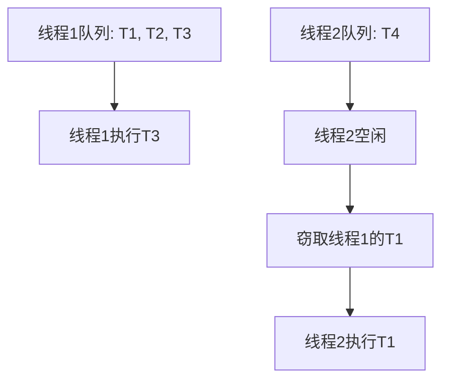

# 5. Fork/Join

# Java面试八股文：并发使用场景之Fork/Join详解

***

## 1. 概述与定义

Fork/Join框架是Java并发编程中的高级工具，专为并行计算设计。它由Java 7引入，位于`java.util.concurrent`包中，核心目标是将复杂任务分解为更小的子任务，利用多线程并行执行，最终合并结果，得到最终答案。简单来说，Fork/Join是一种基于“分治”思想的并行计算框架：通过递归分解任务（Fork），在多个线程中执行，然后合并（Join）子任务结果。

其核心类包括`ForkJoinPool`（线程池）和`ForkJoinTask`（任务抽象类），后者又有`RecursiveAction`和`RecursiveTask`两个子类。Fork/Join特别适合可以递归分解的计算密集型任务，例如排序、搜索或矩阵运算。在面试中，考官可能关注你对Fork/Join的定义、原理以及使用场景的理解，因此清晰掌握其概念是第一步。

Fork/Join的本质是将任务分解和线程管理交给框架，开发者只需定义分解逻辑和合并方式，无需手动控制线程创建和同步。这种设计极大简化了并行编程，同时在多核CPU上表现出色，成为现代Java并发编程的重要工具。

***

## 2. 主要特点

Fork/Join框架在并发场景中有以下显著特点，值得在面试中重点提及：

- **任务分解**：通过递归将大任务拆分为小任务，适合分治算法的实现。
- **工作窃取（Work Stealing）**：空闲线程从其他线程的任务队列中“窃取”任务，优化CPU利用率。
- **并行计算**：内置线程池自动管理任务分配，无需手动创建线程。
- **轻量级设计**：任务执行开销低，适合处理大量小任务。
- **结果合并**：子任务完成后，框架自动合并结果，减少开发者工作量。

举个例子，在归并排序中，Fork/Join可以将数组分成左右两半并行排序，最后合并结果。这种自动分解和高效调度的能力，使其在多核环境下性能优异。相比传统多线程，Fork/Join的工作窃取机制尤其独特，能有效减少线程空闲时间，这也是面试中常被问到的亮点之一。

***

## 3. 应用目标

Fork/Join框架的目标是为并发编程提供高效、简洁的解决方案，具体包括：

1. **提升计算效率**：通过并行执行加速任务处理，尤其在多核CPU上效果显著。
2. **充分利用硬件资源**：自动将任务分配到多个核心，最大化CPU利用率。
3. **简化开发**：开发者只需关注任务分解逻辑，线程管理和调度由框架完成。
4. **优化负载均衡**：工作窃取机制减少线程忙闲不均，提升整体性能。
5. **支持大规模计算**：适合处理大数据集的并行任务，如统计分析或数据聚合。

在面试中，如果被问到“Fork/Join有什么用”，可以从这些目标出发，结合实际场景（如大数据处理）说明其价值。例如：“我在项目中用Fork/Join并行处理了几百万条数据，性能提升了数倍，特别适合多核环境。”

***

## 4. 主要内容及其组成部分

Fork/Join框架由多个核心组件构成，以下逐一详细解释，确保知识点完备。

### 4.1 ForkJoinPool

`ForkJoinPool`是Fork/Join框架的线程池，负责管理任务执行和线程调度。它是整个框架的入口，开发者通过它提交任务并启动并行计算。

- **定义**：一个支持工作窃取的线程池，每个线程维护独立的任务队列。
- **构造方法**：
  - `ForkJoinPool()`：默认并行度为CPU核心数（`Runtime.getRuntime().availableProcessors()`）。
  - `ForkJoinPool(int parallelism)`：自定义并行度。
- **特点**：内置工作窃取算法，线程间动态平衡任务负载。

```java 
ForkJoinPool pool = new ForkJoinPool(); // 默认并行度
```


**注意**：并行度设置需根据任务特性和硬件环境调整，过高可能导致线程切换开销，过低则无法充分利用CPU。

### 4.2 ForkJoinTask

`ForkJoinTask`是Fork/Join任务的抽象基类，定义了任务分解和执行的基本方法。它有两个主要子类：

- **RecursiveAction**：无返回值的任务，适合执行型操作（如数组排序）。
- **RecursiveTask\<V>**：有返回值的任务，适合计算型操作（如求和或斐波那契数列）。

主要方法：

- `fork()`：异步提交任务到线程池。
- `join()`：等待任务完成并返回结果（仅`RecursiveTask`有返回值）。
- `compute()`：抽象方法，开发者需重写以实现任务逻辑。

### 4.3 RecursiveAction 示例

用于无返回值任务，例如数组元素加倍：

```java 
import java.util.concurrent.ForkJoinPool;
import java.util.concurrent.RecursiveAction;

public class ArrayDoubler extends RecursiveAction {
    private final int[] array;
    private final int start;
    private final int end;
    private static final int THRESHOLD = 1000;

    public ArrayDoubler(int[] array, int start, int end) {
        this.array = array;
        this.start = start;
        this.end = end;
    }

    @Override
    protected void compute() {
        if (end - start <= THRESHOLD) {
            for (int i = start; i < end; i++) {
                array[i] *= 2;
            }
        } else {
            int mid = start + (end - start) / 2;
            ArrayDoubler left = new ArrayDoubler(array, start, mid);
            ArrayDoubler right = new ArrayDoubler(array, mid, end);
            left.fork();
            right.compute();
            left.join();
        }
    }

    public static void main(String[] args) {
        int[] array = new int[]{1, 2, 3, 4, 5};
        ForkJoinPool pool = new ForkJoinPool();
        pool.invoke(new ArrayDoubler(array, 0, array.length));
        System.out.println("Result: " + java.util.Arrays.toString(array)); // [2, 4, 6, 8, 10]
    }
}
```


**说明**：任务根据阈值分解，超过阈值时递归拆分，小于阈值时直接计算。

### 4.4 RecursiveTask 示例

用于有返回值任务，例如计算斐波那契数：

```java 
import java.util.concurrent.ForkJoinPool;
import java.util.concurrent.RecursiveTask;

public class Fibonacci extends RecursiveTask<Long> {
    private final int n;

    public Fibonacci(int n) {
        this.n = n;
    }

    @Override
    protected Long compute() {
        if (n <= 1) return (long) n;
        Fibonacci f1 = new Fibonacci(n - 1);
        f1.fork();
        Fibonacci f2 = new Fibonacci(n - 2);
        return f2.compute() + f1.join();
    }

    public static void main(String[] args) {
        ForkJoinPool pool = new ForkJoinPool();
        long result = pool.invoke(new Fibonacci(10));
        System.out.println("Fib(10): " + result); // 55
    }
}
```


**说明**：`fork()`异步执行子任务，`join()`等待并合并结果。

### 4.5 任务提交与执行

- **`invoke()`**：同步提交任务，等待结果。
- **`execute()`**：异步提交任务，无返回值。
- **`submit()`**：异步提交任务，返回`Future`对象。

**表格总结Fork/Join核心组件**：

| 组件              | 作用                   | 使用场景  | 注意事项           |
| --------------- | -------------------- | ----- | -------------- |
| ForkJoinPool    | 管理线程和任务，支持工作窃取       | 任务入口  | 并行度设置          |
| ForkJoinTask    | 任务抽象基类，提供fork/join方法 | 任务定义  | 子类需重写compute() |
| RecursiveAction | 无返回值任务               | 执行型操作 | 无需返回值          |
| RecursiveTask   | 有返回值任务               | 计算型操作 | 返回值合并          |
| fork()          | 异步提交子任务              | 任务分解  | 避免过度分解         |
| join()          | 等待子任务完成并获取结果         | 结果合并  | 控制调用顺序         |

**表格说明**：清晰列出每个组件的作用和注意事项，便于面试快速回忆。

***

## 5. 原理剖析

Fork/Join的高效性源于其底层设计，以下深入解析其原理。

### 5.1 任务队列

每个线程拥有一个双端队列（Deque）：

- **入队**：新任务从队尾添加。
- **出队**：线程从队尾取任务执行。
- **窃取**：空闲线程从其他线程的队头取任务。

这种设计利用了无锁操作，减少线程竞争，提高效率。

### 5.2 工作窃取算法

- **原理**：线程执行完自身任务后，随机选择其他线程的队列，从队头窃取任务。
- **优势**：动态平衡负载，避免部分线程过忙而其他线程空闲。
- **实现**：基于Deque的LIFO（线程自身）和FIFO（窃取者）访问模式。

Mermaid图示工作窃取：




**图表说明**：线程2空闲时从线程1队列头窃取T1，线程1继续处理T2和T3，实现负载均衡。

### 5.3 任务分解策略

- **阈值控制**：通过阈值决定是否继续分解，避免任务过细导致开销增加。
- **示例**：在数组求和中，若子数组长度小于100则直接计算，否则分解：

```java 
if (end - start <= 100) {
    long sum = 0;
    for (int i = start; i < end; i++) sum += array[i];
    return sum;
} else {
    int mid = start + (end - start) / 2;
    SumTask left = new SumTask(array, start, mid);
    SumTask right = new SumTask(array, mid, end);
    left.fork();
    return right.compute() + left.join();
}
```


- **性能关键**：阈值需根据任务特性和硬件调整，通常与CPU核心数和数据规模相关。

### 5.4 执行流程

1. 任务提交到`ForkJoinPool`。
2. 线程从队列取任务，递归分解为子任务。
3. 子任务通过`fork()`分派，`join()`合并。
4. 空闲线程执行工作窃取，直至所有任务完成。

**深入剖析**：Fork/Join的性能优势在于工作窃取和无锁队列，但对任务分解粒度和计算密集型要求较高。若任务涉及大量I/O阻塞，则可能不如传统线程池（如`ThreadPoolExecutor`）高效。

***

## 6. 应用与拓展

Fork/Join在实际开发中有广泛应用，以下为常见场景：

- **并行排序**：快速排序、归并排序的并行实现。
- **矩阵计算**：并行矩阵乘法或转置。
- **图像处理**：并行应用滤镜或图像转换。
- **大数据处理**：统计分析、数据聚合。

**拓展**：Java 8的并行流（Parallel Stream）底层依赖Fork/Join，例如：

```java 
List<Integer> numbers = Arrays.asList(1, 2, 3, 4, 5);
int sum = numbers.parallelStream().reduce(0, Integer::sum);
```


**注意事项**：

- 任务粒度需合理，过细增加分解开销，过粗降低并行度。
- 避免在`compute()`中执行阻塞操作（如I/O），否则影响线程利用率。
- 与传统线程池结合使用时，需明确任务特性。

***

## 7. 面试问答

以下从面试者视角提供详细回答，模拟真实场景。

### 7.1 问题：Fork/Join框架是什么？有什么用？

**回答**： &#x20;

面试官好！Fork/Join是Java 7引入的并行计算框架，核心是把大任务分解成小任务，利用多线程并行执行，最后合并结果。它特别适合分治算法，比如排序或大数据处理。我在项目里用它做过百万级数据的并行统计，比单线程快了好几倍，特别适合多核CPU环境。简单说，它帮我们高效利用硬件资源，还简化了并发编程。

### 7.2 问题：Fork/Join和普通线程池有什么区别？

**回答**： &#x20;

我觉得Fork/Join和普通线程池最大的区别在任务管理和调度上。普通线程池需要手动提交任务，线程执行完就没了；而Fork/Join能自动分解任务，还通过工作窃取让线程互相帮忙，减少空闲时间。比如`ThreadPoolExecutor`得自己控制线程数和任务分配，Fork/Join直接内置这些功能，适合递归分解的场景，效率更高。

### 7.3 问题：Fork/Join的工作窃取是怎么实现的？

**回答**： &#x20;

工作窃取是Fork/Join的核心优化。每个线程有个双端队列，新任务从队尾进，自己执行时从队尾取。如果线程空闲了，它会随机挑其他线程的队列，从队头“偷”任务。这样忙的线程少干点，闲的线程有事做，负载就平衡了。我觉得这个设计很聪明，用无锁队列还降低了竞争开销。

### 7.4 问题：你在项目中怎么用Fork/Join？

**回答**： &#x20;

我在一个数据分析项目里用过Fork/Join。当时要统计几百万条记录的聚合结果，我用了`RecursiveTask`，把数据分成小块，每块交给一个线程算，最后合并。代码里设了个阈值，比如每1000条算一次，跑下来比单线程快了5倍左右。调试时还调了并行度，确保跟CPU核心数匹配，效果挺好的。

### 7.5 问题：Fork/Join适合什么场景？有什么注意事项？

**回答**： &#x20;

Fork/Join适合计算密集型、能递归分解的任务，比如排序、矩阵计算或大数据统计。不太适合I/O密集型任务，因为阻塞会浪费线程。注意事项嘛，任务粒度得控制好，太小了分解开销大，太大了并行度不够。我一般根据数据量和核心数设阈值，还要避免在任务里放阻塞操作，保证性能最大化。

***

## 总结

本文从Fork/Join的定义入手，详细讲解了其特点、目标、组件、原理及应用场景，结合代码、表格和Mermaid图深入剖析，确保内容清晰且易于背诵。面试问答部分模拟真实场景，帮助你在考场上自信应对并发问题。不管是理论还是实践，这篇八股文都能让你在Fork/Join话题上游刃有余！💪
