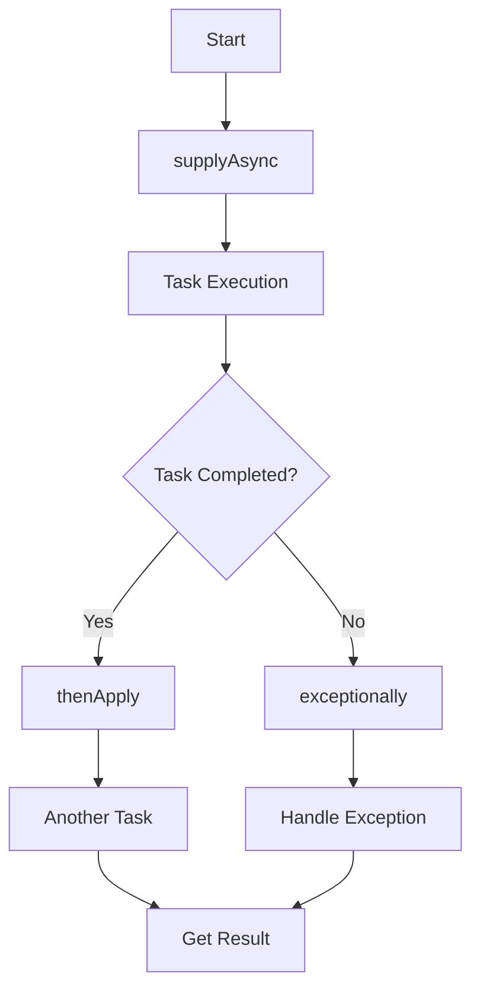

# 6. CompletableFuture

# Java并发之CompletableFuture详解：面试八股文

***

## 1. 概述与定义

`CompletableFuture` 是 Java 8 引入的一个类，位于 `java.util.concurrent` 包下。它是对传统 `Future` 的增强，实现了 `Future` 和 `CompletionStage` 两个接口，旨在提供一种更强大、更灵活的方式来处理异步任务。简单来说，`CompletableFuture` 允许开发者以声明式的方式定义异步操作，支持任务的链式处理、组合和异常管理，并在任务完成时获取结果或处理异常。

与传统的 `Future` 相比，`CompletableFuture` 不仅能表示一个异步计算的结果，还能通过丰富的 API 实现复杂的任务编排。无论是单任务的异步执行，还是多任务的并行处理，它都提供了非阻塞的解决方案，成为 Java 并发编程中的重要工具。

***

## 2. 主要特点

`CompletableFuture` 的强大之处在于其独特的特性，这些特点让它在并发编程中脱颖而出：

- **非阻塞**：任务执行时，主线程无需等待，可以继续处理其他逻辑，提高程序的响应性。
- **链式调用**：支持通过 `thenApply`、`thenAccept` 等方法，将多个操作串联起来，形成流畅的任务处理管道。
- **异常处理**：提供 `exceptionally`、`handle` 等方法，优雅地处理异步任务中的异常。
- **任务组合**：通过 `thenCombine`、`thenCompose`、`allOf`、`anyOf` 等方法，组合多个异步任务，实现复杂的业务逻辑。
- **手动完成**：支持通过 `complete` 或 `completeExceptionally` 手动设置结果或异常，增强灵活性。

这些特点使得 `CompletableFuture` 在异步编程中如鱼得水，接下来我们看看它的应用目标。

***

## 3. 应用目标

`CompletableFuture` 的设计初衷是为了解决并发编程中的常见痛点，其应用目标包括：

- **异步编程**：通过非阻塞的方式执行任务，提升程序的吞吐量和响应速度。
- **任务编排**：将多个异步任务组合起来，形成有序的执行流程，满足复杂业务需求。
- **并行处理**：利用多线程并行执行任务，缩短计算时间，提高效率。
- **异常处理**：在异步任务中提供健壮的异常管理机制，确保系统稳定性。

无论是微服务中的异步调用，还是大数据处理中的并行计算，`CompletableFuture` 都能派上用场。接下来，我们深入剖析它的核心内容和组成部分。

***

## 4. 主要内容及其组成部分

`CompletableFuture` 的功能非常丰富，涵盖创建、获取结果、链式操作、组合操作、异常处理和手动完成等多个方面。以下是对每个部分的详细解释，结合示例逐一展开。

### 4.1 创建 CompletableFuture

`CompletableFuture` 提供了多种静态方法来创建实例：

- **`supplyAsync`**：异步执行一个 `Supplier`（有返回值的任务），返回一个 `CompletableFuture`。
- **`runAsync`**：异步执行一个 `Runnable`（无返回值的任务），返回一个 `CompletableFuture`。
- **`completedFuture`**：直接返回一个已完成的 `CompletableFuture`，适用于已知结果的场景。

**示例代码**：

```java 
import java.util.concurrent.CompletableFuture;

public class CompletableFutureDemo {
    public static void main(String[] args) {
        // 使用 supplyAsync 创建异步任务
        CompletableFuture<String> future = CompletableFuture.supplyAsync(() -> {
            try {
                Thread.sleep(1000); // 模拟耗时操作
            } catch (InterruptedException e) {
                e.printStackTrace();
            }
            return "Hello from supplyAsync";
        });
        System.out.println(future.join()); // 输出: Hello from supplyAsync
    }
}
```


**说明**：`supplyAsync` 默认使用 `ForkJoinPool.commonPool()` 作为线程池，也可以通过传入自定义 `Executor` 来指定线程池。

### 4.2 获取结果

`CompletableFuture` 提供了多种方法来获取异步任务的结果：

- **`get()`**：阻塞等待任务完成，返回结果，可能会抛出 `InterruptedException` 和 `ExecutionException`。
- **`join()`**：类似于 `get()`，但抛出的是 `CompletionException`，更简洁。
- **`getNow(T defaultValue)`**：如果任务已完成，立即返回结果；否则返回指定的默认值。

**示例代码**：

```java 
CompletableFuture<String> future = CompletableFuture.supplyAsync(() -> "Hello");
String result = future.getNow("Default"); // 如果任务未完成，返回 "Default"
System.out.println(result); // 输出: Hello（假设任务已完成）
```


### 4.3 链式操作

`CompletableFuture` 支持链式调用，允许在任务完成后执行后续操作：

- **`thenApply`**：对结果应用一个 `Function`，返回新的 `CompletableFuture`。
- **`thenAccept`**：对结果应用一个 `Consumer`，无返回值。
- **`thenRun`**：任务完成后执行一个 `Runnable`，不关心结果。

**示例代码**：

```java 
CompletableFuture<String> future = CompletableFuture.supplyAsync(() -> "Hello")
    .thenApply(s -> s + " World")           // 拼接字符串
    .thenApply(String::toUpperCase)         // 转换为大写
    .thenAccept(System.out::println);       // 打印结果
// 输出: HELLO WORLD
```


### 4.4 组合操作

`CompletableFuture` 允许组合多个任务，常见方法包括：

- **`thenCombine`**：组合两个 `CompletableFuture`，当两者都完成时，应用一个 `BiFunction` 处理结果。
- **`thenCompose`**：将一个任务的结果传递给另一个函数，返回新的 `CompletableFuture`，适合嵌套任务。
- **`allOf`**：等待所有指定的 `CompletableFuture` 完成，返回一个新的 `CompletableFuture<Void>`。
- **`anyOf`**：当任意一个指定的 `CompletableFuture` 完成时，返回一个新的 `CompletableFuture<Object>`。

**示例代码**：

```java 
CompletableFuture<String> future1 = CompletableFuture.supplyAsync(() -> "Hello");
CompletableFuture<String> future2 = CompletableFuture.supplyAsync(() -> "World");
CompletableFuture<String> combined = future1.thenCombine(future2, (s1, s2) -> s1 + " " + s2);
System.out.println(combined.join()); // 输出: Hello World
```


### 4.5 异常处理

异步任务难免会遇到异常，`CompletableFuture` 提供了以下方法：

- **`exceptionally`**：当任务抛出异常时，执行一个 `Function` 来恢复。
- **`handle`**：无论任务成功或失败，都执行一个 `BiFunction`，返回新的结果。

**示例代码**：

```java 
CompletableFuture<String> future = CompletableFuture.supplyAsync(() -> {
    if (true) throw new RuntimeException("Oops");
    return "Hello";
}).exceptionally(ex -> "Recovered from " + ex.getMessage());
System.out.println(future.join()); // 输出: Recovered from Oops
```


### 4.6 手动完成

`CompletableFuture` 支持手动控制任务的完成状态：

- **`complete`**：手动完成任务，设置结果。
- **`completeExceptionally`**：手动完成任务，设置异常。

**示例代码**：

```java 
CompletableFuture<String> future = new CompletableFuture<>();
new Thread(() -> {
    try {
        Thread.sleep(1000);
        future.complete("Done");
    } catch (InterruptedException e) {
        future.completeExceptionally(e);
    }
}).start();
System.out.println(future.join()); // 输出: Done
```


***

## 5. 原理剖析

`CompletableFuture` 的强大功能背后，隐藏着精巧的设计和实现原理。以下是对其核心机制的深入解析。

### 5.1 核心接口与实现

`CompletableFuture` 实现了 `Future` 和 `CompletionStage` 接口：

- **`Future`**：提供了基本的异步结果获取能力，如 `get()`。
- **`CompletionStage`**：定义了任务阶段的链式操作，支持任务的依赖和组合。

### 5.2 任务执行机制

`CompletableFuture` 的任务默认由 `ForkJoinPool.commonPool()` 执行，这是一个共享的线程池，适用于大多数场景。开发者也可以通过传入自定义 `Executor` 来控制线程池，例如：

```java 
Executor executor = Executors.newFixedThreadPool(4);
CompletableFuture<String> future = CompletableFuture.supplyAsync(() -> "Hello", executor);
```


### 5.3 任务依赖管理

内部通过 `Completion` 对象管理任务之间的依赖关系。当一个任务完成时，会触发依赖它的后续任务，形成链式执行。任务的状态（未完成、正常完成、异常完成）由原子变量维护，确保线程安全。

### 5.4 执行流程图

以下是用 Mermaid 语法绘制的 `CompletableFuture` 执行流程图：




**图表说明**：从 `supplyAsync` 开始，任务进入执行阶段。完成后，通过 `thenApply` 执行后续任务；若抛出异常，则由 `exceptionally` 处理。最终通过 `get` 或 `join` 获取结果。

### 5.5 线程安全与性能

`CompletableFuture` 使用无锁的 CAS（Compare-And-Swap）操作管理状态更新，确保线程安全。同时，其非阻塞设计避免了线程的频繁阻塞，提升了并发性能。

***

## 6. 应用与拓展

`CompletableFuture` 在实际开发中应用广泛，以下是几个典型场景：

- **异步 API 调用**：在微服务中，异步调用下游服务，避免主线程阻塞。
- **并行处理**：将大任务拆分为小任务并行执行，如批量数据处理。
- **任务编排**：组合多个异步任务，例如用户注册后发送邮件和更新数据库。
- **异常恢复**：在异步任务失败时，提供默认值或重试机制。

在 Spring Boot 中，`CompletableFuture` 常与 `@Async` 注解结合使用，实现方法的异步调用。例如：

```java 
@Service
public class MyService {
    @Async
    public CompletableFuture<String> asyncMethod() {
        return CompletableFuture.supplyAsync(() -> "Async Result");
    }
}
```


***

## 7. 面试问答

以下是针对 `CompletableFuture` 的常见面试问题及详细回答，模拟面试场景。

### 7.1 问题：CompletableFuture 是什么？它与 Future 有什么区别？

**回答**： &#x20;

`CompletableFuture` 是 Java 8 引入的一个类，用于异步编程。它实现了 `Future` 和 `CompletionStage` 接口，相比传统的 `Future`，它提供了更强大的功能。`Future` 只能通过 `get()` 阻塞获取结果，而 `CompletableFuture` 支持非阻塞操作，比如链式调用（`thenApply`）、任务组合（`thenCombine`）和异常处理（`exceptionally`）。另外，它还能通过 `complete` 手动完成，而 `Future` 不支持。我觉得它最大的优势是任务编排能力，比如我可以用 `allOf` 等待多个任务完成，这是 `Future` 做不到的。

### 7.2 问题：如何使用 CompletableFuture 实现异步任务？

**回答**： &#x20;

可以用 `CompletableFuture.supplyAsync` 创建一个异步任务。比如：

```java 
CompletableFuture<String> future = CompletableFuture.supplyAsync(() -> {
    try {
        Thread.sleep(1000); // 模拟耗时操作
    } catch (InterruptedException e) {
        e.printStackTrace();
    }
    return "Hello";
});
System.out.println(future.join()); // 输出: Hello
```


这里 `supplyAsync` 会启动一个异步任务，默认用 `ForkJoinPool` 执行。如果需要自定义线程池，可以传一个 `Executor` 参数。我一般用 `join()` 获取结果，因为它比 `get()` 的异常处理更简洁。

### 7.3 问题：CompletableFuture 如何处理异常？

**回答**： &#x20;

它提供了 `exceptionally` 和 `handle` 两种方法。`exceptionally` 是在任务抛异常时执行一个恢复逻辑，比如：

```java 
CompletableFuture<String> future = CompletableFuture.supplyAsync(() -> {
    throw new RuntimeException("Oops");
}).exceptionally(ex -> "Recovered");
```


`handle` 更通用，无论成功还是失败都会执行，比如：

```java 
CompletableFuture<String> future = CompletableFuture.supplyAsync(() -> {
    if (true) throw new RuntimeException("Oops");
    return "Hello";
}).handle((result, ex) -> ex != null ? "Error" : result);
```


我倾向于用 `exceptionally` 处理特定异常，用 `handle` 做全面控制。

### 7.4 问题：什么是 CompletableFuture 的链式调用？举个例子。

**回答**： &#x20;

链式调用就是通过 `thenApply`、`thenAccept` 等方法把多个操作连起来，形成一个处理流程。比如：

```java 
CompletableFuture<String> future = CompletableFuture.supplyAsync(() -> "Hello")
    .thenApply(s -> s + " World")
    .thenApply(String::toUpperCase)
    .thenAccept(System.out::println);
```


这个例子先异步返回 "Hello"，然后拼接 " World"，再转成大写，最后打印 "HELLO WORLD"。每个方法都返回一个新的 `CompletableFuture`，可以一直链下去，很适合任务流水线处理。

### 7.5 问题：CompletableFuture 的 allOf 和 anyOf 有什么区别？

**回答**： &#x20;

`allOf` 是等待所有任务完成，返回一个 `CompletableFuture<Void>`，而 `anyOf` 是任意一个任务完成就返回，返回值是那个完成任务的结果。比如：

```java 
CompletableFuture<String> f1 = CompletableFuture.supplyAsync(() -> "Task 1");
CompletableFuture<String> f2 = CompletableFuture.supplyAsync(() -> "Task 2");
CompletableFuture<Void> all = CompletableFuture.allOf(f1, f2);
CompletableFuture<Object> any = CompletableFuture.anyOf(f1, f2);
```


`allOf` 适合需要所有任务都完成的情况，比如批量操作；`anyOf` 适合竞争场景，比如从多个服务中取最快的结果。我用 `allOf` 时会配合 `join` 获取具体结果。

***

## 总结

`CompletableFuture` 是 Java 并发编程中的一大利器，提供了异步任务处理、任务编排和异常管理的完整解决方案。本文从定义到原理，从应用到面试，全面覆盖了它的知识点。通过示例、表格和图表，希望你能更直观地掌握它，并在面试中自信应对相关问题。无论是代码实践还是理论回答，这篇 3000 字+ 的八股文都为你铺平了道路，祝你面试顺利！🚀
