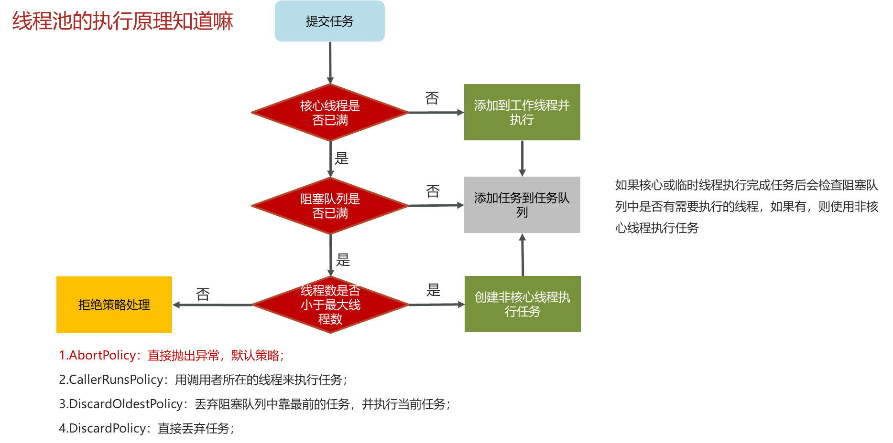
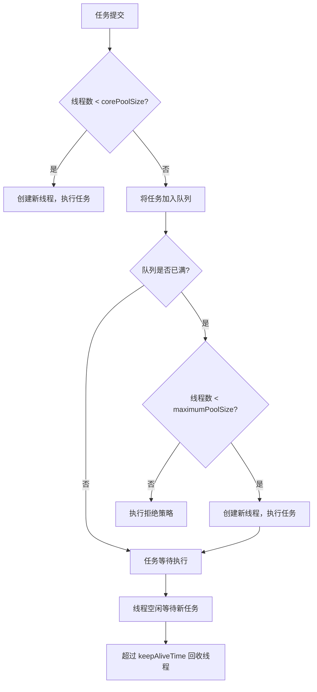
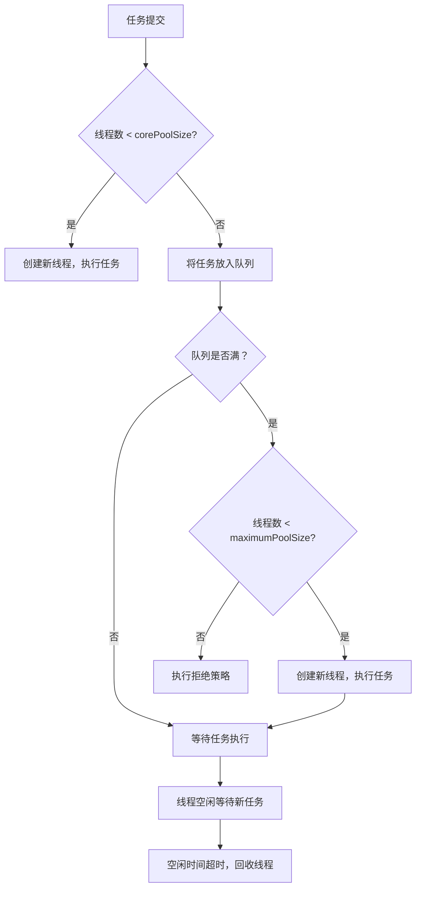

# 四. 线程池

[1. 核心参数](<1. 核心参数/1. 核心参数.md> "1. 核心参数")

[2. 阻塞队列](<2. 阻塞队列/2. 阻塞队列.md> "2. 阻塞队列")

[3. 核心线程数的确定](<3. 核心线程数的确定/3. 核心线程数的确定.md> "3. 核心线程数的确定")

[4. 线程池的种类](<4. 线程池的种类/4. 线程池的种类.md> "4. 线程池的种类")

## 1. 概述与定义

线程池是一种管理和复用线程的技术，主要用于解决在高并发场景下频繁创建和销毁线程带来的系统资源浪费和性能开销问题。在 Java 中，线程池由 Executor 框架提供支持，主要接口是 `ExecutorService`，其核心实现类包括 `ThreadPoolExecutor`。通过线程池，程序可以将任务提交到任务队列中，由固定数量的线程来执行这些任务，从而实现线程复用和任务调度。

简单来说，线程池的作用是：

- 复用线程，降低频繁创建销毁线程的开销；
- 管理线程数量，防止因线程过多导致系统资源耗尽；
- 对任务进行排队调度，确保高并发环境下任务能够有序执行；
- 提供任务超时、拒绝策略等高级功能，增强系统健壮性。 &#x20;

例如，在一个 Web 服务器中，成百上千的请求可以通过线程池高效处理，而不必为每个请求都创建新线程，从而大大提高系统吞吐量和响应速度。😊

## 2. 主要特点

线程池作为一种并发编程的重要技术，具有以下主要特点：

1. **线程复用** &#x20;
   - 线程池中的线程可以被多次利用，避免了频繁创建和销毁线程的高额开销。 &#x20;
   - 这种复用机制在高并发环境下能大幅提升系统性能。 &#x20;
2. **任务排队与调度** &#x20;
   - 任务提交到线程池后，会先进入任务队列，等待空闲线程调度执行。 &#x20;
   - 任务调度机制保证了任务的有序执行，并且可以根据不同策略进行调优。 &#x20;
3. **灵活配置** &#x20;
   - 线程池支持多种参数配置，如核心线程数、最大线程数、空闲线程存活时间、任务队列类型、线程工厂以及拒绝策略。 &#x20;
   - 这些参数可根据业务场景进行灵活调整，达到性能与资源利用的平衡。 &#x20;
4. **资源管理** &#x20;
   - 通过限制线程池的最大线程数，可以防止系统因线程过多而耗尽资源。 &#x20;
   - 任务队列可以缓存大量任务，缓解突发高并发压力。 &#x20;
5. **扩展性与高级功能** &#x20;
   - 提供定时任务执行（如 `ScheduledThreadPoolExecutor`）和异步任务执行（如 `CompletableFuture`）的支持。 &#x20;
   - 允许自定义拒绝策略，在任务过载时做出恰当处理。 &#x20;

下面的表格归纳了线程池与直接创建线程的主要区别和优势：

| 特性     | 直接创建线程            | 线程池              |
| ------ | ----------------- | ---------------- |
| 线程创建成本 | 频繁创建销毁，系统开销大      | 线程复用，创建成本低       |
| 系统资源利用 | 线程数量不受控制，容易耗尽系统资源 | 可设定最大线程数，控制资源占用  |
| 任务调度   | 无统一调度机制           | 任务排队调度，保证任务有序执行  |
| 扩展性    | 编程复杂，难以管理大量线程     | 支持灵活配置、定时任务和异步执行 |
| 性能     | 高并发时容易出现性能瓶颈      | 高并发环境下性能稳定，吞吐量高  |

## 3. 应用目标

线程池技术在实际开发中的应用目标主要体现在以下几个方面：

1. **提高系统性能** &#x20;
   - 通过线程复用降低线程创建和销毁的成本，在高并发场景下保持系统高效响应。 &#x20;
   - 实现任务排队与调度，使得系统能够均衡处理突发流量，避免因线程过多导致资源耗尽。 &#x20;
2. **提升资源利用率** &#x20;
   - 限制线程池中同时活动线程的数量，合理利用 CPU 和内存资源，防止线程过多带来的资源竞争。 &#x20;
3. **实现任务异步与并行处理** &#x20;
   - 线程池能够并行处理多个任务，提高数据处理速度和响应时间。 &#x20;
   - 支持异步任务执行，减少主线程等待时间，提高用户体验。
4. **降低开发复杂度** &#x20;
   - 使用线程池统一管理线程生命周期，避免程序员手动管理线程，提高代码的可维护性。 &#x20;
5. **保障系统稳定性** &#x20;
   - 通过合理配置线程池参数和拒绝策略，可以有效防止系统因任务过载而崩溃。 &#x20;
   - 在分布式系统中，线程池也是实现异步处理、流量削峰和资源隔离的重要手段。 &#x20;

## 4. 主要内容及其组成部分

在深入了解线程池时，需要掌握其核心组成部分及工作流程。下面详细介绍线程池的主要内容：

### 4.1 核心参数与组成部分

线程池的主要参数包括：

- **核心线程数（corePoolSize）** &#x20;
  - 表示线程池中始终保持活动的线程数，即使这些线程处于空闲状态也不会被销毁。 &#x20;
  - 适用于任务量稳定的场景。 &#x20;
- **最大线程数（maximumPoolSize）** &#x20;
  - 表示线程池允许创建的最大线程数，在任务量突增时会创建额外线程直至达到该值。 &#x20;
  - 当任务结束后，超过核心线程数的线程会被终止。 &#x20;
- **线程空闲存活时间（keepAliveTime）** &#x20;
  - 指定非核心线程在空闲状态下存活的最长时间，超时后会被回收。 &#x20;
  - 可以防止线程池中线程数无限增长。 &#x20;
- **任务队列（workQueue）** &#x20;
  - 用于存储等待执行的任务，常见实现有 ArrayBlockingQueue、LinkedBlockingQueue、SynchronousQueue 等。 &#x20;
  - 任务队列的选择会影响线程池的性能和行为。 &#x20;
- **线程工厂（threadFactory）** &#x20;
  - 用于创建新线程，可以通过自定义线程工厂为线程设置名称、优先级、守护状态等属性。 &#x20;
- **拒绝策略（rejectedExecutionHandler）** &#x20;
  - 当任务队列满且线程数达到最大值时，新提交的任务将调用拒绝策略。 &#x20;
  - 常见策略有 AbortPolicy、CallerRunsPolicy、DiscardPolicy 和 DiscardOldestPolicy。 &#x20;

下面的表格对线程池的核心参数进行了详细说明：

| 参数名称                     | 说明             | 典型应用场景                     |
| ------------------------ | -------------- | -------------------------- |
| corePoolSize             | 线程池中始终保持活动的线程数 | 任务量稳定，保持一定并发处理能力           |
| maximumPoolSize          | 线程池允许的最大线程数    | 任务高峰期处理突增任务                |
| keepAliveTime            | 非核心线程空闲存活时间    | 动态调整线程数量，防止资源浪费            |
| workQueue                | 存储等待执行任务的队列    | 根据任务特性选择阻塞队列（数组、链表或直接交给线程） |
| threadFactory            | 用于创建新线程的工厂     | 定制线程属性，便于调试和管理             |
| rejectedExecutionHandler | 当任务过载时的拒绝策略    | 任务过载时决定如何处理新提交任务，确保系统稳定    |

### 4.2 线程池工作流程

线程池的工作流程大致分为以下几个步骤：

1. **任务提交** &#x20;
   - 调用 `execute()` 或 `submit()` 方法将任务提交给线程池。 &#x20;
2. **任务调度** &#x20;
   - 如果当前线程数小于 corePoolSize，则直接创建新线程执行任务；如果达到核心线程数，则将任务加入任务队列；如果队列满且线程数小于 maximumPoolSize，则创建新线程执行任务；否则，执行拒绝策略。 &#x20;
3. **线程复用** &#x20;
   - 已创建的线程不断从任务队列中取任务执行，任务执行完毕后进入空闲状态，等待新任务。 &#x20;
4. **线程回收** &#x20;
   - 当线程处于空闲状态超过 keepAliveTime，且线程数超过 corePoolSize，则回收空闲线程，释放系统资源。 &#x20;

下面使用 Mermaid 图表展示线程池的基本工作流程：

图中展示了线程池接收任务后的决策过程：判断是否创建新线程，任务排队，扩容以及拒绝策略，最后通过线程回收机制节省资源。

### 4.3 线程池常见实现类

在 Java 中，常见的线程池实现类包括：

- **ThreadPoolExecutor** &#x20;
  - 是最常用的线程池实现类，可通过构造方法自定义上述核心参数。 &#x20;
  - 支持任务提交、调度、线程回收等全流程管理，是生产级并发编程的主力军。 &#x20;
- **ScheduledThreadPoolExecutor** &#x20;
  - 用于执行定时任务和周期性任务的线程池，扩展了 ThreadPoolExecutor 的功能。 &#x20;
- **ForkJoinPool** &#x20;
  - 主要用于分治任务和并行计算，支持将大任务拆分为多个子任务并行执行，基于工作窃取算法。 &#x20;

每种线程池都有各自的优势和适用场景，在实际开发中应根据业务特点选择合适的线程池实现。

### 4.4 拒绝策略

当线程池任务过载时，会执行拒绝策略来处理新提交的任务。常见的拒绝策略有：

- **AbortPolicy**：直接抛出 RejectedExecutionException。 &#x20;
- **CallerRunsPolicy**：由调用线程执行任务，降低新任务提交速度。 &#x20;
- **DiscardPolicy**：直接丢弃新提交的任务，不抛异常。 &#x20;
- **DiscardOldestPolicy**：丢弃任务队列中最旧的任务，然后尝试提交当前任务。 &#x20;

选择合适的拒绝策略对保持系统稳定性至关重要。

## 5. 原理剖析

深入理解线程池的底层实现原理，对于调优并发性能和排查问题具有重要意义。以下是 ReentrantLock 和 ThreadPoolExecutor 相关的核心原理解析。

### 5.1 ThreadPoolExecutor 的内部工作原理

ThreadPoolExecutor 的内部实现依赖于多个核心组件和数据结构，包括： &#x20;

- **工作线程池**：内部维护一组工作线程，通过 `Worker` 对象封装。 &#x20;
- **任务队列**：通常采用阻塞队列（如 LinkedBlockingQueue）存储待执行任务。 &#x20;
- **线程状态与同步**：通过 volatile 状态变量管理线程池状态，使用 AQS（AbstractQueuedSynchronizer）实现等待队列管理。 &#x20;
- **扩容与回收机制**：依据核心线程数、最大线程数与任务队列情况决定是否创建新线程或回收空闲线程。 &#x20;

整个工作流程依赖于以下逻辑：\n &#x20;

1. 任务提交后，如果当前工作线程数小于 corePoolSize，则直接创建新线程执行任务；\n &#x20;
2. 如果线程数达到核心线程数，则将任务加入队列；\n &#x20;
3. 如果队列满且线程数小于 maximumPoolSize，则创建新线程执行任务；\n &#x20;
4. 如果队列满且线程数达到最大值，则执行拒绝策略。 &#x20;

### 5.2 任务队列与线程复用机制

- **任务队列**：使用阻塞队列存储任务，线程在空闲时会从队列中取任务执行。阻塞队列类型直接影响线程池的行为，例如 SynchronousQueue 适用于直接交付任务，而 ArrayBlockingQueue 则适用于任务排队。 &#x20;
- **线程复用**：线程池创建的线程在执行完任务后不会销毁，而是进入空闲状态等待下一个任务，这大大降低了线程创建和销毁的频率，提高了系统性能。 &#x20;

### 5.3 线程池状态管理

ThreadPoolExecutor 内部通过一个状态变量管理线程池的生命周期，状态主要包括运行、关闭、停止等阶段。 &#x20;

- **运行状态**：线程池接受新任务并处理排队任务。 &#x20;
- **关闭状态**：线程池不再接受新任务，但会处理队列中的所有任务。 &#x20;
- **停止状态**：线程池终止所有任务，线程被中断。 &#x20;

这种状态管理机制确保线程池能够平稳关闭和重启，并为系统提供良好的容错性。

### 5.4 扩容与线程回收原理

- 当任务数超过当前线程池容量乘以负载因子时，线程池会扩容，创建新线程并将任务分配给新线程。 &#x20;
- 线程空闲超过 keepAliveTime 后，如果线程池中线程数超过 corePoolSize，新线程会被回收，释放资源。 &#x20;
- 扩容和回收过程依赖于阻塞队列的状态和当前线程数，通过动态调整线程数达到资源利用与性能之间的平衡。

下面使用 Mermaid 图表展示线程池的整体工作流程和状态转换：

图中展示了任务提交后，线程池如何判断是否创建新线程、将任务排队、扩容及回收空闲线程的完整流程。

## 6. 应用与拓展

掌握线程池的工作原理和关键参数对实际项目具有极高的指导意义。以下是常见的应用与扩展方向：

### 6.1 高并发 Web 服务器

- 采用线程池统一管理客户端请求，提高系统吞吐量和响应速度。 &#x20;
- 通过合理配置核心线程数、最大线程数及队列容量，避免资源耗尽。

### 6.2 异步任务与定时任务

- 使用线程池结合 ScheduledThreadPoolExecutor 实现定时任务调度，如定时数据清理、缓存刷新等。 &#x20;
- 通过异步任务执行降低主线程等待时间，提升用户体验。

### 6.3 数据处理与批量计算

- 在线程池中并行处理大量数据，提高批量计算或数据处理任务的效率。 &#x20;
- 利用 Fork/Join 框架实现大任务拆分，采用线程池管理子任务。

### 6.4 并发设计模式

- 结合线程池实现生产者–消费者、工作者模式、任务分派等经典并发设计模式。 &#x20;
- 通过合理的线程池调优和任务调度，实现高效且可扩展的并发系统。

### 6.5 自定义线程池与拒绝策略

- 根据具体业务需求，定制线程池参数和拒绝策略，确保在高负载情况下系统能够稳定运行。 &#x20;
- 例如，CallerRunsPolicy 可以使任务由提交线程执行，避免任务丢失；DiscardPolicy 则直接丢弃过载任务，适用于对实时性要求不高的场景。

下面的表格展示了不同场景下线程池配置和拒绝策略的选择建议：&#x20;

| 应用场景       | 核心线程数建议      | 队列类型                          | 拒绝策略                           |
| ---------- | ------------ | ----------------------------- | ------------------------------ |
| 高并发 Web 服务 | 根据服务器核心数适当设置 | LinkedBlockingQueue           | CallerRunsPolicy 或 AbortPolicy |
| 定时任务调度     | 较低，任务间隔较长    | DelayedQueue 或 ScheduledQueue | AbortPolicy                    |
| 数据批处理      | 较高，充分利用 CPU  | ArrayBlockingQueue            | DiscardOldestPolicy            |
| 异步任务执行     | 根据任务量动态调整    | LinkedBlockingQueue           | CallerRunsPolicy               |

## 7. 面试问答

下面从面试者角度出发，整理了五个常见问题及详细回答，帮助你在面试中从容回答有关线程池的考察问题。

### 问题1：请简述线程池的基本概念及其主要作用是什么？

答： &#x20;

线程池是一种管理和复用线程的机制，通过预先创建一组线程并复用它们来处理提交的任务，从而降低线程创建和销毁带来的性能开销。线程池能够统一管理任务调度、队列管理、线程复用等，是高并发场景下提高系统响应速度和资源利用率的重要手段。

### 问题2：请详细说明 ThreadPoolExecutor 的核心参数及它们在实际应用中的作用？

答： &#x20;

ThreadPoolExecutor 的核心参数包括：\n &#x20;

- corePoolSize：线程池中始终保持活动的核心线程数；\n &#x20;
- maximumPoolSize：线程池允许的最大线程数；\n &#x20;
- keepAliveTime：非核心线程空闲时的存活时间；\n &#x20;
- workQueue：任务队列，用于存储等待执行的任务；\n &#x20;
- threadFactory：创建新线程的工厂；\n &#x20;
- rejectedExecutionHandler：当任务无法被接受时的拒绝策略。 \n &#x20;

这些参数直接影响线程池的性能、资源利用和任务调度策略。例如，在高并发场景下，合理设置 corePoolSize 和 maximumPoolSize 能保证任务及时处理，同时选择合适的队列类型和拒绝策略可以防止任务丢失或系统崩溃。

### 问题3：请解释线程池的工作流程和任务调度过程？

答： &#x20;

线程池的工作流程包括以下几个步骤：\n &#x20;

1. 任务提交：调用 execute() 或 submit() 方法提交任务；\n &#x20;
2. 核心线程处理：如果当前线程数小于 corePoolSize，立即创建新线程执行任务；\n &#x20;
3. 任务排队：若达到核心线程数，将任务加入阻塞队列；\n &#x20;
4. 扩容机制：如果队列满且线程数小于 maximumPoolSize，创建新线程执行任务；\n &#x20;
5. 拒绝策略：若线程数已达 maximumPoolSize，且队列已满，则根据拒绝策略处理新任务；\n &#x20;
6. 线程回收：空闲线程超过 keepAliveTime 后，超出 corePoolSize 的线程被回收。 \n &#x20;

这一流程保证了任务能够高效调度，线程资源得到充分利用。

### 问题4：请讨论线程池中常见的拒绝策略及如何选择合适的拒绝策略？

答： &#x20;

线程池中常见的拒绝策略有四种：\n &#x20;

- AbortPolicy：直接抛出异常，阻止任务继续提交；\n &#x20;
- CallerRunsPolicy：任务由提交线程执行，降低新任务提交速度；\n &#x20;
- DiscardPolicy：直接丢弃新提交的任务，不抛异常；\n &#x20;
- DiscardOldestPolicy：丢弃队列中最旧的任务，为新任务腾出空间。 \n &#x20;

选择哪种策略取决于业务场景：如果任务对实时性要求高，CallerRunsPolicy 可降低并发压力；如果任务可以丢弃，则 DiscardPolicy 是一个选择；AbortPolicy 通常用于确保错误能被发现；DiscardOldestPolicy 则适合任务较为冗余的场景。

### 问题5：在实际项目中，你如何调优线程池参数以优化性能？请结合具体实例说明。

答： &#x20;

在实际项目中，我通常根据任务量和系统资源情况调优线程池参数。具体做法包括：\n &#x20;

- 分析业务负载，确定核心线程数和最大线程数；\n &#x20;
- 根据任务特性选择合适的队列类型（如 LinkedBlockingQueue 用于稳定负载，而 SynchronousQueue 用于高并发短任务）；\n &#x20;
- 设置合理的 keepAliveTime，防止线程长期占用资源；\n &#x20;
- 根据实际情况选择合适的拒绝策略，确保系统不会因任务过载而崩溃；\n &#x20;

例如，在一个高并发的 Web 服务中，我会使用固定大小的线程池，并通过监控调整核心线程数和队列容量，以保证系统响应速度和稳定性。同时，我会定期使用工具检测线程池的状态，分析任务队列长度、线程空闲时间等指标，进一步优化参数配置，达到最佳性能。

## 总结

本文从概述与定义、主要特点、应用目标、主要内容及其组成部分、原理剖析、应用与拓展以及面试问答七个部分，全面详细地解析了 Java 并发编程中线程池的相关知识。我们介绍了线程池的基本概念、主要作用以及与直接创建线程相比的优势；详细讲解了 ThreadPoolExecutor 的核心参数、任务调度流程、拒绝策略及线程回收机制；并通过深入剖析其底层实现（包括 AQS 框架、自旋与阻塞机制）阐明了线程池如何在高并发环境下实现高效资源管理。文中结合了代码示例、详细的表格归纳和 Mermaid 图表展示了线程池的工作流程及状态转换，帮助你直观理解其内部机制。最后，通过面试问答部分模拟了常见问题和详细回答，为你在面试中解答关于线程池的考察提供了充分准备。

希望这篇文章能为你的面试复习和项目开发提供充分的理论依据和实践指导，助你构建出高效、稳定且并发友好的系统。加油！🚀

[5. Fork/Join](<5. Fork-Join/5. Fork-Join.md> "5. Fork/Join")

[6. CompletableFuture](<6. CompletableFuture/6. CompletableFuture.md> "6. CompletableFuture")
