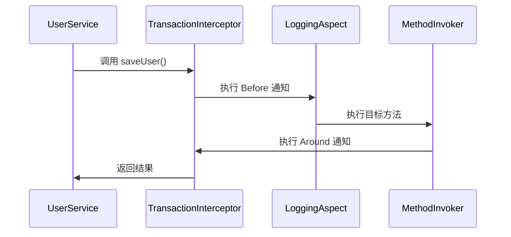
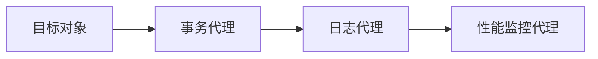

# 0. Spring概述

***

# Java面试八股—Spring框架核心知识点详解

***

## 1. 概述与定义

**Spring框架** 是一个开源的轻量级 Java 企业级应用框架，由 Rod Johnson 发起，旨在简化 Java 开发，通过 **控制反转（IoC）** 和 **面向切面编程（AOP）** 解耦应用组件，提升开发效率。

**核心定义**： &#x20;

- **IoC容器**：管理 Bean 的生命周期和依赖关系（如 `BeanFactory`、`ApplicationContext`）。 &#x20;
- **AOP**：通过横向切面（如日志、事务）解耦业务逻辑与系统服务。 &#x20;
- **模块化设计**：提供独立模块（如 Spring Core、Spring MVC、Spring Data）适配不同场景。

**与传统J2EE的对比**： &#x20;

| 特性         | Spring              | J2EE              |
| ---------- | ------------------- | ----------------- |
| **复杂度**​   | 轻量级，无需 EJB容器        | 重量级，依赖 EJB等规范     |
| **耦合度**​   | 低（IoC实现解耦）          | 高（硬编码依赖）          |
| **事务管理**​  | 声明式（@Transactional） | 手动编码（JTA）         |
| **AOP支持**​ | 内置支持                | 需第三方框架（如 AspectJ） |

***

## 2. 主要特点

### 2.1 核心优势

| 特性           | 描述                                                         |
| ------------ | ---------------------------------------------------------- |
| **IoC控制反转**​ | 通过容器管理对象生命周期，降低对象间耦合。                                      |
| **AOP支持**​   | 将横切逻辑（如日志、事务）从业务代码中分离，提升可维护性。                              |
| **模块化设计**​   | 按需引入核心模块（如 Spring MVC、Spring Data），避免功能冗余。                 |
| **声明式事务**​   | 通过注解（\`@Transactional\`）简化事务管理，无需手动编写 \`commit/rollback\`。 |
| **测试友好**​    | 支持 Mock 依赖 Bean，方便单元测试和集成测试。                               |

### 2.2 设计模式应用

| 模式         | Spring中的体现                    | 示例代码片段                                                  |
| ---------- | ----------------------------- | ------------------------------------------------------- |
| **工厂模式**​  | \`BeanFactory\`创建对象           | \`ApplicationContext.getBean("userDao");\`              |
| **代理模式**​  | AOP实现通过 JDK/CGLIB 动态代理        | \`new ProxyFactory(target).getProxy();\`                |
| **单例模式**​  | 默认 Bean 为单例（\`singleton\`作用域） | \`\<bean id="userDao" class="..." scope="singleton"/>\` |
| **观察者模式**​ | 事件驱动机制（\`ApplicationEvent\`）  | \`context.publishEvent(new MyEvent());\`                |

***

## 3. 应用目标

1. **简化开发**： &#x20;
   - 通过 IoC 集中管理对象依赖，避免硬编码。 &#x20;
   - 提供通用解决方案（如事务、日志），减少重复代码。 &#x20;
2. **提升可测试性**： &#x20;
   - 依赖注入允许替换 Mock 对象，降低测试成本。 &#x20;
3. **模块化扩展**： &#x20;
   - 支持与第三方库（如 MyBatis、Hibernate）无缝集成。 &#x20;
4. **企业级功能**： &#x20;
   - 提供声明式事务、安全框架（Spring Security）、消息驱动架构（Spring Integration）。

***

## 4. 主要内容及其组成部分

### 4.1 核心模块详解

#### **4.1.1 Spring Core**

- **功能**：IoC容器的核心实现。 &#x20;
- **关键组件**： &#x20;
  - **BeanFactory**：基础容器接口，提供基本对象管理。 &#x20;
  - **ApplicationContext**：增强型容器，支持国际化、事件发布等。 &#x20;
- **示例代码**： &#x20;
  ```java 
  // Java配置类
  @Configuration
  public class AppConfig {
      @Bean
      public UserDao userDao() {
          return new UserDaoImpl();
      }
  }
  ```


#### **4.1.2 Spring AOP**

- **实现方式**： &#x20;
  - **动态代理**：通过 JDK Proxy（接口代理）或 CGLIB（类代理）生成代理对象。 &#x20;
  - **切面类型**： &#x20;
    | 通知类型                | 描述                 | 示例代码                                                        |
    | ------------------- | ------------------ | ----------------------------------------------------------- |
    | **Before**​         | 方法执行前切入            | `@Before("execution(* service..*. *(..))")`                 |
    | **After**​          | 无论是否异常，方法执行后切入     | `@After("execution(* service..*. *(..))")`                  |
    | **AfterReturning**​ | 方法正常返回后切入          | \`@AfterReturning(pointcut = "...", returning = "result")\` |
    | **AfterThrowing**​  | 方法抛出异常后切入          | \`@AfterThrowing(pointcut = "...", throwing = "ex")\`       |
    | **Around**​         | 包围方法执行，可控制是否执行目标方法 | `@Around("execution(* service..*. *(..))")`                 |

#### **4.1.3 Spring DAO**

- **功能**：简化数据访问层开发。 &#x20;
- **关键注解**： &#x20;
  - `@Repository`：标记数据访问层 Bean。 &#x20;
  - `@Transactional`：声明式事务管理。 &#x20;
- **示例代码**： &#x20;
  ```java 
  @Repository
  public class UserDao {
      @Transactional
      public void saveUser(User user) {
          // 数据库操作
      }
  }
  ```


***

### 4.2 依赖注入（DI）与Bean管理

#### **4.2.1 自动装配方式**

| 方式          | 描述                        | 示例代码                                                       |
| ----------- | ------------------------- | ---------------------------------------------------------- |
| **byType**​ | 根据类型匹配 Bean。              | \`@Autowired private UserDao userDao;\`                    |
| **byName**​ | 根据名称匹配（需 \`@Qualifier\`）。 | \`@Autowired @Qualifier("userDao") private UserDao dao;\`  |
| **构造器注入**​  | 通过构造器参数注入，确保依赖非空。         | \`@Autowired public UserService(UserDao userDao) { ... }\` |

#### **4.2.2 Bean作用域**

| 作用域            | 描述                        | 场景示例                    |
| -------------- | ------------------------- | ----------------------- |
| **Singleton**​ | 默认，单例 Bean。               | 服务类（如 \`UserService\`）。 |
| **Prototype**​ | 每次请求创建新实例。                | 需要独立状态的临时对象。            |
| **Request**​   | 每个 HTTP 请求一个实例（需 Web 环境）。 | 用户会话数据。                 |
| **Session**​   | 每个 HTTP Session 一个实例。     | 购物车、登录状态。               |

***

### 4.3 事务管理

#### **4.3.1 传播行为**

| 传播行为               | 描述                | 示例场景        |
| ------------------ | ----------------- | ----------- |
| **REQUIRED**​      | 默认，若存在事务则加入，否则新建。 | 一般业务方法。     |
| **REQUIRES\_NEW**​ | 总是新建事务，原事务挂起。     | 需要独立事务的子操作。 |
| **NEVER**​         | 禁止事务，若存在则抛异常。     | 不需要事务的方法。   |
| **SUPPORTS**​      | 若存在事务则加入，否则无事务。   | 读取数据操作。     |

#### **4.3.2 事务失效场景**

- **未捕获的`RuntimeException`**：默认回滚。 &#x20;
- **手动提交**：`@Transactional` 未生效时需手动 `commit()`。 &#x20;
- **非 public 方法**：事务注解仅对 public 方法生效。

***

### 4.4 AOP实现原理

#### **4.4.1 代理机制对比**

| 类型           | 适用场景       | 生成方式                         | 限制                 |
| ------------ | ---------- | ---------------------------- | ------------------ |
| **JDK动态代理**​ | 目标对象实现接口。  | \`Proxy.newProxyInstance()\` | 无法代理无接口的类。         |
| **CGLIB代理**​ | 目标对象不实现接口。 | 生成子类字节码                      | 可能影响 \`final\` 方法。 |

#### **4.4.2 通知执行流程图**




***

## 5. 原理剖析

### 5.1 IoC容器初始化流程

#### **5.1.1 核心步骤**

1. **加载配置**：读取 XML、注解或 Java 配置定义的 Bean 定义。 &#x20;
2. **实例化 Bean**：通过反射或工厂方法创建对象。 &#x20;
3. **属性赋值**：注入依赖（如 `@Autowired`）和设置属性（如 `@Value`）。 &#x20;
4. **BeanPostProcessor 处理**：允许修改 Bean（如 AOP 代理）。 &#x20;
5. **初始化**：执行 `@PostConstruct` 或 `init-method`。 &#x20;
6. **注册到容器**：存入 `singletonObjects` 缓存。 &#x20;

#### **5.1.2 关键代码逻辑**

```java 
// DefaultListableBeanFactory.doCreateBean()
protected Object doCreateBean(String beanName, RootBeanDefinition mbd, Object[] args) {
    // 实例化
    Object beanInstance = createBeanInstance(beanName, mbd, args);
    // 属性填充
    populateBean(beanName, mbd, beanInstance);
    // 应用BeanPostProcessor
    applyBeanPostProcessorsBeforeInitialization(beanInstance, beanName);
    // 初始化
    initializeBean(beanName, beanInstance, mbd);
    return beanInstance;
}
```


***

### 5.2 AOP代理链生成

#### **5.2.1 代理链构建过程**




#### **5.2.2 代理对象生成示例**

```java 
// 目标对象
public class UserServiceImpl implements UserService { /* ... */ }

// 事务代理
public class TransactionProxy implements UserService {
    private UserService target;
    public void saveUser(User user) {
        try {
            TransactionAspect.start();
            target.saveUser(user);
            TransactionAspect.commit();
        } catch (Exception e) {
            TransactionAspect.rollback();
            throw e;
        }
    }
}
```


***

## 6. 应用与拓展

### 6.1 典型场景

#### **6.1.1 Web应用**

```java 
// Spring MVC控制器
@Controller
public class UserController {
    @Autowired
    private UserService userService;

    @GetMapping("/users/{id}")
    public User getUser(@PathVariable Long id) {
        return userService.findById(id);
    }
}
```


#### **6.1.2 数据访问层优化**

```java 
// 使用Spring Data JPA
public interface UserRepository extends JpaRepository<User, Long> {
    List<User> findByEmail(String email);
}
```


***

### 6.2 性能优化建议

- **减少Bean作用域为`prototype`**：避免频繁创建对象。 &#x20;
- **合理配置CGLIB代理**：对于无接口的类启用 `proxy-target-class="true"`。 &#x20;
- **事务边界控制**：避免过长事务影响并发性能。

***

## 7. 面试问答

### 问题1：Spring框架的核心优势是什么？

**回答**： &#x20;

Spring的核心优势包括： &#x20;

1. **IoC控制反转**：通过容器管理依赖，降低对象耦合。 &#x20;
2. **AOP支持**：将横切逻辑（如日志、事务）从业务代码中分离。 &#x20;
3. **声明式事务**：通过 `@Transactional` 简化事务管理。 &#x20;
4. **模块化设计**：按需引入功能模块（如 Spring MVC、Spring Security）。 &#x20;
5. **测试友好**：支持 Mock 依赖 Bean，提升测试效率。

***

### 问题2：IoC和DI的区别是什么？

**回答**： &#x20;

- **IoC（控制反转）**：控制权从应用代码转移到框架，对象的创建和管理由容器负责。 &#x20;
- **DI（依赖注入）**：IoC的具体实现方式，通过容器自动注入对象依赖。 &#x20;

**类比**： &#x20;

IoC是“谁控制对象”，DI是“如何控制”。

***

### 问题3：Spring AOP的实现原理？

**回答**： &#x20;

Spring AOP通过**动态代理**实现： &#x20;

1. **JDK动态代理**：为目标对象生成接口代理类。 &#x20;
2. **CGLIB代理**：为目标对象生成子类代理（无接口时使用）。 &#x20;
3. **通知链**：多个切面按顺序执行（如事务→日志→性能监控）。 &#x20;

**示例代码**： &#x20;

```java 
// 目标对象
public class UserService { /* ... */ }

// 代理对象
public class TransactionProxy extends UserService {
    @Override
    public void saveUser() {
        // 事务逻辑
        super.saveUser();
    }
}
```


***

### 问题4：Spring事务失效的常见原因？

**回答**： &#x20;

1. **非 public 方法**：事务注解仅对 public 方法生效。 &#x20;
2. **异常未被捕获**：`RuntimeException` 默认回滚，`Exception` 需手动配置。 &#x20;
3. **代理问题**：调用自身方法不经过代理（需通过 `AopContext.currentProxy()`）。 &#x20;
4. **未启用事务管理器**：需配置 `@EnableTransactionManagement`。

***

### 问题5：如何解决Spring的循环依赖？

**回答**： &#x20;

Spring通过**三级缓存机制**解决单例 Bean 的循环依赖： &#x20;

1. **earlySingletonObjects**：存储未初始化的 Bean。 &#x20;
2. **singletonFactories**：存储 Bean 的工厂对象。 &#x20;
3. **singletonObjects**：存储最终完成的 Bean。 &#x20;

**流程**： &#x20;

- 创建 BeanA 时，存入缓存并返回工厂对象。 &#x20;
- 创建 BeanB 时，通过工厂获取未完成的 BeanA。 &#x20;
- 完成 BeanB 初始化后，返回继续初始化 BeanA。

***

## 结语

本文系统梳理了 Spring 框架的核心知识点，涵盖基础概念、设计模式、核心模块及面试高频问题。在面试中，需结合具体场景（如事务传播、代理机制）深入解释，并通过代码示例和流程图辅助说明，以体现对框架原理的深刻理解。
