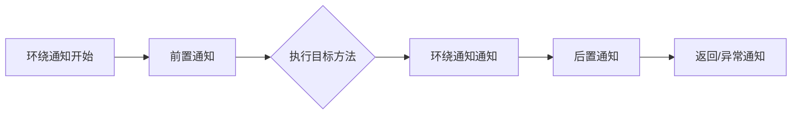
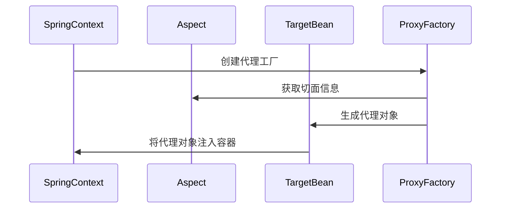

# 1. AOP

# Java面试八股——Spring框架AOP详解

***

## 1. 概述与定义

**Spring AOP（Aspect-Oriented Programming）** 是 Spring 框架提供的面向切面编程实现，用于**模块化横切关注点**（如日志、权限、事务管理等）。它通过**动态代理**或**CGLIB**技术，在不修改业务代码的前提下，将公共逻辑与核心业务逻辑解耦。

**核心目标**：实现**关注点分离**，提升代码复用性与可维护性。

***

## 2. 主要特点

| 特性                | 描述                                                     |
| ----------------- | ------------------------------------------------------ |
| **模块化横切逻辑**​      | 将日志、权限等公共逻辑集中到**切面（Aspect）** 中，避免分散在业务代码中。             |
| **非侵入性**​         | 无需修改业务代码，通过注解或 XML 配置即可实现切面的动态织入。                      |
| **多种通知类型**​       | 支持 \`@Before\`、\`@After\`、\`@Around\` 等 5 种通知类型（详见后文）。 |
| **灵活的切入点定义**​     | 使用正则表达式或注解（如 \`@annotation\`）定义切入点（Pointcut）。          |
| **集成 Spring 生态**​ | 无缝结合 Spring 的 \`Bean\` 管理和依赖注入（DI）。                    |

***

## 3. 应用目标

- **解决代码重复问题**：如日志记录、权限校验等逻辑在多个方法中重复出现。
- **降低耦合度**：将公共逻辑从业务代码中分离，提升系统可维护性。
- **增强扩展性**：新增功能（如监控、缓存）无需修改业务代码，只需定义切面。

***

## 4. 主要内容及其组成部分

### 4.1 核心术语详解

#### 1. **切面（Aspect）**

- **定义**：封装横切逻辑的类，通过 `@Aspect` 注解标识。
- **示例**：
  ```java 
  @Aspect
  @Component
  public class LoggingAspect {
      // 切面逻辑在此实现
  }
  ```


#### 2. **通知（Advice）**

- **定义**：在特定连接点执行的代码逻辑，类型包括：
  | 通知类型      | 触发时机            | 示例注解                |
  | --------- | --------------- | ------------------- |
  | **前置通知**​ | 目标方法执行前         | \`@Before\`         |
  | **后置通知**​ | 目标方法执行后（无论是否异常） | \`@After\`          |
  | **返回通知**​ | 目标方法正常返回后       | \`@AfterReturning\` |
  | **异常通知**​ | 目标方法抛出异常后       | \`@AfterThrowing\`  |
  | **环绕通知**​ | 包围目标方法，可控制是否执行  | \`@Around\`         |

#### 3. **切入点（Pointcut）**

- **定义**：定义通知需要织入的**连接点**（如特定方法）。
- **示例**：通过正则表达式匹配包下所有方法：
  ```java 
  @Pointcut("execution(* com.example.service.*.*(..))")
  public void serviceMethods() {}
  ```


#### 4. **目标对象（Target Object）**

- **定义**：被切面通知的对象，通常是一个由 Spring 管理的 Bean。

#### 5. **代理对象（Proxy）**

- **定义**：Spring 通过动态代理（JDK 或 CGLIB）生成的**增强对象**，包含切面逻辑。

***

### 4.2 通知类型与执行顺序

#### 1. **执行流程图**




#### 2. **详细顺序说明**

1. **`@Around`**\*\* 开始\*\*：进入环绕通知的 `proceed()` 前部分。
2. **`@Before`**：执行前置通知。
3. **目标方法**：执行被拦截的方法。
4. **`@Around`**\*\* 结束\*\*：执行环绕通知的后半部分。
5. **`@After`**：无论是否异常均执行。
6. **`@AfterReturning`****/****`@AfterThrowing`**：根据方法返回或异常触发。

***

### 4.3 配置与实现

#### 1. **启用 AOP 支持**

- **在 Spring Boot 中**：添加 `@EnableAspectJAutoProxy` 注解：
  ```java 
  @SpringBootApplication
  @EnableAspectJAutoProxy
  public class Application {
      public static void main(String[] args) {
          SpringApplication.run(Application.class, args);
      }
  }
  ```


#### 2. **切面示例：日志记录**

```java 
@Aspect
@Component
public class LoggingAspect {
    @Before("execution(* com.example.service.*.*(..))")
    public void logBefore(JoinPoint joinPoint) {
        System.out.println("方法：" + joinPoint.getSignature() + " 开始执行");
    }

    @AfterReturning(pointcut = "execution(* com.example.service.*.*(..))", returning = "result")
    public void logAfterReturning(JoinPoint joinPoint, Object result) {
        System.out.println("方法：" + joinPoint.getSignature() + " 返回结果：" + result);
    }
}
```


***

## 5. 原理剖析

### 5.1 AOP 实现机制

#### 1. **动态代理技术**

- **JDK动态代理**：适用于接口的实现类，通过 `java.lang.reflect.Proxy` 生成代理。
- **CGLIB 代理**：适用于非接口类，通过继承目标类生成子类代理。

#### 2. **织入（Weaving）过程**




#### 3. **通知执行流程**

- **切入点匹配**：根据 `@Pointcut` 定义筛选目标方法。
- **代理拦截**：通过代理对象拦截方法调用。
- **通知触发**：按顺序执行前置、环绕、后置等通知。

***

### 5.2 与 OOP 的对比

| 对比项       | OOP（面向对象编程）  | AOP（面向切面编程）        |
| --------- | ------------ | ------------------ |
| **关注点**​  | 业务功能（如订单、用户） | 横切逻辑（如日志、事务）       |
| **实现方式**​ | 通过类继承、组合实现   | 通过切面模块化横切逻辑        |
| **耦合度**​  | 逻辑分散，耦合度高    | 逻辑集中，耦合度低          |
| **扩展性**​  | 新功能需修改多处代码   | 新功能仅需定义切面，无需改动业务代码 |

***

## 6. 应用与拓展

### 6.1 典型应用场景

1. **日志记录**：在方法前后打印执行信息。
2. **权限校验**：通过 `@Around` 拦截未授权的请求。
3. **性能监控**：统计方法执行耗时。
4. **缓存控制**：通过环绕通知实现缓存逻辑。

### 6.2 性能优化建议

- **减少代理对象数量**：避免过度使用 `@Aspect`。
- **避免深代理链**：多层切面可能导致性能损耗。
- **使用 CGLIB 优化**：对于无接口的类强制使用 CGLIB：
  ```java 
  @EnableAspectJAutoProxy(proxyTargetClass = true)
  ```


### 6.3 常见问题解决

- **问题**：切面未生效。
- **原因**：未添加 `@EnableAspectJAutoProxy` 或切面未被 Spring 管理。
- **解决**：确保切面类有 `@Component` 注解，并检查包扫描路径。

***

## 7. 面试问答

### 问题1：什么是 AOP？它的核心作用是什么？

**回答**： &#x20;

AOP（面向切面编程）是一种编程范式，用于将横切关注点（如日志、权限）从业务逻辑中分离，实现模块化。 &#x20;

**核心作用**： &#x20;

1. **降低耦合**：公共逻辑集中到切面，业务代码无需关心横切逻辑。 &#x20;
2. **提高复用性**：同一切面可应用于多个类或方法。 &#x20;

**示例**：订单服务和用户服务都需要日志记录，通过 AOP 可将日志逻辑统一管理。

***

### 问题2：Spring AOP 支持哪些通知类型？请举例说明。

**回答**： &#x20;

Spring AOP 支持 5 种通知类型： &#x20;

1. **`@Before`**：方法执行前触发。 &#x20;

   **示例**：打印方法开始执行的日志。 &#x20;
2. **`@After`**：方法结束后触发（无论是否异常）。 &#x20;

   **示例**：记录方法执行结束时间。 &#x20;
3. **`@AfterReturning`**：方法正常返回后触发。 &#x20;

   **示例**：记录方法返回结果。 &#x20;
4. **`@AfterThrowing`**：方法抛出异常后触发。 &#x20;

   **示例**：记录异常堆栈信息。 &#x20;
5. **`@Around`**：环绕目标方法，可控制是否执行。 &#x20;

   **示例**：性能监控，计算方法执行耗时。 &#x20;

***

### 问题3：如何定义切入点？请写出一个匹配所有 Service 层方法的切入点。

**回答**： &#x20;

切入点通过 `@Pointcut` 定义，使用 AspectJ 表达式： &#x20;

```java 
@Pointcut("execution(* com.example.service..*.*(..))")
public void serviceMethods() {}
```


**解析**： &#x20;

- `execution`：匹配方法执行。 &#x20;
- `com.example.service..*`：匹配 Service 包及其子包下的所有类。 &#x20;
- `*.*(..)`：匹配所有方法及参数。

***

### 问题4：AOP 的实现原理是什么？为什么需要动态代理？

**回答**： &#x20;

**实现原理**： &#x20;

1. **织入**：Spring 在初始化 Bean 时，根据切面配置生成代理对象。 &#x20;
2. **代理拦截**：通过 JDK 动态代理或 CGLIB 拦截方法调用。 &#x20;
3. **通知执行**：根据切入点匹配规则，触发对应的前置、环绕等通知。 &#x20;

**动态代理的作用**： &#x20;

- **非侵入性**：无需修改业务类代码，通过代理增强功能。 &#x20;
- **灵活扩展**：支持在运行时动态添加或修改切面逻辑。

***

### 问题5：AOP 和 Spring 事务管理的关系？

**回答**： &#x20;

Spring 事务管理本质是通过 AOP 实现的： &#x20;

1. **切面定义**：`@Transactional` 注解标记需要事务的方法。 &#x20;
2. **通知类型**：使用 `@Around` 拦截方法，开启事务并处理提交/回滚。 &#x20;
3. **优点**： &#x20;
   - 事务逻辑与业务代码解耦。 &#x20;
   - 支持声明式事务管理（无需手动编写 `try-catch`）。 &#x20;

**示例**： &#x20;

```java 
@Transactional
public void transferMoney() {
    // 业务逻辑
}
```


Spring 通过 AOP 在方法前后自动管理事务。

***

## 结语

本文系统梳理了 Spring AOP 的核心概念、实现原理及面试高频问题。在实际面试中，需结合具体场景（如日志、事务）说明技术选型和实现细节，以体现对 AOP 模式及 Spring 框架的深刻理解。
