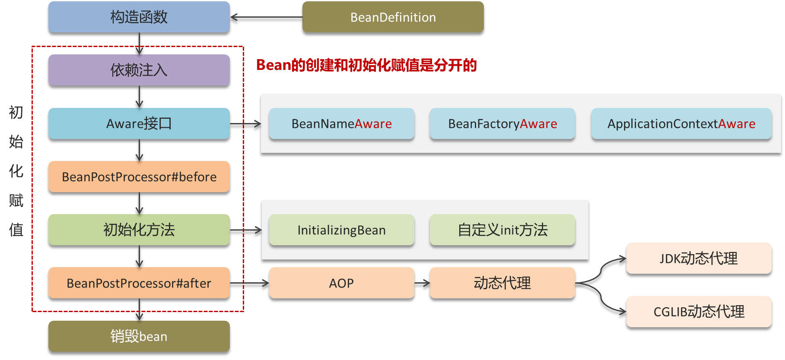
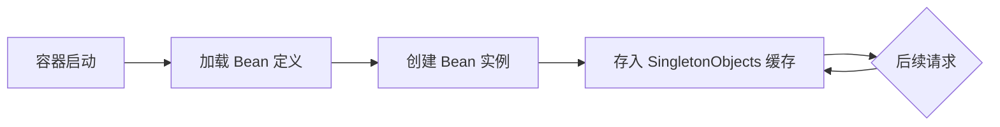
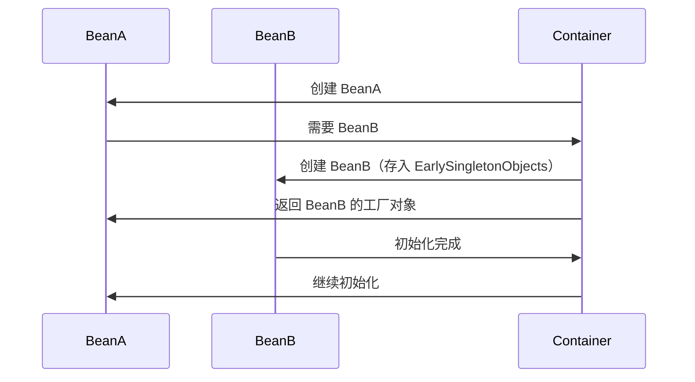

# 2. Bean

# Java面试八股-Spring框架Bean详解

***

## 1. 概述与定义

**Spring Bean** 是 Spring 框架中的核心概念，指由 **Spring 容器**（如 `ApplicationContext`）创建、管理和维护的对象。Bean 是应用程序的基本组成单元，负责封装业务逻辑、数据访问或控制流程。

**与普通 Java 对象的区别**： &#x20;

- **生命周期管理**：Bean 的创建、初始化、销毁由容器控制。 &#x20;
- **依赖注入**：容器自动处理 Bean 之间的依赖关系。 &#x20;
- **作用域控制**：Bean 可配置为单例、原型等作用域。 &#x20;
- **AOP 支持**：可通过切面增强 Bean 的行为。

***

## 2. 主要特点

| 特性             | 描述                                                          |
| -------------- | ----------------------------------------------------------- |
| **生命周期管理**​    | 容器控制 Bean 的创建、初始化、销毁（如 \`@PostConstruct\`、\`@PreDestroy\`）。 |
| **依赖注入（DI）** ​ | 通过构造器、Setter 或字段注入依赖，降低对象间耦合。                               |
| **作用域灵活**​     | 支持单例（Singleton）、原型（Prototype）、请求（Request）等 7 种作用域。          |
| **声明式编程支持**​   | 结合 AOP，可实现事务、日志等横切逻辑的模块化。                                   |
| **配置多样化**​     | 支持 XML、注解（如 \`@Component\`）、Java 配置类（如 \`@Configuration\`）。 |

***

## 3. 应用目标

- **解耦合**：通过依赖注入，减少对象间显式依赖。 &#x20;
- **简化配置**：统一管理 Bean 的创建和生命周期。 &#x20;
- **提升可测试性**：通过 Mock 依赖 Bean 进行单元测试。 &#x20;
- **支持扩展性**：通过作用域和作用域策略适应不同场景（如 Web 应用的请求作用域）。

***

## 4. 主要内容及其组成部分

### 4.1 Bean 的定义方式

#### 1. **XML 配置**

```xml 
<!-- applicationContext.xml -->
<bean id="userDao" class="com.example.dao.UserDaoImpl"/>
<bean id="userService" class="com.example.service.UserServiceImpl">
    <property name="userDao" ref="userDao"/>
</bean>
```


#### 2. **注解配置**

```java 
@Component
public class UserDaoImpl implements UserDao { /* ... */ }

@Service
public class UserServiceImpl implements UserService {
    @Autowired
    private UserDao userDao; // Setter 或构造器注入也可
}
```


#### 3. **Java 配置类**

```java 
@Configuration
public class AppConfig {
    @Bean
    public UserDao userDao() {
        return new UserDaoImpl();
    }

    @Bean
    public UserService userService(UserDao userDao) {
        return new UserServiceImpl(userDao);
    }
}
```


***

### 4.2 Bean 的生命周期

#### 1. **关键步骤流程图**



#### 2. **详细步骤**

1. **实例化**：通过反射或工厂方法创建 Bean 实例。 &#x20;
2. **属性赋值**：注入依赖、设置属性值（如 `@Value`）。 &#x20;
3. 若Bean实现了Aware接口, 则执行相应的回调方法。
4. **BeanPostProcessor 处理**：允许修改 Bean 属性（如 AOP 代理）。 &#x20;
5. **初始化**： &#x20;
   - 调用 `@PostConstruct` 注解方法。 &#x20;
   - 调用自定义 `init-method`（如 `<bean init-method="init">`）。 &#x20;
6. **注册到容器**：Bean 可通过 `getBean()` 获取。 &#x20;
7. **销毁**： &#x20;
   - 调用 `@PreDestroy` 注解方法。 &#x20;
   - 调用自定义 `destroy-method`（如 `<bean destroy-method="close">`）。

***

### 4.3 作用域（Scope）

| 作用域              | 描述                                | 场景示例                          |
| ---------------- | --------------------------------- | ----------------------------- |
| **Singleton**​   | 默认，容器中唯一实例。                       | 服务类（如 \`UserService\`）、单例工具类。 |
| **Prototype**​   | 每次请求创建新实例。                        | 需要独立状态的临时对象（如表单数据）。           |
| **Request**​     | 每个 HTTP 请求一个实例（需 Web 环境）。         | 用户会话请求处理。                     |
| **Session**​     | 每个 HTTP Session 一个实例（需 Web 环境）。   | 用户购物车、登录状态。                   |
| **Application**​ | 每个 ServletContext 一个实例（Web 应用全局）。 | 应用级缓存、配置。                     |
| **WebSocket**​   | 每个 WebSocket 连接一个实例（Spring 5+）。   | 实时聊天服务。                       |

***

### 4.4 依赖注入（DI）类型

#### 1. **注入方式对比**

| 方式             | 语法示例                                              | 适用场景          |
| -------------- | ------------------------------------------------- | ------------- |
| **构造器注入**​     | \`@Autowired public UserService(UserDao dao) {}\` | 必需依赖，避免 null。 |
| **Setter 注入**​ | \`@Autowired public void setDao(UserDao dao) {}\` | 可选依赖，可延迟初始化。  |
| **字段注入**​      | \`@Autowired private UserDao userDao;\`           | 简单场景，但可能隐藏依赖。 |

#### 2. **自动装配策略**

| 策略             | 描述                              |
| -------------- | ------------------------------- |
| **byType**​    | 根据类型匹配，默认策略。                    |
| **byName**​    | 根据 Bean 名称匹配（需 \`@Qualifier\`）。 |
| **Autowired**​ | 结合类型和 \`@Qualifier\`，优先类型匹配。    |

***

***

## 5. 原理剖析

### 5.1 容器创建 Bean 的核心流程

#### 1. **关键步骤**

#### a. Bean 的实例化阶段

- **实例化（Instantiation）：** &#x20;

  当 Spring 容器启动并加载配置（例如 XML、Java Config 或注解）后，容器会根据定义来创建 Bean 的实例。实例化过程通常通过构造函数或工厂方法完成。若采用无参构造函数，则容器直接调用构造方法；若 Bean 定义中指定了工厂方法，则调用该工厂方法来创建对象。
- **注意事项：** &#x20;

  在实例化过程中，Spring 仅仅是创建了对象，但并未对其进行属性赋值或后续初始化处理。

***

#### b. 属性注入和依赖注入阶段

- **属性赋值（Populate Properties）：** &#x20;

  在实例化完成后，容器会对 Bean 的属性进行赋值，这一过程也称为依赖注入。Spring 通过自动装配或显式配置，将所需的依赖对象注入到 Bean 中，从而满足 Bean 内部的依赖关系。
- **依赖检查：** &#x20;

  如果某些必需的依赖没有被正确注入，Spring 会在这个阶段报错，这确保了 Bean 在后续使用前具有完整的依赖环境。

***

#### c. Aware 接口回调阶段

- **Aware 接口的实现：** &#x20;

  如果 Bean 实现了 Spring 提供的某些 Aware 接口（例如`BeanNameAware`、`BeanFactoryAware`、`ApplicationContextAware`等），容器会在设置完属性之后，调用相应的方法，将容器相关的上下文信息传递给 Bean。这一机制使得 Bean 能够获取其在容器中的名称、所属的工厂或者上下文信息，从而进行更加灵活的处理。

***

#### d. BeanPostProcessor 的介入

- **前置处理（postProcessBeforeInitialization）：** &#x20;

  在正式进入初始化方法之前，所有实现了`BeanPostProcessor`接口的处理器会被依次调用。通过`postProcessBeforeInitialization`方法，开发者可以在 Bean 初始化之前对 Bean 进行自定义的修改或增强操作。
- **后置处理（postProcessAfterInitialization）：** &#x20;

  初始化方法执行完毕后，容器还会调用`BeanPostProcessor`的`postProcessAfterInitialization`方法。此时可以进一步对 Bean 进行包装或添加额外功能，比如创建代理对象以实现 AOP（面向切面编程）的功能。

***

#### e. 初始化阶段

- **初始化回调：** &#x20;

  在属性赋值和 Aware 接口回调之后，Bean 进入初始化阶段。Spring 提供了多种方式来定制初始化逻辑：
  - **实现 InitializingBean 接口：** &#x20;

    Bean 可以通过实现`InitializingBean`接口，并重写`afterPropertiesSet`方法，在所有依赖注入完成后执行自定义的初始化逻辑。
  - **配置 init-method：** &#x20;

    在 Bean 的定义中，可以通过`init-method`属性指定初始化方法。这一方法在容器完成属性赋值后被调用，与`afterPropertiesSet`方法共同构成 Bean 的初始化回调。
- **应用场景：** &#x20;

  初始化阶段常用于执行资源加载、数据校验、连接建立等需要在 Bean 使用前完成的任务。

***

#### f. Bean 的使用阶段

- **业务逻辑执行：** &#x20;

  一旦 Bean 完成所有的初始化步骤，便可交由业务逻辑调用。此时 Bean 已处于可用状态，可以被容器内的其他组件引用或直接进行业务处理。
- **作用域的影响：** &#x20;

  需要注意的是，不同作用域的 Bean（如 singleton、prototype 等）在生命周期管理上有所差异。以 singleton 为例，容器只会在整个应用中创建一个共享实例；而 prototype 模式下，每次请求都可能产生一个新实例，但 Spring 仅管理创建过程，对于 prototype Bean 的销毁工作则需要由使用者自行处理。

***

#### g. Bean 的销毁阶段

- **销毁回调：** &#x20;

  当容器关闭时，对于 singleton 作用域的 Bean，Spring 会调用其销毁回调方法，以便释放资源。销毁过程同样支持多种方式：
  - **实现 DisposableBean 接口：** &#x20;

    Bean 通过实现`DisposableBean`接口，并重写`destroy`方法，定义资源释放逻辑。
  - **配置 destroy-method：** &#x20;

    在 Bean 的定义中，可以通过`destroy-method`属性指定销毁方法，在容器关闭时调用。
- **注意事项：** &#x20;

  对于 prototype 作用域的 Bean，Spring 只负责创建和初始化，容器不会管理其生命周期的后续销毁，因此开发者需要自行管理这些 Bean 的资源释放。

***

#### 2. **示例代码：****`DefaultListableBeanFactory`**** 流程**

```java 
protected Object doCreateBean(final String beanName, RootBeanDefinition mbd, @Nullable Object[] args) {
    // 1. 实例化
    Object beanInstance = createBeanInstance(beanName, mbd, args);
    // 2. 填充属性
    populateBean(beanName, mbd, beanInstance);
    // 3. 初始化前处理
    applyBeanPostProcessorsBeforeInitialization(beanInstance, beanName);
    // 4. 初始化
    initializeBean(beanName, beanInstance, mbd);
    return beanInstance;
}
```


***

### 5.2 单例 Bean 的实现机制

#### 1. **单例缓存**




#### 2. **线程安全** &#x20;

- **双重检查锁**：确保多线程下单例 Bean 的唯一性。 &#x20;
- **三级缓存机制**：避免循环依赖时的死锁问题。

***

## 6. 应用与拓展

### 6.1 典型应用场景

1. **服务层组件**：如 `UserService`、`OrderService`，通过单例模式提升性能。 &#x20;
2. **数据源配置**：如 `JdbcTemplate`，通过容器管理避免重复创建。 &#x20;
3. **AOP 切面**：通过 `@Aspect` 定义切面 Bean，实现日志、权限等横切逻辑。 &#x20;

### 6.2 性能优化建议

- **避免过度使用 Prototype**：频繁创建对象可能增加 GC 压力。 &#x20;
- **合理配置作用域**：如 Web 环境下使用 `Request` 作用域处理请求级数据。 &#x20;
- **循环依赖最小化**：通过重构降低 Bean 间的依赖深度。

### 6.3 常见问题解决

- **问题**：Bean 无法注入，提示 `No qualifying bean of type`。 &#x20;
- **原因**：Bean 未被正确扫描或配置。 &#x20;
- **解决**： &#x20;
  - 检查包扫描路径（`@ComponentScan`）。 &#x20;
  - 确保 Bean 使用 `@Component` 或子注解（如 `@Service`）。 &#x20;

***

## 7. 面试问答

### 问题1：什么是 Spring Bean？与普通 Java 对象有什么不同？

**回答**： &#x20;

Spring Bean 是由 Spring 容器管理的对象，其生命周期和依赖关系由容器控制。 &#x20;

**核心区别**： &#x20;

1. **生命周期管理**：Bean 的创建、初始化、销毁由容器完成（如 `@PostConstruct`）。 &#x20;
2. **依赖注入**：容器自动注入依赖，无需手动 `new` 对象。 &#x20;
3. **作用域控制**：可通过配置定义单例、原型等作用域。 &#x20;

**示例**： &#x20;

```java 
@Component
public class UserService { /* 由容器管理 */ }
```


***

### 问题2：Spring Bean 的生命周期是怎样的？请详细说明。

**回答**： &#x20;

Spring Bean 的生命周期包含以下步骤： &#x20;

1. **实例化**：通过反射或工厂方法创建对象。 &#x20;
2. **属性赋值**：注入依赖和设置属性（如 `@Value`）。 &#x20;
3. **BeanPostProcessor 处理**：允许修改 Bean（如 AOP 代理）。 &#x20;
4. **初始化**： &#x20;
   - 调用 `@PostConstruct` 方法。 &#x20;
   - 执行自定义 `init-method`。 &#x20;
5. **注册到容器**：Bean 可通过 `getBean()` 获取。 &#x20;
6. **销毁**：容器关闭时调用 `@PreDestroy` 或 `destroy-method`。 &#x20;

***

### 问题3：如何解决 Spring 单例 Bean 的循环依赖？

**回答**： &#x20;

Spring 通过以下机制解决单例 Bean 的循环依赖： &#x20;

1. **三级缓存**： &#x20;
   - `SingletonObjects`：已完全初始化的 Bean。 &#x20;
   - `EarlySingletonObjects`：早期对象（未完成初始化）。 &#x20;
   - `SingletonFactories`：工厂对象（用于获取早期对象）。 &#x20;
2. **提前暴露工厂**： &#x20;
   - 当 BeanA 依赖未初始化的 BeanB 时，容器返回 BeanB 的工厂对象。 &#x20;
   - BeanB 初始化完成后，BeanA 继续完成初始化。 &#x20;

**示例流程**： &#x20;




***

### 问题4：什么是依赖注入？Spring 支持哪些注入方式？

**回答**： &#x20;

**依赖注入（DI）** 是 Spring 核心特性，通过容器管理对象间的依赖关系。 &#x20;

**支持方式**： &#x20;

1. **构造器注入**：通过 `@Autowired` 注解构造器。 &#x20;
   ```java 
   @Autowired
   public OrderService(OrderRepository repo) { /* ... */ }
   ```

2. **Setter 注入**：通过 `@Autowired` 注解Setter 方法。 &#x20;
   ```java 
   @Autowired
   public void setRepository(OrderRepository repo) { /* ... */ }
   ```

3. **字段注入**：直接通过 `@Autowired` 注解字段。 &#x20;
   ```java 
   @Autowired
   private OrderRepository repository;
   ```


**推荐优先使用构造器注入**，因其显式声明依赖且避免 null 引用。

***

### 问题5：Bean 的作用域有哪些？分别适用于什么场景？

**回答**： &#x20;

Spring 支持以下作用域： &#x20;

| 作用域            | 场景示例                          |
| -------------- | ----------------------------- |
| **Singleton**​ | 服务类（如 \`UserService\`）、单例工具类。 |
| **Prototype**​ | 需要独立状态的临时对象（如表单数据）。           |
| **Request**​   | HTTP 请求处理（如用户会话数据）。           |
| **Session**​   | 用户购物车、登录状态。                   |

**示例配置**： &#x20;

```java 
// 原型作用域
@Component
@Scope("prototype")
public class ShoppingCart { /* ... */ }
```


***

## 结语

本文全面覆盖了 Spring Bean 的核心概念、实现原理及面试高频问题。在实际面试中，需结合具体场景（如循环依赖解决方案、作用域选择）深入解释，并通过代码示例和流程图辅助说明，以体现对 Spring 核心机制的深刻理解。
