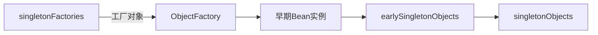
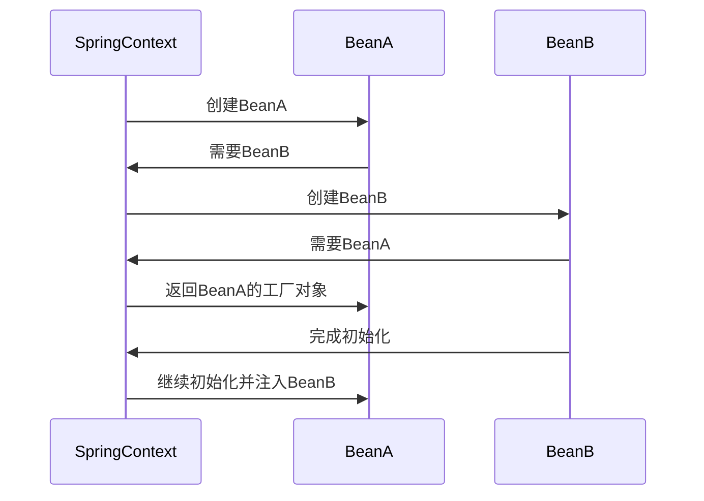
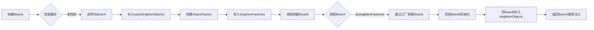

# 3. 循环依赖

# Java面试八股—Spring框架循环依赖详解

***

## 1. 概述与定义

**Spring循环依赖**指两个或多个Bean之间形成相互引用的闭环关系，例如A依赖B，B又依赖A。这种依赖关系在Spring容器初始化时可能导致死锁或启动失败，但Spring通过**三级缓存机制**和**依赖注入策略**解决了部分场景的循环依赖问题。

**核心定义**： &#x20;

- **单例Bean循环依赖**：最常见且可解决的场景（需满足特定条件）。 &#x20;
- **原型Bean循环依赖**：无法解决，直接抛出异常。 &#x20;
- **构造器注入循环依赖**：无法解决，直接抛出异常。

***

## 2. 主要特点

| 特性          | 描述                                                                             |
| ----------- | ------------------------------------------------------------------------------ |
| **单例支持**​   | 可解决单例Bean的Setter方法注入循环依赖。                                                      |
| **三级缓存机制**​ | 通过 \`singletonFactories\`、\`earlySingletonObjects\`、\`singletonObjects\` 缓存对象。 |
| **作用域限制**​  | 仅支持单例（Singleton）作用域的循环依赖解决。                                                    |
| **注入方式敏感**​ | \*\*Setter注入\*\*可解决，\*\*构造器注入\*\*无法解决。                                         |
| **自依赖支持**​  | 支持Bean自身引用（如A依赖自己）。                                                            |

***

## 3. 应用目标

- **保证应用正常启动**：避免因循环依赖导致容器无法初始化。 &#x20;
- **提升代码灵活性**：允许合理设计的循环依赖场景（如模块间协作）。 &#x20;
- **明确设计缺陷**：通过异常提示开发者检查不合理的依赖关系。

***

## 4. 主要内容及其组成部分

### 4.1 循环依赖类型

#### 1. **常见类型**

| 类型              | 描述                                     | 是否可解决 |
| --------------- | -------------------------------------- | ----- |
| **单例Setter循环**​ | A和B均为单例，通过Setter方法互相依赖。                | ✅     |
| **构造器循环**​      | 依赖通过构造器参数注入。                           | ❌     |
| **原型循环**​       | Bean作用域为\`prototype\`的循环依赖。            | ❌     |
| **自依赖**​        | Bean依赖自身（如\`@Autowired private A a\`）。 | ✅     |

#### 2. **示例代码**

```java 
// 单例Setter循环依赖（可解决）
@Component
public class A {
    @Autowired
    private B b;
}

@Component
public class B {
    @Autowired
    private A a;
}
```


***

### 4.2 三级缓存机制

#### 1. **缓存层级**




| 缓存名称                       | 存储内容                                         |
| -------------------------- | -------------------------------------------- |
| **singletonFactories**​    | 存储未完成初始化的Bean工厂（\`ObjectFactory\`），用于提前暴露对象。 |
| **earlySingletonObjects**​ | 存储已实例化但未完成初始化的Bean对象。                        |
| **singletonObjects**​      | 存储已完成初始化的Bean对象（最终容器）。                       |

#### 2. **作用** &#x20;

- **避免死锁**：通过工厂对象提前暴露未完成的Bean，打破依赖链阻塞。 &#x20;
- **分阶段管理**：确保Bean在初始化过程中逐步完成依赖注入。

***

### 4.3 解决流程步骤

#### 1. **核心流程图**




#### 2. **详细步骤**

1. **创建BeanA**： &#x20;
   - 实例化BeanA并放入`earlySingletonObjects`。 &#x20;
   - 将BeanA的工厂对象存入`singletonFactories`。 &#x20;
2. **处理BeanB依赖**： &#x20;
   - 发现BeanB依赖BeanA，从`singletonFactories`获取BeanA的工厂对象。 &#x20;
3. **完成BeanB初始化**： &#x20;
   - 实例化BeanB并注入依赖，完成后存入`singletonObjects`。 &#x20;
4. **返回BeanA初始化**： &#x20;
   - 从`singletonObjects`获取已完成的BeanB，注入到BeanA中。 &#x20;

***

### 4.4 构造器注入的限制

#### 1. **不可解决原因**

- **依赖必须立即可用**：构造器注入要求在实例化时提供所有依赖，而循环依赖的Bean可能未创建。 &#x20;
- **直接抛出异常**： &#x20;
  ```java 
  @Component
  public class A {
      private final B b;
      @Autowired
      public A(B b) {
          this.b = b;
      }
  }
  ```

  上述代码会触发`BeanCurrentlyInCreationException`。

***

## 5. 原理剖析

### 5.1 三级缓存工作原理

#### 1. **缓存交互流程**




#### 2. **关键代码逻辑**

- **工厂对象创建**： &#x20;
  ```java 
  // DefaultSingletonBeanRegistry.java
  ObjectFactory<?> singletonFactory = new ObjectFactory() {
      public Object getObject() {
          return getBean(earlyBeanName);
      }
  };
  singletonFactories.put(beanName, singletonFactory);
  ```


***

### 5.2 构造器注入与Setter注入对比

| 特性          | 构造器注入        | Setter注入    |
| ----------- | ------------ | ----------- |
| **循环依赖支持**​ | ❌ 直接失败       | ✅ 可解决（单例场景） |
| **依赖可选性**​  | 必须提供依赖（强制依赖） | 可选依赖（可延迟注入） |
| **代码可读性**​  | 显式声明依赖       | 可能隐藏依赖关系    |
| **推荐场景**​   | 必要依赖（如数据库连接） | 可选或非核心依赖    |

***

### 5.3 自我依赖的处理

#### 1. **示例代码**

```java 
@Component
public class SelfDependentBean {
    @Autowired
    private SelfDependentBean self;
}
```


#### 2. **解决机制** &#x20;

- Spring允许自我依赖，通过缓存机制确保Bean在初始化时可获取自身引用。 &#x20;
- **流程**： &#x20;
  1. 实例化Bean并存入缓存。 &#x20;
  2. 通过工厂对象提前暴露实例。 &#x20;
  3. 初始化时通过缓存获取自身引用。

***

## 6. 应用与拓展

### 6.1 典型应用场景

1. **模块间协作**：如`UserService`依赖`OrderService`，反之亦然（需合理设计）。 &#x20;
2. **事件监听器**：监听器可能依赖其他服务，而服务又依赖监听器。 &#x20;

### 6.2 性能优化建议

- **避免深层循环**：循环层数过多可能导致内存和性能问题。 &#x20;
- **优先Setter注入**：减少构造器注入的循环风险。 &#x20;
- **重构代码**：通过引入中间接口或服务拆分消除循环依赖。

### 6.3 常见问题解决

- **问题**：启动时报`BeanCurrentlyInCreationException`。 &#x20;
- **原因**：使用构造器注入形成循环依赖。 &#x20;
- **解决**： &#x20;
  - 改为Setter注入。 &#x20;
  - 检查是否为原型作用域。 &#x20;

***

## 7. 面试问答

### 问题1：什么是Spring循环依赖？为什么需要解决它？

**回答**： &#x20;

Spring循环依赖指两个或多个Bean互相依赖形成闭环。例如A依赖B，B又依赖A。 &#x20;

**需要解决的原因**： &#x20;

- **死锁风险**：容器无法确定创建顺序，导致无法初始化Bean。 &#x20;
- **应用启动失败**：未解决的循环依赖可能导致容器无法启动。 &#x20;

**示例**： &#x20;

```java 
@Component
public class A { @Autowired private B b; }  
@Component
public class B { @Autowired private A a; }
```


***

### 问题2：Spring如何解决单例Bean的循环依赖？

**回答**： &#x20;

通过**三级缓存机制**： &#x20;

1. **earlySingletonObjects**：存储未完成初始化的Bean实例。 &#x20;
2. **singletonFactories**：存储Bean的工厂对象，提前暴露实例。 &#x20;
3. **singletonObjects**：存储最终完成的Bean。 &#x20;

**流程**： &#x20;

- 创建BeanA时，实例化并存入缓存。 &#x20;
- 创建BeanB时，通过工厂从缓存获取未完成的BeanA。 &#x20;
- 完成BeanB初始化后，返回继续初始化BeanA。

***

### 问题3：什么是三级缓存？请详细说明每个缓存的作用。

**回答**： &#x20;

Spring的三级缓存用于解决循环依赖： &#x20;

1. **singletonFactories**： &#x20;
   - 存储`ObjectFactory`对象，用于获取未完成的Bean实例。 &#x20;
   - 作用：提前暴露Bean，避免依赖阻塞。 &#x20;
2. **earlySingletonObjects**： &#x20;
   - 存储已实例化但未完成初始化的Bean。 &#x20;
   - 作用：临时存放Bean，等待依赖注入。 &#x20;
3. **singletonObjects**： &#x20;
   - 存储最终完成初始化的Bean。 &#x20;
   - 作用：提供稳定可用的Bean实例。

***

### 问题4：为什么构造器注入的循环依赖无法解决？

**回答**： &#x20;

构造器注入要求在实例化时立即提供所有依赖。 &#x20;

例如： &#x20;

```java 
public class A {  
    private final B b;  
    public A(B b) { this.b = b; }  
}  
public class B {  
    private final A a;  
    public B(A a) { this.a = a; }  
}
```


**问题**： &#x20;

- 创建A时需要B，但B的创建又需要A。 &#x20;
- Spring无法通过缓存提前暴露未完成的Bean，导致直接抛出异常。

***

### 问题5：Spring支持哪些类型的循环依赖？如何避免循环依赖？

**回答**： &#x20;

**支持类型**： &#x20;

- **单例Bean的Setter注入循环依赖**。 &#x20;
- **Bean的自我依赖**（如依赖自身）。 &#x20;

**避免方法**： &#x20;

1. **重构代码**： &#x20;
   - 引入中间接口或服务拆分。 &#x20;
   - 使用事件机制替代直接依赖。 &#x20;
2. **依赖注入策略**： &#x20;
   - 避免构造器注入的循环。 &#x20;
   - 使用Setter注入处理可选依赖。 &#x20;
3. **设计模式**： &#x20;
   - 通过工厂模式或策略模式解耦。 &#x20;

***

## 结语

本文深入剖析了Spring循环依赖的核心机制、解决原理及面试高频问题。在面试中，需结合具体场景（如三级缓存交互、注入方式选择）进行详细解释，并通过代码示例和流程图辅助说明，以体现对Spring容器管理机制的深刻理解。
