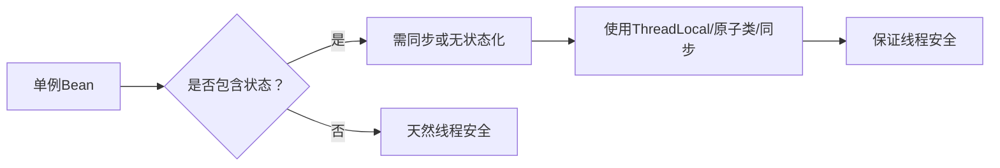

# 4. 线程安全

***

# Java面试八股——Spring框架线程安全详解

***

## 1. 概述与定义

**Spring线程安全的核心概念**： &#x20;

Spring框架默认采用**单例作用域**（Singleton），即一个Bean在Spring容器中只有一个实例。由于单例Bean被所有线程共享，其线程安全性取决于Bean的实现方式。 &#x20;

- **线程安全**：Bean在多线程环境下能正确处理共享数据，不会因并发操作导致数据不一致或异常。 &#x20;
- **线程不安全**：Bean的可变状态在多线程访问时可能发生竞争条件（Race Condition）。

**线程安全的关键点**： &#x20;

| 场景           | 描述                  | 示例代码                                                                                     |
| ------------ | ------------------- | ---------------------------------------------------------------------------------------- |
| **无状态Bean**​ | 不保存状态，所有操作依赖方法参数。   | \`@Service public class MathService { public int add(int a, int b) { return a + b; } }\` |
| **有状态Bean**​ | 包含可变成员变量，需额外处理线程安全。 | \`private int count; public void increment() { count++; }\`                              |

***

## 2. 主要特点

### 2.1 线程安全的核心原则

| 特性          | Spring中的体现                            | 解决方案示例                                                                   |
| ----------- | ------------------------------------- | ------------------------------------------------------------------------ |
| **作用域控制**​  | 单例（默认）、原型、请求、会话等作用域影响线程安全             | \`@Scope("prototype")\`避免共享实例                                            |
| **无状态设计**​  | 推荐Bean无状态化，减少线程竞争                     | 避免成员变量，依赖方法参数传递状态                                                        |
| **同步机制**​   | 使用\`@Synchronized\`或显式\`lock\`保证操作原子性 | \`synchronized void updateData() { ... }\`                               |
| **线程局部变量**​ | \`ThreadLocal\`隔离线程状态                 | \`ThreadLocal\<Context> contextHolder = new ThreadLocal<>();\`           |
| **原子操作**​   | \`AtomicInteger\`等原子类避免竞态条件           | \`AtomicInteger count = new AtomicInteger(0); count.incrementAndGet();\` |

### 2.2 线程安全的常见场景

| 场景         | 问题描述               | 解决方案                               |
| ---------- | ------------------ | ---------------------------------- |
| **计数器操作**​ | 多线程同时修改计数器导致结果错误   | 使用\`AtomicInteger\`或同步块            |
| **请求上下文**​ | 同一线程需共享临时数据（如用户ID） | \`ThreadLocal\`存储上下文               |
| **资源池**​   | 多线程访问共享资源池需控制并发访问  | \`ReentrantLock\`或\`synchronized\` |

***

## 3. 应用目标

1. **确保单例Bean的安全性**： &#x20;
   - 在高并发场景下，通过同步机制或无状态设计避免数据污染。 &#x20;
2. **优化资源利用率**： &#x20;
   - 通过原型作用域或`ThreadLocal`减少资源竞争。 &#x20;
3. **减少代码冗余**： &#x20;
   - 使用Spring提供的线程安全工具（如`ConcurrentHashMap`）替代手动实现。 &#x20;
4. **提升系统稳定性**： &#x20;
   - 避免因线程安全问题导致的`ConcurrentModificationException`或脏数据。

***

## 4. 主要内容及其组成部分

### 4.1 作用域与线程安全

#### **4.1.1 单例作用域（Singleton）**

- **线程安全风险**： &#x20;
  - 多线程共享同一个Bean实例，若包含可变状态，可能导致数据不一致。 &#x20;
- **示例代码（线程不安全）**： &#x20;
  ```java 
  @Service
  public class CounterService {
      private int count;
      public void increment() { count++; } // 非原子操作，存在竞态条件
  }
  ```

- **修复方案**： &#x20;
  ```java 
  @Service
  public class SafeCounterService {
      private AtomicInteger count = new AtomicInteger(0);
      public void increment() { count.incrementAndGet(); }
  }
  ```


#### **4.1.2 原型作用域（Prototype）**

- **线程安全**： &#x20;
  - 每次请求创建新实例，实例间不共享状态，天然线程安全。 &#x20;
- **适用场景**： &#x20;
  - 需要独立状态的Bean（如临时计算类）。 &#x20;

#### **作用域对比表**

| 作用域                  | 线程安全性  | 适用场景            |
| -------------------- | ------ | --------------- |
| **Singleton**​       | 需手动保证  | 无状态服务、工具类       |
| **Prototype**​       | 天然线程安全 | 需独立状态的Bean      |
| **Request/Session**​ | 会话内安全  | Web场景的请求/会话相关数据 |

***

### 4.2 无状态Bean设计

#### **4.2.1 无状态Bean的优势**

- **线程安全**：无共享状态，无需同步。 &#x20;
- **可扩展性**：易于集群部署，实例间无依赖。 &#x20;
- **示例代码**： &#x20;
  ```java 
  @Service
  public class StatelessCalculator {
      public double calculateInterest(double amount, double rate) {
          return amount * rate / 100; // 无状态，方法参数驱动
      }
  }
  ```


#### **4.2.2 有状态Bean的线程安全处理**

- **方案对比**： &#x20;
  | 方法                | 适用场景        | 示例代码                                                                    |
  | ----------------- | ----------- | ----------------------------------------------------------------------- |
  | **ThreadLocal**​  | 需线程隔离状态     | \`ThreadLocal\<UserContext> context = new ThreadLocal<>();\`            |
  | **Synchronized**​ | 简单同步场景      | \`public synchronized void update() { ... }\`                           |
  | **原子类**​          | 基本类型操作（如计数） | \`AtomicInteger count = new AtomicInteger();\`                          |
  | **线程安全数据结构**​     | 集合类操作       | \`ConcurrentHashMap\<String, User> users = new ConcurrentHashMap<>();\` |

***

### 4.3 线程安全工具与模式

#### **4.3.1 ThreadLocal**

- **原理**：为每个线程提供独立的变量副本。 &#x20;
- **典型用途**：存储请求上下文（如用户ID、事务ID）。 &#x20;
- **示例代码**： &#x20;
  ```java 
  public class RequestContext {
      private static final ThreadLocal<User> currentUser = new ThreadLocal<>();
      public static void set(User user) { currentUser.set(user); }
      public static User get() { return currentUser.get(); }
      public static void remove() { currentUser.remove(); }
  }
  ```


#### **4.3.2 同步机制（Synchronized vs Lock）**

- **同步块**： &#x20;
  ```java 
  public class SafeService {
      private final Object lock = new Object();
      public void update() {
          synchronized (lock) {
              // 安全操作
          }
      }
  }
  ```

- **ReentrantLock**： &#x20;
  ```java 
  public class LockService {
      private final ReentrantLock lock = new ReentrantLock();
      public void update() {
          lock.lock();
          try {
              // 安全操作
          } finally {
              lock.unlock();
          }
      }
  }
  ```


#### **4.3.3 原子类（Atomic）**

- **原子操作示例**： &#x20;
  ```java 
  public class AtomicCounter {
      private AtomicInteger count = new AtomicInteger(0);
      public int increment() { return count.incrementAndGet(); }
      public int getCount() { return count.get(); }
  }
  ```


***

## 5. 原理剖析

### 5.1 单例Bean的线程安全问题根源

#### **5.1.1 竞态条件（Race Condition）**

- **示例场景**： &#x20;
  ```java 
  @Service
  public class UnsafeService {
      private int value;
      public void setValue(int value) { this.value = value; }
      public int getValue() { return value; }
  }
  ```

- **问题**： &#x20;

  多线程同时调用`setValue`可能导致`value`未及时更新。 &#x20;

#### **5.1.2 线程安全保证流程图**




***

### 5.2 Spring容器的线程安全机制

#### **5.2.1 Bean的创建与初始化**

- **单例Bean的三级缓存**： &#x20;
  1. **earlySingletonObjects**：存放正在初始化的Bean。 &#x20;
  2. **singletonFactories**：存放Bean的工厂对象（如ObjectFactory）。 &#x20;
  3. **singletonObjects**：存放已完全初始化的Bean。 &#x20;
- **流程图**： &#x20;
  ```mermaid 
  sequenceDiagram
    participant ApplicationContext
    participant SingletonBean
    ApplicationContext->>SingletonBean: 创建Bean实例
    SingletonBean->>ApplicationContext: 存入earlySingletonObjects
    ApplicationContext->>SingletonBean: 初始化并移至singletonObjects
  ```


***

## 6. 应用与拓展

### 6.1 典型场景解决方案

#### **6.1.1 Web应用中的请求上下文**

```java 
// 使用ThreadLocal存储用户信息
public class RequestContextFilter implements Filter {
    @Override
    public void doFilter(ServletRequest request, ServletResponse response, FilterChain chain) {
        try {
            User user = ((HttpServletRequest) request).getUserPrincipal();
            UserContextHolder.set(user);
            chain.doFilter(request, response);
        } finally {
            UserContextHolder.remove();
        }
    }
}
```


#### **6.1.2 分布式锁与Spring结合**

```java 
@Service
public class DistributedLockService {
    @Autowired
    private RedissonClient redissonClient;
    public RLock getLock(String key) {
        return redissonClient.getLock(key);
    }
}
```


***

### 6.2 性能优化建议

1. **减少同步范围**：仅对关键代码块加锁，避免阻塞。 &#x20;
2. **使用无锁设计**：优先使用`Atomic`类代替`synchronized`。 &#x20;
3. **合理选择作用域**：避免不必要的单例Bean。 &#x20;

***

## 7. 面试问答

### 问题1：Spring单例Bean是否线程安全？

**回答**： &#x20;

Spring单例Bean默认是**非线程安全**的，因为其实例被所有线程共享。线程安全性取决于Bean的实现： &#x20;

1. **无状态Bean**：如工具类、计算类，无成员变量，天然线程安全。 &#x20;
2. **有状态Bean**：包含可变成员变量，需通过`ThreadLocal`、`synchronized`或原子类保证安全。 &#x20;

**示例**： &#x20;

```java 
// 线程不安全的单例Bean
@Service
public class UnsafeCounter {
    private int count;
    public void increment() { count++; } // 竞态条件
}
```


***

### 问题2：如何解决Spring单例Bean的线程安全问题？

**回答**： &#x20;

1. **无状态设计**：避免成员变量，依赖方法参数。 &#x20;
2. **同步机制**：使用`@Synchronized`注解或`synchronized`关键字。 &#x20;
3. **线程局部变量**：通过`ThreadLocal`隔离线程状态。 &#x20;
4. **原子类**：如`AtomicInteger`处理基本类型操作。 &#x20;
5. **线程安全数据结构**：如`ConcurrentHashMap`替代`HashMap`。 &#x20;

***

### 问题3：解释ThreadLocal的作用和适用场景？

**回答**： &#x20;

- **作用**：为每个线程提供独立的变量副本，避免线程间共享数据。 &#x20;
- **适用场景**： &#x20;
  - 存储请求上下文（如用户ID、事务ID）。 &#x20;
  - 在多线程任务中维护线程独有状态。 &#x20;
- **示例**： &#x20;

```java 
public class UserContext {
    private static final ThreadLocal<User> current = new ThreadLocal<>();
    public static void set(User user) { current.set(user); }
    public static User get() { return current.get(); }
}
```


***

### 问题4：Spring中如何实现线程安全的计数器？

**回答**： &#x20;

1. **使用AtomicInteger**： &#x20;
   ```java 
   @Service
   public class SafeCounter {
       private AtomicInteger count = new AtomicInteger(0);
       public int increment() { return count.incrementAndGet(); }
   }
   ```

2. **同步方法**： &#x20;
   ```java 
   @Service
   public class SynchronizedCounter {
       private int count;
       public synchronized void increment() { count++; }
   }
   ```


**推荐方案**：优先使用`AtomicInteger`，因其性能优于`synchronized`。

***

### 问题5：Spring的Prototype作用域如何保证线程安全？

**回答**： &#x20;

- **原理**：每次请求创建新实例，实例间不共享状态。 &#x20;
- **适用场景**： &#x20;
  - 需要独立状态的Bean（如临时计算对象）。 &#x20;
  - 避免单例Bean的线程安全问题。 &#x20;
- **示例**： &#x20;

```java 
@Service
@Scope("prototype")
public class TemporaryCalculator {
    private int result;
    public int compute() { return result = someCalculation(); }
}
```


***

## 结语

本文系统分析了Spring框架的线程安全机制，涵盖作用域选择、无状态设计、同步工具及典型场景解决方案。在面试中，需结合具体案例（如计数器、请求上下文）深入解释原理，并通过代码示例和流程图辅助说明，以体现对线程安全问题的全面理解。
