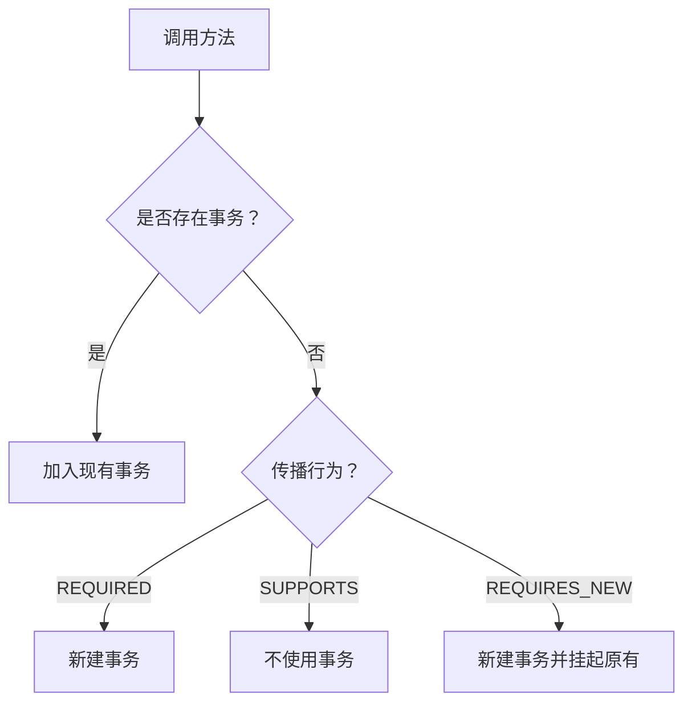

# 5. 事务

***

# Java面试八股——Spring框架事务管理详解

***

## 1. 概述与定义

**Spring事务的核心概念**： &#x20;

Spring事务是Spring框架对数据库操作的**ACID特性**（原子性、一致性、隔离性、持久性）的封装，通过声明式或编程式方式管理事务边界。其本质是通过**AOP**（面向切面编程）将事务逻辑从业务代码中解耦，实现统一管理。

**事务的定义**： &#x20;

事务是一组**逻辑上相关**的数据库操作，要么全部成功提交，要么全部失败回滚。例如：银行转账操作中，从A账户扣款和向B账户存款必须作为原子操作。

**核心特性（ACID）**： &#x20;

| 特性       | 描述               | 示例场景                |
| -------- | ---------------- | ------------------- |
| **原子性**​ | 操作要么全部成功，要么全部失败。 | 转账时若扣款成功但存款失败，事务回滚。 |
| **一致性**​ | 事务前后数据保持合法状态。    | 转账后总金额不变。           |
| **隔离性**​ | 并发事务互不干扰。        | 多个用户同时查询余额时数据一致。    |
| **持久性**​ | 事务提交后结果永久保存。     | 数据库崩溃后仍能恢复提交的数据。    |

***

## 2. 主要特点

### 2.1 Spring事务的核心优势

| 特性           | 优势说明                                                            | 示例代码                                                        |
| ------------ | --------------------------------------------------------------- | ----------------------------------------------------------- |
| **声明式事务**​   | 通过注解（\`@Transactional\`）或XML配置，无需手动编写事务代码。                      | \`@Transactional public void transferMoney() { ... }\`      |
| **编程式事务**​   | 通过\`TransactionTemplate\`或\`PlatformTransactionManager\`精细控制事务。 | \`new TransactionTemplate().execute(status -> { ... });\`   |
| **隔离多种数据源**​ | 支持JDBC、Hibernate、JPA等数据源的事务管理。                                  | \`@EnableTransactionManagement\`                            |
| **传播行为灵活**​  | 定义事务在方法调用时的传播规则（如\`REQUIRED\`、\`REQUIRES\_NEW\`）。               | \`@Transactional(propagation = Propagation.REQUIRES\_NEW)\` |

### 2.2 事务的适用场景

| 场景          | 描述                          | 示例代码             |
| ----------- | --------------------------- | ---------------- |
| **数据变更操作**​ | 插入、更新、删除操作需保证数据一致性。         | 转账、订单创建等。        |
| **跨服务操作**​  | 分布式场景需通过补偿机制或Saga模式实现最终一致性。 | 订单服务与库存服务的分布式事务。 |
| **资源管理**​   | 文件操作与数据库操作的原子性保证。           | 保存文件后更新数据库状态。    |

***

## 3. 应用目标

1. **保证数据一致性**： &#x20;
   - 避免部分操作成功导致的数据不一致（如转账只扣款未存款）。 &#x20;
2. **简化事务管理**： &#x20;
   - 通过声明式事务减少样板代码，提升开发效率。 &#x20;
3. **支持复杂场景**： &#x20;
   - 处理分布式事务、超时控制、隔离级别调整等需求。 &#x20;
4. **提升系统可靠性**： &#x20;
   - 通过回滚机制恢复异常状态，防止数据污染。

***

## 4. 主要内容及其组成部分

### 4.1 事务管理器（`PlatformTransactionManager`）

#### **4.1.1 核心接口与实现类**

- **接口定义**： &#x20;

  `PlatformTransactionManager`是Spring事务管理的核心接口，定义了事务的**开启、提交、回滚**操作。 &#x20;
- **常见实现类**： &#x20;
  | 实现类                              | 适用场景                    | 示例代码                                                |
  | -------------------------------- | ----------------------- | --------------------------------------------------- |
  | \`DataSourceTransactionManager\` | 纯JDBC或MyBatis单数据源场景     | \`new DataSourceTransactionManager(dataSource)\`    |
  | \`HibernateTransactionManager\`  | Hibernate ORM框架         | \`new HibernateTransactionManager(sessionFactory)\` |
  | \`JpaTransactionManager\`        | JPA框架（如Spring Data JPA） | \`new JpaTransactionManager(entityManagerFactory)\` |

#### **4.1.2 事务状态对象（****`TransactionStatus`****）**

- **核心方法**： &#x20;
  ```java 
  interface TransactionStatus {
      boolean isNewTransaction();  // 是否新创建的事务
      void setRollbackOnly();      // 标记为回滚
      boolean isRollbackOnly();    // 是否需要回滚
      void flush();                // 强制刷新事务
  }
  ```


***

### 4.2 事务传播行为（`Propagation`）

| 传播行为               | 描述                | 使用场景              | 示例代码                                                        |
| ------------------ | ----------------- | ----------------- | ----------------------------------------------------------- |
| **REQUIRED**​      | 默认，若存在事务则加入，否则新建。 | 大部分业务方法（如服务层方法）。  | \`@Transactional(propagation = Propagation.REQUIRED)\`      |
| **REQUIRES\_NEW**​ | 总是新建事务，原有事务挂起。    | 需要独立事务的操作（如日志记录）。 | \`@Transactional(propagation = Propagation.REQUIRES\_NEW)\` |
| **NEVER**​         | 禁止事务，若存在则抛异常。     | 无需事务的查询操作。        | \`@Transactional(propagation = Propagation.NEVER)\`         |
| **SUPPORTS**​      | 若存在事务则加入，否则不使用事务。 | 读操作且不需要事务保证。      | \`@Transactional(propagation = Propagation.SUPPORTS)\`      |

**传播行为流程图**： &#x20;




***

### 4.3 事务隔离级别（`Isolation`）

| 隔离级别                   | 说明                                   | 数据可见性             | 示例代码                                                        |
| ---------------------- | ------------------------------------ | ----------------- | ----------------------------------------------------------- |
| **DEFAULT**​           | 使用数据库默认隔离级别（通常为\`READ\_COMMITTED\`）。 | 允许脏读？否；允许不可重复读？是  | \`@Transactional(isolation = Isolation.DEFAULT)\`           |
| **READ\_UNCOMMITTED**​ | 最低隔离级别，允许读未提交数据。                     | 允许脏读、不可重复读、幻读。    | \`@Transactional(isolation = Isolation.READ\_UNCOMMITTED)\` |
| **READ\_COMMITTED**​   | 只读已提交数据，防止脏读。                        | 防止脏读，但允许不可重复读和幻读。 | \`@Transactional(isolation = Isolation.READ\_COMMITTED)\`   |
| **REPEATABLE\_READ**​  | 防止脏读和不可重复读，但允许幻读。                    | 通过锁机制实现。          | \`@Transactional(isolation = Isolation.REPEATABLE\_READ)\`  |
| **SERIALIZABLE**​      | 最高隔离级别，完全串行化执行。                      | 防止所有并发问题，但性能最低。   | \`@Transactional(isolation = Isolation.SERIALIZABLE)\`      |

***

### 4.4 回滚规则（`rollbackFor`和`noRollbackFor`）

#### **4.4.1 默认回滚规则**

- 默认仅对\*\*`RuntimeException`及其子类 \*\*（如`NullPointerException`）回滚，对`Error`和`CheckedException`不回滚。 &#x20;

#### **4.4.2 自定义规则**

```java 
@Transactional(
    rollbackFor = {CustomException.class, SQLException.class},  // 触发回滚的异常
    noRollbackFor = {IOException.class}                         // 不触发回滚的异常
)
public void customRollbackRule() { ... }
```


***

### 4.5 声明式事务配置

#### **4.5.1 注解配置**

```java 
// 启用事务管理
@Configuration
@EnableTransactionManagement
public class AppConfig { ... }

// 服务层方法添加@Transactional
@Service
public class OrderService {
    @Transactional
    public void createOrder() { ... }
}
```


#### **4.5.2 XML配置**

```xml 
<tx:advice id="txAdvice" transaction-manager="transactionManager">
    <tx:attributes>
        <tx:method name="create*" propagation="REQUIRED" />
        <tx:method name="delete*" read-only="true" />
    </tx:attributes>
</tx:advice>
```


***

### 4.6 编程式事务管理

#### **4.6.1 使用TransactionTemplate**

```java 
@Service
public class UserService {
    @Autowired
    private PlatformTransactionManager txManager;

    public void updateUser() {
        TransactionTemplate txTemplate = new TransactionTemplate(txManager);
        txTemplate.execute(status -> {
            // 业务逻辑
            if (error) {
                status.setRollbackOnly();
            }
            return result;
        });
    }
}
```


***

## 5. 原理剖析

### 5.1 Spring事务的实现机制

#### **5.1.1 AOP代理机制**

- **流程**： &#x20;
  1. **切面织入**：Spring在启动时通过`@EnableTransactionManagement`扫描带有`@Transactional`的方法，生成事务拦截器（`TransactionInterceptor`）。 &#x20;
  2. **动态代理**：为目标Bean生成代理对象（JDK动态代理或CGLIB）。 &#x20;
  3. **事务拦截**：在方法执行前开启事务，在方法正常返回时提交，在异常时回滚。 &#x20;

#### **5.1.2 事务拦截器（TransactionInterceptor）**

- **核心流程**： &#x20;
  ```mermaid 
  sequenceDiagram
    participant Proxy as 代理对象
    participant TransactionInterceptor as 事务拦截器
    participant PlatformTransactionManager as 事务管理器
    Proxy->>TransactionInterceptor: 调用方法
    TransactionInterceptor->>PlatformTransactionManager: 获取事务状态
    PlatformTransactionManager->>TransactionInterceptor: 返回TransactionStatus
    TransactionInterceptor->>Proxy: 执行业务方法
    alt 无异常
        TransactionInterceptor->>PlatformTransactionManager: 提交事务
    else 发生异常
        TransactionInterceptor->>PlatformTransactionManager: 回滚事务
    end
  ```


***

### 5.2 声明式事务的底层实现

#### \*\*5.2.1`@Transactional`\*\***注解解析**

- **注解元数据**： &#x20;

  `@Transactional`的属性（如`propagation`、`isolation`）会被转换为`TransactionAttribute`对象。 &#x20;
- **代理调用链**： &#x20;
  ```java 
  // 代理调用逻辑伪代码
  public Object invoke(MethodInvocation invocation) {
      TransactionStatus status = txManager.getTransaction(...);
      try {
          Object result = invocation.proceed(); // 执行目标方法
          txManager.commit(status);
          return result;
      } catch (Exception e) {
          txManager.rollback(status);
          throw e;
      }
  }
  ```


***

## 6. 应用与拓展

### 6.1 典型场景解决方案

#### **6.1.1 分布式事务处理**

- **解决方案**： &#x20;
  1. **Saga模式**：将长事务拆分为多个本地事务，通过状态机协调。 &#x20;
  2. **最终一致性**：通过补偿操作（如退款）修复数据不一致。 &#x20;
  3. **消息队列+事务消息**：如RocketMQ的事务消息。 &#x20;

#### **6.1.2 事务超时控制**

```java 
@Transactional(timeout = 5) // 5秒后自动回滚
public void longOperation() { 
    // 耗时操作
}
```


***

### 6.2 性能优化建议

1. **合理设置隔离级别**：避免过高隔离级别导致锁竞争。 &#x20;
2. **减少事务范围**：将无关操作移出事务方法。 &#x20;
3. **批量操作**：使用`JDBC批处理`或`Hibernate批量保存`。 &#x20;

***

## 7. 面试问答

### 问题1：Spring事务的ACID特性如何实现？

**回答**： &#x20;

Spring事务通过底层数据库的事务支持实现ACID特性： &#x20;

1. **原子性**：通过`commit`和`rollback`保证操作整体成功或失败。 &#x20;
2. **一致性**：依赖业务逻辑和约束（如唯一索引）。 &#x20;
3. **隔离性**：通过`Isolation`级别和数据库锁机制实现。 &#x20;
4. **持久性**：数据库将提交的数据写入持久化存储。 &#x20;

**示例**： &#x20;

```java 
@Transactional
public void transferMoney(Account from, Account to) {
    from.debit(100);
    to.credit(100); // 若此处抛异常，事务回滚，扣款操作撤销
}
```


***

### 问题2：`@Transactional`注解在哪些情况下不生效？

**回答**： &#x20;

常见原因： &#x20;

1. **未启用事务管理**：未在配置类添加`@EnableTransactionManagement`。 &#x20;
2. **方法未被代理调用**： &#x20;
   - 同一Bean内部调用（需通过外部引用调用）。 &#x20;
   - 静态方法、private方法无法被代理。 &#x20;
3. **数据源未正确配置**：如未注入`DataSourceTransactionManager`。 &#x20;
4. **异常类型未触发回滚**：如抛出`CheckedException`且未设置`rollbackFor`。 &#x20;

***

### 问题3：解释事务传播行为`REQUIRED`和`REQUIRES_NEW`的区别？

**回答**： &#x20;

| 行为          | \`REQUIRED\` | \`REQUIRES\_NEW\` |
| ----------- | ------------ | ----------------- |
| **现有事务存在**​ | 加入现有事务       | 挂起现有事务，新建事务       |
| **无现有事务**​  | 新建事务         | 新建事务              |
| **典型场景**​   | 普通业务方法（如服务层） | 需要独立事务的操作（如日志记录）  |

**示例代码**： &#x20;

```java 
@Service
public class AService {
    @Transactional(propagation = Propagation.REQUIRED)
    public void methodA() {
        bService.methodB(); // 使用同一事务
    }
}

@Service
public class BService {
    @Transactional(propagation = Propagation.REQUIRES_NEW)
    public void methodB() {
        // 新事务，methodA异常不影响此处提交
    }
}
```


***

### 问题4：如何解决事务的脏读问题？

**回答**： &#x20;

1. **设置隔离级别为**\*\*`READ_COMMITTED`\*\***或更高**： &#x20;
   ```java 
   @Transactional(isolation = Isolation.READ_COMMITTED)
   ```

2. **使用数据库锁**：如`SELECT ... FOR UPDATE`。 &#x20;
3. **业务逻辑优化**：减少并发操作冲突。 &#x20;

***

### 问题5：Spring事务与数据库事务的关系？

**回答**： &#x20;

Spring事务是**对数据库事务的封装**，其本质是： &#x20;

1. **开启事务**：调用数据库的`begin`或`setAutoCommit(false)`。 &#x20;
2. **提交/回滚**：调用数据库的`commit`或`rollback`。 &#x20;
3. **透明性**：通过Spring的`PlatformTransactionManager`抽象不同数据库的实现差异。 &#x20;

***

## 结语

本文系统梳理了Spring事务的核心概念、配置方法、实现原理及常见问题解决方案。在面试中，需结合具体场景（如转账、分布式事务）说明事务传播行为和隔离级别的选择，并通过代码示例和流程图辅助解释，以体现对事务管理的深入理解。
