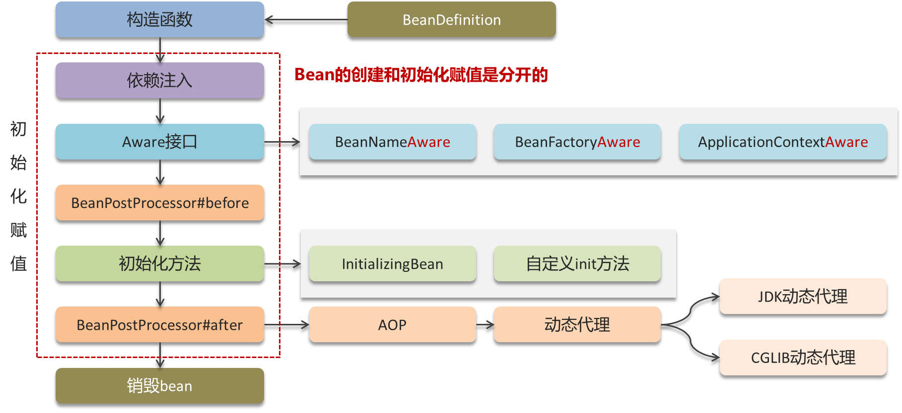
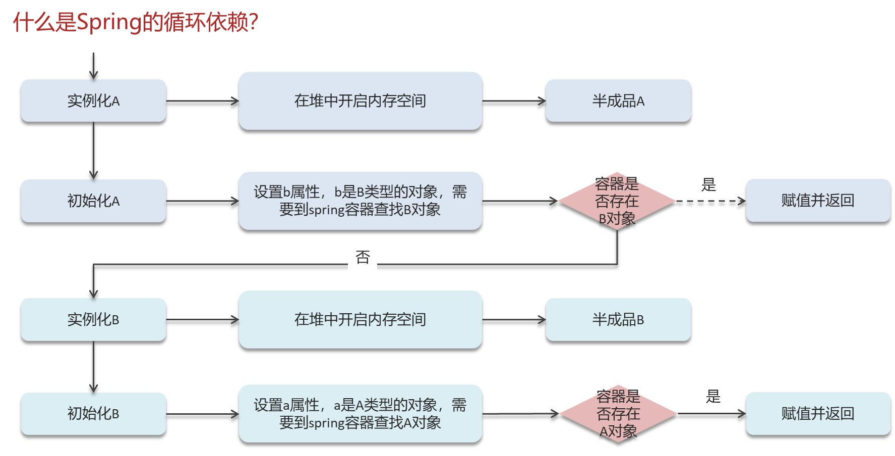
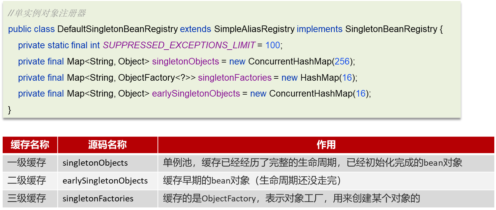
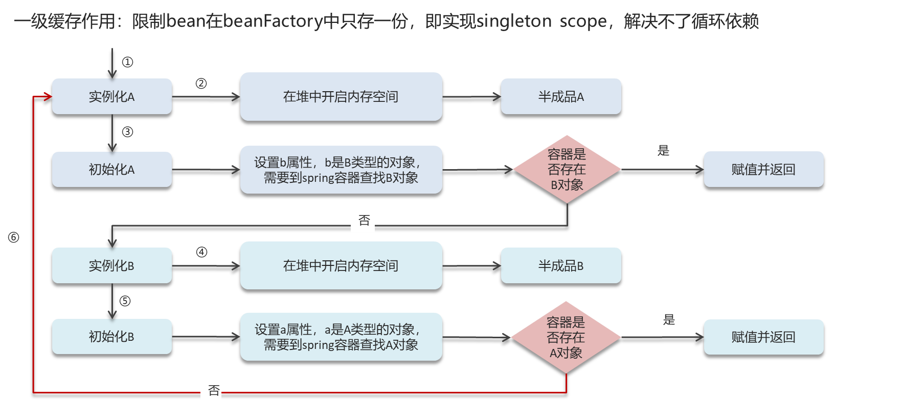
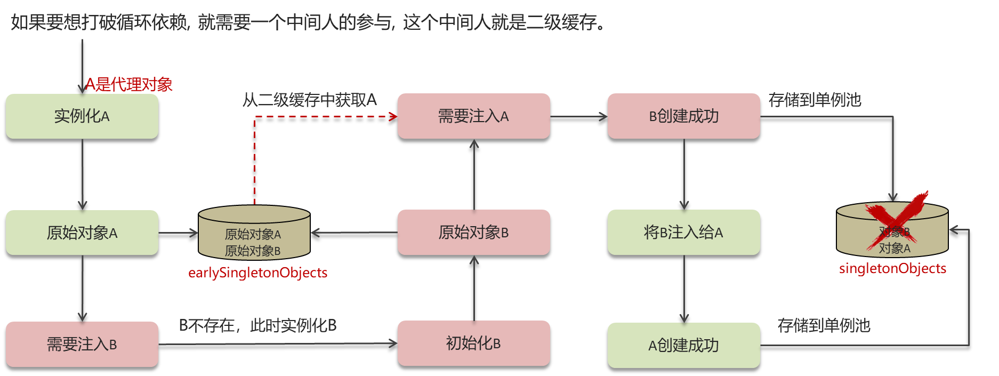
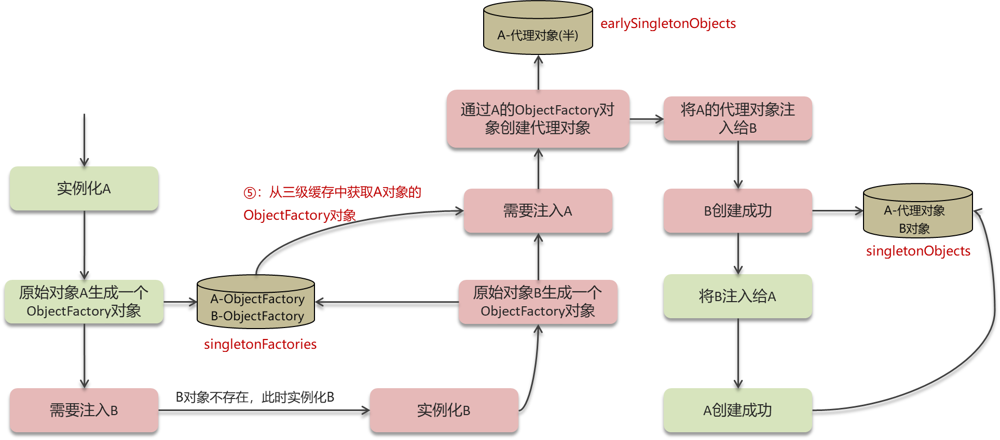

# 一. Spring

# A. Bean线程安全

&#x20;Spring Bean本身并不保证线程安全，开发者需要根据具体情况选择合适的作用域和设计模式，以确保在多线程环境下的安全性。&#x20;

## 单例作用域(Singleton Scope)

- 默认情况下，Spring Bean是单例的，也就是说，Spring容器在创建应用时只会创建一个Bean实例，并在应用的整个生命周期内共享这个实例。
- 单例Bean在多线程环境下可能会出现线程安全问题，因为多个线程可能同时访问和修改同一个实例的状态。因此，如果单例Bean包含有状态的信息（如实例变量），则需要采取措施来保证线程安全，例如使用同步机制、无状态设计或使用线程安全的数据结构。

## 原型作用域(Prototype Scope)

- 每次请求一个原型Bean，Spring容器都会创建一个新的实例。因此，原型Bean的实例不会被多个线程共享，每个线程都会有自己的实例，从而避免了线程安全问题。
- 然而，原型Bean的生命周期由调用者管理，使用时需要小心内存泄漏和其他资源管理问题。

## 请求作用域(Request Scope) 和 会话作用域(Session Scope)

- 这些作用域主要用于Web应用中，分别表示每个HTTP请求和每个HTTP会话创建一个新的Bean实例。
- 在这种情况下，Bean实例仅在特定请求或会话中使用，不会被多个线程共享，因此可以避免线程安全问题。

## 线程作用域(Thread Scope)

每个线程都会有自己的Bean实例，这样可以确保线程安全，因为每个线程都有自己独立的Bean实例

# B. AOP

## 基本概念

1. Aspect

切面是AOP的核心，定义了横切关注点。一个切面可以包含多个Advice，通常用来描述某个功能模块，如日志记录或事务管理。

1. Advice

- 通知是切面的具体实现部分，定义了切面的行为。通知可以在方法的不同阶段（如方法执行前、执行后、抛出异常时）插入特定的操作。
- 通知类型包括：
  - **Before Advice**：在方法执行前执行。
  - **After Advice**：在方法执行后执行，不论方法是否成功执行。
  - **After Returning Advice**：在方法成功返回后执行。
  - **After Throwing Advice**：在方法抛出异常后执行。
  - **Around Advice**：在方法执行的前后都执行，可以控制方法是否执行。

1. Pointcut

切入点定义了Advice应用的具体位置，即哪些方法或一组方法会被拦截。切入点使用表达式来匹配连接点。

1. JoinPoint

连接点是程序执行的一个点，例如方法调用或异常处理。切面可以在连接点处插入通知。

1. Weaving

织入是将切面应用到目标对象并创建代理对象的过程。在Spring AOP中，主要有两种织入方式：

- **编译时织入**：在编译时通过特殊的编译器进行织入。
- **运行时织入**：在运行时通过代理机制进行织入，Spring AOP主要采用这种方式。

## 实现

1. JDK动态代理

使用Java的动态代理技术，只能代理实现了接口的类。代理类在运行时动态创建。

1. CGLIB代理

使用CGLIB（Code Generation Library）来创建代理类，基于字节码生成技术，能够代理没有实现接口的类

# C. 事务失效

## 异常捕获处理

- 原因:

事务通知只有捉到了目标抛出的异常，才能进行后续的回滚处理，如果目标自己处理掉异常，事务通知无法知悉 &#x20;

- 解决:

在catch块添加throw new RuntimeException(e)抛出

## 抛出检查异常

- 原因:

Spring 默认只会回滚非检查异常 &#x20;

- 解决:

配置rollbackFor属性: @Transactional(rollbackFor=Exception.class)

## 非public方法

- 原因:

Spring 为方法创建代理、添加事务通知、前提条件都是该方法是 public 的 &#x20;

- 解决:

改为 public 方法

# D. Bean生命周期

## 1. BeanDefinition:

- beanClassName：bean 的类名
- initMethodName：初始化方法名称
- properryValues：bean 的属性值
- scope：作用域
- lazyInit：延迟初始化

## 2. 构造函数

## 3. 依赖注入

## 4. Aware

- BeanNameAware
- BeanFactoryAware
- ApplicationContextAware

## 5. BeanPostProcessors::before

## 6. 初始化方法

- InitializingBean
- 自定义init方法

## 7. BeanPostProcessors::after

- AOP
- 动态代理

## 8. 销毁Bean

# E. 循环依赖

## 三级缓存解决循环依赖

#### 1. 一级缓存

#### 2. 二级缓存

#### 3. 三级缓存

## 构造方法循环依赖

A依赖B, B依赖A, 注入的方式是构造函数.

原因:

由于bean的生命周期中构造函数是第一个执行的, spring框架并不能解决构造函数的依赖注入.

解决方法:

使用@Lazy进行懒加载, 什么时候需要对象再进行对象的创建.

[0. Spring概述](<0. Spring概述/0. Spring概述.md> "0. Spring概述")

[1. AOP](<1. AOP/1. AOP.md> "1. AOP")

[2. Bean](<2. Bean/2. Bean.md> "2. Bean")

[3. 循环依赖](<3. 循环依赖/3. 循环依赖.md> "3. 循环依赖")

[4. 线程安全](<4. 线程安全/4. 线程安全.md> "4. 线程安全")

[5. 事务](<5. 事务/5. 事务.md> "5. 事务")
