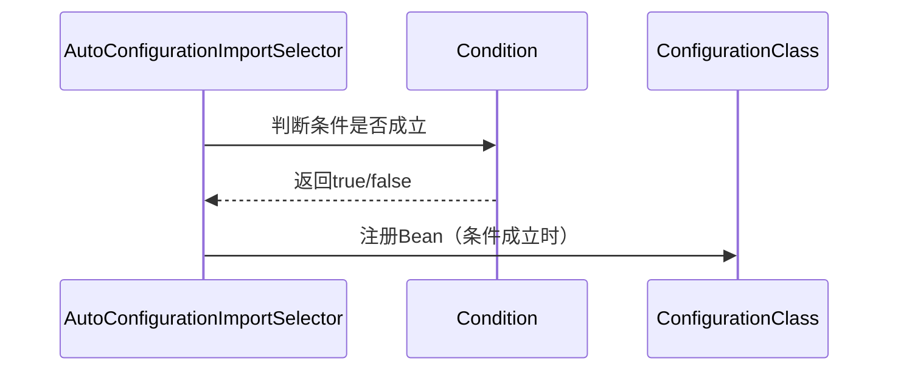

# 1. 自动配置原理

***

# Java面试八股——Spring Boot 自动配置原理详解

***

## 1. 概述与定义

**自动配置（Auto-Configuration）** 是 **Spring Boot** 的核心特性之一，其目标是通过 **约定优于配置** 的原则，**自动检测项目依赖并配置相关 Bean**，从而减少开发者的手动配置工作。 &#x20;

**核心机制**：通过 **`@EnableAutoConfiguration`**\*\* 注解\*\* 和 **`META-INF/spring.factories`**\*\* 文件\*\*，结合 **条件注解**（如 `@ConditionalOnClass`），动态加载和注册 Bean。

***

## 2. 主要特点

### 2.1 核心特性对比表

| **特性**​         | **说明**​                                           |
| --------------- | ------------------------------------------------- |
| **约定优于配置**​     | 基于依赖自动推断配置（如检测到 \`HikariCP\` 时自动配置数据源）。           |
| **条件化配置**​      | 通过 \`@Conditional\` 系列注解实现灵活的条件判断。                |
| **Starter 支持**​ | 预定义依赖集合（如 \`spring-boot-starter-web\`）触发对应的自动配置类。 |
| **可扩展性**​       | 支持自定义自动配置类和排除默认配置。                                |

***

## 3. 应用目标

### 3.1 核心目标

- **快速启动**： &#x20;
  - 新建项目时，通过 `Starter` 依赖快速集成技术栈（如 Web、JPA、Security）。 &#x20;
- **零手动配置**： &#x20;
  - 自动配置数据源、模板引擎、事务管理器等常见组件。 &#x20;
- **环境适配**： &#x20;
  - 根据运行环境（如是否存在 MySQL 驱动）动态启用或禁用配置。 &#x20;

***

## 4. 主要内容及其组成部分

***

### 4.1 核心组件详解

#### **4.1.1 @EnableAutoConfiguration 注解**

- **作用**： &#x20;
  - 触发 Spring Boot 的自动配置机制，加载所有符合条件的自动配置类。 &#x20;
- **实现原理**： &#x20;
  - 通过 `@Import(AutoConfigurationImportSelector.class)` 导入配置类选择器。 &#x20;
- **示例代码**： &#x20;
  ```java 
  @Target(ElementType.TYPE)
  @Import(AutoConfigurationImportSelector.class)
  public @interface EnableAutoConfiguration { ... }
  ```


#### **4.1.2 SpringFactories 机制**

- **核心文件**： &#x20;
  - `META-INF/spring.factories`：定义自动配置类的映射关系。 &#x20;
- **文件结构示例**： &#x20;
  ```.properties 
  # spring-boot-autoconfigure-3.0.0.jar/META-INF/spring.factories
  org.springframework.boot.autoconfigure.EnableAutoConfiguration=\
  org.springframework.boot.autoconfigure.web.servlet.WebMvcAutoConfiguration,\
  org.springframework.boot.autoconfigure.jdbc.DataSourceAutoConfiguration,...
  ```

- **作用**： &#x20;
  - 启动时，Spring Boot 会扫描所有 JAR 包中的该文件，收集所有配置类。

#### **4.1.3 条件注解（Conditional Annotations）**

- **常用注解**： &#x20;
  | 注解                        | 作用                                                               |
  | ------------------------- | ---------------------------------------------------------------- |
  | @ConditionalOnClass       | 检测类路径中是否存在指定类（如 HibernateJpaAutoConfiguration 检测 EntityManager）。 |
  | @ConditionalOnMissingBean | 当容器中不存在指定 Bean 时才生效。                                             |
  | @ConditionalOnProperty    | 根据配置属性值（如 spring.datasource.url 是否存在）决定是否启用。                     |

#### **4.1.4 自动配置类（Auto-Configuration Classes）**

- **结构示例**： &#x20;
  ```java 
  @Configuration
  @ConditionalOnClass(DataSource.class)
  @ConditionalOnProperty(prefix = "spring.datasource", name = "url")
  public class DataSourceAutoConfiguration {
      @Bean
      @ConditionalOnMissingBean
      public DataSource dataSource() {
          // 根据配置创建数据源
          return DataSourceBuilder.create().build();
      }
  }
  ```


***

### 4.2 自动配置流程图

```mermaid 
graph TD
    A[Spring Boot启动] --> B[加载主类上的<br>@EnableAutoConfiguration]
    B --> C[通过AutoConfiguration<br>ImportSelector选择配置类]
    C --> D[读取META-INF/<br>spring.factories]
    D --> E[筛选符合条件的自动配置类<br>（如@ConditionalOnClass）]
    E --> F[注册Bean到Spring容器]
```


***

## 5. 原理剖析

### 5.1 自动配置的核心流程

#### **5.1.1 步骤详解**

1. **触发自动配置**： &#x20;
   - 主类上的 `@SpringBootApplication` 包含 `@EnableAutoConfiguration`，触发自动配置机制。 &#x20;
2. **加载配置类**： &#x20;
   - 通过 `AutoConfigurationImportSelector` 的 `selectImports` 方法，读取 `spring.factories` 中的所有配置类。 &#x20;
3. **条件过滤**： &#x20;
   - 遍历所有候选配置类，根据 `@Conditional` 注解的条件（如类是否存在、属性是否配置）筛选出有效的配置类。 &#x20;
4. **注册 Bean**： &#x20;
   - 将符合条件的配置类的 Bean 注册到 Spring 容器中。

#### **5.1.2 关键类解析**

- **`AutoConfigurationImportSelector`**： &#x20;
  - 实现 `ImportSelector` 接口，负责从 `spring.factories` 加载配置类，并筛选有效配置。 &#x20;
- **`SpringFactoriesLoader`**： &#x20;
  - 工具类，用于加载所有 JAR 包中的 `spring.factories` 文件内容。

***

### 5.2 条件注解的底层实现

#### **5.2.1 条件判断流程**




#### **5.2.2 @ConditionalOnClass 实现示例**

```java 
@Target({ElementType.TYPE, ElementType.METHOD})
@Retention(RetentionPolicy.RUNTIME)
@Conditional(OnClassCondition.class)
public @interface ConditionalOnClass {
    // 检测类路径中的类
}

class OnClassCondition implements Condition {
    @Override
    public boolean matches(ConditionContext context, AnnotatedTypeMetadata metadata) {
        String className = metadata.getAnnotationAttributes(ConditionalOnClass.class).value();
        try {
            context.getClassLoader().loadClass(className);
            return true;
        } catch (ClassNotFoundException e) {
            return false;
        }
    }
}
```


***

## 6. 应用与拓展

### 6.1 实际场景示例

#### **6.1.1 自动配置数据源**

- **依赖**：添加 `spring-boot-starter-jdbc`。 &#x20;
- **自动配置类**：`DataSourceAutoConfiguration`。 &#x20;
- **条件**：检测 `DataSource` 类和 `spring.datasource.url` 属性。 &#x20;
- **结果**：自动注册 `DataSource` Bean。

#### **6.1.2 自定义自动配置**

```java 
@Configuration
@ConditionalOnProperty("custom.feature.enabled")
public class CustomAutoConfiguration {
    @Bean
    public CustomService customService() {
        return new CustomServiceImpl();
    }
}
```


***

### 6.2 高级用法

#### **6.2.1 排除默认配置**

```.properties 
# application.properties
spring.autoconfigure.exclude=\
org.springframework.boot.autoconfigure.jdbc.DataSourceAutoConfiguration
```


#### **6.2.2 多条件组合**

```java 
@Configuration
@ConditionalOnWebApplication // 仅在Web应用中生效
@ConditionalOnClass(RedisTemplate.class) // 检测Redis依赖
@ConditionalOnProperty(prefix = "spring.redis", name = "host")
public class RedisAutoConfiguration { ... }
```


***

## 7. 面试问答

### 问题1：Spring Boot的自动配置是如何实现的？

**回答**： &#x20;

- **核心步骤**： &#x20;
  1. **触发**：主类添加 `@EnableAutoConfiguration`。 &#x20;
  2. **加载配置类**：通过 `spring.factories` 文件读取所有候选自动配置类。 &#x20;
  3. **条件过滤**：根据 `@Conditional` 注解（如 `@ConditionalOnClass`）筛选出适用的配置类。 &#x20;
  4. **注册 Bean**：将符合条件的配置类的 Bean 注册到 Spring 容器。 &#x20;
- **示例**： &#x20;
  - 若项目依赖 `spring-boot-starter-web`，会自动加载 `WebMvcAutoConfiguration`，配置 `DispatcherServlet` 和 `ViewResolvers`。

***

### 问题2：`@ConditionalOnClass` 和 `@ConditionalOnMissingBean` 的区别？

**回答**： &#x20;

- **`@ConditionalOnClass`**： &#x20;
  - 检测类路径中是否存在指定类（如 `HibernateJpaAutoConfiguration` 检测 `EntityManager`）。 &#x20;
- **`@ConditionalOnMissingBean`**： &#x20;
  - 当容器中**不存在**指定 Bean 时才生效（避免重复配置）。 &#x20;
- **示例**： &#x20;
  ```java 
  @Bean
  @ConditionalOnMissingBean
  public DataSource dataSource() { ... }
  ```


***

### 问题3：如何自定义自动配置？

**回答**： &#x20;

1. **创建配置类**： &#x20;
   - 使用 `@Configuration` 标记类，并添加 `@Conditional` 注解。 &#x20;
2. **定义 Bean**： &#x20;
   - 通过 `@Bean` 方法定义 Bean，并添加条件判断。 &#x20;
3. **注册到 Spring Boot**： &#x20;
   - 在 `src/main/resources/META-INF/spring.factories` 中添加配置类： &#x20;
     ```.properties 
     org.springframework.boot.autoconfigure.EnableAutoConfiguration=\
     com.example.CustomAutoConfiguration
     ```


***

### 问题4：自动配置的优先级如何控制？

**回答**： &#x20;

- **排除配置**： &#x20;
  ```.properties 
  spring.autoconfigure.exclude=org.springframework.boot.autoconfigure.jdbc.DataSourceAutoConfiguration
  ```

- **优先级顺序**： &#x20;
  - 命令行参数 > `@Value` 注入 > 配置文件 > 默认值。 &#x20;
- **自定义配置覆盖**： &#x20;
  - 通过 `@Primary` 或 `@Conditional` 注解覆盖默认配置。

***

### 问题5：Spring Boot 2.7 版本后，`spring.factories` 的加载方式有何变化？

**回答**： &#x20;

- **旧版本（<2.7）**： &#x20;
  - 通过 `SpringFactoriesLoader` 加载 `spring.factories`。 &#x20;
- **新版本（>=2.7）**： &#x20;
  - 直接读取 `META-INF/spring/org.springframework.boot.autoconfigure.AutoConfiguration.imports` 文件，提升性能。 &#x20;
- **兼容性**： &#x20;
  - 两种方式并存，开发者无需感知变化。

***

## 结语

本文深入解析了 Spring Boot 自动配置的原理、实现机制及面试高频问题。面试中需重点说明 **`@EnableAutoConfiguration`**\*\* 的触发流程\*\*、**条件注解的底层逻辑**，并通过代码示例（如 `DataSourceAutoConfiguration`）展示自动配置的灵活性。建议结合实际项目，演示如何通过自定义配置扩展 Spring Boot 的功能，并强调其在减少重复配置、提升开发效率方面的核心价值。
