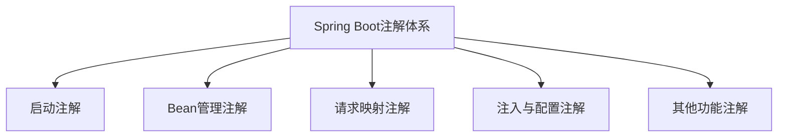
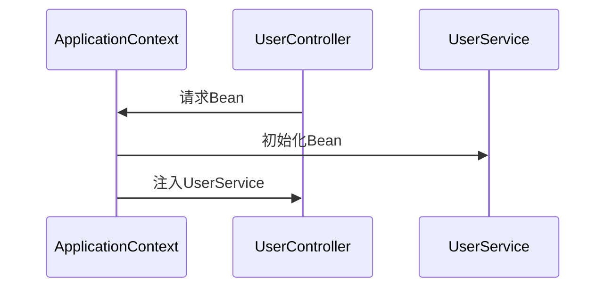

# 2. 常见注解

***

# Java面试八股——Spring Boot 常见注解详解

***

## 1. 概述与定义

**Spring Boot 注解**是 Spring Boot 框架的核心工具，通过 **约定优于配置** 的原则简化开发流程。其注解体系分为 **启动配置、Bean 管理、请求映射、条件化配置** 等类别，覆盖从项目启动到业务逻辑实现的全生命周期。

**核心注解结构图**： &#x20;




***

## 2. 主要特点

### 2.1 核心注解对比表

| **注解类型**​     | **注解**​                    | **作用**​                         | **示例**​                                   |
| ------------- | -------------------------- | ------------------------------- | ----------------------------------------- |
| **启动注解**​     | \`@SpringBootApplication\` | 标识主类，启动 Spring Boot 应用并启用自动配置。  | \`@SpringBootApplication\`                |
| **Bean管理注解**​ | \`@Component\`             | 通用 Bean 标识，用于组件扫描。              | \`@Component\`                            |
| **分层注解**​     | \`@Service\`               | 标识服务层 Bean，通常用于业务逻辑。            | \`@Service\`                              |
| **请求映射注解**​   | \`@RestController\`        | 标识 RESTful 控制器，返回数据直接序列化为 JSON。 | \`@RestController\`                       |
| **依赖注入注解**​   | \`@Autowired\`             | 自动注入依赖 Bean。                    | \`@Autowired private Service service;\`   |
| **条件化配置**​    | \`@ConditionalOnClass\`    | 根据类是否存在动态启用配置。                  | \`@ConditionalOnClass(DataSource.class)\` |

***

## 3. 应用目标

### 3.1 核心目标

- **简化配置**：通过注解替代 XML 配置（如 `@SpringBootApplication` 替代 XML 配置文件）。 &#x20;
- **分层管理**：通过 `@Service`、`@Repository` 等注解明确代码分层，提升可维护性。 &#x20;
- **快速开发**：通过 `@RestController` 快速构建 REST API，减少样板代码。 &#x20;

***

## 4. 主要内容及其组成部分

***

### 4.1 核心注解详解

#### **4.1.1 启动类注解**

- **`@SpringBootApplication`** &#x20;
  - **组成**：`@Configuration` + `@EnableAutoConfiguration` + `@ComponentScan`。 &#x20;
  - **作用**：启动 Spring Boot 应用，自动配置 Bean 并扫描组件。 &#x20;
  - **示例代码**： &#x20;
    ```java 
    @SpringBootApplication  // 等同于 @Configuration + @EnableAutoConfiguration + @ComponentScan
    public class Application {
        public static void main(String[] args) {
            SpringApplication.run(Application.class, args);
        }
    }
    ```


#### **4.1.2 Bean管理注解**

- **`@Component`** &#x20;
  - **作用**：通用组件注解，标记类为 Spring 管理的 Bean。 &#x20;
- **`@Service`** &#x20;
  - **作用**：标记服务层 Bean（继承自 `@Component`）。 &#x20;
- **`@Repository`** &#x20;
  - **作用**：标记数据访问层 Bean（继承自 `@Component`）。 &#x20;
- **`@Controller`** &#x20;
  - **作用**：标记控制器层 Bean（继承自 `@Component`）。 &#x20;
- **`@RestController`** &#x20;
  - **作用**：`@Controller` + `@ResponseBody`，简化 REST API 开发。 &#x20;
  - **示例代码**： &#x20;
    ```java 
    @RestController
    @RequestMapping("/api")
    public class UserController {
        @GetMapping("/users")
        public List<User> getUsers() {
            return userService.findAll();
        }
    }
    ```


#### **4.1.3 请求映射注解**

- **`@RequestMapping`** &#x20;
  - **作用**：映射 HTTP 请求到方法或类。 &#x20;
  - **属性**：`method`（HTTP 方法）、`params`（参数条件）、`consumes`（内容类型）。 &#x20;
- **`@GetMapping`****/****`@PostMapping`** &#x20;
  - **作用**：简化 `@RequestMapping(method = RequestMethod.GET/POST)`。 &#x20;
- **`@PathVariable`** &#x20;
  - **作用**：获取 URL 路径中的变量。 &#x20;
  - **示例代码**： &#x20;
    ```java 
    @GetMapping("/users/{id}")
    public User getUser(@PathVariable("id") Long id) { ... }
    ```


#### **4.1.4 依赖注入与配置注解**

- **`@Autowired`** &#x20;
  - **作用**：通过类型或名称注入依赖 Bean。 &#x20;
  - **示例代码**： &#x20;
    ```java 
    @Service
    public class UserService {
        @Autowired
        private UserRepository userRepository;
    }
    ```

- **`@Value`** &#x20;
  - **作用**：注入配置文件属性值。 &#x20;
  - **示例代码**： &#x20;
    ```java 
    @Value("${app.name}")
    private String appName;
    ```


#### **4.1.5 条件化配置注解**

- **`@ConditionalOnClass`** &#x20;
  - **作用**：仅在类路径中存在指定类时启用配置。 &#x20;
- **`@ConditionalOnProperty`** &#x20;
  - **作用**：根据属性值启用配置。 &#x20;
  - **示例代码**： &#x20;
    ```java 
    @ConditionalOnProperty(prefix = "spring.datasource", name = "url")
    public class DataSourceConfig { ... }
    ```


***

### 4.2 其他重要注解

#### **4.2.1 AOP 相关注解**

- **`@Aspect`**：定义切面类。 &#x20;
- **`@Before`****/****`@After`****/****`@Around`**：定义切点前/后/环绕通知。 &#x20;

#### **4.2.2 事务管理**

- **`@Transactional`**：声明方法需要事务支持。 &#x20;
  ```java 
  @Service
  public class OrderService {
      @Transactional
      public void placeOrder() { ... }
  }
  ```


#### **4.2.3 缓存注解**

- **`@Cacheable`**：缓存方法返回值。 &#x20;
  ```java 
  @Cacheable("users")
  public User findUserById(Long id) { ... }
  ```


#### **4.2.4 其他注解**

- **`@Configuration`**：标记配置类，定义 `@Bean` 方法。 &#x20;
- **`@Bean`**：在配置类中显式定义 Bean。 &#x20;
  ```java 
  @Configuration
  public class AppConfig {
      @Bean
      public UserRepo userRepo() {
          return new UserRepositoryImpl();
      }
  }
  ```


***

## 5. 原理剖析

### 5.1 依赖注入（@Autowired）的原理

#### **5.1.1 依赖注入流程图**




#### **5.1.2 实现细节**

- **自动装配策略**： &#x20;
  - **按类型**：默认通过类型匹配 Bean（如 `private UserService service`）。 &#x20;
  - **按名称**：通过 `@Qualifier("beanName")` 指定名称。 &#x20;
- **字段注入 vs 构造器注入**： &#x20;
  - **推荐构造器注入**：保证依赖的不可变性。 &#x20;
  - 示例： &#x20;
    ```java 
    @Service
    public class UserController {
        private final UserService service;
        
        @Autowired
        public UserController(UserService service) {
            this.service = service;
        }
    }
    ```


### 5.2 条件化配置（@ConditionalOnClass）的实现

#### **5.2.1 判断流程**

```mermaid 
graph TD
    A[Spring启动] --> B[加载配置类]
    B --> C[检查@ConditionalOnClass]
    C -->|存在类| D[注册Bean]
    C -->|不存在类| E[跳过配置]
```


#### **5.2.2 代码实现示例**

```java 
@ConditionalOnClass(DataSource.class)
public class DataSourceAutoConfiguration {
    // 配置数据源Bean
}
```


***

## 6. 应用与拓展

### 6.1 实际场景示例

#### **6.1.1 REST API 开发**

```java 
@RestController
@RequestMapping("/api/v1")
public class ProductController {
    @Autowired
    private ProductService productService;

    @GetMapping("/products/{id}")
    public Product getProduct(@PathVariable Long id) {
        return productService.findById(id);
    }

    @PostMapping("/products")
    public Product createProduct(@RequestBody Product product) {
        return productService.save(product);
    }
}
```


#### **6.1.2 条件化配置应用**

```java 
@Configuration
@ConditionalOnProperty("feature.enabled")
public class FeatureConfig {
    @Bean
    public FeatureService featureService() { ... }
}
```


***

### 6.2 高级用法

#### **6.2.1 自定义注解**

```java 
@Target(ElementType.METHOD)
@Retention(RetentionPolicy.RUNTIME)
@ConditionalOnExpression("${custom.condition}")
public @interface CustomCondition {
    String value() default "";
}
```


#### **6.2.2 多条件组合**

```java 
@Configuration
@ConditionalOnWebApplication
@ConditionalOnClass(RedisTemplate.class)
public class RedisConfig { ... }
```


***

## 7. 面试问答

### 问题1：`@SpringBootApplication` 包含哪些注解？

**回答**： &#x20;

- **核心组成**： &#x20;
  - **`@Configuration`**：标记类为配置类，允许定义 `@Bean` 方法。 &#x20;
  - **`@EnableAutoConfiguration`**：启用 Spring Boot 的自动配置机制。 &#x20;
  - **`@ComponentScan`**：扫描组件（默认扫描主类所在包及子包）。 &#x20;
- **作用**：通过一个注解简化 Spring Boot 应用的启动和配置流程。

***

### 问题2：`@Service` 和 `@Component` 的区别？

**回答**： &#x20;

- **`@Component`**：通用注解，适用于任何层的 Bean。 &#x20;
- **`@Service`**：`@Component` 的子注解，**明确标识服务层 Bean**（如业务逻辑类）。 &#x20;
- **区别**： &#x20;
  - **语义化**：`@Service` 更清晰地表明 Bean 的作用域。 &#x20;
  - **功能**：两者在注入和管理上无差异。

***

### 问题3：`@PathVariable` 和 `@RequestParam` 的区别？

**回答**： &#x20;

- **`@PathVariable`**： &#x20;
  - **作用**：获取 URL 路径中的动态参数（如 `/users/{id}`）。 &#x20;
  - 示例：`/users/123` → `@PathVariable Long id`。 &#x20;
- **`@RequestParam`**： &#x20;
  - **作用**：获取查询参数（如 `/search?query=hello`）。 &#x20;
  - 示例：`@RequestParam String query`。 &#x20;

***

### 问题4：如何实现条件化配置？

**回答**： &#x20;

- **步骤**： &#x20;
  1. **定义条件注解**：如 `@ConditionalOnProperty`。 &#x20;
  2. **标记配置类**：通过注解控制 Bean 的注册。 &#x20;
- **示例**： &#x20;
  ```java 
  @Configuration
  @ConditionalOnProperty("custom.enabled")
  public class CustomConfig {
      @Bean
      public CustomService customService() { ... }
  }
  ```


***

### 问题5：为什么推荐使用构造器注入而非字段注入？

**回答**： &#x20;

- **优势**： &#x20;
  - **不可变性**：依赖注入后无法被修改，避免并发问题。 &#x20;
  - **测试友好**：便于通过构造器传入 Mock 对象。 &#x20;
  - **清晰性**：明确类的依赖关系。 &#x20;
- **示例**： &#x20;
  ```java 
  @Service
  public class OrderService {
      private final UserRepository repo;
      
      @Autowired
      public OrderService(UserRepository repo) {
          this.repo = repo;
      }
  }
  ```


***

## 结语

本文详细梳理了 Spring Boot 的核心注解体系，涵盖启动、Bean 管理、请求映射、条件化配置等场景。面试中需重点说明 **`@SpringBootApplication`**\*\* 的组成\*\*、**依赖注入的原理**、以及 **条件注解的使用场景**，并通过代码示例（如 REST API 开发、自定义配置）展示实际应用。掌握这些注解不仅能提升开发效率，还能在面试中清晰解释 Spring Boot 的设计思想和底层机制。
