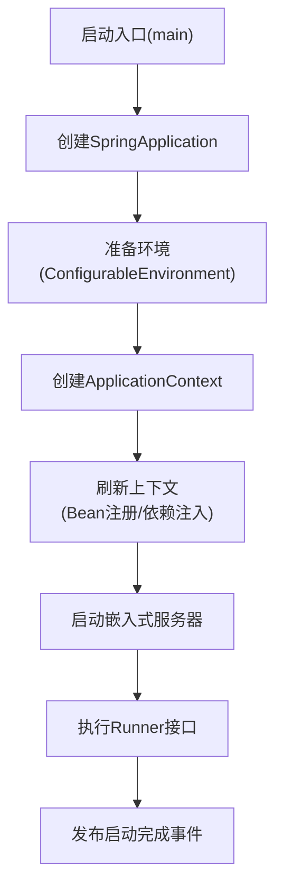
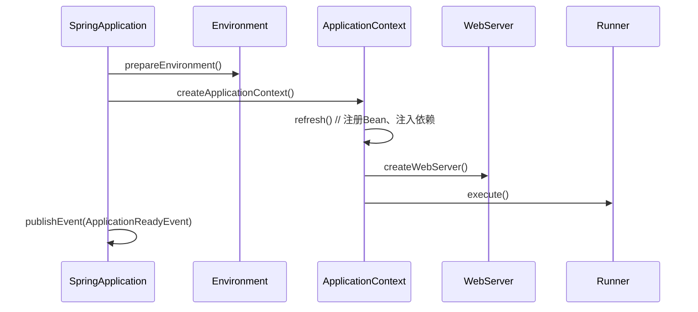

# 3. 启动流程

***

# Java面试八股——Spring Boot 启动流程详解

***

## 1. 概述与定义

**Spring Boot 启动流程**是框架的核心机制，通过 **"约定优于配置"** 的原则，将复杂的 Spring 配置简化为几行代码。其核心目标是 **快速启动应用**、**自动配置 Bean** 和 **集成内嵌服务器**。启动流程可划分为 **8个核心阶段**，涵盖从入口类到服务运行的全生命周期。

**启动流程结构图**： &#x20;




***

## 2. 主要特点

### 2.1 核心特点对比表

| **阶段**​       | **特点**​                                                                  | **示例**​                                |
| ------------- | ------------------------------------------------------------------------ | -------------------------------------- |
| **入口阶段**​     | 通过 \`@SpringBootApplication\` 标识启动类，支持自动配置和组件扫描。                         | \`SpringApplication.run()\`            |
| **环境准备**​     | 动态加载 \`application.properties/yml\`、系统变量及命令行参数。                          | \`Environment\` 对象管理属性                 |
| **Bean注册**​   | 通过 \`@ComponentScan\` 自动扫描组件，结合 \`@EnableAutoConfiguration\` 完成 Bean 定位。 | 自动注入 \`DataSource\`、\`WebServer\`      |
| **Web服务器集成**​ | 内置 Tomcat/Jetty，无需手动配置 \`web.xml\`。                                      | \`ServletWebServerApplicationContext\` |
| **扩展性**​      | 通过 \`ApplicationRunner\` 和 \`CommandLineRunner\` 执行初始化逻辑。                | 自定义数据初始化任务                             |

***

## 3. 应用目标

### 3.1 核心目标

- **简化启动配置**：通过 `@SpringBootApplication` 替代 XML 配置。 &#x20;
- **自动化 Bean 管理**：通过 `@EnableAutoConfiguration` 动态加载配置类。 &#x20;
- **快速集成 Web 服务**：内嵌 Tomcat/Jetty 实现零成本部署 HTTP 服务。 &#x20;
- **统一事件监听**：通过 `ApplicationEvent` 触发初始化和清理逻辑。

***

## 4. 主要内容及其组成部分

***

### 4.1 启动流程详解

#### **4.1.1 阶段1：入口类与SpringApplication初始化**

- **入口代码**： &#x20;
  ```java 
  @SpringBootApplication  // 组合注解：@Configuration + @EnableAutoConfiguration + @ComponentScan
  public class Application {
      public static void main(String[] args) {
          SpringApplication.run(Application.class, args);  // 核心启动方法
      }
  }
  ```

- **关键操作**： &#x20;
  - 创建 `SpringApplication` 实例，推断应用类型（如 Web 非 Web）。 &#x20;
  - 加载 `META-INF/spring.factories` 中的自动配置类（通过 **SPI 机制**）。 &#x20;

#### **4.1.2 阶段2：准备运行环境(ConfigurableEnvironment)**

- **环境对象**： &#x20;
  ```java 
  ConfigurableEnvironment environment = prepareEnvironment(...);
  ```

- **数据来源**： &#x20;
  - **优先级排序**：命令行参数 > 系统环境变量 > `application.properties/yml`。 &#x20;
  - 示例：`spring.datasource.url` 从配置文件加载。 &#x20;

#### **4.1.3 阶段3：创建ApplicationContext**

- **容器类型**： &#x20;
  - **非 Web 应用**：`AnnotationConfigApplicationContext`。 &#x20;
  - **Web 应用**：`AnnotationConfigWebApplicationContext`（集成 Servlet 容器）。 &#x20;
- **作用**：管理 Bean 生命周期和依赖注入。

#### **4.1.4 阶段4：刷新上下文(Bean 注册与依赖注入)**

- **关键步骤**： &#x20;
  1. **加载Bean定义**：通过组件扫描（`@ComponentScan`）定位 `@Component`、`@Service` 等注解类。 &#x20;
  2. **自动配置**：执行 `@EnableAutoConfiguration` 中的配置类（如 `DataSourceAutoConfiguration`）。 &#x20;
  3. **依赖注入**：通过 `Autowired` 等注解完成 Bean 依赖关系绑定。 &#x20;

#### **4.1.5 阶段5：启动嵌入式 Web 服务器**

- **核心代码**： &#x20;
  ```java 
  protected void onRefresh() {
      createWebServer();  // 启动 Tomcat/Jetty
  }
  ```

- **流程**： &#x20;
  1. 通过 `ServletWebServerFactory` 创建服务器实例。 &#x20;
  2. 注册 `DispatcherServlet` 和 `Filter`。 &#x20;
  3. 绑定端口（默认 8080）。 &#x20;

#### **4.1.6 阶段6：执行ApplicationRunner和CommandLineRunner**

- **接口对比**： &#x20;
  | **接口**​               | **参数支持**​                | **执行顺序**​  |
  | --------------------- | ------------------------ | ---------- |
  | \`ApplicationRunner\` | \`ApplicationArguments\` | 优先执行       |
  | \`CommandLineRunner\` | \`String\[] args\`       | 次之，依赖命令行参数 |
- **示例代码**： &#x20;
  ```java 
  @Component
  public class MyRunner implements ApplicationRunner {
      @Override
      public void run(ApplicationArguments args) {
          System.out.println("应用初始化完成，开始执行业务逻辑...");
      }
  }
  ```


#### **4.1.7 阶段7：发布启动完成事件**

- **事件类型**：`ApplicationReadyEvent`。 &#x20;
- **作用**：通知监听者应用已就绪，可处理请求。 &#x20;

***

### 4.2 核心配置文件加载机制

- **加载顺序**： &#x20;
  1. `src/main/resources/application.properties/yml`。 &#x20;
  2. `src/main/resources/config/application.properties/yml`。 &#x20;
  3. `classpath:config/application.properties/yml`。 &#x20;
- **多环境配置**： &#x20;
  - 通过 `--spring.profiles.active=dev` 激活 `application-dev.properties`。 &#x20;

***

### 4.3 自动配置原理

- **触发条件**： &#x20;
  - `@EnableAutoConfiguration` 指示框架扫描 `spring.factories` 文件。 &#x20;
  - **条件注解**：如 `@ConditionalOnClass`、`@ConditionalOnProperty` 决定是否加载配置。 &#x20;
- **示例**： &#x20;
  ```java 
  @Configuration
  @ConditionalOnClass(DataSource.class)
  @ConditionalOnProperty(prefix = "spring.datasource", name = "url")
  public class DataSourceAutoConfiguration { ... }
  ```


***

## 5. 原理剖析

### 5.1 SpringApplication.run() 源码分析

#### **5.1.1 核心流程图**




#### **5.1.2 关键方法解析**

- **`refresh()`**： &#x20;
  1. **刷新容器**：加载 Bean 定义、实例化 Bean、处理依赖。 &#x20;
  2. **触发事件**：`ContextRefreshedEvent`。 &#x20;
- **`createWebServer()`**： &#x20;
  - 通过 `ServletWebServerFactory` 创建服务器实例。 &#x20;
  - 示例：Tomcat 的 `TomcatServletWebServerFactory`。 &#x20;

***

### 5.2 自动配置加载机制

#### **5.2.1 spring.factories 文件作用**

- **位置**：依赖 JAR 包的 `META-INF/spring.factories`。 &#x20;
- **内容示例**： &#x20;
  ```.properties 
  # 启动自动配置
  org.springframework.boot.autoconfigure.EnableAutoConfiguration=\
    org.springframework.boot.autoconfigure.jdbc.DataSourceAutoConfiguration,\
    org.springframework.boot.autoconfigure.web.servlet.DispatcherServletAutoConfiguration
  ```

- **加载过程**： &#x20;
  1. 通过 `ClassLoader` 遍历所有 `spring.factories` 文件。 &#x20;
  2. 解析 `EnableAutoConfiguration` 对应的配置类。 &#x20;

***

### 5.3 条件化配置实现

#### **5.3.1 条件注解执行流程**

```mermaid 
graph TD
    A[Spring启动] --> B[加载配置类]
    B --> C[检查@Conditional注解]
    C -->|满足条件| D[注册Bean]
    C -->|不满足| E[跳过配置]
```


#### **5.3.2 条件注解示例**

- **`@ConditionalOnClass`**： &#x20;
  ```java 
  @ConditionalOnClass(name = "org.springframework.web.servlet.DispatcherServlet")
  public class WebMvcAutoConfiguration { ... }
  ```

- **`@ConditionalOnMissingBean`**： &#x20;

  确保 Bean 不存在时才创建，避免重复配置。

***

## 6. 应用与拓展

### 6.1 实际场景示例

#### **6.1.1 自定义启动逻辑**

- **自定义监听器**： &#x20;
  ```java 
  public class MyApplicationListener implements ApplicationListener<ApplicationStartingEvent> {
      @Override
      public void onApplicationEvent(ApplicationStartingEvent event) {
          System.out.println("应用即将启动，执行预检任务...");
      }
  }
  ```


#### **6.1.2 多环境配置切换**

- **配置文件**： &#x20;
  ```.properties 
  # application-dev.properties
  server.port=8081
  spring.datasource.url=jdbc:mysql://localhost:3306/dev

  # application-prod.properties
  server.port=80
  spring.datasource.url=jdbc:mysql://prod-db:3306/prod
  ```

- **启动命令**： &#x20;
  ```bash 
  java -jar app.jar --spring.profiles.active=prod
  ```


***

### 6.2 高级用法

#### **6.2.1 自定义自动配置**

```java 
@Configuration
@ConditionalOnProperty("custom.enabled")
public class CustomAutoConfiguration {
    @Bean
    public CustomService customService() {
        return new CustomService();
    }
}
```


#### **6.2.2 替换内嵌服务器**

- **配置**： &#x20;
  ```.properties 
  spring.main.web-application-type=SERVLET
  spring.servlet.http.encoding.charset=UTF-8
  ```

- **代码**： &#x20;
  ```java 
  @Bean
  public WebServerFactoryCustomizer<TomcatServletWebServerFactory> tomcatCustomizer() {
      return factory -> factory.addContextCustomizers(context -> context.setSessionTimeout(30, TimeUnit.MINUTES));
  }
  ```


***

## 7. 面试问答

### 问题1：Spring Boot 启动流程的核心步骤是什么？

**回答**： &#x20;

- **步骤**： &#x20;
  1. **入口类启动**：通过 `main()` 方法调用 `SpringApplication.run()`。 &#x20;
  2. **创建 ****`SpringApplication`**** 实例**：推断应用类型并加载自动配置类。 &#x20;
  3. **准备环境**：整合 `application.properties`、系统变量及命令行参数。 &#x20;
  4. **创建上下文**：初始化 `ApplicationContext`（如 `WebApplicationContext`）。 &#x20;
  5. **刷新上下文**：加载 Bean、自动配置、依赖注入。 &#x20;
  6. **启动 Web 服务器**：集成 Tomcat/Jetty 并绑定端口。 &#x20;
  7. **执行初始化任务**：运行 `ApplicationRunner` 和 `CommandLineRunner`。 &#x20;
  8. **发布启动完成事件**：通知监听者应用已就绪。 &#x20;

***

### 问题2：`@SpringBootApplication` 包含哪些注解？

**回答**： &#x20;

- **核心注解**： &#x20;
  - **`@SpringBootConfiguration`**：等同于 `@Configuration`，允许定义 `@Bean` 方法。 &#x20;
  - **`@EnableAutoConfiguration`**：触发自动配置机制，加载 `spring.factories` 中的配置类。 &#x20;
  - **`@ComponentScan`**：扫描当前包及子包下的 `@Component`、`@Service` 等注解类。 &#x20;
- **作用**：通过一个注解简化配置，实现零 XML 的 Spring Boot 应用启动。

***

### 问题3：如何自定义 Spring Boot 启动配置？

**回答**： &#x20;

- **方法**： &#x20;
  1. **自定义 ****`SpringApplication`**** 实例**： &#x20;
     ```java 
     public static void main(String[] args) {
         SpringApplication app = new SpringApplication(Application.class);
         app.setWebApplicationType(WebApplicationType.NONE);  // 非 Web 应用
         app.run(args);
     }
     ```

  2. **扩展`Environment`**： &#x20;
     ```java 
     ConfigurableEnvironment environment = app.getEnvironment();
     environment.getPropertySources().addFirst(new CustomPropertySource());
     ```

  3. **实现监听器**：通过 `ApplicationListener` 监听启动事件。

***

### 问题4：自动配置是如何加载的？

**回答**： &#x20;

- **关键步骤**： &#x20;
  1. **触发条件**：`@EnableAutoConfiguration` 注解。 &#x20;
  2. **加载配置类**：通过 `spring.factories` 文件（SPI 机制）获取所有配置类。 &#x20;
  3. **条件判断**：每个配置类通过 `@Conditional` 子注解（如 `@ConditionalOnClass`）决定是否生效。 &#x20;
  4. **注册 Bean**：符合条件的配置类被加载并注册到 Spring 容器中。 &#x20;
- **示例**： &#x20;

  当项目依赖 `spring-boot-starter-jdbc` 时，`DataSourceAutoConfiguration` 会自动配置数据源。

***

### 问题5：为什么 Spring Boot 需要 `main()` 方法？

**回答**： &#x20;

- **原因**： &#x20;
  1. **入口控制**：Java 应用必须通过 `main()` 方法启动。 &#x20;
  2. **初始化引导**：通过 `SpringApplication.run()` 启动框架流程，包括容器创建和 Bean 管理。 &#x20;
  3. **参数传递**：支持通过命令行参数传递配置（如 `--spring.profiles.active=dev`）。 &#x20;
- **替代方案**： &#x20;

  可通过 `@SpringBootConfiguration` 和 `@EnableAutoConfiguration` 手动构建容器，但 `main()` 方法是标准实践。

***

## 结语

本文详细拆解了 Spring Boot 的启动流程，涵盖从入口类到自动配置的每个阶段。面试中需重点掌握 **`@SpringBootApplication`**\*\* 的作用\*\*、**环境准备机制**、**自动配置原理**，并通过示例（如自定义 Runner、多环境配置）展示实际应用能力。理解 `spring.factories` 和条件注解是深入掌握启动流程的关键，能帮助面试者在技术面试中清晰解释 Spring Boot 的设计思想和底层实现。
