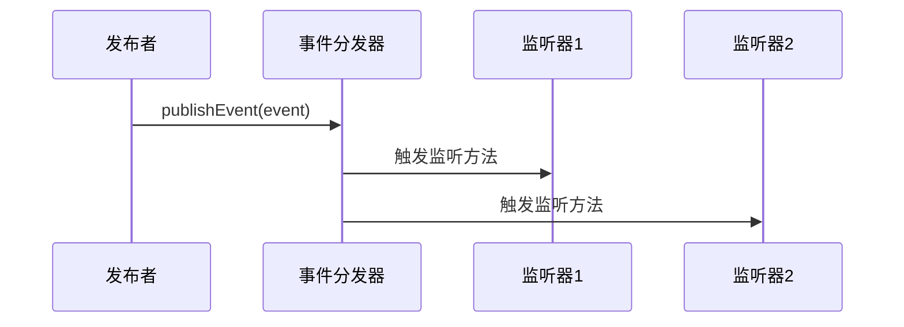
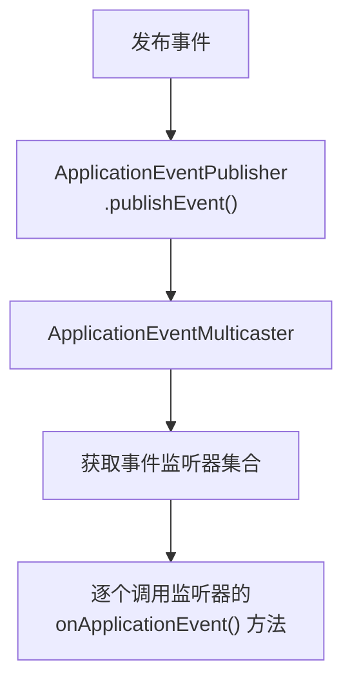

# 4. 事件与监听

***

# Java面试八股——Spring Boot 应用事件与监听 核心知识点详解

***

## 1. 概述与定义

**Spring Boot 应用事件与监听机制**是基于 **Spring Framework 的事件驱动模型**，用于 **解耦组件间的通信**，通过 **发布-订阅模式** 实现组件间的消息传递。其核心组件包括： &#x20;

- **事件（Event）**：继承 `ApplicationEvent` 的自定义事件类或 Spring 内置事件。 &#x20;
- **监听器（Listener）**：实现 `ApplicationListener` 接口或使用 `@EventListener` 注解的类。 &#x20;
- **发布者（Publisher）**：通过 `ApplicationEventPublisher` 推送事件的对象。

### 1.1 核心类关系图

```mermaid 
graph TD
    A[ApplicationEvent] --> B[自定义事件]
    A --> C[Spring 内置事件]
    C --> D[ContextRefreshedEvent]
    C --> E[ApplicationReadyEvent]
    F[ApplicationListener] --> G[监听器接口实现]
    H[@EventListener] --> I[注解方式监听]
```


***

## 2. 主要特点

### 2.1 核心优势对比表

| **特点**​     | **描述**​                                                     | **示例**​                                              |
| ----------- | ----------------------------------------------------------- | ---------------------------------------------------- |
| **解耦性**​    | 生产者与消费者无需直接依赖，通过事件间接通信。                                     | 用户注册成功后触发 \`UserRegisteredEvent\`，邮件服务监听该事件发送通知。     |
| **灵活性**​    | 支持同步/异步监听、条件过滤、多种实现方式（注解/接口）。                               | \`@Async\` 实现异步监听，\`@ConditionalOnExpression\` 过滤事件。 |
| **内置事件丰富**​ | Spring Boot 提供启动/关闭/错误等生命周期事件（如 \`ApplicationReadyEvent\`）。 | 监听 \`ApplicationFailedEvent\` 实现启动失败告警。              |
| **轻量级**​    | 无需第三方中间件，基于 Spring 容器原生实现。                                  | 替代 Redis 消息队列实现单应用内的异步任务。                            |

### 2.2 事件发布流程




***

## 3. 应用目标

### 3.1 典型场景

| **场景**​     | **描述**​                                         | **示例**​                                    |
| ----------- | ----------------------------------------------- | ------------------------------------------ |
| **系统监控**​   | 监听启动/关闭事件，记录系统状态。                               | 监听 \`ApplicationReadyEvent\` 记录启动耗时。       |
| **业务流程解耦**​ | 业务操作完成后触发事件，异步执行后续逻辑（如发送邮件）。                    | 用户下单后触发 \`OrderCreatedEvent\`，库存系统监听并扣减库存。 |
| **错误处理**​   | 监听异常事件（如 \`ApplicationFailedEvent\`），实现熔断或日志记录。 | 记录应用启动失败原因并通知运维。                           |

***

## 4. 主要内容及其组成部分

***

### 4.1 核心组件详解

#### **4.1.1 事件类（ApplicationEvent）**

```java 
// 自定义事件继承 ApplicationEvent
public class UserRegisteredEvent extends ApplicationEvent {
    private final String userId;
    
    public UserRegisteredEvent(Object source, String userId) {
        super(source);
        this.userId = userId;
    }
    
    public String getUserId() {
        return userId;
    }
}
```


#### **4.1.2 监听器实现方式**

| **实现方式**​  | **描述**​                                           | **示例**​                                                                                                                                                                                                             |
| ---------- | ------------------------------------------------- | ------------------------------------------------------------------------------------------------------------------------------------------------------------------------------------------------------------------- |
| **接口实现**​  | 实现 \`ApplicationListener\<T>\` 接口。                | \`java\npublic class UserRegistrationListener implements ApplicationListener\<UserRegisteredEvent> {\n    @Override\n    public void onApplicationEvent(UserRegisteredEvent event) {\n        // 处理逻辑\n    }\n}\n\` |
| **注解驱动**​  | 使用 \`@EventListener\` 注解标记方法。                     | \`java\n\@EventListener\npublic void handleEvent(UserRegisteredEvent event) {\n    // 处理逻辑\n}\n\`                                                                                                                   |
| **配置类注册**​ | 通过 \`@ComponentScan\` 或 \`@Configuration\` 扫描监听器。 | \`@ComponentScan(basePackages = "com.example.listeners")\`                                                                                                                                                          |

#### **4.1.3 事件发布者**

```java 
// 通过注入 ApplicationEventPublisher 发布事件
@Service
public class UserService {
    @Autowired
    private ApplicationEventPublisher eventPublisher;
    
    public void registerUser(String userId) {
        // 业务逻辑...
        eventPublisher.publishEvent(new UserRegisteredEvent(this, userId));
    }
}
```


***

### 4.2 内置事件类型

#### **4.2.1 Spring Boot 启动事件**

| **事件类型**​                                | **触发时机**​              | **用途**​         |
| ---------------------------------------- | ---------------------- | --------------- |
| **ApplicationStartingEvent**​            | 应用启动初始化阶段，尚未加载配置。      | 记录启动开始时间。       |
| **ApplicationEnvironmentPreparedEvent**​ | 环境配置加载完成，但上下文未创建。      | 修改全局配置（如动态数据源）。 |
| **ApplicationReadyEvent**​               | 上下文刷新完成，所有 Bean 初始化完毕。 | 启动健康检查或初始化定时任务。 |
| **ApplicationFailedEvent**​              | 启动过程中发生致命错误。           | 记录错误日志并触发告警。    |

#### **4.2.2 Spring Framework 内置事件**

| **事件类型**​                  | **触发时机**​             | **用途**​            |
| -------------------------- | --------------------- | ------------------ |
| **ContextRefreshedEvent**​ | 应用上下文刷新（首次启动或重新加载配置）。 | 执行初始化逻辑，如数据库连接池预热。 |
| **RequestHandledEvent**​   | Web 应用处理 HTTP 请求结束。   | 统计请求耗时或日志记录。       |

***

### 4.3 事件监听器注册方式

#### **4.3.1 四种实现方式对比**

| **方式**​        | **描述**​                                                                | **代码示例**​                                                                                         |
| -------------- | ---------------------------------------------------------------------- | ------------------------------------------------------------------------------------------------- |
| **组件扫描（推荐）** ​ | 通过 \`@Component\` 标记监听器，由 Spring 容器自动注册。                               | \`java\n\@Component\npublic class MyListener implements ApplicationListener\<MyEvent> { ... }\n\` |
| **注解配置**​      | 在 \`@SpringBootApplication\` 注解类中配置监听器。                                | \`java\n\@SpringBootApplication\n\@Listeners(MyListener.class)\npublic class App { ... }\n\`      |
| **手动注册**​      | 通过 \`ConfigurableApplicationContext\` 的 \`addApplicationListener\` 方法。 | \`java\ncontext.addApplicationListener(new MyListener());\n\`                                     |
| **配置文件**​      | 在 \`application.properties\` 中配置监听器类名。                                 | \`spring.application.listeners=my.package.MyListener\`                                            |

***

### 4.4 异步事件处理

#### **4.4.1 异步监听实现**

```java 
// 需要开启异步支持
@EnableAsync
@SpringBootApplication
public class App { ... }

// 监听方法添加 @Async 注解
@Component
public class AsyncListener {
    @Async
    @EventListener
    public void handleEvent(UserRegisteredEvent event) {
        // 异步执行耗时操作（如发送邮件）
    }
}
```


***

## 5. 原理剖析

### 5.1 事件发布与监听机制

#### **5.1.1 核心流程图**




#### **5.1.2 关键类解析**

- **ApplicationEventPublisher**：发布事件的接口，通常由 `ApplicationContext` 实现。 &#x20;
- **ApplicationEventMulticaster**：事件分发器，默认使用 `SimpleApplicationEventMulticaster`。 &#x20;
- **事件传播**： &#x20;
  - **同步传播**：默认按顺序调用所有监听器。 &#x20;
  - **异步传播**：通过 `SimpleApplicationEventMulticaster.setTaskExecutor()` 配置线程池。

***

### 5.2 条件过滤事件

#### **5.2.1 条件表达式示例**

```java 
// 只监听 userId 为 "admin" 的事件
@EventListener(condition = "#event.userId == 'admin'")
public void handleAdminEvent(UserRegisteredEvent event) {
    // 特权用户处理逻辑
}
```


#### **5.2.2 过滤条件语法**

- **`#event`**：事件对象的引用。 &#x20;
- **`@target`**：当前监听器实例。 &#x20;
- **SpEL 表达式**：支持属性访问、方法调用、条件判断。

***

## 6. 应用与拓展

### 6.1 自定义事件与监听器

#### **6.1.1 完整示例**

```java 
// 1. 定义事件
public class OrderPlacedEvent extends ApplicationEvent {
    private final Long orderId;
    
    public OrderPlacedEvent(Object source, Long orderId) {
        super(source);
        this.orderId = orderId;
    }
}

// 2. 实现监听器（注解方式）
@Component
public class OrderEventListener {
    @EventListener
    public void handleOrderEvent(OrderPlacedEvent event) {
        System.out.println("处理订单：" + event.getOrderId());
    }
}

// 3. 发布事件
@Service
public class OrderService {
    @Autowired
    private ApplicationEventPublisher publisher;
    
    public void placeOrder(Long orderId) {
        publisher.publishEvent(new OrderPlacedEvent(this, orderId));
    }
}
```


***

### 6.2 与消息队列的对比

#### **6.2.1 对比表格**

| **特性**​   | **Spring Boot 事件**​    | **MQ（如 Kafka/RabbitMQ）** ​ |
| --------- | ---------------------- | -------------------------- |
| **作用域**​  | 同一 JVM 内的组件通信。         | 跨系统、跨网络通信。                 |
| **持久化**​  | 不支持（除非手动集成）。           | 支持消息持久化。                   |
| **可靠性**​  | 事件丢失风险高（依赖应用存活）。       | 可配置消息可靠性（如事务、重试）。          |
| **适用场景**​ | 单应用内的异步任务（如日志记录、简单通知）。 | 分布式系统、高吞吐场景。               |

***

### 6.3 启动事件监听实战

#### **6.3.1 监听 ApplicationReadyEvent**

```java 
@Component
public class StartupListener {
    @EventListener(ApplicationReadyEvent.class)
    public void onStartup() {
        System.out.println("应用已启动，开始执行初始化任务...");
        // 初始化缓存、预加载数据等
    }
}
```


***

## 7. 面试问答

### 问题1：Spring Boot 事件机制的核心作用是什么？

**回答**： &#x20;

Spring Boot 的事件机制通过 **发布-订阅模式** 解耦组件间的通信，核心作用包括： &#x20;

1. **解耦生产者与消费者**：组件无需直接引用，通过事件间接协作。 &#x20;
2. **异步处理**：通过异步监听实现非阻塞操作（如日志记录、通知服务）。 &#x20;
3. **系统监控**：监听内置事件（如 `ApplicationReadyEvent`）实现启动状态监控。 &#x20;
4. **业务流程扩展**：在关键业务节点（如用户注册、订单创建）触发后续逻辑。

***

### 问题2：如何实现一个自定义事件？

**回答**： &#x20;

步骤如下： &#x20;

1. **定义事件类**：继承 `ApplicationEvent`，添加业务属性。 &#x20;
   ```java 
   public class UserLoggedInEvent extends ApplicationEvent {
       private final String userId;
       public UserLoggedInEvent(Object source, String userId) {
           super(source);
           this.userId = userId;
       }
       public String getUserId() { return userId; }
   }
   ```

2. **实现监听器**：通过 `@EventListener` 或实现 `ApplicationListener`。 &#x20;
3. **发布事件**：通过 `ApplicationEventPublisher` 的 `publishEvent()` 方法。 &#x20;

***

### 问题3：Spring Boot 内置事件有哪些？请列举至少三种。

**回答**： &#x20;

- **`ApplicationReadyEvent`**：应用启动成功后触发，可用于初始化任务。 &#x20;
- **`ContextRefreshedEvent`**：应用上下文刷新时触发（如配置重载）。 &#x20;
- **`ApplicationFailedEvent`**：启动失败时触发，用于错误处理。 &#x20;
- **`RequestHandledEvent`**：Web 请求处理完成后触发，用于统计请求耗时。 &#x20;

***

### 问题4：如何实现异步监听？

**回答**： &#x20;

1. **启用异步支持**：在主类添加 `@EnableAsync`。 &#x20;
2. **配置线程池**（可选）：通过 `@Bean` 定义 `TaskExecutor`。 &#x20;
3. **在监听方法添加 ****`@Async`**** 注解**： &#x20;
   ```java 
   @Component
   public class AsyncListener {
       @Async
       @EventListener
       public void handleEvent(UserRegisteredEvent event) {
           // 异步执行耗时操作
       }
   }
   ```


***

### 问题5：Spring Boot 事件与消息队列（如 Kafka）的区别？

**回答**： &#x20;

| **维度**​    | **Spring Boot 事件**​    | **Kafka 等 MQ**​     |
| ---------- | ---------------------- | ------------------- |
| **通信范围**​  | 仅限同一 JVM 内的组件。         | 跨进程、跨网络通信。          |
| **持久化能力**​ | 默认不持久化，事件可能丢失（如应用崩溃）。  | 支持消息持久化，确保可靠性。      |
| **吞吐量**​   | 适合低频、轻量级事件。            | 高吞吐场景（如订单处理、实时数据流）。 |
| **适用场景**​  | 单应用内的异步任务（如日志记录、简单通知）。 | 分布式系统、微服务间的解耦通信。    |

***

## 结语

Spring Boot 的事件机制是 **轻量级组件间通信的核心工具**，面试中需重点掌握 **事件定义、监听实现、内置事件类型** 以及 **异步/条件过滤** 等进阶用法。通过结合示例和流程图，能清晰展示对事件传播机制的理解，帮助在面试中脱颖而出。
