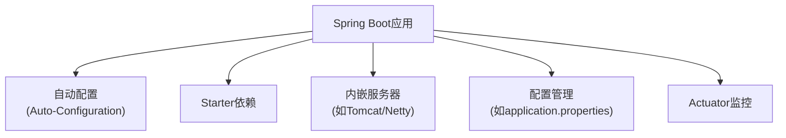
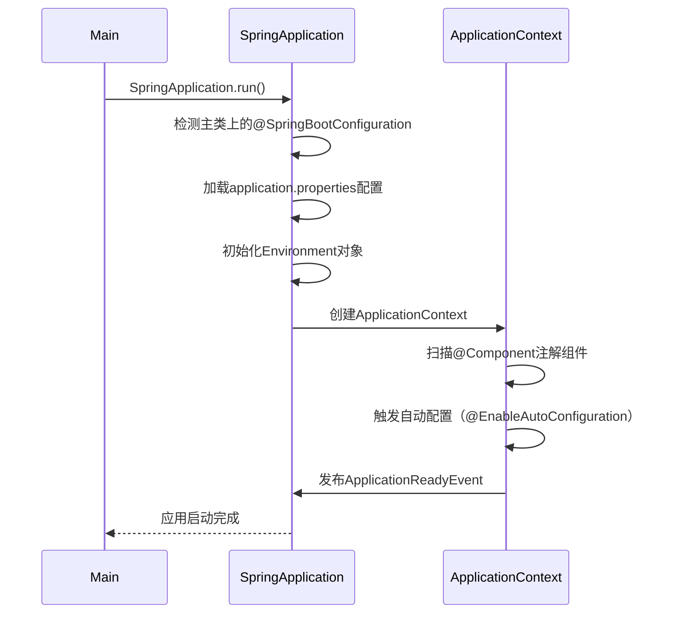

# 三. SpringBoot

***

# Java面试八股——Spring Boot 核心机制与高频面试题详解

***

## 1. 概述与定义

**Spring Boot 的核心定位**： &#x20;

Spring Boot 是 **Spring 生态的简化框架**，通过 **约定优于配置** 的原则，简化 Spring 应用的初始化和配置过程。其核心目标是 **快速开发**、**快速部署** 和 **快速迭代**，并提供 **内嵌服务器**、**自动配置** 和 **Starter 依赖管理** 等特性。

**核心架构图**： &#x20;




***

## 2. 主要特点

### 2.1 核心特性对比表

| **特性**​         | **Spring Boot 实现方式**​                                                                                                            |
| --------------- | -------------------------------------------------------------------------------------------------------------------------------- |
| **自动配置**​       | 通过\`@EnableAutoConfiguration\`和\*\*META-INF/spring/org.springframework.boot.autoconfigure.AutoConfiguration.imports\*\*实现组件自动装配。 |
| **Starter依赖**​  | 预定义的依赖集合（如\`spring-boot-starter-web\`），简化依赖管理。                                                                                   |
| **内嵌服务器**​      | 默认集成Tomcat，支持Jetty/Undertow，无需外部容器。                                                                                              |
| **Actuator监控**​ | 提供\`/health\`、\`/metrics\`等端点，监控应用运行状态。                                                                                          |
| **配置简化**​       | 支持\`.properties\`和\`.yml\`配置，默认使用\`.properties\`。                                                                                |

***

## 3. 应用目标

### 3.1 核心目标

- **快速开发**： &#x20;
  - 通过Starter快速集成技术栈（如Spring Web、JPA、Security）。 &#x20;
- **简化配置**： &#x20;
  - 通过`application.properties`统一管理配置，减少XML/Java配置。 &#x20;
- **微服务基础**： &#x20;
  - 作为Spring Cloud的基础框架，提供服务启动与基础功能。 &#x20;

***

## 4. 主要内容及其组成部分

***

### 4.1 核心组件详解

#### **4.1.1 @SpringBootApplication**

- **复合注解**： &#x20;
  ```java 
  @Target(ElementType.TYPE)
  @Retention(RetentionPolicy.RUNTIME)
  @Documented
  @SpringBootConfiguration
  @EnableAutoConfiguration
  @ComponentScan
  public @interface SpringBootApplication {}
  ```

- **作用**： &#x20;
  - `@SpringBootConfiguration`：标记配置类。 &#x20;
  - `@EnableAutoConfiguration`：触发自动配置机制。 &#x20;
  - `@ComponentScan`：扫描组件（默认扫描同包及子包）。 &#x20;

#### **4.1.2 自动配置（Auto-Configuration）**

- **原理**： &#x20;
  - 通过`spring-boot-autoconfigure`模块，根据类路径依赖（如`spring-jdbc.jar`）自动配置Bean。 &#x20;
- **条件判断**： &#x20;
  - 使用`@ConditionalOnClass`、`@ConditionalOnMissingBean`等条件注解控制配置生效。 &#x20;
- **示例**： &#x20;
  ```java 
  @Configuration
  @ConditionalOnClass(JdbcTemplate.class)
  @ConditionalOnBean(DataSource.class)
  public class JdbcTemplateAutoConfiguration {
      @Bean
      public JdbcTemplate jdbcTemplate(DataSource dataSource) {
          return new JdbcTemplate(dataSource);
      }
  }
  ```


#### **4.1.3 Starter依赖机制**

- **作用**： &#x20;
  - 预定义技术栈依赖（如`spring-boot-starter-data-jpa`包含JPA、Hibernate等）。 &#x20;
- **示例**： &#x20;
  ```xml 
  <dependency>
      <groupId>org.springframework.boot</groupId>
      <artifactId>spring-boot-starter-web</artifactId>
  </dependency>
  ```


#### **4.1.4 配置管理**

- **支持格式**： &#x20;
  - `.properties`（默认）和`.yml`。 &#x20;
- **多环境配置**： &#x20;
  - `application-dev.properties`、`application-prod.yml`通过`spring.profiles.active`激活。 &#x20;
- **示例**： &#x20;
  ```.properties 
  # application.properties
  spring.datasource.url=jdbc:mysql://localhost:3306/test
  spring.datasource.username=root
  spring.jpa.hibernate.ddl-auto=update
  ```


#### **4.1.5 内嵌服务器**

- **默认配置**： &#x20;
  - Tomcat（Spring Boot默认）：无需部署WAR包，直接通过`java -jar`运行。 &#x20;
- **切换服务器**： &#x20;
  ```xml 
  <!-- 使用Jetty替代Tomcat -->
  <dependency>
      <groupId>org.springframework.boot</groupId>
      <artifactId>spring-boot-starter-web</artifactId>
      <exclusions>
          <exclusion>
              <groupId>org.springframework.boot</groupId>
              <artifactId>spring-boot-starter-tomcat</artifactId>
          </exclusion>
      </exclusions>
  </dependency>
  <dependency>
      <groupId>org.springframework.boot</groupId>
      <artifactId>spring-boot-starter-jetty</artifactId>
  </dependency>
  ```


***

### 4.2 启动流程




***

### 4.3 Actuator监控

- **核心端点**： &#x20;
  | **端点**​           | **作用**​              |
  | ----------------- | -------------------- |
  | \`/health\`       | 检查应用健康状态。            |
  | \`/metrics\`      | 展示JVM内存、HTTP请求统计等指标。 |
  | \`/actuator/env\` | 查看当前环境变量。            |
- **启用方式**： &#x20;
  ```xml 
  <dependency>
      <groupId>org.springframework.boot</groupId>
      <artifactId>spring-boot-starter-actuator</artifactId>
  </dependency>
  ```


***

## 5. 原理剖析

### 5.1 自动配置原理

#### **5.1.1 核心流程**

1. **加载**\*\*`spring.factories`\*\***文件**： &#x20;
   - 在`META-INF/spring/org.springframework.boot.autoconfigure.AutoConfiguration.imports`中声明自动配置类（如`DataSourceAutoConfiguration`）。 &#x20;
2. **条件判断**： &#x20;
   - 通过`@Conditional`注解判断配置是否生效（如检测是否存在`DataSource`类）。 &#x20;
3. **Bean注册**： &#x20;
   - 根据条件动态注册Bean（如`JdbcTemplate`）。 &#x20;

#### **5.1.2 条件注解示例**

```java 
// 仅当类路径存在JdbcTemplate时生效
@ConditionalOnClass(JdbcTemplate.class)
```


***

### 5.2 Starter Parent的作用

- \*\*`spring-boot-starter-parent`\*\***的核心功能**： &#x20;
  1. **依赖管理**： &#x20;
     - 继承`spring-boot-dependencies`，统一管理所有依赖的版本。 &#x20;
  2. **插件配置**： &#x20;
     - 集成`spring-boot-maven-plugin`，支持可执行JAR打包。 &#x20;
  3. **编码规范**： &#x20;
     - 设置Java版本（默认Java 8+）、编码格式（UTF-8）。 &#x20;

***

## 6. 应用与拓展

### 6.1 实际场景示例

#### **6.1.1 快速创建REST API**

```java 
@RestController
@RequestMapping("/api/users")
public class UserController {
    @Autowired
    private UserRepository userRepository;

    @GetMapping
    public List<User> getAllUsers() {
        return userRepository.findAll();
    }

    @PostMapping
    public User createUser(@RequestBody User user) {
        return userRepository.save(user);
    }
}
```


#### **6.1.2 自定义Starter**

```java 
// 自定义AutoConfiguration类
@Configuration
@ConditionalOnClass(MyService.class)
public class MyServiceAutoConfiguration {
    @Bean
    public MyService myService() {
        return new MyServiceImpl();
    }
}
```


***

### 6.2 高级用法

#### **6.2.1 多环境配置**

```.properties 
# application-dev.properties
spring.datasource.url=jdbc:mysql://localhost:3306/dev
spring.profiles.active=dev

# application-prod.properties
spring.datasource.url=jdbc:mysql://prod-db:3306/prod
spring.profiles.active=prod
```


#### **6.2.2 自定义健康检查**

```java 
@Component
public class CustomHealthIndicator implements HealthIndicator {
    @Override
    public Health health() {
        if (/* 检查条件 */) {
            return Health.up().build();
        } else {
            return Health.down().withDetail("Error", "Service Unavailable").build();
        }
    }
}
```


***

## 7. 面试问答

### 问题1：Spring Boot与Spring MVC/Spring Cloud的区别？

**回答**： &#x20;

- **Spring Boot**： &#x20;
  - 简化Spring应用的配置和启动，提供内嵌服务器和Starter依赖。 &#x20;
  - **核心**：快速开发单体应用。 &#x20;
- **Spring MVC**： &#x20;
  - Spring的MVC框架，处理请求分发、视图渲染等Web功能。 &#x20;
  - **依赖**：Spring Boot默认集成Spring MVC。 &#x20;
- **Spring Cloud**： &#x20;
  - 基于Spring Boot构建的微服务框架，提供服务发现（Eureka）、配置中心（Config）、网关（Gateway）等组件。 &#x20;
  - **核心**：解决分布式系统的治理问题。 &#x20;

***

### 问题2：@SpringBootApplication注解的作用？

**回答**： &#x20;

- **复合注解**： &#x20;
  1. `@SpringBootConfiguration`：标记配置类。 &#x20;
  2. `@EnableAutoConfiguration`：触发自动配置机制。 &#x20;
  3. `@ComponentScan`：扫描组件（默认当前包及子包）。 &#x20;

***

### 问题3：Spring Boot的自动配置原理？

**回答**： &#x20;

1. **加载配置类**： &#x20;
   - 通过`spring.factories`文件加载所有自动配置类（如`DataSourceAutoConfiguration`）。 &#x20;
2. **条件判断**： &#x20;
   - 使用`@Conditional`注解（如`@ConditionalOnClass`）判断是否满足条件。 &#x20;
3. **注册Bean**： &#x20;
   - 根据条件动态注册Bean（如检测到`DataSource`则创建`JdbcTemplate`）。 &#x20;

***

### 问题4：如何打包Spring Boot应用？可执行JAR与普通JAR的区别？

**回答**： &#x20;

- **打包方式**： &#x20;
  ```bash 
  mvn clean package  # 生成可执行JAR
  mvn clean package -Dpackaging=war  # 生成WAR
  ```

- **可执行JAR结构**： &#x20;
  - 内含内嵌服务器（如Tomcat），通过`java -jar`直接运行。 &#x20;
  - **区别**： &#x20;
    - 普通JAR需外部容器（如Tomcat），而可执行JAR无需部署。 &#x20;

***

### 问题5：Spring Boot的配置文件优先级如何？

**回答**： &#x20;

1. **命令行参数**：最高优先级（如`--server.port=9000`）。 &#x20;
2. \*\*`SPRING_APPLICATION_JSON`\*\***环境变量**。 &#x20;
3. \*\*`ServletConfig`\*\***初始化参数**。 &#x20;
4. \*\*`@PropertySource`\*\***注解的文件**。 &#x20;
5. **`application.properties`****（或****`.yml`）**。 &#x20;
6. **默认配置**：最低优先级。 &#x20;

***

## 结语

本文系统梳理了Spring Boot的核心机制、组件原理及高频面试题，重点强调了**自动配置**、**Starter依赖**和**内嵌服务器**等核心概念。面试时需结合代码示例说明技术细节（如`@SpringBootApplication`的注解组成、自动配置流程），并通过Mermaid图辅助解释复杂流程。建议通过实际项目演示Spring Boot的快速开发能力，并强调其在微服务架构中的基础作用。

[1. 自动配置原理](<1. 自动配置原理/1. 自动配置原理.md> "1. 自动配置原理")

[2. 常见注解](<2. 常见注解/2. 常见注解.md> "2. 常见注解")

[3. 启动流程](<3. 启动流程/3. 启动流程.md> "3. 启动流程")

[4. 事件与监听](<4. 事件与监听/4. 事件与监听.md> "4. 事件与监听")
