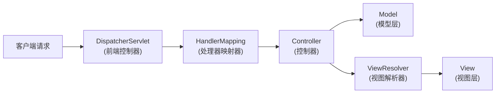
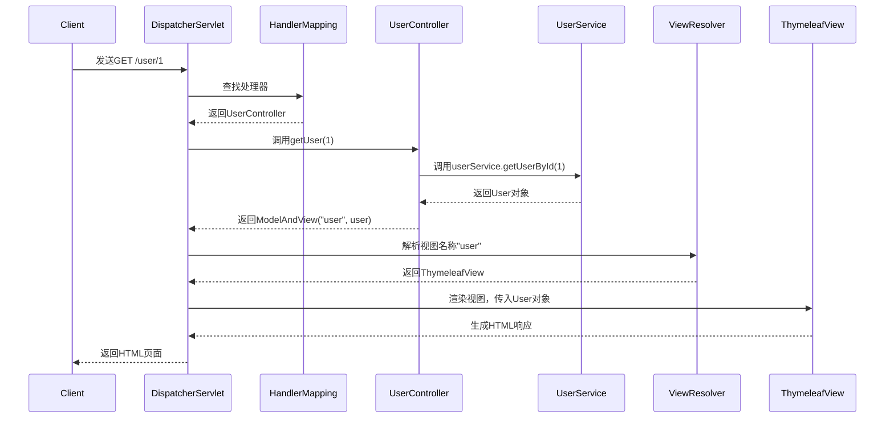

# 0. MVC

***

# Java面试八股——SpringMVC MVC模式详解

***

## 1. 概述与定义

**MVC模式的核心定位**： &#x20;

MVC（Model-View-Controller）是一种经典的软件架构模式，通过**分层解耦**提升代码的可维护性与可扩展性。 &#x20;

- **Model（模型）**：负责数据存储与业务逻辑处理。 &#x20;
- **View（视图）**：负责数据的展示（如HTML、JSON）。 &#x20;
- **Controller（控制器）**：作为请求入口，协调Model与View的交互。 &#x20;

**SpringMVC中的MVC实现**： &#x20;




***

## 2. 主要特点

### 2.1 核心对比表

| **特性**​        | **SpringMVC的MVC实现**​                              |
| -------------- | ------------------------------------------------- |
| **分层清晰**​      | Model、View、Controller职责分离，避免代码耦合。                 |
| **与Spring集成**​ | 支持依赖注入（\`@Autowired\`）、AOP等Spring特性。              |
| **灵活的视图支持**​   | 支持JSP、Thymeleaf、JSON等视图技术，通过\`ViewResolver\`动态解析。 |
| **RESTful支持**​ | 通过\`@RequestMapping\`等注解支持RESTful风格的URL设计。        |
| **非侵入式设计**​    | 不强制业务代码依赖框架（如Model层可独立于SpringMVC）。                |

***

## 3. 应用目标

### 3.1 核心目标

- **提升可维护性**： &#x20;
  - 通过分层设计，修改视图无需改动业务逻辑。 &#x20;
- **分离关注点**： &#x20;
  - Controller处理请求流程，Model处理业务，View负责展示。 &#x20;
- **支持多种前端技术**： &#x20;
  - 同一接口可返回JSON（移动端）或JSP（网页端）。 &#x20;

***

## 4. 主要内容及其组成部分

***

### 4.1 Model（模型层）

#### **4.1.1 核心组成**

- **JavaBean**： &#x20;
  - 存储数据的POJO类（如`User`类）。 &#x20;
- **Service层**： &#x20;
  - 调用DAO层获取数据，执行业务逻辑（如`UserService`）。 &#x20;
- **Spring依赖注入**： &#x20;
  - 通过`@Service`、`@Autowired`实现组件解耦。 &#x20;

#### **4.1.2 示例代码**

```java 
// Model层：User实体类
public class User {
    private Long id;
    private String name;
    // Getters and Setters
}

// Service层：业务逻辑
@Service
public class UserService {
    @Autowired
    private UserRepository repository;

    public User getUserById(Long id) {
        return repository.findById(id).orElse(null);
    }
}
```


***

### 4.2 View（视图层）

#### **4.2.1 支持的视图技术**

| **技术**​        | **描述**​                                                        |
| -------------- | -------------------------------------------------------------- |
| **JSP**​       | 传统Java服务器页面，需配置\`InternalResourceViewResolver\`。               |
| **Thymeleaf**​ | 模板引擎，支持HTML5，通过\`ThymeleafViewResolver\`集成。                    |
| **JSON/XML**​  | 通过\`@ResponseBody\`返回数据，需配置\`ContentNegotiatingViewResolver\`。 |

#### **4.2.2 示例代码（Thymeleaf）**

```html 
<!-- view/user.html -->
<!DOCTYPE html>
<html xmlns:th="http://www.thymeleaf.org">
<body>
    <h1 th:text="${user.name}">用户名</h1>
</body>
</html>
```


***

### 4.3 Controller（控制器层）

#### **4.3.1 核心注解**

| **注解**​             | **作用**​                        |
| ------------------- | ------------------------------ |
| \`@Controller\`     | 声明控制器类。                        |
| \`@RequestMapping\` | 映射请求路径（支持\`/user/{id}\`等动态参数）。 |
| \`@ResponseBody\`   | 将方法返回值直接序列化为JSON/XML。          |
| \`@PathVariable\`   | 从URL中提取参数（如\`/user/{id}\`）。    |

#### **4.3.2 示例代码**

```java 
@Controller
@RequestMapping("/user")
public class UserController {
    @Autowired
    private UserService userService;

    @GetMapping("/{id}")
    public String getUser(@PathVariable Long id, Model model) {
        User user = userService.getUserById(id);
        model.addAttribute("user", user);
        return "user"; // 对应视图名称
    }

    @GetMapping("/json/{id}")
    @ResponseBody
    public User getUserAsJson(@PathVariable Long id) {
        return userService.getUserById(id);
    }
}
```


***

### 4.4 核心组件详解

#### **4.4.1 DispatcherServlet（前端控制器）**

- **职责**： &#x20;
  - 接收所有请求，分发到对应的Controller。 &#x20;
  - 配置在`web.xml`中： &#x20;
    ```xml 
    <servlet>
        <servlet-name>dispatcherServlet</servlet-name>
        <servlet-class>org.springframework.web.servlet.DispatcherServlet</servlet-class>
        <load-on-startup>1</load-on-startup>
    </servlet>
    <servlet-mapping>
        <servlet-name>dispatcherServlet</servlet-name>
        <url-pattern>/</url-pattern>
    </servlet-mapping>
    ```


#### **4.4.2 HandlerMapping（处理器映射器）**

- **作用**： &#x20;
  - 根据请求URL找到对应的Controller方法。 &#x20;
  - 支持`@RequestMapping`注解的解析。

#### **4.4.3 ViewResolver（视图解析器）**

- **示例配置（Thymeleaf）**： &#x20;
  ```java 
  @Bean
  public SpringResourceTemplateResolver templateResolver() {
      SpringResourceTemplateResolver resolver = new SpringResourceTemplateResolver();
      resolver.setPrefix("classpath:/templates/");
      resolver.setSuffix(".html");
      resolver.setTemplateMode(TemplateMode.HTML);
      return resolver;
  }

  @Bean
  public SpringTemplateEngine templateEngine() {
      SpringTemplateEngine engine = new SpringTemplateEngine();
      engine.setTemplateResolver(templateResolver());
      return engine;
  }
  ```


***

## 5. 原理剖析

### 5.1 请求处理流程




#### **5.1.1 关键阶段解析**

1. **请求分发**： &#x20;
   - `DispatcherServlet`将请求映射到`UserController`的`getUser()`方法。 &#x20;
2. **业务处理**： &#x20;
   - `UserController`调用`UserService`获取数据，填充到Model中。 &#x20;
3. **视图渲染**： &#x20;
   - `ViewResolver`找到`user.html`模板，通过Thymeleaf渲染数据。 &#x20;

***

### 5.2 Model与ViewModel的区别

- **Model**： &#x20;
  - 直接传递POJO对象（如`User`），适合简单场景。 &#x20;
- **ViewModel**： &#x20;
  - 封装多个Model对象或额外字段（如分页信息），避免视图层直接操作复杂数据。 &#x20;
  ```java 
  public class UserViewModel {
      private User user;
      private List<Role> roles;
      // Getters and Setters
  }
  ```


***

## 6. 应用与拓展

### 6.1 实际场景示例

#### **6.1.1 RESTful接口设计**

```java 
@RestController
@RequestMapping("/api/users")
public class UserRestController {
    @GetMapping
    public List<User> getAllUsers() {
        return userService.findAll();
    }

    @PostMapping
    public User createUser(@RequestBody User user) {
        return userService.save(user);
    }
}
```


#### **6.1.2 文件上传示例**

```java 
@PostMapping("/upload")
public String handleFileUpload(@RequestParam("file") MultipartFile file) {
    try {
        byte[] bytes = file.getBytes();
        Path path = Paths.get(UPLOAD_DIR + file.getOriginalFilename());
        Files.write(path, bytes);
        return "File uploaded successfully";
    } catch (IOException e) {
        return "Error: " + e.getMessage();
    }
}
```


***

### 6.2 高级用法

- **全局异常处理**： &#x20;
  ```java 
  @ControllerAdvice
  public class GlobalExceptionHandler {
      @ExceptionHandler(UserNotFoundException.class)
      public ResponseEntity<String> handleUserNotFound() {
          return ResponseEntity.status(404).body("User not found");
      }
  }
  ```

- **拦截器增强**： &#x20;
  ```java 
  @Component
  public class AuthInterceptor implements HandlerInterceptor {
      @Override
      public boolean preHandle(HttpServletRequest request, 
                              HttpServletResponse response, 
                              Object handler) {
          String token = request.getHeader("Authorization");
          if (token == null) {
              response.sendError(401, "Unauthorized");
              return false;
          }
          return true;
      }
  }
  ```


***

## 7. 面试问答

### 问题1：MVC模式的核心优势是什么？

**回答**： &#x20;

- **分层解耦**： &#x20;
  - Model负责业务逻辑，View负责展示，Controller协调流程，修改某一层不影响其他层。 &#x20;
- **可维护性**： &#x20;
  - 例如修改页面样式（View）无需改动数据逻辑（Model）。 &#x20;
- **复用性**： &#x20;
  - 同一业务逻辑（Model）可同时支持Web和移动端（通过不同View）。 &#x20;

***

### 问题2：SpringMVC的请求处理流程是怎样的？

**回答**： &#x20;

1. **DispatcherServlet接收请求**： &#x20;
   - 根据URL匹配对应的Controller方法。 &#x20;
2. **HandlerMapping解析处理器**： &#x20;
   - 通过`@RequestMapping`找到目标方法。 &#x20;
3. **Controller处理请求**： &#x20;
   - 调用Service层获取数据，填充到Model中。 &#x20;
4. **视图解析**： &#x20;
   - `ViewResolver`根据逻辑视图名（如`user`）找到具体视图（如`user.html`）。 &#x20;
5. **渲染并返回响应**： &#x20;
   - 视图层（如Thymeleaf）将数据渲染为HTML或JSON。 &#x20;

***

### 问题3：如何配置Thymeleaf视图解析器？

**回答**： &#x20;

```java 
@Configuration
public class WebConfig implements WebMvcConfigurer {
    @Bean
    public SpringResourceTemplateResolver templateResolver() {
        SpringResourceTemplateResolver resolver = new SpringResourceTemplateResolver();
        resolver.setPrefix("classpath:/templates/");
        resolver.setSuffix(".html");
        return resolver;
    }

    @Bean
    public SpringTemplateEngine templateEngine() {
        SpringTemplateEngine engine = new SpringTemplateEngine();
        engine.setTemplateResolver(templateResolver());
        return engine;
    }

    @Bean
    public ThymeleafViewResolver viewResolver() {
        ThymeleafViewResolver resolver = new ThymeleafViewResolver();
        resolver.setTemplateEngine(templateEngine());
        return resolver;
    }
}
```


- **关键点**： &#x20;
  - `templateResolver`指定模板路径。 &#x20;
  - `templateEngine`与`viewResolver`关联。 &#x20;

***

### 问题4：为什么Controller层不能直接操作数据库？

**回答**： &#x20;

- **职责分离原则**： &#x20;
  - Controller仅负责请求协调，数据库操作应放在Service层。 &#x20;
- **复用性**： &#x20;
  - Service层的方法可被多个Controller复用（如`/user/1`和`/admin/user/1`）。 &#x20;
- **测试友好**： &#x20;
  - Service层逻辑可独立测试，无需依赖HTTP请求。 &#x20;

***

### 问题5：如何实现RESTful API的分页功能？

**回答**： &#x20;

```java 
@GetMapping
public Page<User> getUsers(
        @RequestParam(defaultValue = "0") int page,
        @RequestParam(defaultValue = "10") int size) {
    return userService.findAll(PageRequest.of(page, size));
}
```


- **关键点**： &#x20;
  - 使用Spring Data的`Pageable`实现分页。 &#x20;
  - 通过`@RequestParam`获取分页参数。 &#x20;
  - 返回`Page<User>`对象，包含总页数、当前页数据等。 &#x20;

***

## 结语

本文系统梳理了SpringMVC中MVC模式的核心概念、实现原理及实战场景，重点强调了分层设计的优势与组件协作机制。面试时需结合代码示例说明具体实现（如Thymeleaf配置、RESTful接口设计），并强调分层设计对项目维护的价值。建议通过`Mermaid`图辅助解释请求流程，以直观展示技术细节。
