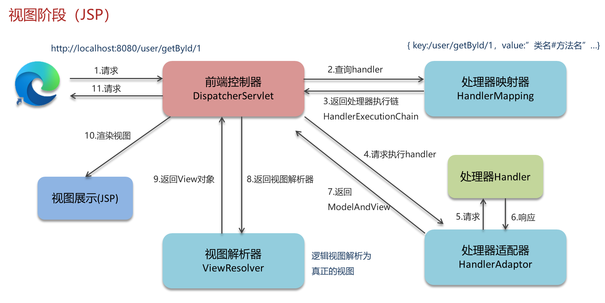
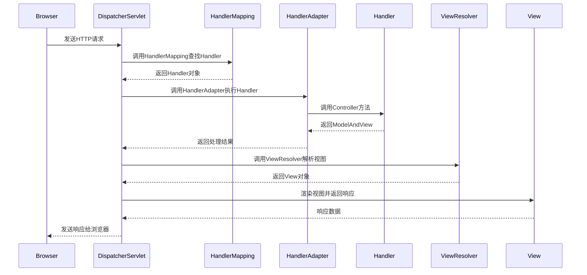

# 1. 核心组件

***

# Java面试八股——SpringMVC核心组件详解

***

## 1. 概述与定义

**SpringMVC的核心定位**： &#x20;

SpringMVC是Spring框架提供的**MVC实现**，通过**组件化设计**将请求处理流程分解为多个独立职责的组件，实现**高内聚低耦合**。其核心组件协同工作，完成从请求接收、处理到响应的全流程。

**核心组件的作用链**： &#x20;



***

## 2. 主要特点

### 2.1 核心组件的职责分离

| 组件名称                  | 核心职责                     | 协作角色                            |
| --------------------- | ------------------------ | ------------------------------- |
| \`DispatcherServlet\` | 请求入口，统一分发，处理请求生命周期       | 调用所有组件，协调流程                     |
| \`HandlerMapping\`    | 映射请求到具体处理器（Controller方法） | 根据URL、方法等规则匹配Handler            |
| \`HandlerAdapter\`    | 适配不同类型的处理器，执行业务逻辑        | 封装处理器调用方式，支持多种开发模式（如注解/接口）      |
| \`ViewResolver\`      | 解析逻辑视图名到具体视图对象           | 与\`DispatcherServlet\`协作，渲染最终响应 |
| \`MultipartResolver\` | 处理文件上传请求                 | 解析\`multipart/form-data\`格式的请求体 |

***

## 3. 应用目标

1. **标准化请求处理**： &#x20;
   - 通过组件协作实现**统一入口**（`DispatcherServlet`），避免代码分散。 &#x20;
2. **扩展性**： &#x20;
   - 通过`HandlerAdapter`和`ViewResolver`支持多种处理器类型（如REST、文件上传）和视图技术（Thymeleaf、JSON）。 &#x20;
3. **松耦合设计**： &#x20;
   - 各组件仅通过接口通信，可替换或扩展（如自定义`ViewResolver`）。 &#x20;

***

## 4. 主要内容及其组成部分

### 4.1 核心组件详解（九大组件）

#### **4.1.1 DispatcherServlet**

- **作用**： &#x20;

  前端控制器，接收所有请求并分发处理。 &#x20;
- **生命周期**： &#x20;
  ```java 
  // 初始化时加载核心组件（通过initStrategies）
  @Override
  protected void initStrategies(ApplicationContext context) {
      initMultipartResolver(context);    // 文件上传解析器
      initLocaleResolver(context);       // 国际化解析器
      initThemeResolver(context);        // 主题解析器
      initHandlerMappings(context);      // 处理器映射器
      initHandlerAdapters(context);      // 处理器适配器
      initHandlerExceptionResolvers(context); // 异常处理器
      initRequestToViewNameTranslator(context); // 请求到视图名转换
      initViewResolvers(context);        // 视图解析器
      initFlashMapManager(context);      // 重定向参数管理
  }
  ```


***

#### **4.1.2 HandlerMapping**

- **实现类**： &#x20;
  - `RequestMappingHandlerMapping`：支持`@RequestMapping`注解的映射。 &#x20;
  - `BeanNameUrlHandlerMapping`：通过Bean名称匹配URL。 &#x20;
- **配置示例**： &#x20;
  ```java 
  @Configuration
  public class WebConfig implements WebMvcConfigurer {
      @Bean
      public RequestMappingHandlerMapping handlerMapping() {
          RequestMappingHandlerMapping mapping = new RequestMappingHandlerMapping();
          mapping.setOrder(0); // 设置优先级
          return mapping;
      }
  }
  ```


***

#### **4.1.3 HandlerAdapter**

- **适配规则**： &#x20;

  根据处理器类型选择适配器（如`RequestMappingHandlerAdapter`处理注解Controller）。 &#x20;
- **关键代码**： &#x20;
  ```java 
  public class RequestMappingHandlerAdapter implements HandlerAdapter {
      @Override
      public ModelAndView handle(HttpServletRequest request, 
                                HttpServletResponse response, 
                                Object handler) throws Exception {
          // 解析@PathVariable, @RequestBody等参数
          // 调用Controller方法
          // 处理返回值（ModelAndView/void/String等）
      }
  }
  ```


***

#### **4.1.4 ViewResolver**

- **实现类**： &#x20;
  - `InternalResourceViewResolver`：解析JSP视图。 &#x20;
  - `ThymeleafViewResolver`：解析Thymeleaf模板。 &#x20;
- **配置示例**： &#x20;
  ```java 
  @Bean
  public InternalResourceViewResolver viewResolver() {
      InternalResourceViewResolver resolver = new InternalResourceViewResolver();
      resolver.setPrefix("/WEB-INF/views/"); // 视图前缀
      resolver.setSuffix(".jsp");            // 视图后缀
      return resolver;
  }
  ```


***

#### **4.1.5 HandlerExceptionResolver**

- **作用**： &#x20;

  统一处理Controller抛出的异常，返回友好提示。 &#x20;
- **使用示例**： &#x20;
  ```java 
  @ControllerAdvice
  public class GlobalExceptionHandler implements HandlerExceptionResolver {
      @Override
      public ModelAndView resolveException(HttpServletRequest request, 
                                           HttpServletResponse response, 
                                           Object handler, 
                                           Exception ex) {
          ModelAndView mv = new ModelAndView("error");
          mv.addObject("errorMessage", "系统异常，请稍后重试");
          return mv;
      }
  }
  ```


***

#### **4.1.6 MultipartResolver**

- **文件上传支持**： &#x20;

  解析`multipart/form-data`请求体为`MultipartFile`对象。 &#x20;
- **配置示例**： &#x20;
  ```java 
  @Bean
  public MultipartResolver multipartResolver() {
      return new CommonsMultipartResolver();
  }
  ```


***

#### **4.1.7 LocaleResolver & ThemeResolver**

- **国际化支持**： &#x20;
  - `LocaleResolver`：根据请求语言设置（如`Accept-Language`头）切换资源。 &#x20;
  - `ThemeResolver`：支持主题切换（如夜间模式）。 &#x20;
- **配置示例**： &#x20;
  ```java 
  @Bean
  public LocaleResolver localeResolver() {
      SessionLocaleResolver resolver = new SessionLocaleResolver();
      resolver.setDefaultLocale(Locale.CHINA);
      return resolver;
  }
  ```


***

#### **4.1.8 HandlerInterceptor**

- **拦截请求**： &#x20;

  在Controller执行前/后、视图渲染前执行自定义逻辑（如权限校验、日志）。 &#x20;
- **示例代码**： &#x20;
  ```java 
  public class AuthInterceptor implements HandlerInterceptor {
      @Override
      public boolean preHandle(HttpServletRequest request, 
                              HttpServletResponse response, 
                              Object handler) {
          if (!SecurityUtil.isAuthenticated()) {
              response.sendRedirect("/login");
              return false;
          }
          return true;
      }
  }
  ```


***

#### **4.1.9 FlashMapManager**

- **重定向参数传递**： &#x20;

  在重定向时临时存储参数（避免URL暴露敏感信息）。 &#x20;
- **使用示例**： &#x20;
  ```java 
  @GetMapping("/redirect")
  public String redirectWithFlash(redirectAttributes) {
      redirectAttributes.addFlashAttribute("message", "操作成功");
      return "redirect:/home";
  }
  ```


***

## 5. 原理剖析

### 5.1 请求处理全流程

#### **5.1.1 核心流程图**




#### **5.1.2 关键步骤解析**

1. **HandlerMapping的映射逻辑**： &#x20;
   - 根据`@RequestMapping`的URL和HTTP方法匹配Controller方法。 &#x20;
   - 示例：`@GetMapping("/users/{id}")`匹配`GET /users/123`请求。 &#x20;
2. **HandlerAdapter的适配逻辑**： &#x20;
   - 解析方法参数（如`@RequestParam`、`@PathVariable`）。 &#x20;
   - 处理返回值（如`String`返回视图名，`ModelAndView`直接返回）。 &#x20;
3. **ViewResolver的视图选择**： &#x20;
   - 根据`ModelAndView`的视图名（如`"user"`）匹配`/WEB-INF/views/user.jsp`。 &#x20;

***

### 5.2 与传统Servlet的对比

| 对比项       | SpringMVC核心组件               | 传统Servlet          |
| --------- | --------------------------- | ------------------ |
| **请求入口**​ | \`DispatcherServlet\`统一处理   | 每个Servlet独立处理      |
| **组件协作**​ | 组件解耦，通过接口通信                 | 逻辑分散在多个Servlet中    |
| **扩展性**​  | 通过扩展接口（如\`HandlerAdapter\`） | 需要重写Servlet或Filter |

***

## 6. 应用与拓展

### 6.1 文件上传场景

- **组件协作**： &#x20;
  - `MultipartResolver`解析请求体为`MultipartFile`。 &#x20;
  - `HandlerAdapter`将`MultipartFile`注入Controller参数。 &#x20;
- **代码示例**： &#x20;
  ```java 
  @PostMapping("/upload")
  public String handleUpload(@RequestParam("file") MultipartFile file) {
      // 处理文件存储
      return "uploadSuccess";
  }
  ```


***

### 6.2 国际化支持

- **流程**： &#x20;
  ```mermaid 
  graph LR
      A[LocaleResolver] --> B[解析请求语言]
      B --> C[加载对应资源文件]
      C --> D[Controller注入Locale对象]
      D --> E[视图渲染国际化文本]
  ```

- **资源文件示例**： &#x20;
  ```.properties 
  # messages_zh_CN.properties
  greeting=欢迎使用！

  # messages_en_US.properties
  greeting=Welcome!
  ```


***

### 6.3 自定义拦截器

- **场景**： &#x20;

  在请求到达Controller前校验权限。 &#x20;
- **实现代码**： &#x20;
  ```java 
  public class AuthInterceptor implements HandlerInterceptor {
      @Override
      public boolean preHandle(HttpServletRequest request, 
                              HttpServletResponse response, 
                              Object handler) {
          String token = request.getHeader("Authorization");
          if (!token.equals("valid-token")) {
              response.setStatus(HttpServletResponse.SC_UNAUTHORIZED);
              return false;
          }
          return true;
      }
  }
  ```


***

## 7. 面试问答

### 问题1：SpringMVC的核心组件有哪些？

**回答**： &#x20;

SpringMVC的九大核心组件包括： &#x20;

1. **DispatcherServlet**：前端控制器，统一分发请求。 &#x20;
2. **HandlerMapping**：映射请求到具体Controller方法。 &#x20;
3. **HandlerAdapter**：适配不同处理器类型，执行业务逻辑。 &#x20;
4. **ViewResolver**：解析逻辑视图名到具体视图。 &#x20;
5. **MultipartResolver**：处理文件上传请求。 &#x20;
6. **LocaleResolver**：国际化解析器。 &#x20;
7. **ThemeResolver**：主题解析器。 &#x20;
8. **HandlerExceptionResolver**：异常处理。 &#x20;
9. **FlashMapManager**：重定向参数管理。 &#x20;

***

### 问题2：DispatcherServlet和HandlerAdapter的关系？

**回答**： &#x20;

- **DispatcherServlet**是流程的起点，负责调用所有组件。 &#x20;
- **HandlerAdapter**是DispatcherServlet的“助手”，负责执行具体的处理器逻辑： &#x20;
  - 根据处理器类型（如注解Controller）选择适配器。 &#x20;
  - 解析方法参数（如`@RequestBody`）。 &#x20;
  - 处理返回值（如返回`String`时自动查找视图）。 &#x20;

***

### 问题3：如何实现自定义的视图解析器？

**回答**： &#x20;

1. **实现**\*\*`ViewResolver`\*\***接口**： &#x20;
   ```java 
   public class CustomViewResolver implements ViewResolver {
       @Override
       public View resolveViewName(String viewName, Locale locale) throws Exception {
           return new CustomView(viewName);
       }
   }
   ```

2. **配置Bean**： &#x20;
   ```java 
   @Bean
   public ViewResolver viewResolver() {
       return new CustomViewResolver();
   }
   ```


***

### 问题4：HandlerInterceptor的执行顺序？

**回答**： &#x20;

1. **preHandle()**：在Controller方法执行前调用，返回`false`中断流程。 &#x20;
2. **postHandle()**：在Controller方法执行后、视图渲染前调用。 &#x20;
3. **afterCompletion()**：在请求完成后调用（无论是否异常）。 &#x20;

***

### 问题5：如何解决文件上传大小限制？

**回答**： &#x20;

1. **配置**\*\*`MultipartResolver`\*\*： &#x20;
   ```java 
   @Bean
   public MultipartResolver multipartResolver() {
       CommonsMultipartResolver resolver = new CommonsMultipartResolver();
       resolver.setMaxUploadSize(10485760); // 10MB
       return resolver;
   }
   ```

2. **设置Servlet容器参数**（如Tomcat）： &#x20;
   ```xml 
   <multipart-config>
       <max-file-size>10485760</max-file-size>
   </multipart-config>
   ```


***

## 结语

本文系统梳理了SpringMVC核心组件的功能、协作流程及实战场景，重点覆盖九大组件的实现细节与面试高频问题。面试时需结合代码示例说明组件间交互（如`DispatcherServlet`如何调用`HandlerMapping`），并强调组件设计的**解耦性**和**扩展性**，体现对框架原理的深入理解。
