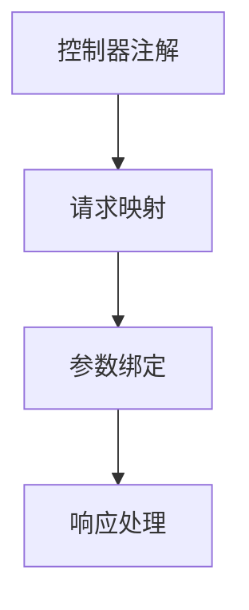
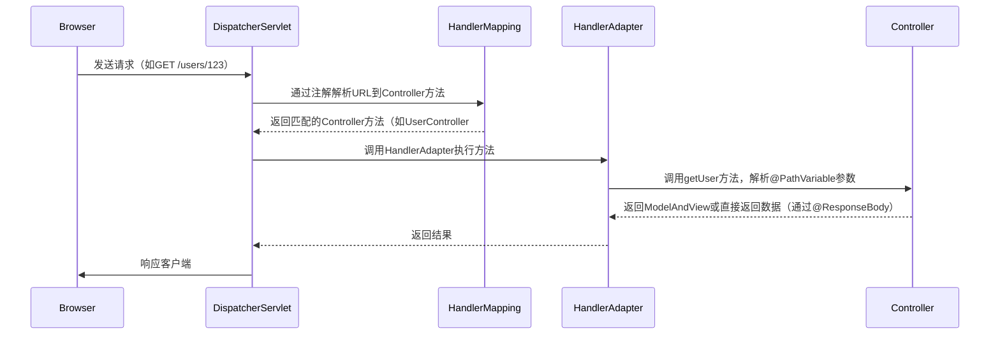

# 2. 核心注解

***

# Java面试八股——SpringMVC核心注解详解

***

## 1. 概述与定义

**SpringMVC的核心注解定位**： &#x20;

SpringMVC通过**注解驱动开发**（Annotation-Driven Development），将请求映射、参数绑定、数据返回等流程**声明式化**，极大简化了传统XML配置的复杂性。核心注解分为**控制器注解**、**请求映射注解**、**参数绑定注解**、**响应处理注解**等类别。

**注解的作用链**： &#x20;




***

## 2. 主要特点

### 2.1 核心注解分类

| 注解类别      | 核心注解                                                                       | 主要功能                      |
| --------- | -------------------------------------------------------------------------- | ------------------------- |
| **控制器**​  | \`@Controller\`, \`@RestController\`                                       | 声明控制器类，区分视图渲染与直接返回数据      |
| **请求映射**​ | \`@RequestMapping\`, \`@GetMapping\`, \`@PostMapping\`                     | 映射请求URL到方法，支持HTTP方法、路径变量等 |
| **参数绑定**​ | \`@RequestParam\`, \`@PathVariable\`, \`@RequestBody\`, \`@RequestHeader\` | 绑定请求参数、路径变量、请求体、请求头到方法参数  |
| **响应处理**​ | \`@ResponseBody\`, \`@ResponseStatus\`, \`@ExceptionHandler\`              | 定义响应格式、HTTP状态码，全局异常处理     |
| **数据绑定**​ | \`@ModelAttribute\`, \`@InitBinder\`                                       | 预处理请求参数、格式化数据             |

***

## 3. 应用目标

1. **简化配置**： &#x20;
   - 通过注解替代XML配置，提升开发效率（如`@Controller`替代`<bean>`）。 &#x20;
2. **声明式开发**： &#x20;
   - 直接在代码中标注请求处理逻辑，增强代码可读性。 &#x20;
3. **解耦与扩展**： &#x20;
   - 通过`@ControllerAdvice`实现全局异常处理和数据绑定。 &#x20;

***

## 4. 主要内容及其组成部分

### 4.1 核心注解详解（15+注解）

#### **4.1.1 控制器注解**

- **`@Controller`** &#x20;
  - **作用**：声明一个控制器类，用于处理请求。 &#x20;
  - **示例**： &#x20;
    ```java 
    @Controller
    @RequestMapping("/users") // 类级URL映射
    public class UserController {
        @RequestMapping("/list")
        public String list() { return "userList"; }
    }
    ```

- **`@RestController`** &#x20;
  - **作用**：组合`@Controller`和`@ResponseBody`，直接返回数据（如JSON/XML）。 &#x20;
  - **示例**： &#x20;
    ```java 
    @RestController
    public class ApiUserController {
        @GetMapping("/users/{id}")
        public User getUser(@PathVariable Long id) { 
            return userService.findById(id); 
        }
    }
    ```


***

#### **4.1.2 请求映射注解**

- **`@RequestMapping`** &#x20;
  - **作用**：定义请求URL到方法的映射，支持HTTP方法、路径变量等。 &#x20;
  - **参数**： &#x20;
    | 参数名         | 描述                                               |
    | ----------- | ------------------------------------------------ |
    | \`value\`   | 请求路径（可省略）                                        |
    | \`method\`  | HTTP方法（如\`RequestMethod.GET\`）                   |
    | \`params\`  | 需要匹配的请求参数（如\`params="id"\`）                      |
    | \`headers\` | 需要匹配的请求头（如\`headers="Accept=application/json"\`） |
  - **示例**： &#x20;
    ```java 
    @RequestMapping(value = "/create", method = RequestMethod.POST)
    public String createUser(@RequestBody User user) { /* ... */ }
    ```

- **HTTP方法专用注解** &#x20;
  - `@GetMapping`, `@PostMapping`, `@PutMapping`, `@DeleteMapping`： &#x20;

    简化`@RequestMapping(method=...)`的写法。 &#x20;
  - **示例**： &#x20;
    ```java 
    @PostMapping("/login")
    public String login(@RequestParam String username, @RequestParam String password) { /* ... */ }
    ```


***

#### **4.1.3 参数绑定注解**

- **`@RequestParam`** &#x20;
  - **作用**：绑定查询参数或表单参数到方法参数。 &#x20;
  - **参数**： &#x20;
    | 参数名          | 描述               |
    | ------------ | ---------------- |
    | \`value\`    | 参数名              |
    | \`required\` | 是否必填（默认\`true\`） |
  - **示例**： &#x20;
    ```java 
    @GetMapping("/search")
    public String search(@RequestParam("q") String query) { /* ... */ }
    ```

- **`@PathVariable`** &#x20;
  - **作用**：绑定URL路径中的变量到方法参数。 &#x20;
  - **示例**： &#x20;
    ```java 
    @GetMapping("/users/{id}")
    public String getUser(@PathVariable("id") Long userId) { /* ... */ }
    ```

- **`@RequestBody`** &#x20;
  - **作用**：将请求体（如JSON/XML）转换为Java对象。 &#x20;
  - **示例**： &#x20;
    ```java 
    @PostMapping("/create")
    public String createUser(@RequestBody User user) { /* ... */ }
    ```

- **`@RequestHeader`** &#x20;
  - **作用**：绑定请求头参数。 &#x20;
  - **示例**： &#x20;
    ```java 
    @GetMapping("/check")
    public String checkHeader(@RequestHeader("Authorization") String token) { /* ... */ }
    ```


***

#### **4.1.4 响应处理注解**

- **`@ResponseBody`** &#x20;
  - **作用**：将方法返回值直接序列化为HTTP响应体（如JSON）。 &#x20;
  - **示例**： &#x20;
    ```java 
    @Controller
    public class ApiController {
        @RequestMapping("/data")
        @ResponseBody
        public User getUser() { return new User("John"); }
    }
    ```

- **`@ResponseStatus`** &#x20;
  - **作用**：定义方法或异常的HTTP状态码。 &#x20;
  - **示例**： &#x20;
    ```java 
    @ExceptionHandler(UserNotFoundException.class)
    @ResponseStatus(HttpStatus.NOT_FOUND)
    public void handleUserNotFound() { /* ... */ }
    ```

- **`@ExceptionHandler`** &#x20;
  - **作用**：在类中定义异常处理方法。 &#x20;
  - **示例**： &#x20;
    ```java 
    @Controller
    public class UserController {
        @ExceptionHandler(SQLException.class)
        public String handleDatabaseError() { return "error/database"; }
    }
    ```


***

#### **4.1.5 数据绑定与全局注解**

- **`@ModelAttribute`** &#x20;
  - **作用**：预处理请求参数，填充到模型中。 &#x20;
  - **示例**： &#x20;
    ```java 
    @ModelAttribute("user")
    public User getUser(@RequestParam Long id) {
        return userService.findById(id);
    }
    ```

- **`@SessionAttributes`** &#x20;
  - **作用**：将模型数据存储到会话中。 &#x20;
  - **示例**： &#x20;
    ```java 
    @Controller
    @SessionAttributes("cart")
    public class ShoppingCartController {
        // ...
    }
    ```

- **`@ControllerAdvice`** &#x20;
  - **作用**：定义全局异常处理和数据绑定逻辑。 &#x20;
  - **示例**： &#x20;
    ```java 
    @ControllerAdvice
    public class GlobalExceptionHandler {
        @ExceptionHandler(Exception.class)
        public ResponseEntity<String> handleAllExceptions() {
            return ResponseEntity.status(500).body("Internal Server Error");
        }
    }
    ```


***

#### **4.1.6 其他常用注解**

- **`@CrossOrigin`** &#x20;
  - **作用**：处理跨域请求（CORS）。 &#x20;
  - **示例**： &#x20;
    ```java 
    @CrossOrigin(origins = "http://example.com")
    @GetMapping("/data")
    public String getData() { /* ... */ }
    ```

- **`@SessionAttribute`** &#x20;
  - **作用**：从会话中获取属性。 &#x20;
  - **示例**： &#x20;
    ```java 
    @GetMapping("/checkout")
    public String checkout(@SessionAttribute("cart") Cart cart) { /* ... */ }
    ```


***

## 5. 原理剖析

### 5.1 注解驱动的请求处理流程

#### **5.1.1 核心流程图**




#### **5.1.2 关键步骤解析**

1. \*\*`@RequestMapping`\*\***的URL匹配**： &#x20;
   - 通过`RequestMappingHandlerMapping`解析注解中的URL、HTTP方法等规则，匹配到具体方法。 &#x20;
2. **参数绑定**： &#x20;
   - `HandlerAdapter`通过`ServletInvocableHandlerMethod`解析`@RequestParam`、`@PathVariable`等注解，将参数注入方法。 &#x20;
3. **响应序列化**： &#x20;
   - 若方法有`@ResponseBody`，`HandlerAdapter`使用`HttpMessageConverter`（如`Jackson`）将返回对象序列化为JSON。 &#x20;

***

### 5.2 `@RequestBody`与`@ResponseBody`的协作

- **序列化流程**： &#x20;
  ```mermaid 
  graph LR
      A[客户端发送<br>JSON请求体] --> B[DispatcherServlet]
      B --> C[HandlerAdapter]
      C --> D[调用方法，触发<br>@RequestBody解析]
      D --> E[使用Jackson将<br>JSON转为Java对象]
      E --> F[方法执行<br>返回User对象]
      F --> G[HandlerAdapter触发<br>@ResponseBody]
      G --> H[使用Jackson将<br>User对象转为JSON响应]
      H --> I[返回给客户端]
  ```


***

### 5.3 异常处理机制

- \*\*`@ExceptionHandler`\*\***的执行链**： &#x20;
  ```mermaid 
  sequenceDiagram
      Controller->>ExceptionResolver: 抛出异常
      ExceptionResolver->>GlobalExceptionHandler: 查找@ExceptionHandler方法
      GlobalExceptionHandler-->>ExceptionResolver: 返回处理结果
      ExceptionResolver-->>DispatcherServlet: 构造错误响应
  ```


***

## 6. 应用与拓展

### 6.1 RESTful API设计

- **示例**： &#x20;
  ```java 
  @RestController
  @RequestMapping("/api/v1/users")
  public class UserApiController {
      @GetMapping("/{id}") // GET /api/v1/users/123
      public User getUser(@PathVariable Long id) { /* ... */ }

      @PostMapping // POST /api/v1/users
      @ResponseStatus(HttpStatus.CREATED)
      public User createUser(@RequestBody User user) { /* ... */ }

      @DeleteMapping("/{id}") // DELETE /api/v1/users/123
      public void deleteUser(@PathVariable Long id) { /* ... */ }
  }
  ```


***

### 6.2 跨域问题解决

- **通过**\*\*`@CrossOrigin`\*\***注解**： &#x20;
  ```java 
  @CrossOrigin(origins = "http://frontend.example.com", 
              methods = {RequestMethod.GET, RequestMethod.POST})
  @RestController
  public class PublicApiController { /* ... */ }
  ```


***

### 6.3 全局异常处理

- **示例**： &#x20;
  ```java 
  @ControllerAdvice
  public class GlobalExceptionHandler {
      @ExceptionHandler(value = {NullPointerException.class, IllegalArgumentException.class})
      public ResponseEntity<String> handleClientErrors() {
          return ResponseEntity.status(400).body("Invalid request");
      }
  }
  ```


***

## 7. 面试问答

### 问题1：`@Controller`和`@RestController`的区别？

**回答**： &#x20;

- **`@Controller`**： &#x20;
  - 用于返回视图名称（如JSP页面），需要结合视图解析器（`ViewResolver`）。 &#x20;
  - 示例：`return "user/list";`最终渲染为`/WEB-INF/views/user/list.jsp`。 &#x20;
- **`@RestController`**： &#x20;
  - 组合`@Controller`和`@ResponseBody`，直接返回数据（如JSON/XML），无需视图解析。 &#x20;
  - 示例：`return user;`会通过`Jackson`自动序列化为JSON。 &#x20;

***

### 问题2：如何区分`@RequestParam`和`@PathVariable`？

**回答**： &#x20;

- **`@RequestParam`**： &#x20;
  - 绑定**查询参数**或表单参数（如`?id=123`）。 &#x20;
  - 示例：`/api/users?sort=asc` → `@RequestParam String sort`。 &#x20;
- **`@PathVariable`**： &#x20;
  - 绑定**URL路径中的变量**（如`/users/{id}`）。 &#x20;
  - 示例：`/users/123` → `@PathVariable Long id`。 &#x20;

***

### 问题3：`@RequestBody`的底层实现原理？

**回答**： &#x20;

- **序列化过程**： &#x20;
  1. Spring MVC通过`HandlerAdapter`调用方法时，检测到`@RequestBody`注解。 &#x20;
  2. 使用`HttpMessageConverter`（如`JacksonHttpMessageConverter`）将请求体（JSON/XML）反序列化为Java对象。 &#x20;
  3. 将对象注入方法参数。 &#x20;
- **示例**： &#x20;
  ```json 
  // 请求体：{"name": "John", "age": 30}
  @PostMapping("/create")
  public void createUser(@RequestBody User user) { /* ... */ }
  ```


***

### 问题4：如何实现全局异常处理？

**回答**： &#x20;

1. **使用**\*\*`@ControllerAdvice`\*\*： &#x20;
   ```java 
   @ControllerAdvice
   public class GlobalExceptionHandler {
       @ExceptionHandler(SQLException.class)
       public ResponseEntity<String> handleDatabaseError() {
           return ResponseEntity.status(500).body("Database error");
       }
   }
   ```

2. **结合**\*\*`@ResponseStatus`\*\*： &#x20;
   ```java 
   @ExceptionHandler(NotFoundException.class)
   @ResponseStatus(HttpStatus.NOT_FOUND)
   public void handleNotFound() { /* ... */ }
   ```


***

### 问题5：如何实现数据预处理（如格式化日期）？

**回答**： &#x20;

- **使用**\*\*`@InitBinder`\*\*： &#x20;
  ```java 
  @Controller
  public class UserController {
      @InitBinder
      public void initBinder(WebDataBinder binder) {
          SimpleDateFormat dateFormat = new SimpleDateFormat("yyyy-MM-dd");
          binder.registerCustomEditor(Date.class, new CustomDateEditor(dateFormat, true));
      }
  }
  ```


***

## 结语

本文系统梳理了SpringMVC核心注解的功能、使用场景及底层原理，重点覆盖控制器、请求映射、参数绑定、响应处理等高频考点。面试时需结合代码示例说明注解间的协作关系（如`@RequestMapping`与`@RequestBody`的配合），并强调注解对开发效率和代码可维护性的提升。
