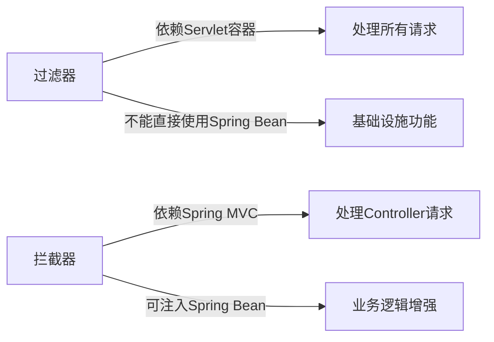
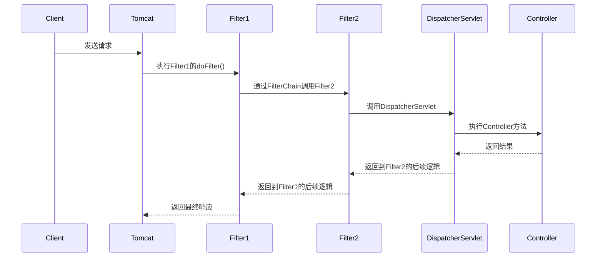
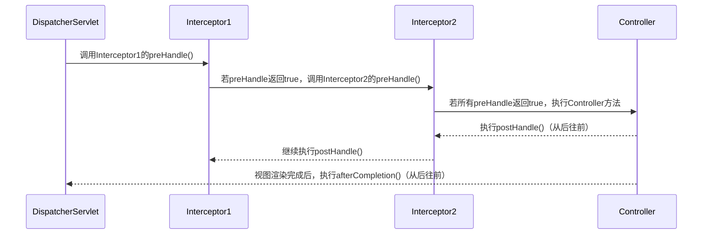

# 3. 拦截器与过滤器

***

# Java面试八股——SpringMVC拦截器与过滤器详解

***

## 1. 概述与定义

**拦截器（Interceptor）与过滤器（Filter）的核心定位**： &#x20;

- **过滤器**：基于Servlet规范，由Servlet容器（如Tomcat）管理，对**所有HTTP请求**生效，属于**基础设施层**。 &#x20;
- **拦截器**：基于Spring MVC框架，仅对**控制器（Controller）请求**生效，属于**业务层**。 &#x20;

**核心区别**： &#x20;




***

## 2. 主要特点

### 2.1 核心对比表

| **特性**​    | **过滤器（Filter）** ​                         | **拦截器（Interceptor）** ​                       |
| ---------- | ----------------------------------------- | -------------------------------------------- |
| **依赖**​    | 依赖Servlet容器（如Tomcat），与框架无关                | 依赖Spring MVC框架，需Spring支持                     |
| **作用范围**​  | 对\*\*所有请求\*\*生效（如静态资源、图片等）                | 仅对\*\*Spring MVC的Controller请求\*\*生效          |
| **执行顺序**​  | 先于拦截器执行（在Servlet容器层面）                     | 在DispatcherServlet处理请求时执行（在Spring MVC层面）     |
| **依赖注入**​  | \*\*不支持\*\*直接使用Spring Bean（需手动获取）         | \*\*支持\*\*通过\`@Autowired\`注入Spring Bean      |
| **生命周期**​  | 由Servlet容器管理，通过\`init()\`/\`destroy()\`控制 | 由Spring容器管理，通过Bean生命周期控制                     |
| **执行链顺序**​ | 按\`web.xml\`或注解配置的顺序执行                    | 按\`WebMvcConfigurer\`配置的顺序执行，可通过\`@Order\`调整 |

***

## 3. 应用目标

### 3.1 过滤器的应用场景

- **基础设施级功能**： &#x20;
  - 设置字符编码（如`CharacterEncodingFilter`）。 &#x20;
  - 跨域处理（CORS）。 &#x20;
  - 安全拦截（如IP白名单）。 &#x20;
  - 压缩响应（如`GzipFilter`）。 &#x20;

### 3.2 拦截器的应用场景

- **业务增强功能**： &#x20;
  - 权限校验（如检查登录状态）。 &#x20;
  - 日志记录（记录请求耗时、用户操作）。 &#x20;
  - 统一异常处理（拦截异常返回友好提示）。 &#x20;
  - 请求数据预处理（如自动填充用户信息到ThreadLocal）。 &#x20;

***

## 4. 主要内容及其组成部分

***

### 4.1 过滤器（Filter）详解

#### **4.1.1 核心接口**

- **`javax.servlet.Filter`**： &#x20;
  - **方法**： &#x20;
    | 方法名                                                        | 描述             |
    | ---------------------------------------------------------- | -------------- |
    | \`init(FilterConfig)\`                                     | 初始化方法，容器启动时调用。 |
    | \`doFilter(ServletRequest, ServletResponse, FilterChain)\` | 处理请求的核心逻辑。     |
    | \`destroy()\`                                              | 销毁方法，容器关闭时调用。  |

#### **4.1.2 配置方式**

1. **通过**\*\*`@WebFilter`\*\***注解**： &#x20;
   ```java 
   @WebFilter(urlPatterns = "/*", initParams = @InitParam(name = "encoding", value = "UTF-8"))
   public class EncodingFilter implements Filter {
       private String encoding;

       @Override
       public void init(FilterConfig config) throws ServletException {
           encoding = config.getInitParameter("encoding");
       }

       @Override
       public void doFilter(ServletRequest request, ServletResponse response, FilterChain chain)
               throws IOException, ServletException {
           request.setCharacterEncoding(encoding);
           response.setCharacterEncoding(encoding);
           chain.doFilter(request, response); // 放行请求
       }
   }
   ```

   - 需在Spring Boot中添加`@ServletComponentScan`扫描注解类。
2. **通过**\*\*`web.xml`\*\***配置**： &#x20;
   ```xml 
   <filter>
       <filter-name>EncodingFilter</filter-name>
       <filter-class>com.example.EncodingFilter</filter-class>
       <init-param>
           <param-name>encoding</param-name>
           <param-value>UTF-8</param-value>
       </init-param>
   </filter>
   <filter-mapping>
       <filter-name>EncodingFilter</filter-name>
       <url-pattern>/*</url-pattern>
   </filter-mapping>
   ```


***

#### **4.1.3 执行流程**




***

### 4.2 拦截器（Interceptor）详解

#### **4.2.1 核心接口**

- **`HandlerInterceptor`**： &#x20;
  - **方法**： &#x20;
    | 方法名                   | 描述                                           |
    | --------------------- | -------------------------------------------- |
    | \`preHandle()\`       | \*\*请求到达Controller前调用\*\*，返回\`false\`可中断请求。  |
    | \`postHandle()\`      | \*\*Controller方法执行后调用，但视图渲染前\*\*，可用于修改Model。 |
    | \`afterCompletion()\` | \*\*整个请求完成（视图渲染后）调用\*\*，适合资源清理或日志记录。         |

#### **4.2.2 配置方式**

1. **通过**\*\*`WebMvcConfigurer`\*\***实现**： &#x20;
   ```java 
   @Configuration
   public class WebConfig implements WebMvcConfigurer {
       @Override
       public void addInterceptors(InterceptorRegistry registry) {
           registry.addInterceptor(new LoginInterceptor())
                   .addPathPatterns("/**") // 拦截所有请求
                   .excludePathPatterns("/login", "/public/**"); // 排除路径
       }
   }
   ```

2. **自定义拦截器示例**： &#x20;
   ```java 
   public class LoginInterceptor implements HandlerInterceptor {
       @Autowired
       private UserService userService;

       @Override
       public boolean preHandle(HttpServletRequest request, 
                               HttpServletResponse response, 
                               Object handler) throws Exception {
           Object user = request.getSession().getAttribute("user");
           if (user == null) {
               response.sendRedirect("/login");
               return false;
           }
           return true;
       }
   }
   ```


***

#### **4.2.3 执行流程**




***

### 4.3 其他关键点

- **拦截器的执行顺序**： &#x20;
  - 通过`addInterceptor().addPathPatterns()`的添加顺序决定。 &#x20;
  - 可通过`@Order`或`Ordered`接口显式指定优先级（值越小优先级越高）。 &#x20;
- **过滤器的执行顺序**： &#x20;
  - 通过`web.xml`中声明的顺序决定，或`@WebFilter`的`urlPatterns`配置。 &#x20;

***

## 5. 原理剖析

### 5.1 请求处理流程对比

#### **5.1.1 关键阶段解析**

1. **过滤器阶段**： &#x20;
   - 在Servlet容器层面处理，如Tomcat先调用所有匹配的Filter。 &#x20;
   - 可修改请求/响应对象（如设置编码）。 &#x20;
2. **拦截器阶段**： &#x20;
   - 在Spring MVC框架内部，由DispatcherServlet触发。 &#x20;
   - 可依赖注入Spring Bean（如`@Autowired`）。 &#x20;

***

### 5.2 异常处理机制

- **拦截器的异常处理**： &#x20;
  - 若`preHandle`抛出异常，直接进入`afterCompletion`。 &#x20;
  - 若Controller抛出异常，需通过`@ExceptionHandler`或`HandlerExceptionResolver`处理。 &#x20;
- **过滤器的异常处理**： &#x20;
  - 若`doFilter`抛出异常，Servlet容器会直接返回500错误。 &#x20;

***

## 6. 应用与拓展

### 6.1 实际场景示例

#### **6.1.1 登录拦截器**

```java 
public class AuthInterceptor implements HandlerInterceptor {
    @Autowired
    private TokenService tokenService;

    @Override
    public boolean preHandle(HttpServletRequest request, 
                            HttpServletResponse response, 
                            Object handler) {
        String token = request.getHeader("Authorization");
        if (token == null || !tokenService.validate(token)) {
            response.setStatus(HttpServletResponse.SC_UNAUTHORIZED);
            return false;
        }
        return true;
    }
}
```


#### **6.1.2 日志过滤器**

```java 
@WebFilter("/*")
public class LoggingFilter implements Filter {
    @Override
    public void doFilter(ServletRequest request, 
                        ServletResponse response, 
                        FilterChain chain) throws IOException, ServletException {
        long startTime = System.currentTimeMillis();
        chain.doFilter(request, response);
        long endTime = System.currentTimeMillis();
        System.out.println("Request took " + (endTime - startTime) + "ms");
    }
}
```


***

### 6.2 高级用法

- **组合使用**： &#x20;
  - 过滤器设置编码（`CharacterEncodingFilter`）。 &#x20;
  - 拦截器实现权限校验。 &#x20;
- **全局异常处理**： &#x20;
  ```java 
  @ControllerAdvice
  public class GlobalExceptionHandler {
      @ExceptionHandler(AccessDeniedException.class)
      public ResponseEntity<String> handleAccessDenied() {
          return ResponseEntity.status(403).body("Forbidden");
      }
  }
  ```


***

## 7. 面试问答

### 问题1：拦截器和过滤器的核心区别？

**回答**： &#x20;

- **过滤器**： &#x20;
  - 依赖Servlet容器，对所有请求生效（如静态资源、图片）。 &#x20;
  - 不能直接使用Spring Bean，需通过`ServletConfig`获取。 &#x20;
  - 执行顺序在拦截器之前。 &#x20;
- **拦截器**： &#x20;
  - 依赖Spring MVC，仅对Controller请求生效。 &#x20;
  - 支持依赖注入（`@Autowired`），可直接使用Spring组件。 &#x20;
  - 适合业务逻辑增强（如权限校验）。 &#x20;

***

### 问题2：拦截器和过滤器的执行顺序？

**回答**： &#x20;

- **流程**： &#x20;
  1. 客户端请求 → **过滤器链**（Servlet容器层面）。 &#x20;
  2. 过滤器处理后 → **DispatcherServlet** → **拦截器链**（Spring MVC层面）。 &#x20;
  3. 拦截器通过后 → **Controller** → **拦截器的后置逻辑** → **过滤器的后置逻辑**。 &#x20;
- **示例**： &#x20;
  ```text 
  Filter1 → Filter2 → Interceptor1 → Interceptor2 → Controller → Interceptor2.postHandle → Interceptor1.postHandle → Filter2 → Filter1
  ```


***

### 问题3：如何实现一个登录拦截器？

**回答**： &#x20;

```java 
public class AuthInterceptor implements HandlerInterceptor {
    @Autowired
    private UserDetailsService userDetailsService;

    @Override
    public boolean preHandle(HttpServletRequest request, 
                            HttpServletResponse response, 
                            Object handler) {
        String token = request.getHeader("token");
        if (token == null || !userDetailsService.validateToken(token)) {
            response.sendError(401, "Unauthorized");
            return false;
        }
        return true;
    }
}
```


- **配置步骤**： &#x20;
  1. 实现`HandlerInterceptor`接口。 &#x20;
  2. 在`WebMvcConfigurer`中注册拦截器。 &#x20;
  3. 通过`addPathPatterns()`指定拦截路径。 &#x20;

***

### 问题4：为什么过滤器不能直接使用Spring Bean？

**回答**： &#x20;

- **根本原因**： &#x20;
  - 过滤器由Servlet容器（如Tomcat）实例化，而非Spring容器。 &#x20;
  - 因此无法自动注入Spring管理的Bean。 &#x20;
- **解决方案**： &#x20;
  - 通过`@Component`将过滤器声明为Spring Bean，并使用`@ServletComponentScan`扫描。 &#x20;
  - 或手动从Spring应用上下文中获取Bean： &#x20;
    ```java 
    WebApplicationContext context = WebApplicationContextUtils.getWebApplicationContext(servletContext);
    myBean = context.getBean(MyBean.class);
    ```


***

### 问题5：如何调整拦截器的执行顺序？

**回答**： &#x20;

- **方式1**：通过`addInterceptor()`的添加顺序。 &#x20;
  ```java 
  registry.addInterceptor(interceptor1); // 第一个执行
  registry.addInterceptor(interceptor2); // 第二个执行
  ```

- **方式2**：使用`@Order`注解或实现`Ordered`接口。 &#x20;
  ```java 
  @Order(1)
  public class FirstInterceptor implements HandlerInterceptor { /* ... */ }

  @Order(2)
  public class SecondInterceptor implements HandlerInterceptor { /* ... */ }
  ```


***

## 结语

本文系统梳理了SpringMVC拦截器与过滤器的核心概念、实现原理及实战场景，重点对比了两者的区别与协作关系。面试时需结合代码示例说明具体实现（如登录拦截器、日志过滤器），并强调它们在请求链路中的位置差异。建议通过`Mermaid`图辅助解释执行流程，以直观展示技术细节。
