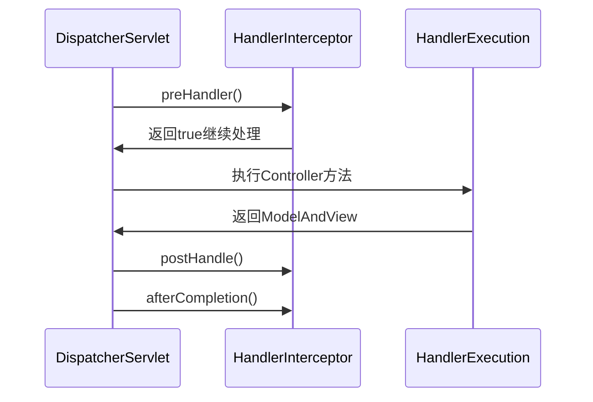
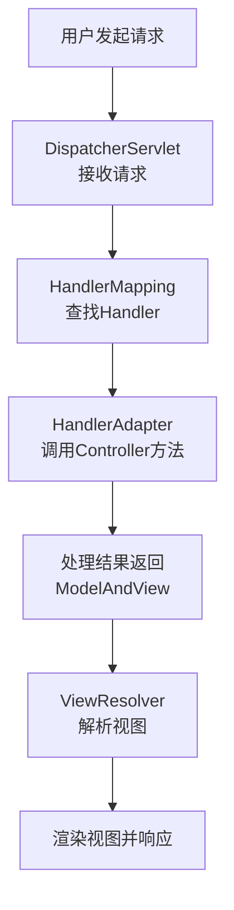
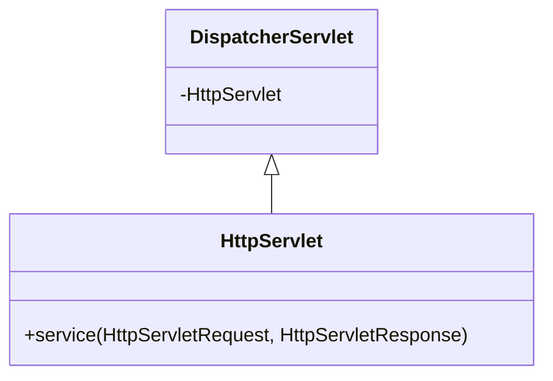

# 二. SpringMVC

***

# Java面试八股——SpringMVC框架详解

***

## 1. 概述与定义

**SpringMVC的核心概念**： &#x20;

SpringMVC是Spring框架的核心模块之一，基于**MVC（Model-View-Controller）设计模式**，用于构建**轻量级Web应用**。其核心思想是通过**前端控制器（DispatcherServlet）统一处理请求，将请求分发给对应的**Controller，并最终渲染视图（View）。

**MVC架构的三大组件**： &#x20;

| 组件              | 作用                     | 示例场景                  |
| --------------- | ---------------------- | --------------------- |
| **Model**​      | 业务逻辑层，负责数据处理和业务规则。     | 计算订单总价、查询用户信息。        |
| **View**​       | 用户界面层，负责展示数据。          | JSP、Thymeleaf、JSON响应。 |
| **Controller**​ | 控制层，接收请求并协调Model和View。 | 处理HTTP请求，返回视图或数据。     |

**核心特点**： &#x20;

- **基于注解**：通过`@Controller`、`@RequestMapping`等注解简化开发。 &#x20;
- **与Spring集成**：无缝整合Spring的DI（依赖注入）和AOP特性。 &#x20;
- **灵活路由**：支持RESTful风格、路径变量、请求方法绑定等。 &#x20;

***

## 2. 主要特点

### 2.1 SpringMVC的核心优势

| 特性             | 优势说明                                            | 示例代码                                |
| -------------- | ----------------------------------------------- | ----------------------------------- |
| **注解驱动开发**​    | 通过注解替代XML配置，开发效率高。                              | \`@Controller\`、\`@RequestMapping\` |
| **RESTful支持**​ | 原生支持REST风格，通过HTTP方法（GET/POST/PUT/DELETE）映射资源操作。 | \`@GetMapping("/users/{id}")\`      |
| **灵活的视图解析**​   | 自动匹配视图名称到JSP、Thymeleaf等模板。                      | \`InternalResourceViewResolver\`    |
| **数据绑定与验证**​   | 自动将请求参数绑定到Java对象，支持JSR-303验证。                   | \`@Valid @RequestBody User user\`   |
| **拦截器机制**​     | 通过\`HandlerInterceptor\`实现请求预处理或后置处理。           | 日志记录、权限校验。                          |

### 2.2 适用场景

| 场景               | 描述                          | 示例代码                         |
| ---------------- | --------------------------- | ---------------------------- |
| **Web应用开发**​     | 传统Web页面渲染（如电商系统）。           | \`@Controller\`返回JSP页面路径。    |
| **RESTful API**​ | 提供数据接口供移动端或前端调用。            | \`@RestController\`返回JSON数据。 |
| **单页应用（SPA）** ​  | 与Vue/React等前端框架配合，后端仅提供API。 | \`@CrossOrigin\`支持跨域请求。      |

***

## 3. 应用目标

1. **简化Web开发**： &#x20;
   - 通过注解和约定优于配置（如`@RequestMapping`），减少XML配置。 &#x20;
2. **分离关注点**： &#x20;
   - 将请求处理、业务逻辑、视图渲染分层，提升代码可维护性。 &#x20;
3. **支持多种视图技术**： &#x20;
   - 自动适配JSP、Thymeleaf、JSON等输出格式。 &#x20;
4. **提升安全性**： &#x20;
   - 结合Spring Security实现权限控制（如`@PreAuthorize`）。 &#x20;

***

## 4. 主要内容及其组成部分

### 4.1 核心组件

#### **4.1.1 前端控制器（DispatcherServlet）**

- **作用**： &#x20;

  统一处理所有请求，是SpringMVC的入口。 &#x20;
- **配置示例**（XML方式）： &#x20;
  ```xml 
  <servlet>
      <servlet-name>dispatcherServlet</servlet-name>
      <servlet-class>org.springframework.web.servlet.DispatcherServlet</servlet-class>
      <init-param>
          <param-name>contextConfigLocation</param-name>
          <param-value>/WEB-INF/spring-mvc.xml</param-value>
      </init-param>
  </servlet>
  ```


#### **4.1.2 处理器映射器（HandlerMapping）**

- **作用**： &#x20;

  根据请求URL找到对应的**Controller方法**。 &#x20;
- **常见实现**： &#x20;
  | 类型                               | 描述                                                     | 示例代码                             |
  | -------------------------------- | ------------------------------------------------------ | -------------------------------- |
  | \`RequestMappingHandlerMapping\` | 基于\`@RequestMapping\`注解匹配控制器方法。                        | \`@GetMapping("/users")\`        |
  | \`BeanNameUrlHandlerMapping\`    | 通过Bean名称匹配URL路径（如Bean名为\`userController\`对应\`/user\`）。 | \`@Component("userController")\` |

#### **4.1.3 处理器适配器（HandlerAdapter）**

- **作用**： &#x20;

  调用匹配到的Controller方法，并将请求参数绑定到方法参数。 &#x20;
- **示例**： &#x20;
  ```java 
  @Controller
  public class UserController {
      @GetMapping("/users/{id}")
      public String getUser(@PathVariable Long id, Model model) {
          User user = userService.findById(id);
          model.addAttribute("user", user);
          return "userDetail"; // 视图名称
      }
  }
  ```


#### **4.1.4 视图解析器（ViewResolver）**

- **作用**： &#x20;

  将逻辑视图名称（如`userDetail`）解析为实际的视图资源（如`/WEB-INF/views/userDetail.jsp`）。 &#x20;
- **配置示例**： &#x20;
  ```java 
  @Bean
  public InternalResourceViewResolver viewResolver() {
      InternalResourceViewResolver resolver = new InternalResourceViewResolver();
      resolver.setPrefix("/WEB-INF/views/"); // 前缀
      resolver.setSuffix(".jsp"); // 后缀
      return resolver;
  }
  ```


***

### 4.2 核心注解详解

#### \*\*4.2.1 \*\***`@Controller`**

- **作用**： &#x20;

  标记一个类为控制器，处理请求。 &#x20;
- **示例**： &#x20;
  ```java 
  @Controller
  @RequestMapping("/users") // 基础路径
  public class UserController {
      // 方法定义
  }
  ```


#### \*\*4.2.2 \*\***`@RequestMapping`**

- **作用**： &#x20;

  定义请求路径与方法的映射。 &#x20;
- **常用属性**： &#x20;
  | 属性          | 说明                                                 | 示例代码                                      |
  | ----------- | -------------------------------------------------- | ----------------------------------------- |
  | \`value\`   | 请求路径（可与\`path\`互换）。                                | \`@RequestMapping("/create")\`            |
  | \`method\`  | 指定HTTP方法（如\`RequestMethod.GET\`）。                  | \`method = RequestMethod.POST\`           |
  | \`params\`  | 根据请求参数过滤（如\`params = "active=true"\`）。             | \`@RequestMapping(params = "sort=name")\` |
  | \`headers\` | 根据请求头过滤（如\`headers = "Accept=application/json"\`）。 |                                           |

#### \*\*4.2.3 \*\***`@PathVariable`**

- **作用**： &#x20;

  绑定URL路径中的变量到方法参数。 &#x20;
- **示例**： &#x20;
  ```java 
  @GetMapping("/{id}")
  public String showUser(@PathVariable("id") Long userId) { ... }
  ```


#### \*\*4.2.4 \*\***`@RequestParam`**

- **作用**： &#x20;

  绑定查询参数或表单字段到方法参数。 &#x20;
- **示例**： &#x20;
  ```java 
  @GetMapping("/search")
  public String search(@RequestParam String keyword, @RequestParam(required = false) Integer page) { ... }
  ```


#### \*\*4.2.5 \*\***`@RestController`**

- **作用**： &#x20;

  等同于`@Controller` + `@ResponseBody`，直接返回数据而非视图名称。 &#x20;
- **示例**： &#x20;
  ```java 
  @RestController
  public class UserController {
      @GetMapping("/api/users")
      public List<User> getUsers() { ... }
  }
  ```


***

### 4.3 RESTful风格实现

#### **4.3.1 核心注解**

| 注解                 | 对应HTTP方法 | 路径示例            | 示例代码                              |
| ------------------ | -------- | --------------- | --------------------------------- |
| \`@GetMapping\`    | GET      | \`/users\`      | \`@GetMapping("/users/{id}")\`    |
| \`@PostMapping\`   | POST     | \`/users\`      | \`@PostMapping("/users")\`        |
| \`@PutMapping\`    | PUT      | \`/users/{id}\` | \`@PutMapping("/users/{id}")\`    |
| \`@DeleteMapping\` | DELETE   | \`/users/{id}\` | \`@DeleteMapping("/users/{id}")\` |

#### **4.3.2 示例代码**

```java 
@RestController
@RequestMapping("/api/users")
public class UserController {
    @GetMapping
    public List<User> getAllUsers() { ... }

    @PostMapping
    public User createUser(@RequestBody User user) { ... }

    @PutMapping("/{id}")
    public User updateUser(@PathVariable Long id, @RequestBody User user) { ... }

    @DeleteMapping("/{id}")
    public void deleteUser(@PathVariable Long id) { ... }
}
```


***

### 4.4 异常处理

#### \*\*4.4.1`@ControllerAdvice`\*\***全局异常处理**

- **作用**： &#x20;

  统一处理Controller层的异常。 &#x20;
- **示例**： &#x20;
  ```java 
  @ControllerAdvice
  public class GlobalExceptionHandler {
      @ExceptionHandler(value = {UserNotFoundException.class})
      public ResponseEntity<String> handleUserNotFound(UserNotFoundException ex) {
          return ResponseEntity.status(HttpStatus.NOT_FOUND).body(ex.getMessage());
      }
  }
  ```


#### \*\*4.4.2 \*\***`@ResponseStatus`**

- **作用**： &#x20;

  直接指定异常对应的HTTP状态码。 &#x20;
- **示例**： &#x20;
  ```java 
  @ResponseStatus(code = HttpStatus.BAD_REQUEST, reason = "Invalid input")
  public class InvalidInputException extends RuntimeException {}
  ```


***

### 4.5 拦截器（Interceptor）

#### **4.5.1 实现流程**




#### **4.5.2 示例代码**

```java 
public class LoggingInterceptor implements HandlerInterceptor {
    @Override
    public boolean preHandle(HttpServletRequest request, HttpServletResponse response, Object handler) {
        System.out.println("Before request: " + request.getRequestURI());
        return true;
    }

    @Override
    public void postHandle(HttpServletRequest request, HttpServletResponse response, Object handler, ModelAndView modelAndView) {
        System.out.println("After processing request");
    }
}
```


***

## 5. 原理剖析

### 5.1 SpringMVC请求处理流程

#### **5.1.1 核心步骤**




#### **5.1.2 详细流程**

1. **请求到达DispatcherServlet**： &#x20;
   - 由`web.xml`配置的Servlet拦截所有请求。 &#x20;
2. **查找Handler**： &#x20;
   - `HandlerMapping`根据URL找到对应的Controller方法。 &#x20;
3. **适配Handler**： &#x20;
   - `HandlerAdapter`将请求参数绑定到方法参数，并调用方法。 &#x20;
4. **处理结果**： &#x20;
   - Controller返回`ModelAndView`对象（视图名称和数据）。 &#x20;
5. **视图解析**： &#x20;
   - `ViewResolver`将逻辑视图名解析为具体视图资源。 &#x20;
6. **渲染响应**： &#x20;
   - 视图（如JSP）填充数据后返回给客户端。

***

### 5.2 与Servlet的关系

#### **5.2.1 核心区别**

| 对比项       | SpringMVC         | Servlet                   |
| --------- | ----------------- | ------------------------- |
| **开发模式**​ | 注解驱动，无需继承或实现接口。   | 需继承\`HttpServlet\`类。      |
| **配置方式**​ | 通过注解或少量XML配置。     | 通过\`web.xml\`配置Servlet映射。 |
| **功能扩展**​ | 支持拦截器、异常处理、数据绑定等。 | 功能有限，需手动处理。               |

#### **5.2.2 嵌套关系**




***

## 6. 应用与拓展

### 6.1 典型场景解决方案

#### **6.1.1 文件上传**

- **配置**： &#x20;
  ```java 
  @Configuration
  public class WebConfig implements WebMvcConfigurer {
      @Bean
      public MultipartResolver multipartResolver() {
          return new CommonsMultipartResolver();
      }
  }
  ```

- **Controller**： &#x20;
  ```java 
  @PostMapping("/upload")
  public String handleFileUpload(@RequestParam("file") MultipartFile file) { ... }
  ```


#### **6.2 国际化支持**

- **配置资源文件**： &#x20;

  `messages_zh_CN.properties`: `greeting=你好` &#x20;

  `messages_en_US.properties`: `greeting=Hello` &#x20;
- **启用国际化**： &#x20;
  ```java 
  @Configuration
  public class I18nConfig {
      @Bean
      public MessageSource messageSource() {
          ReloadableResourceBundleMessageSource source = new ReloadableResourceBundleMessageSource();
          source.setBasename("classpath:messages");
          source.setDefaultEncoding("UTF-8");
          return source;
      }
  }
  ```


***

### 6.2 性能优化建议

1. **启用缓存**： &#x20;
   - 使用`@Cacheable`缓存频繁查询结果。 &#x20;
2. **静态资源优化**： &#x20;
   - 配置静态资源映射（如CSS/JS文件）。 &#x20;
   ```java 
   @Configuration
   public class WebConfig implements WebMvcConfigurer {
       @Override
       public void addResourceHandlers(ResourceHandlerRegistry registry) {
           registry.addResourceHandler("/static/**").addResourceLocations("/static/");
       }
   }
   ```

3. **异步请求处理**： &#x20;
   - 使用`@Async`注解实现异步方法。 &#x20;

***

## 7. 面试问答

### 问题1：SpringMVC与Struts2的核心区别？

**回答**： &#x20;

1. **设计模式**： &#x20;
   - SpringMVC基于**前端控制器模式**，由DispatcherServlet统一处理请求。 &#x20;
   - Struts2基于**Action链模式**，每个Action需继承特定基类。 &#x20;
2. **依赖注入**： &#x20;
   - SpringMVC天然集成Spring的DI，可通过`@Autowired`注入Bean。 &#x20;
   - Struts2需通过插件或手动配置实现依赖注入。 &#x20;
3. **注解支持**： &#x20;
   - SpringMVC原生支持RESTful注解（如`@GetMapping`）。 &#x20;
   - Struts2需通过插件或自定义拦截器实现类似功能。 &#x20;

***

### 问题2：`@RequestBody`和`@ResponseBody`的区别？

**回答**： &#x20;

| 注解                | 作用                                               | 示例代码                                            |
| ----------------- | ------------------------------------------------ | ----------------------------------------------- |
| \`@RequestBody\`  | 将HTTP请求体（如JSON/XML）反序列化为Java对象。                  | \`public void save(@RequestBody User user)\`    |
| \`@ResponseBody\` | 将Java对象序列化为响应体（如JSON），常与\`@RestController\`配合使用。 | \`@ResponseBody public User getUser() { ... }\` |

***

### 问题3：如何解决Controller方法无法被调用的问题？

**回答**： &#x20;

常见原因及解决方案： &#x20;

1. **未添加**\*\*`@Controller`****或****`@RestController`\*\***注解**： &#x20;
   - 确保类上有控制器注解。 &#x20;
2. **请求路径不匹配**： &#x20;
   - 检查`@RequestMapping`的路径是否与URL一致。 &#x20;
3. **未配置组件扫描**： &#x20;
   - 在配置类上添加`@ComponentScan`扫描Controller包。 &#x20;
4. **请求方法不匹配**： &#x20;
   - 如使用`GET`请求但方法标注为`@PostMapping`。 &#x20;

***

### 问题4：`@ModelAttribute`的作用？

**回答**： &#x20;

1. **方法级标注**： &#x20;
   - 在Controller方法前添加，用于在调用目标方法前填充模型数据。 &#x20;
   ```java 
   @ModelAttribute("user")
   public User getUser() { return new User(); }
   ```

2. **参数级标注**： &#x20;
   - 将请求参数自动绑定到POJO对象。 &#x20;
   ```java 
   public String saveUser(@ModelAttribute User user) { ... }
   ```


***

### 问题5：SpringMVC如何实现RESTful风格？

**回答**： &#x20;

1. **使用HTTP方法注解**： &#x20;
   - `@GetMapping`、`@PostMapping`等对应HTTP方法。 &#x20;
2. **路径变量绑定**： &#x20;
   - 通过`@PathVariable`接收路径参数。 &#x20;
3. **返回数据格式**： &#x20;
   - 使用`@RestController`直接返回对象，由Jackson自动序列化为JSON。 &#x20;
4. **统一配置**： &#x20;
   - 启用`@EnableWebMvc`并配置消息转换器（如`MappingJackson2HttpMessageConverter`）。 &#x20;

***

## 结语

本文系统梳理了SpringMVC的核心概念、配置方法、实现原理及常见问题解决方案。在面试中，需结合具体场景（如RESTful API设计、异常处理）说明注解的使用和组件的协作，并通过流程图和代码示例辅助解释，以体现对框架的深入理解。

[0. MVC](<0. MVC/0. MVC.md> "0. MVC")

[1. 核心组件](<1. 核心组件/1. 核心组件.md> "1. 核心组件")

[2. 核心注解](<2. 核心注解/2. 核心注解.md> "2. 核心注解")

[3. 拦截器与过滤器](<3. 拦截器与过滤器/3. 拦截器与过滤器.md> "3. 拦截器与过滤器")
