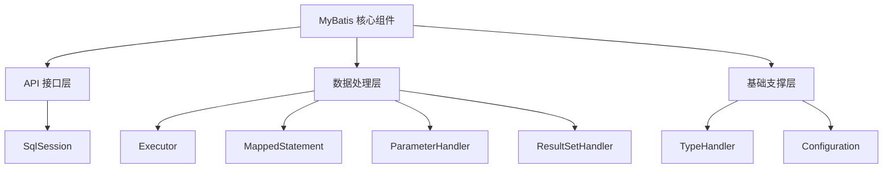
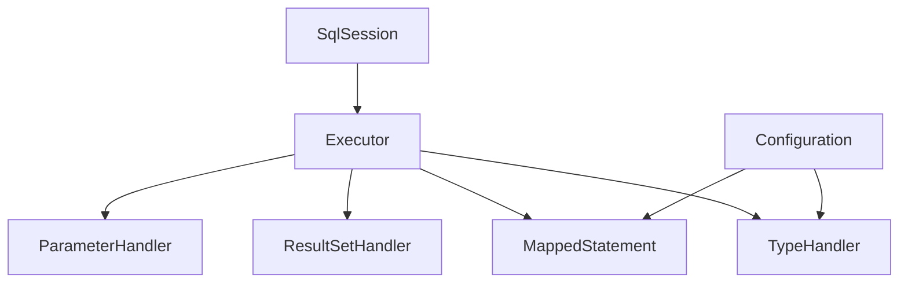
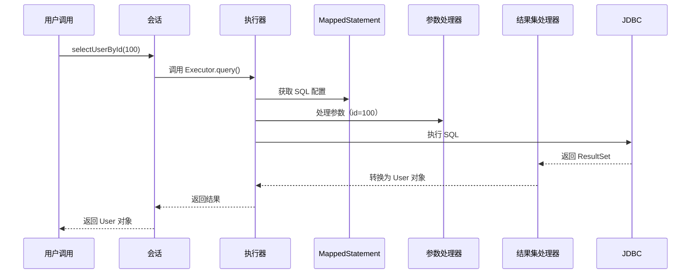
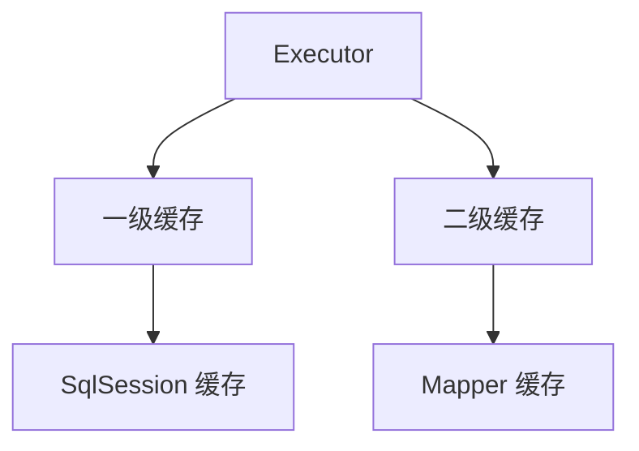

# 0. 核心组件

***

# Java面试八股——MyBatis 核心组件 核心知识点详解

***

## 1. 概述与定义

**MyBatis 核心组件**是 MyBatis 框架实现数据库操作的核心功能模块，它们共同协作完成 SQL 映射、参数处理、结果集转换和数据库交互等任务。核心组件遵循 **分层架构设计**，分为 **API 接口层**、**数据处理层** 和 **基础支撑层**，如下图所示： &#x20;




***

## 2. 主要特点

### 2.1 核心组件特性对比表

| **组件**​               | **作用**​                       | **关键特性**​                         |
| --------------------- | ----------------------------- | --------------------------------- |
| **SqlSession**​       | 会话接口，提供数据库操作入口。               | 门面模式，封装 Executor、Transaction 等组件。 |
| **Executor**​         | SQL 执行器，负责 SQL 执行和缓存管理。       | 支持 Simple、Reuse、Batch 三种实现，可扩展。   |
| **MappedStatement**​  | SQL 语句的封装对象。                  | 存储 SQL、参数映射、结果映射等元数据。             |
| **ParameterHandler**​ | 参数处理器，负责将 Java 对象转换为 JDBC 参数。 | 支持 OGNL 表达式和类型转换。                 |
| **ResultSetHandler**​ | 结果集处理器，将 JDBC 结果集转换为 Java 对象。 | 支持多结果映射和延迟加载。                     |

***

## 3. 应用目标

### 3.1 核心组件应用场景

| **组件**​                | **典型场景**​               | **示例**​                                  |
| ---------------------- | ----------------------- | ---------------------------------------- |
| **SqlSessionFactory**​ | 创建会话对象，初始化配置。           | 根据 XML 或注解构建 Configuration 对象。           |
| **Executor**​          | 执行批量操作或事务性操作。           | 使用 BatchExecutor 批量插入数据。                 |
| **TypeHandler**​       | 处理 Java 类型与 JDBC 类型的转换。 | 自定义 Date 类型与字符串的双向转换。                    |
| **ResultSetHandler**​  | 处理复杂结果映射（如嵌套对象）。        | 将用户-订单关联查询结果映射为 User 对象和 List\\\<Order>。 |

***

## 4. 主要内容及其组成部分

***

### 4.1 核心组件详解

#### **4.1.1 SqlSession**

- **作用**：MyBatis 的 **门面接口**，提供数据库操作入口。 &#x20;
- **关键方法**： &#x20;
  ```java 
  public interface SqlSession {
      <T> T selectOne(String statement, Object parameter); // 单条查询
      void commit(); // 提交事务
      void close(); // 关闭会话
  }
  ```

- **生命周期**：单线程使用，不可跨会话共享。 &#x20;

#### **4.1.2 Executor**

- **作用**：SQL 执行的核心组件，支持 **三种实现类型**： &#x20;
  | 类型             | 适用场景                                 |
  | -------------- | ------------------------------------ |
  | SimpleExecutor | 每次执行 SQL 都创建新的 Statement，适合短连接操作。    |
  | ReuseExecutor  | 重用 Statement 对象，减少资源开销，适合频繁执行相同 SQL。 |
  | BatchExecutor  | 批量执行 SQL，适用于批量插入或更新操作。               |

#### **4.1.3 MappedStatement**

- **作用**：封装 SQL 的元数据，包括： &#x20;
  - SQL 语句（`sqlSource`）。 &#x20;
  - 参数映射（`parameterMap`）。 &#x20;
  - 结果映射（`resultMap`）。 &#x20;
- **配置示例**： &#x20;
  ```xml 
  <select id="selectUserById" resultType="User">
      SELECT * FROM user WHERE id = #{id}
  </select>
  ```

  对应生成的 `MappedStatement` 包含： &#x20;
  - `id = "selectUserById"`。 &#x20;
  - `sql = "SELECT * FROM user WHERE id = ?"`。 &#x20;

#### **4.1.4 ParameterHandler**

- **作用**：将 Java 参数对象转换为 JDBC 参数。 &#x20;
- **工作流程图**： &#x20;
  ```mermaid 
  sequenceDiagram
      participant ParameterHandler
      participant Statement
      ParameterHandler->>Statement: 设置参数值（如 setInt(1, 100)）
  ```


#### **4.1.5 ResultSetHandler**

- **作用**：将 JDBC 的 `ResultSet` 转换为 Java 对象。 &#x20;
- **示例代码**： &#x20;
  ```java 
  List<User> users = resultSetHandler.handleResultSets(statement);
  ```


#### **4.1.6 TypeHandler**

- **作用**：处理 Java 类型与 JDBC 类型的转换。 &#x20;
- **内置类型**： &#x20;
  | Java 类型        | JDBC 类型   |
  | -------------- | --------- |
  | String         | VARCHAR   |
  | java.util.Date | TIMESTAMP |
- **自定义示例**： &#x20;
  ```java 
  public class CustomDateHandler extends BaseTypeHandler<Date> {
      @Override
      public void setNonNullParameter(PreparedStatement ps, int i, Date parameter, JdbcType jdbcType) 
          throws SQLException {
          ps.setString(i, DateUtil.format(parameter));
      }
      // 其他方法实现...
  }
  ```


***

### 4.2 组件协作关系图




***

## 5. 原理剖析

### 5.1 执行流程解析

#### **5.1.1 SQL 执行时序图**




#### **5.1.2 关键步骤详解**

1. **SqlSession 接口调用**：用户通过 `selectOne("selectUserById", 100)` 触发请求。 &#x20;
2. **Executor 执行**：根据配置选择合适的 Executor（如 SimpleExecutor）。 &#x20;
3. **参数处理**：ParameterHandler 将参数 `100` 转换为 JDBC 的 `setInt(1, 100)`。 &#x20;
4. **SQL 执行**：通过 JDBC 执行 `SELECT * FROM user WHERE id = ?`。 &#x20;
5. **结果映射**：ResultSetHandler 根据 `resultMap` 将结果集转换为 User 对象。 &#x20;

***

### 5.2 Executor 的缓存机制

#### **5.2.1 缓存层级关系图**




#### **5.2.2 缓存失效条件**

| **场景**​           | **描述**​                           |
| ----------------- | --------------------------------- |
| **跨 Session 查询**​ | 不同 SqlSession 的一级缓存独立。            |
| **SQL 语句变化**​     | 查询条件或 SQL 语法不同，缓存不命中。             |
| **修改操作**​         | \`update\`、\`delete\` 等操作会清空关联缓存。 |

***

## 6. 应用与拓展

### 6.1 自定义组件示例

#### **6.1.1 自定义 TypeHandler**

```java 
@MappedTypes({Date.class})
public class CustomDateTypeHandler extends BaseTypeHandler<Date> {
    @Override
    public void setNonNullParameter(PreparedStatement ps, int i, Date parameter, JdbcType jdbcType) 
        throws SQLException {
        ps.setString(i, DateUtil.format(parameter, "yyyy-MM-dd"));
    }

    @Override
    public Date getNullableResult(ResultSet rs, String columnName) 
        throws SQLException {
        String dateStr = rs.getString(columnName);
        return DateUtil.parse(dateStr, "yyyy-MM-dd");
    }
}
```


#### **6.1.2 自定义 Executor**

```java 
public class MyBatchExecutor extends BaseExecutor {
    public MyBatchExecutor(SqlTransactionTemplate transactionTemplate, 
                          MappedStatement mappedStatement) {
        super(transactionTemplate, mappedStatement);
    }

    @Override
    public int doUpdate(MappedStatement ms, Object parameter) {
        // 自定义批量更新逻辑
        return super.doUpdate(ms, parameter);
    }
}
```


***

### 6.2 与 Spring 集成

#### **6.2.1 Spring 配置示例**

```xml 
<!-- Spring 配置文件 -->
<bean id="sqlSessionFactory" class="org.mybatis.spring.SqlSessionFactoryBean">
    <property name="dataSource" ref="dataSource"/>
</bean>

<bean class="org.mybatis.spring.mapper.MapperScannerConfigurer">
    <property name="basePackage" value="com.example.mapper"/>
</bean>
```


***

## 7. 面试问答

### 问题1：MyBatis 的核心组件有哪些？

**回答**： &#x20;

MyBatis 的核心组件包括： &#x20;

1. **SqlSession**：门面接口，提供数据库操作入口。 &#x20;
2. **Executor**：SQL 执行器，负责 SQL 执行和缓存管理。 &#x20;
3. **MappedStatement**：封装 SQL 元数据（如 SQL 语句、参数映射）。 &#x20;
4. **ParameterHandler**：处理参数到 JDBC 的转换。 &#x20;
5. **ResultSetHandler**：处理结果集到 Java 对象的转换。 &#x20;
6. **TypeHandler**：类型转换器，处理 Java 类型与 JDBC 类型的映射。 &#x20;
7. **Configuration**：全局配置对象，存储框架配置信息。 &#x20;

***

### 问题2：解释 Executor 的三种实现类型？

**回答**： &#x20;

Executor 的三种实现类型及其特点： &#x20;

1. **SimpleExecutor**： &#x20;
   - **特点**：每次执行 SQL 都创建新的 Statement 对象。 &#x20;
   - **适用场景**：短连接操作，如单条查询或插入。 &#x20;
2. **ReuseExecutor**： &#x20;
   - **特点**：重用已创建的 Statement 对象，减少资源开销。 &#x20;
   - **适用场景**：频繁执行相同 SQL 的场景。 &#x20;
3. **BatchExecutor**： &#x20;
   - **特点**：批量执行 SQL，减少与数据库的通信次数。 &#x20;
   - **适用场景**：批量插入、更新或删除操作。 &#x20;

***

### 问题3：MappedStatement 的作用是什么？

**回答**： &#x20;

`MappedStatement` 是 MyBatis 中最重要的元数据对象，主要作用包括： &#x20;

1. **存储 SQL 信息**：如 SQL 语句、参数映射、结果映射等。 &#x20;
2. **唯一标识**：通过 `id`（如 `com.example.mapper.UserMapper.selectUserById`）定位 SQL。 &#x20;
3. **配置扩展**：支持超时设置、缓存配置等。 &#x20;

- **示例**： &#x20;
  ```java 
  MappedStatement ms = configuration.getMappedStatement("selectUserById");
  String sql = ms.getBoundSql().getSql(); // 获取最终 SQL
  ```


***

### 问题4：如何自定义 TypeHandler？

**回答**： &#x20;

自定义 `TypeHandler` 步骤如下： &#x20;

1. **实现接口**：继承 `BaseTypeHandler<T>` 或实现 `TypeHandler<T>`。 &#x20;
2. **重写方法**： &#x20;
   - `setNonNullParameter`：设置 JDBC 参数值。 &#x20;
   - `getNullableResult`：从结果集获取值并转换为 Java 对象。 &#x20;
3. **注册处理器**： &#x20;
   ```xml 
   <!-- 在 mybatis-config.xml 中注册 -->
   <typeHandlers>
       <typeHandler handler="com.example.CustomDateHandler"/>
   </typeHandlers>
   ```

4. **使用**：在 Mapper 中直接使用，无需额外配置。 &#x20;

***

### 问题5：SqlSession 的生命周期如何管理？

**回答**： &#x20;

SqlSession 的管理需注意以下几点： &#x20;

1. **单线程使用**：每个线程应独立创建和关闭 `SqlSession`。 &#x20;
2. **及时关闭**：在 finally 块中关闭，避免资源泄漏： &#x20;
   ```java 
   try (SqlSession session = sqlSessionFactory.openSession()) {
       User user = session.selectOne("selectUserById", 100);
   }
   ```

3. **避免跨会话共享**：不同 `SqlSession` 的一级缓存独立，跨会话需使用二级缓存。 &#x20;

***

## 结语

MyBatis 核心组件是框架高效运作的关键，面试中需深入理解 **组件协作流程、配置方式和扩展方法**。通过结合示例代码、流程图和对比表格，能够清晰展现对框架底层原理的掌握。重点需关注 **Executor 的执行策略、参数与结果集处理机制**，以及在分布式场景下的组件协作优化。
