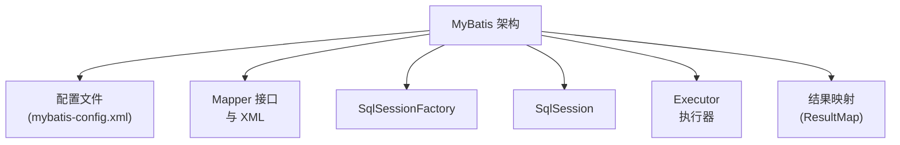
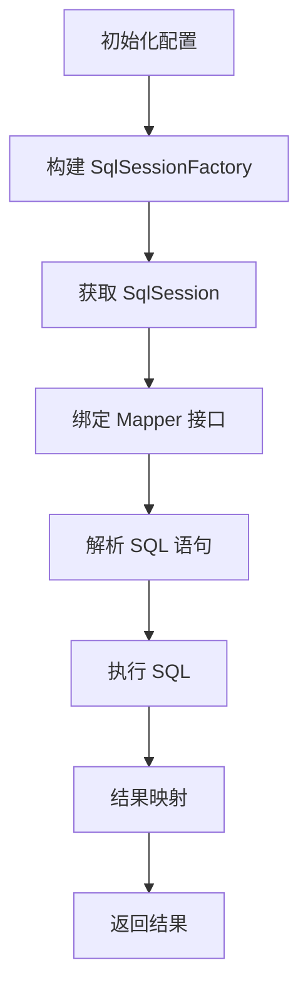
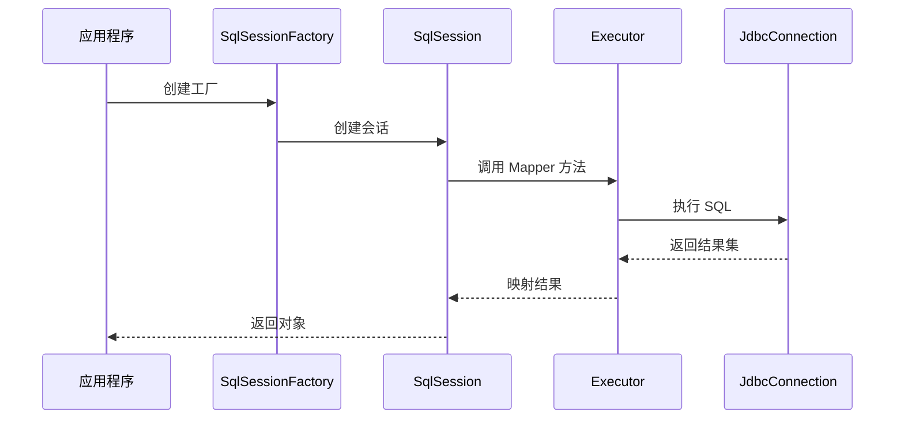

# 1. 执行流程

***

# Java面试八股——MyBatis 执行流程 核心知识点详解

***

## 1. 概述与定义

**MyBatis** 是一个基于 **Java 的持久层框架**，通过 **XML 或注解** 将 SQL 语句与 Java 方法映射，简化了 **JDBC 的繁琐操作**，提供了对 SQL 的灵活控制。其核心作用是： &#x20;

- **解耦 SQL 与业务代码**：将 SQL 语句从 Java 代码中剥离，集中管理。 &#x20;
- **自动映射**：将数据库结果集自动映射为 Java 对象。 &#x20;
- **动态 SQL**：支持根据条件动态拼接 SQL。 &#x20;

### 1.1 核心架构图




***

## 2. 主要特点

### 2.1 核心优势对比表

| **特性**​         | **描述**​                                                | **示例**​                                                                        |
| --------------- | ------------------------------------------------------ | ------------------------------------------------------------------------------ |
| **解耦 SQL 与代码**​ | SQL 写在 XML 或注解中，避免硬编码。                                 | \`\<select id="selectUser" resultType="User"> SELECT \* FROM user \</select>\` |
| **动态 SQL**​     | 支持 \`\<if>\`、\`\<choose>\`、\`\<foreach>\` 等标签动态拼接 SQL。 | \`xml\n\<if test="name != null"> AND name = #{name} \</if>\n\`                 |
| **自动映射**​       | 根据字段名自动将结果集映射到 POJO（Plain Old Java Object）。            | \`User user = session.selectOne("selectUser", 1);\`                            |
| **轻量级**​        | 无需复杂配置，依赖少，与 Spring 等框架无缝集成。                           | \`mybatis-core-3.5.9.jar\` 即可运行。                                               |

***

## 3. 应用目标

### 3.1 典型场景

| **场景**​      | **描述**​                                        | **示例**​                                                     |
| ------------ | ---------------------------------------------- | ----------------------------------------------------------- |
| **替代 JDBC**​ | 简化数据库操作，无需手动处理 Connection、Statement、ResultSet。 | 用 \`\<insert>\` 标签替代 \`preparedStatement.executeUpdate()\`。 |
| **复杂查询**​    | 处理多表关联、动态条件、分页等复杂 SQL。                         | 使用 \`\<resultMap>\` 处理一对多关联。                                |
| **数据库无关性**​  | 通过方言（Dialect）适配不同数据库的 SQL 语法差异。                | MySQL 支持 \`LIMIT\`，Oracle 支持 \`ROWNUM\`。                    |

***

## 4. 主要内容及其组成部分

***

### 4.1 核心组件详解

#### **4.1.1 配置文件 (mybatis-config.xml)**

```xml 
<?xml version="1.0" encoding="UTF-8" ?>
<!DOCTYPE configuration
  PUBLIC "-//mybatis.org//DTD Config 3.0//EN"
  "http://mybatis.org/dtd/mybatis-3-config.dtd">
<configuration>
    <environments default="development">
        <environment id="development">
            <transactionManager type="JDBC"/>
            <dataSource type="POOLED">
                <property name="driver" value="com.mysql.cj.jdbc.Driver"/>
                <property name="url" value="jdbc:mysql://localhost:3306/test"/>
                <property name="username" value="root"/>
                <property name="password" value="123456"/>
            </dataSource>
        </environment>
    </environments>
    <mappers>
        <mapper resource="mapper/UserMapper.xml"/>
    </mappers>
</configuration>
```


#### **4.1.2 核心对象关系**

| **对象**​                | **作用**​                             | **生命周期**​                     |
| ---------------------- | ----------------------------------- | ----------------------------- |
| **SqlSessionFactory**​ | 工厂类，用于创建 \`SqlSession\`。            | 单例，应用启动时初始化。                  |
| **SqlSession**​        | 提供数据库操作接口（\`select\`、\`insert\` 等）。 | 线程不安全，方法调用后关闭。                |
| **Executor**​          | 抽象执行器，负责 SQL 执行与结果映射。               | 根据配置选择 Simple/Reuse/Batch 类型。 |

#### **4.1.3 Mapper 接口与 XML**

```java 
// Mapper 接口
public interface UserMapper {
    User selectById(int id);
}

// 对应的 XML 配置
<mapper namespace="com.example.mapper.UserMapper">
    <select id="selectById" resultType="User">
        SELECT * FROM user WHERE id = #{id}
    </select>
</mapper>
```


***

### 4.2 执行流程关键步骤

#### **4.2.1 详细步骤流程图**




***

### 4.3 动态 SQL 机制

#### **4.3.1 动态 SQL 标签示例**

```xml 
<select id="findActiveBlog" resultType="Blog">
    SELECT * FROM blog 
    WHERE state = 'ACTIVE'
    <if test="author != null">
        AND author = #{author}
    </if>
    <if test="title != null">
        AND title = #{title}
    </if>
</select>
```


#### **4.3.2 核心标签功能**

| **标签**​                            | **作用**​                                 |
| ---------------------------------- | --------------------------------------- |
| \`\<if>\`                          | 条件判断。                                   |
| \`\<choose>/\<when>/\<otherwise>\` | 多条件分支。                                  |
| \`\<foreach>\`                     | 遍历集合（如 IN 查询）。                          |
| \`\<trim>\`                        | 移除多余的 SQL 关键字（如 \`WHERE 1=1 AND ...\`）。 |

***

### 4.4 缓存机制

#### **4.4.1 两级缓存结构**

| **类型**​   | **作用域**​                                     | **默认开启**​ |
| --------- | -------------------------------------------- | --------- |
| **一级缓存**​ | \`SqlSession\` 级别，自动开启。                      | 是         |
| **二级缓存**​ | \`Mapper\` 级别，需在 \`mapper\` 标签中配置 \`cache\`。 | 否         |

```xml 
<!-- 开启二级缓存 -->
<mapper namespace="com.example.mapper.UserMapper">
    <cache/>
</mapper>
```


***

## 5. 原理剖析

### 5.1 执行流程深度解析

#### **5.1.1 核心流程图**




#### **5.1.2 关键步骤详解**

1. **配置解析**： &#x20;
   - 通过 `XMLConfigBuilder` 解析 `mybatis-config.xml`，构建 `Configuration` 对象。 &#x20;
   - 加载所有 `Mapper.xml`，解析 SQL 语句生成 `MappedStatement` 对象。 &#x20;
2. **SQL 执行**： &#x20;
   - `SqlSession` 通过 `Executor` 真正执行 SQL。 &#x20;
   - `Executor` 根据类型选择： &#x20;
     - **SimpleExecutor**：每次执行 SQL 都创建新 `PreparedStatement`。 &#x20;
     - **ReuseExecutor**：复用 `PreparedStatement`（减少资源开销）。 &#x20;
     - **BatchExecutor**：批量执行 SQL（如批量插入）。 &#x20;
3. **结果映射**： &#x20;
   - `ResultSetHandler` 负责将结果集映射为对象，依赖 `TypeHandler` 处理类型转换（如 `Timestamp → Date`）。 &#x20;

***

### 5.2 动态 SQL 解析原理

#### **5.2.1 OGNL 表达式**

```xml 
<!-- 判断 username 是否非空 -->
<if test="username != null">
    AND username = #{username}
</if>
```


- **OGNL**（Object-Graph Navigation Language）解析 `test` 属性，动态拼接 SQL。 &#x20;

#### **5.2.2 SQL 节点解析**

- **解析过程**： &#x20;
  1. 解析 XML 标签生成 `SqlNode` 树。 &#x20;
  2. 遍历树节点，根据条件拼接最终 SQL 字符串。 &#x20;

***

## 6. 应用与拓展

### 6.1 分页插件实战

#### **6.1.1 插件实现示例**

```java 
@Intercepts({@Signature(
    type = Executor.class,
    method = "query",
    args = {MappedStatement.class, Object.class, RowBounds.class, ResultHandler.class}
)})
public class PaginationInterceptor implements Interceptor {
    @Override
    public Object intercept(Invocation invocation) throws Throwable {
        RowBounds rowBounds = (RowBounds) invocation.getArgs()[2];
        if (!rowBounds.isUnbounded()) {
            // 动态修改 SQL 为分页语句
            MappedStatement ms = (MappedStatement) invocation.getArgs()[0];
            BoundSql boundSql = ms.getBoundSql(invocation.getArgs()[1]);
            String originalSql = boundSql.getSql();
            String pagedSql = buildPageSql(originalSql, rowBounds);
            // 重新绑定 SQL
            BoundSql newBoundSql = new BoundSql(ms.getConfiguration(), pagedSql, boundSql.getParameterMappings(), boundSql.getParameterObject());
            MappedStatement newMs = copyFromMappedStatement(ms, new BoundSqlSqlSource(newBoundSql));
            return invocation.proceed();
        }
        return invocation.proceed();
    }
}
```


***

### 6.2 与 Spring 集成

#### **6.2.1 Spring 配置示例**

```xml 
<!-- Spring 配置文件 -->
<bean id="sqlSessionFactory" class="org.mybatis.spring.SqlSessionFactoryBean">
    <property name="dataSource" ref="dataSource"/>
</bean>

<bean class="org.mybatis.spring.mapper.MapperScannerConfigurer">
    <property name="basePackage" value="com.example.mapper"/>
</bean>
```


#### **6.2.2 优势对比**

| **特性**​   | **MyBatis + Spring**​         | **纯 MyBatis**​ |
| --------- | ----------------------------- | -------------- |
| **事务管理**​ | 通过 \`@Transactional\` 简化事务控制。 | 手动提交/回滚。       |
| **依赖注入**​ | 可注入 Service 层到 Mapper 中。      | 无法直接注入。        |

***

## 7. 面试问答

### 问题1：请描述 MyBatis 的执行流程。

**回答**： &#x20;

MyBatis 的核心执行流程如下： &#x20;

1. **初始化配置**：加载 `mybatis-config.xml`，构建 `SqlSessionFactory`。 &#x20;
2. **获取会话**：通过 `SqlSessionFactory.openSession()` 创建 `SqlSession`。 &#x20;
3. **绑定 Mapper**：通过 `SqlSession.getMapper()` 获取 Mapper 接口的动态代理。 &#x20;
4. **解析 SQL**：根据 Mapper 方法名匹配 XML 中的 SQL 语句，生成 `MappedStatement`。 &#x20;
5. **执行 SQL**：通过 `Executor` 执行 SQL，返回结果集。 &#x20;
6. **结果映射**：利用 `ResultMap` 将结果集转换为 Java 对象。 &#x20;
7. **关闭资源**：调用 `SqlSession.close()` 释放连接。 &#x20;

***

### 问题2：什么是 MyBatis 的一级缓存和二级缓存？

**回答**： &#x20;

- **一级缓存**： &#x20;
  - **作用域**：`SqlSession` 级别。 &#x20;
  - **特性**：默认开启，同一 `SqlSession` 内多次查询相同 SQL 时直接返回缓存结果。 &#x20;
  - **失效条件**：`SqlSession` 关闭、提交事务或清空缓存。 &#x20;
- **二级缓存**： &#x20;
  - **作用域**：`Mapper` 级别（跨 `SqlSession`）。 &#x20;
  - **特性**：需手动开启，通过 `<cache/>` 标签配置。 &#x20;
  - **适用场景**：跨会话的数据共享，但需注意并发问题。 &#x20;

***

### 问题3：动态 SQL 是如何工作的？

**回答**： &#x20;

MyBatis 的动态 SQL 通过 **XML 标签** 和 **OGNL 表达式** 实现： &#x20;

1. **标签解析**：如 `<if>`、`<foreach>` 标签根据条件拼接 SQL 片段。 &#x20;
2. **OGNL 表达式**：在 `test` 属性中直接引用参数对象的属性（如 `#{user.name}`）。 &#x20;
3. **最终 SQL 生成**：通过 `SqlNode` 树遍历，动态生成最终 SQL 字符串。 &#x20;

***

### 问题4：如何实现 MyBatis 的分页？

**回答**： &#x20;

可通过 **插件（Interceptor）** 拦截 `Executor.query()` 方法： &#x20;

1. **拦截逻辑**：在 `RowBounds` 参数中获取分页参数（如 `offset`、`limit`）。 &#x20;
2. **SQL 改写**：根据数据库方言（如 MySQL 的 `LIMIT`）动态拼接分页语句。 &#x20;
3. **示例**： &#x20;
   ```java 
   public class PaginationInterceptor implements Interceptor {
       @Override
       public Object intercept(Invocation invocation) {
           // 修改 SQL 为 "SELECT * FROM table LIMIT 0,10"
           return invocation.proceed();
       }
   }
   ```


***

### 问题5：MyBatis 与 Hibernate 的主要区别？

**回答**： &#x20;

| **维度**​     | **MyBatis**​                | **Hibernate**​               |
| ----------- | --------------------------- | ---------------------------- |
| **SQL 控制**​ | 直接编写 SQL，灵活控制。              | 通过 ORM 自动生成 SQL，需遵循对象关系映射规则。 |
| **学习成本**​   | 简单，直接操作 SQL。                | 复杂，需理解 HQL、缓存策略等。            |
| **适用场景**​   | 需要精细控制 SQL 的场景（如大数据量、复杂查询）。 | 简单实体映射、快速开发的场景。              |

***

## 结语

MyBatis 的执行流程是 **JDBC 的封装与增强**，其核心优势在于 **灵活的 SQL 控制** 和 **自动化的结果映射**。面试中需重点掌握 **配置解析、Executor 类型、动态 SQL 原理** 以及 **与 Spring 的整合方式**。通过结合示例和流程图，能清晰展示对框架底层机制的理解，帮助在面试中脱颖而出。
