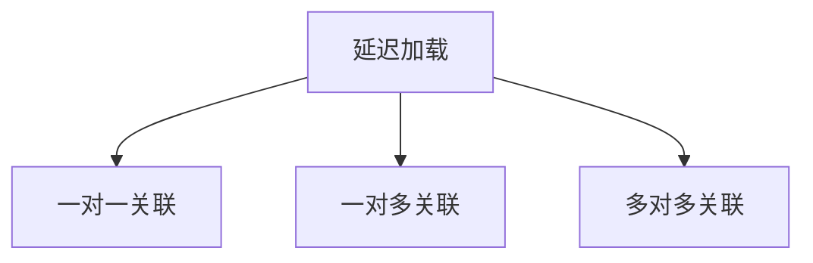
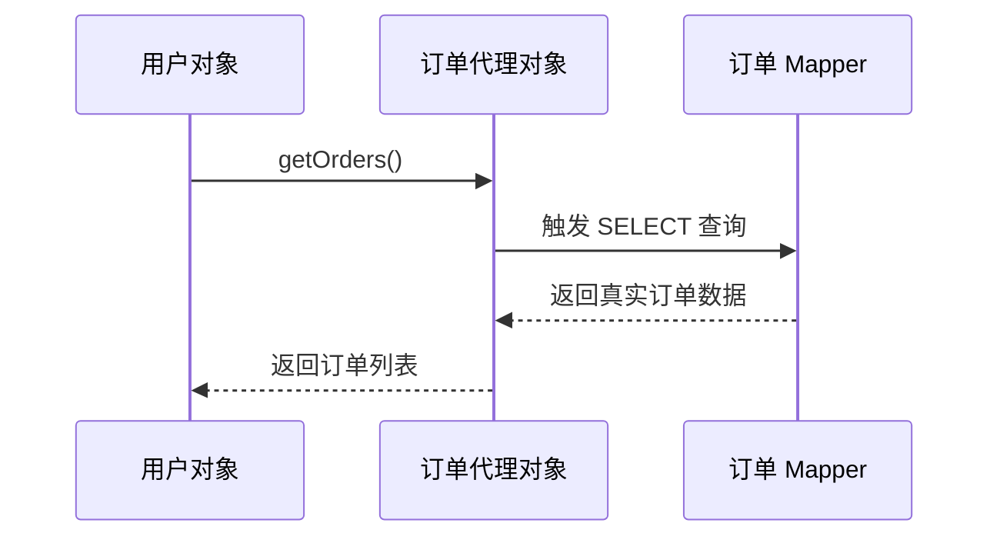
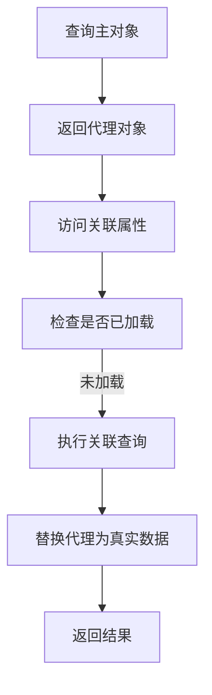

# 2. 延迟加载

***

# Java面试八股——MyBatis 延迟加载 核心知识点详解

***

## 1. 概述与定义

**延迟加载（Lazy Loading）** 是 MyBatis 的一项 **优化特性**，用于在查询关联对象时 **按需加载**，而非一次性加载所有关联数据。其核心思想是： &#x20;

- **初始查询**：仅加载主对象的基础数据。 &#x20;
- **按需加载**：当访问关联对象时，才触发 SQL 查询获取关联数据。 &#x20;

### 1.1 延迟加载的作用域




***

## 2. 主要特点

### 2.1 核心优势对比表

| **特性**​       | **描述**​                          | **示例**​                                                              |
| ------------- | -------------------------------- | -------------------------------------------------------------------- |
| **按需加载**​     | 减少初始查询的数据量，提升性能。                 | 查询用户时，仅加载用户基础信息，访问订单时才加载订单详情。                                        |
| **代理对象**​     | 使用动态代理包装关联对象，触发访问时才执行 SQL。       | \`user.getOrders()\` 触发 \`SELECT \* FROM orders WHERE user\_id = ?\` |
| **N+1 问题风险**​ | 若关联对象未被代理或配置不当，可能导致多次查询（N+1 问题）。 | 多次调用 \`user.getOrders()\` 会重复执行 SQL。                                 |

***

## 3. 应用目标

### 3.1 典型场景

| **场景**​      | **描述**​                | **示例**​                     |
| ------------ | ---------------------- | --------------------------- |
| **关联查询优化**​  | 当关联表数据量大时，避免一次性加载全部数据。 | 用户与订单表关联，用户信息频繁查询，订单数据量大。   |
| **减少网络开销**​  | 减少数据库与应用间的传输数据量。       | 查询用户列表时，仅需显示用户名，无需立即加载订单信息。 |
| **复杂对象初始化**​ | 延迟加载避免初始化时的高内存消耗。      | 多层嵌套对象（如用户-订单-商品）的初始化。      |

***

## 4. 主要内容及其组成部分

***

### 4.1 配置方式详解

#### **4.1.1 XML 配置示例**

```xml 
<!-- 在 User 对象的 resultType 或 resultMap 中配置 -->
<resultMap id="userResultMap" type="User">
    <id property="id" column="id"/>
    <result property="name" column="name"/>
    <!-- 延迟加载 orders 关联 -->
    <association property="address" column="address_id" javaType="Address" 
                 select="com.example.mapper.AddressMapper.selectById" 
                 fetchType="lazy"/>
    <collection property="orders" column="id" 
                select="com.example.mapper.OrderMapper.selectByUserId" 
                fetchType="lazy"/>
</resultMap>
```


#### **4.1.2 注解配置示例**

```java 
@Results({
    @Result(id = true, column = "id", property = "id"),
    @Result(property = "address", 
            column = "address_id", 
            select = "com.example.mapper.AddressMapper.selectById", 
            fetchType = FetchType.LAZY)
})
public interface UserMapper {
    @Select("SELECT * FROM user WHERE id = #{id}")
    User selectUserWithLazyLoad(int id);
}
```


***

### 4.2 代理实现机制

#### **4.2.1 动态代理流程图**




#### **4.2.2 核心组件**

| **组件**​           | **作用**​             |
| ----------------- | ------------------- |
| **ProxyFactory**​ | 创建代理对象（默认使用 CGLIB）。 |
| **Loader**​       | 负责在访问代理对象时加载真实数据。   |
| **Executor**​     | 执行延迟加载的 SQL。        |

***

### 4.3 触发条件与限制

#### **4.3.1 触发条件**

| **条件**​     | **描述**​                         |
| ----------- | ------------------------------- |
| **访问关联属性**​ | 直接调用 \`user.getOrders()\` 触发加载。 |
| **序列化操作**​  | 若对象被序列化（如 JSON 转换），会强制加载关联数据。   |

#### **4.3.2 限制场景**

- **SqlSession 关闭后**：无法再访问代理对象，会抛出 `LazyLoadingException`。 &#x20;
- **集合类型属性**：若关联对象是集合（如 `List<Order>`），需确保代理对象未被强制转换为 `List`。

***

## 5. 原理剖析

### 5.1 延迟加载实现原理

#### **5.1.1 核心流程图**




#### **5.1.2 步骤详解**

1. **初始化代理对象**： &#x20;
   - MyBatis 使用 **CGLIB** 或 **JDK 动态代理** 创建关联对象的代理实例。 &#x20;
   - 代理对象中保存了关联查询所需的 **SQL 语句** 和 **参数**。 &#x20;
2. **触发加载**： &#x20;
   - 当调用 `user.getOrders()` 时，代理对象拦截方法调用，检查数据是否已加载。 &#x20;
   - 若未加载，则通过 **Executor** 执行预存的关联查询 SQL。 &#x20;
3. **数据替换**： &#x20;
   - 将查询结果替换代理对象，后续访问直接返回真实数据。 &#x20;

***

### 5.2 N+1 问题与解决方案

#### **5.2.1 N+1 问题示例**

```java 
// 查询所有用户及其订单
List<User> users = sqlSession.selectList("selectUsers");
for (User user : users) {
    List<Order> orders = user.getOrders(); // 每次循环触发一次订单查询
}
```


- **问题**：假设用户有 100 条记录，会导致 1（用户查询） + 100（订单查询） = 101 次 SQL。 &#x20;

#### **5.2.2 解决方案**

| **方案**​                 | **实现方式**​                                          | **适用场景**​       |
| ----------------------- | -------------------------------------------------- | --------------- |
| **Eager 加载**​           | 在查询时直接加载关联数据（\`fetchType="eager"\`）。               | 关联数据量小且必须一次性获取。 |
| **批量加载**​               | 通过 \`@Options(fetched="remote")\` 配置批量查询。          | 关联数据量较大但可批量获取。  |
| **Select Before From**​ | 在主查询中预加载关联数据（`SELECT user. *, orders.* FROM ...`）。 | 简单关联场景，避免多次查询。  |

***

## 6. 应用与拓展

### 6.1 分页场景下的延迟加载

#### **6.1.1 分页查询示例**

```java 
// 分页查询用户列表（延迟加载订单）
Page<User> users = userMapper.selectPage(page, new QueryWrapper<User>());
for (User user : users.getRecords()) {
    List<Order> orders = user.getOrders(); // 每个用户触发一次订单查询
}
```


- **风险**：分页后若数据量大，可能导致大量 N+1 查询。 &#x20;
- **优化**：使用 `@Options(fetched="remote")` 或批量查询。 &#x20;

***

### 6.2 与 Eager 加载的对比

#### **6.2.1 对比表格**

| **特性**​     | **延迟加载（Lazy）** ​ | **立即加载（Eager）** ​ |
| ----------- | ---------------- | ----------------- |
| **初始查询性能**​ | 高（仅加载主对象）        | 低（加载主对象和关联数据）     |
| **内存占用**​   | 低（按需加载）          | 高（一次性加载全部数据）      |
| **适用场景**​   | 关联数据量大或按需访问      | 关联数据量小或频繁访问关联数据   |

***

## 7. 面试问答

### 问题1：如何开启 MyBatis 的延迟加载？

**回答**： &#x20;

MyBatis 的延迟加载可通过以下方式开启： &#x20;

1. **全局配置**：在 `mybatis-config.xml` 中设置： &#x20;
   ```xml 
   <settings>
       <setting name="lazyLoadingEnabled" value="true"/>
       <setting name="aggressiveLazyLoading" value="false"/>
   </settings>
   ```

   - `lazyLoadingEnabled`：启用延迟加载。 &#x20;
   - `aggressiveLazyLoading`：若为 `true`，即使未访问关联属性，也会预加载关联数据（默认 `true`，需显式设为 `false`）。 &#x20;
2. **局部配置**：在 `resultMap` 或注解中设置 `fetchType="lazy"`。 &#x20;

***

### 问题2：延迟加载的 N+1 问题如何解决？

**回答**： &#x20;

N+1 问题可通过以下方法解决： &#x20;

1. **Eager 加载**： &#x20;
   ```xml 
   <!-- 在 resultMap 中设置 fetchType="eager" -->
   <collection property="orders" fetchType="eager"/>
   ```

2. **批量加载**： &#x20;
   - 配置 `@Options(fetched="remote")`，MyBatis 会批量查询关联数据。 &#x20;
3. **关联查询优化**： &#x20;
   - 在主查询中使用 `JOIN` 预加载关联数据，通过 `ResultMap` 映射。 &#x20;

***

### 问题3：为什么延迟加载时会报 `No Session` 异常？

**回答**： &#x20;

该异常通常由以下原因导致： &#x20;

1. **SqlSession 已关闭**： &#x20;
   - 延迟加载需要依赖当前 `SqlSession` 的连接，若在关闭后访问代理对象，会抛出异常。 &#x20;
   - **解决方案**：在访问关联属性前保持 `SqlSession` 打开，或使用 `@Options(fetched="remote")`。 &#x20;
2. **未正确配置代理**： &#x20;
   - 检查 `lazyLoadingEnabled` 和 `aggressiveLazyLoading` 是否正确设置。 &#x20;

***

### 问题4：延迟加载与二级缓存如何配合使用？

**回答**： &#x20;

- **兼容性**：延迟加载与二级缓存可共存，但需注意： &#x20;
  - **缓存数据范围**：二级缓存默认缓存主对象，关联数据不会被缓存。 &#x20;
  - **手动缓存关联数据**：可通过 `@CacheNamespace` 对关联对象的 Mapper 启用缓存。 &#x20;
- **示例**： &#x20;
  ```java 
  @CacheNamespace(implementation = EhcacheCache.class)
  public interface OrderMapper {
      // ...
  }
  ```


***

### 问题5：如何判断延迟加载是否生效？

**回答**： &#x20;

可通过以下方式验证： &#x20;

1. **日志分析**： &#x20;
   - 在 `log4j` 或 `logback` 中开启 MyBatis 日志，观察 SQL 执行顺序。 &#x20;
   - 若仅在访问关联属性时执行关联查询，则延迟加载生效。 &#x20;
2. **代理对象检查**： &#x20;
   - 打印对象的 `toString()`，未加载的关联属性显示为代理对象（如 `com.sun.proxy.$Proxy12`）。 &#x20;

***

## 结语

MyBatis 的延迟加载是优化复杂关联查询性能的关键技术，但需谨慎处理 **N+1 问题** 和 **会话生命周期**。面试中需深入理解其 **代理机制、配置方式、与 Eager 的区别**，并通过实际案例（如分页查询、批量加载）展示对原理的掌握。通过结合流程图、对比表格和代码示例，能清晰传达对延迟加载的全面认知。
