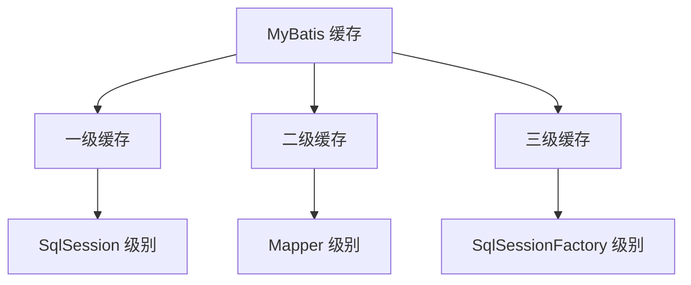
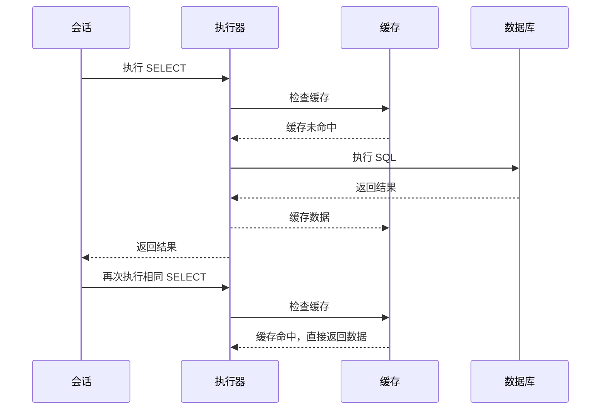
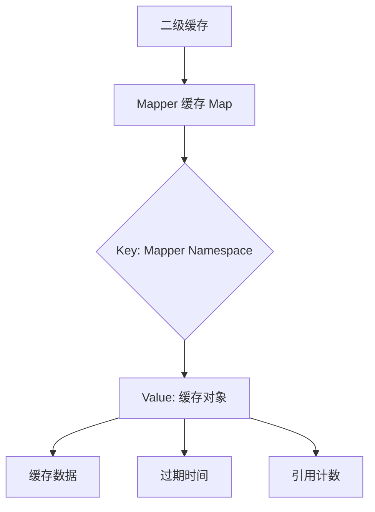

# 3. 缓存

***

# Java面试八股——MyBatis 缓存 核心知识点详解

***

## 1. 概述与定义

**MyBatis 缓存**是 MyBatis 框架提供的 **数据缓存机制**，用于减少数据库查询次数，提升系统性能。根据作用域不同，分为 **一级缓存**、**二级缓存** 和 **三级缓存**。其核心思想是： &#x20;

- **缓存数据**：将查询结果暂存于内存中，后续相同查询直接返回缓存数据。 &#x20;
- **减少开销**：避免频繁访问数据库，降低网络和磁盘 I/O 成本。 &#x20;

### 1.1 缓存层级关系图




***

## 2. 主要特点

### 2.1 核心特性对比表

| **特性**​     | **一级缓存**​              | **二级缓存**​                     | **三级缓存**​                   |
| ----------- | ---------------------- | ----------------------------- | --------------------------- |
| **作用域**​    | \`SqlSession\` 级别      | \`Mapper\` 级别                 | \`SqlSessionFactory\` 级别    |
| **默认状态**​   | 默认开启                   | 默认关闭                          | 默认关闭                        |
| **数据共享性**​  | 单个 \`SqlSession\` 内共享  | 多个 \`SqlSession\` 共享          | 多个 \`SqlSessionFactory\` 共享 |
| **生命周期**​   | 随 \`SqlSession\` 关闭而失效 | 随 \`SqlSessionFactory\` 关闭而失效 | 全局生命周期，需手动管理                |
| **数据存储结构**​ | \`HashMap\`            | \`HashMap\` 或第三方缓存（如 Ehcache） | \`HashMap\` 或分布式缓存          |

***

## 3. 应用目标

### 3.1 典型场景

| **场景**​     | **描述**​               | **示例**​            |
| ----------- | --------------------- | ------------------ |
| **高频查询优化**​ | 频繁查询相同数据时，减少数据库压力。    | 用户信息查询接口，相同参数重复调用。 |
| **分布式系统**​  | 跨服务共享缓存数据，避免重复查询。     | 微服务架构中，多个服务共享用户数据。 |
| **复杂查询加速**​ | 复杂 SQL 的结果可缓存，避免重复计算。 | 统计报表生成时，缓存聚合查询结果。  |

***

## 4. 主要内容及其组成部分

***

### 4.1 缓存类型详解

#### **4.1.1 一级缓存**

- **作用域**：`SqlSession` 级别。 &#x20;
- **自动生效**：无需配置，默认开启。 &#x20;
- **失效条件**： &#x20;
  - `SqlSession` 关闭。 &#x20;
  - 执行 `update`、`delete`、`insert` 操作（触发缓存清空）。 &#x20;
  - 执行 `commit` 或 `rollback` 事务。 &#x20;

#### **4.1.2 二级缓存**

- **作用域**：`Mapper` 级别。 &#x20;
- **手动开启**：需在 `Mapper.xml` 中配置 `<cache>` 标签。 &#x20;
- **配置参数**： &#x20;
  ```xml 
  <cache 
      eviction="FIFO"    <!-- 缓存淘汰策略：FIFO/LRU/SOFT/WEAK -->
      flushInterval="60000" <!-- 缓存刷新间隔（毫秒） -->
      size="512"         <!-- 缓存最大容量 -->
      readOnly="true"/>  <!-- 是否只读（true 避免并发修改） -->
  ```


#### **4.1.3 三级缓存**

- **作用域**：`SqlSessionFactory` 级别。 &#x20;
- **适用场景**：全局共享缓存，需在 `mybatis-config.xml` 中配置。 &#x20;
- **配置示例**： &#x20;
  ```xml 
  <settings>
      <setting name="cacheEnabled" value="true"/>
  </settings>
  ```


***

### 4.2 配置方式示例

#### **4.2.1 二级缓存配置**

```xml 
<!-- 在 UserMapper.xml 中开启二级缓存 -->
<mapper namespace="com.example.mapper.UserMapper">
    <cache eviction="LRU" size="1024" readOnly="true"/>
    <!-- 映射语句 -->
    <select id="selectUserById" resultType="User" useCache="true">
        SELECT * FROM user WHERE id = #{id}
    </select>
</mapper>
```


#### **4.2.2 实体类序列化要求**

```java 
// 实体类必须实现 Serializable 接口
public class User implements Serializable {
    private static final long serialVersionUID = 1L;
    private Integer id;
    private String name;
    // Getters and Setters
}
```


***

### 4.3 缓存失效场景

#### **4.3.1 常见失效原因**

| **场景**​           | **描述**​                                            |
| ----------------- | -------------------------------------------------- |
| **跨 Session 查询**​ | 不同 \`SqlSession\` 的一级缓存独立。                         |
| **SQL 语句变化**​     | 查询条件或 SQL 语法不同，缓存不命中。                              |
| **修改操作**​         | \`update\`、\`delete\` 等操作会清空关联缓存。                  |
| **手动清除缓存**​       | 调用 \`clearCache()\` 或 \`SqlSession.clearCache()\`。 |

***

## 5. 原理剖析

### 5.1 一级缓存工作原理

#### **5.1.1 数据流图**




#### **5.1.2 核心流程**

1. **查询阶段**： &#x20;
   - 执行 `SELECT` 时，`Executor` 先检查 `SqlSession` 的一级缓存。 &#x20;
   - 若命中，直接返回缓存数据；否则查询数据库并缓存结果。 &#x20;
2. **修改阶段**： &#x20;
   - 执行 `INSERT`、`UPDATE`、`DELETE` 后，清空当前 `SqlSession` 的一级缓存。 &#x20;

***

### 5.2 二级缓存实现机制

#### **5.2.1 缓存存储结构**




#### **5.2.2 缓存更新策略**

- **读写模式**： &#x20;
  - `readOnly="true"`：缓存数据为只读，避免并发修改冲突。 &#x20;
  - `readOnly="false"`：允许修改，但需手动处理并发问题。 &#x20;
- **淘汰策略**： &#x20;
  - `LRU`：最近最少使用，优先淘汰未访问的条目。 &#x20;
  - `FIFO`：先进先出，按插入顺序淘汰。 &#x20;

***

## 6. 应用与拓展

### 6.1 缓存与事务的交互

#### **6.1.1 事务提交的影响**

```java 
try (SqlSession session = sqlSessionFactory.openSession()) {
    User user = session.selectOne("selectUserById", 1); // 缓存命中
    session.update("updateUser", user); // 触发缓存清空
    User newUser = session.selectOne("selectUserById", 1); // 需重新查询数据库
    session.commit();
}
```


#### **6.1.2 分布式场景下的挑战**

- **缓存一致性**：多个节点修改同一数据时，需通过 `@CacheEvict` 或数据库锁保证同步。 &#x20;
- **解决方案**： &#x20;
  - 使用 Redis 作为二级缓存，结合发布-订阅模式通知节点刷新缓存。 &#x20;

***

### 6.2 缓存穿透与雪崩的应对

#### **6.2.1 缓存穿透防护**

```java 
// 在查询前先检查是否存在数据
public User getUserById(int id) {
    User user = cache.get(id);
    if (user == null) {
        user = queryFromDB(id);
        if (user != null) {
            cache.put(id, user);
        } else {
            // 缓存空值（可设置短过期时间）
            cache.put(id, new User(), 10); // 10秒后自动清除
        }
    }
    return user;
}
```


#### **6.2.2 缓存雪崩缓解**

- **设置随机过期时间**：避免大量缓存同时失效。 &#x20;
- **分层缓存**：结合本地缓存与 Redis 缓存，降低单点失效影响。 &#x20;

***

## 7. 面试问答

### 问题1：MyBatis 缓存的类型及其作用域？

**回答**： &#x20;

MyBatis 提供三种缓存： &#x20;

1. **一级缓存**： &#x20;
   - **作用域**：`SqlSession` 级别。 &#x20;
   - **特点**：默认开启，生命周期与 `SqlSession` 一致。 &#x20;
   - **适用场景**：同一会话内的重复查询优化。 &#x20;
2. **二级缓存**： &#x20;
   - **作用域**：`Mapper` 级别。 &#x20;
   - **特点**：需手动开启，跨 `SqlSession` 共享。 &#x20;
   - **适用场景**：分布式系统或跨会话的高频查询。 &#x20;
3. **三级缓存**： &#x20;
   - **作用域**：`SqlSessionFactory` 级别。 &#x20;
   - **特点**：全局共享，需谨慎管理。 &#x20;
   - **适用场景**：大型系统全局数据共享。 &#x20;

***

### 问题2：如何开启二级缓存？

**回答**： &#x20;

开启二级缓存需三步： &#x20;

1. **全局配置**：在 `mybatis-config.xml` 中启用： &#x20;
   ```xml 
   <settings>
       <setting name="cacheEnabled" value="true"/>
   </settings>
   ```

2. **Mapper 配置**：在 `Mapper.xml` 中添加 `<cache>` 标签： &#x20;
   ```xml 
   <cache eviction="LRU" size="1024" readOnly="true"/>
   ```

3. **实体类序列化**：确保实体类实现 `Serializable` 接口。 &#x20;

***

### 问题3：一级缓存失效的常见原因？

**回答**： &#x20;

一级缓存失效的典型场景包括： &#x20;

1. **跨 Session 查询**：不同 `SqlSession` 的缓存独立。 &#x20;
2. **SQL 语句变化**：查询参数或 SQL 语法不同导致缓存不命中。 &#x20;
3. **执行修改操作**：`update`、`delete` 等操作会清空当前 `SqlSession` 的缓存。 &#x20;
4. **手动清空缓存**：调用 `SqlSession.clearCache()`。 &#x20;

***

### 问题4：如何解决二级缓存的并发修改问题？

**回答**： &#x20;

可通过以下方式解决： &#x20;

1. **设置 readOnly="true"**： &#x20;
   ```xml 
   <cache readOnly="true"/> 
   ```

   - 该配置强制缓存数据为只读，避免并发修改冲突。 &#x20;
2. **手动清除缓存**： &#x20;
   ```java 
   @CacheEvict(value = "userCache", allEntries = true)
   public void updateUser(User user) {
       // 更新逻辑
   }
   ```

3. **结合数据库锁**：在更新前加锁，确保缓存与数据库数据一致性。 &#x20;

***

### 问题5：缓存穿透如何防护？

**回答**： &#x20;

缓存穿透的典型场景是查询不存在的数据，导致频繁访问数据库。解决方案包括： &#x20;

1. **布隆过滤器**：预存所有可能存在的数据 ID，快速判断合法性。 &#x20;
2. **缓存空值**：对不存在的数据缓存短时间（如 5 分钟）的空值。 &#x20;
   ```java 
   if (user == null) {
       cache.put(id, "NULL", 300); // 缓存 5 分钟
   }
   ```

3. **参数校验**：在接口层校验参数合法性，拦截恶意请求。 &#x20;

***

## 结语

MyBatis 缓存是提升系统性能的核心技术，需根据业务场景合理选择一级、二级或三级缓存。面试中需重点掌握 **配置方式、失效条件、并发处理**，并通过实际案例（如分布式场景、事务隔离）展示对原理的深入理解。结合流程图、对比表格和代码示例，能清晰传达对缓存机制的全面认知。
