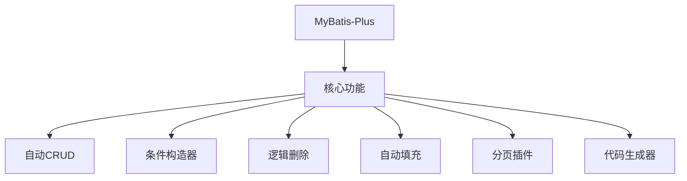
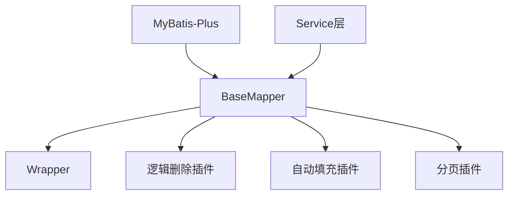
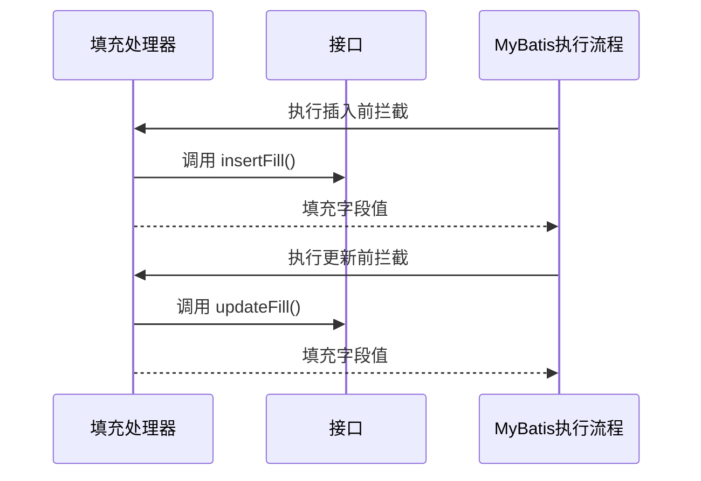
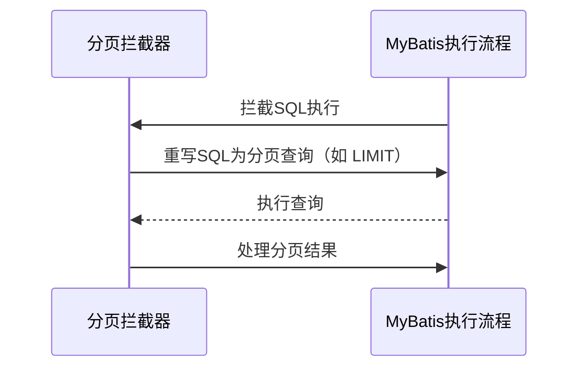

# 4. Mybatis-Plus

***

# Java面试八股——MyBatis-Plus 核心知识点详解

***

## 1. 概述与定义

**MyBatis-Plus**（简称 MP）是基于 **MyBatis** 的增强工具，旨在简化开发、减少重复代码。它通过 **代码生成器**、**CRUD 模板**、**条件构造器** 等功能，让开发者无需编写大量 XML 或重复的 SQL 语句。其核心设计理念是：**无侵入、高性能、易扩展**。




***

## 2. 主要特点

### 2.1 核心功能特性对比表

| **功能**​     | **作用**​                                      | **关键特性**​                                       |
| ----------- | -------------------------------------------- | ----------------------------------------------- |
| **自动CRUD**​ | 自动实现基础增删改查操作。                                | 无需 XML，通过注解或接口定义表结构。                            |
| **条件构造器**​  | 动态构建查询条件（如 \`QueryWrapper\`）。                | 支持链式调用，如 \`eq("age", 20).ge("salary", 10000)\`。 |
| **逻辑删除**​   | 通过标记字段实现软删除。                                 | 自动过滤已删除数据，支持查询条件自动注入。                           |
| **自动填充**​   | 自动填充字段（如 \`create\_time\`、\`update\_time\`）。 | 通过拦截器（Interceptor）实现，支持插入和更新场景。                 |
| **分页插件**​   | 简化分页查询，兼容多种数据库方言。                            | 通过 \`Page\` 对象封装分页参数。                           |

***

## 3. 应用目标

### 3.1 核心功能的应用场景

| **功能**​     | **典型场景**​                | **示例**​                                                                   |
| ----------- | ------------------------ | ------------------------------------------------------------------------- |
| **自动CRUD**​ | 快速实现基础数据操作，减少重复代码。       | 通过 \`BaseMapper\<User>\` 直接调用 \`selectById()\`。                           |
| **条件构造器**​  | 构建复杂查询条件，如多表关联、动态查询。     | \`selectList(new QueryWrapper\<User>().like("name", "张三").gt("age", 25)\` |
| **逻辑删除**​   | 需要保留历史数据但标记删除的场景（如用户注销）。 | 通过 \`@TableLogic\` 注解标记 \`deleted\` 字段。                                   |
| **自动填充**​   | 需要自动记录操作时间或操作人字段。        | 自动填充 \`create\_time\` 和 \`update\_time\`。                                 |

***

## 4. 主要内容及其组成部分

***

### 4.1 核心功能详解

#### **4.1.1 自动CRUD**

- **作用**：通过继承 `BaseMapper<T>` 实现基础操作。 &#x20;
- **示例代码**： &#x20;
  ```java 
  public interface UserMapper extends BaseMapper<User> {}

  @Service
  public class UserService {
      @Autowired
      private UserMapper userMapper;

      public User getUserById(Long id) {
          return userMapper.selectById(id); // 自动实现 SELECT * FROM user WHERE id = ?
      }
  }
  ```


#### **4.1.2 条件构造器（Wrapper）**

- **作用**：动态构建查询条件，支持链式调用。 &#x20;
- **关键类**： &#x20;
  - `QueryWrapper`：普通查询条件。 &#x20;
  - `LambdaQueryWrapper`：使用 Lambda 表达式避免字段名硬编码。 &#x20;
- **示例代码**： &#x20;
  ```java 
  List<User> users = userMapper.selectList(
      new LambdaQueryWrapper<User>()
          .eq(User::getAge, 25)
          .ge(User::getSalary, 10000)
  );
  ```


#### **4.1.3 逻辑删除**

- **作用**：通过标记字段实现软删除，而非物理删除。 &#x20;
- **配置步骤**： &#x20;
  1. 在实体类中添加 `deleted` 字段并标记： &#x20;
     ```java 
     @TableLogic
     private Integer deleted; // 0=正常，1=已删除
     ```

  2. 启用逻辑删除插件： &#x20;
     ```java 
     @Configuration
     public class MyBatisPlusConfig {
         @Bean
         public ISqlInjector sqlInjector() {
             return new LogicSqlInjector(); // 启用逻辑删除
         }
     }
     ```

- **效果**： &#x20;
  - 查询时自动添加 `AND deleted = 0`。 &#x20;
  - 删除操作改为 `UPDATE user SET deleted = 1 WHERE id = ?`。

#### **4.1.4 自动填充**

- **作用**：自动填充字段（如时间戳、操作人）。 &#x20;
- **实现步骤**： &#x20;
  1. 定义填充策略类： &#x20;
     ```java 
     @Component
     public class MetaObjectHandler implements IMetaObjectHandler {
         @Override
         public void insertFill(MetaObject metaObject) {
             setFieldValByName("createTime", new Date(), metaObject);
         }

         @Override
         public void updateFill(MetaObject metaObject) {
             setFieldValByName("updateTime", new Date(), metaObject);
         }
     }
     ```

  2. 在实体类中标记需要填充的字段： &#x20;
     ```java 
     @TableField(fill = FieldFill.INSERT)
     private Date createTime;

     @TableField(fill = FieldFill.UPDATE)
     private Date updateTime;
     ```


#### **4.1.5 分页插件**

- **作用**：简化分页查询，支持多种数据库方言。 &#x20;
- **配置示例**： &#x20;
  ```java 
  @Configuration
  public class MyBatisPlusConfig {
      @Bean
      public PaginationInterceptor paginationInterceptor() {
          return new PaginationInterceptor();
      }
  }
  ```

- **使用方式**： &#x20;
  ```java 
  Page<User> page = new Page<>(1, 10);
  Page<User> result = userMapper.selectPage(page, new QueryWrapper<>());
  ```


***

### 4.2 核心组件协作关系图




***

## 5. 原理剖析

### 5.1 自动填充机制原理

#### **5.1.1 拦截器执行流程图**




#### **5.1.2 关键步骤详解**

1. **拦截器注册**：通过 `MetaObjectHandler` 实现 `IMetaObjectHandler` 接口，在配置中注册。 &#x20;
2. **字段标记**：在实体类中通过 `@TableField(fill = ...)` 标记需要填充的字段。 &#x20;
3. **执行阶段**： &#x20;
   - **插入前**：调用 `insertFill()` 填充 `createTime`。 &#x20;
   - **更新前**：调用 `updateFill()` 填充 `updateTime`。

***

### 5.2 分页插件原理

#### **5.2.1 分页拦截器流程图**




#### **5.2.2 关键实现逻辑**

1. **拦截 SQL**：通过 `Interceptor` 拦截器，获取原始 SQL 和分页参数。 &#x20;
2. **重写 SQL**：根据数据库类型（如 MySQL、Oracle）生成分页语句（如 `LIMIT` 或 `ROWNUM`）。 &#x20;
3. **计算总数**：自动执行 `COUNT` 查询，返回总记录数。

***

## 6. 应用与拓展

### 6.1 自定义功能示例

#### **6.1.1 自定义逻辑删除字段名**

```java 
// 在全局配置中自定义逻辑删除字段名
@Configuration
public class MyBatisPlusConfig {
    @Bean
    public GlobalConfig globalConfig() {
        GlobalConfig config = new GlobalConfig();
        config.setMetaObjectHandler(new CustomMetaObjectHandler());
        config.setLogicDeleteValue(1); // 设置删除值为1
        config.setLogicNotDeleteValue(0); // 设置未删除值为0
        return config;
    }
}
```


#### **6.1.2 自定义条件构造器**

```java 
public class CustomQueryWrapper extends QueryWrapper<User> {
    public CustomQueryWrapper activeUsers() {
        eq("status", "active");
        return this;
    }
}
```


***

### 6.2 与 Spring Boot 集成

#### **6.2.1 Spring Boot 配置示例**

```yaml 
# application.yml
mybatis-plus:
  configuration:
    log-impl: org.apache.ibatis.logging.stdout.StdOutImpl # 开启日志
  global-config:
    db-config:
      id-type: auto # 主键自增
  mapper-locations: classpath*:mapper/*.xml # XML 映射文件路径
```


```java 
// 启用分页插件
@Configuration
public class MyBatisPlusConfig {
    @Bean
    public PaginationInterceptor paginationInterceptor() {
        return new PaginationInterceptor();
    }
}
```


***

## 7. 面试问答

### 问题1：MyBatis-Plus 的核心优势是什么？

**回答**： &#x20;

MyBatis-Plus 的核心优势包括： &#x20;

1. **简化 CRUD**：通过 `BaseMapper` 自动实现基础操作，无需编写 XML。 &#x20;
2. **条件构造器**：通过 `QueryWrapper` 等动态构建复杂查询条件。 &#x20;
3. **逻辑删除和自动填充**：减少重复代码，提升开发效率。 &#x20;
4. **分页插件**：简化分页逻辑，兼容多种数据库。 &#x20;
5. **代码生成器**：自动生成实体类、Mapper 和 Controller。 &#x20;

***

### 问题2：如何实现自定义的自动填充字段？

**回答**： &#x20;

步骤如下： &#x20;

1. **实现 ****`IMetaObjectHandler`**** 接口**： &#x20;
   ```java 
   @Component
   public class CustomMetaObjectHandler implements IMetaObjectHandler {
       @Override
       public void insertFill(MetaObject metaObject) {
           this.setFieldValByName("creator", "admin", metaObject);
       }
   }
   ```

2. **在实体类中标记字段**： &#x20;
   ```java 
   @TableField(fill = FieldFill.INSERT)
   private String creator;
   ```

3. **配置生效**：无需额外配置，MyBatis-Plus 会自动注入。 &#x20;

***

### 问题3：逻辑删除是如何实现的？

**回答**： &#x20;

逻辑删除的实现分为三步： &#x20;

1. **标记字段**：在实体类中添加 `deleted` 字段并使用 `@TableLogic` 注解。 &#x20;
2. **启用插件**：在配置类中注册 `LogicSqlInjector`。 &#x20;
3. **自动过滤**：查询时会自动添加 `deleted = 0` 条件，删除操作改为更新 `deleted` 为 1。 &#x20;

- **示例**： &#x20;
  ```java 
  @TableLogic
  private Integer deleted; // 0=正常，1=已删除
  ```


***

### 问题4：分页插件的工作原理？

**回答**： &#x20;

分页插件通过以下步骤实现： &#x20;

1. **拦截 SQL**：通过 `Interceptor` 拦截器捕获原始 SQL 和分页参数（如页码、页大小）。 &#x20;
2. **重写 SQL**：根据数据库类型生成分页语句（如 MySQL 的 `LIMIT`）。 &#x20;
3. **计算总数**：自动执行 `COUNT` 查询，返回总记录数。 &#x20;

- **示例**： &#x20;
  ```java 
  Page<User> page = new Page<>(1, 10);
  Page<User> result = userMapper.selectPage(page, new QueryWrapper<>());
  ```


***

### 问题5：MyBatis-Plus 如何与 MyBatis 兼容？

**回答**： &#x20;

MyBatis-Plus 是基于 MyBatis 的增强工具，完全兼容 MyBatis 的功能： &#x20;

1. **XML 支持**：可通过 `@Mapper` 注解和 XML 文件定义复杂 SQL。 &#x20;
2. **自定义 SQL**：在 `BaseMapper` 的基础上，仍可继承并编写自定义接口。 &#x20;
3. **插件扩展**：MyBatis 的插件（如分页插件）可通过 `@Intercepts` 注解集成。 &#x20;

- **示例**： &#x20;
  ```java 
  @Mapper
  public interface UserMapper extends BaseMapper<User> {
      @Select("SELECT * FROM user WHERE name = #{name}")
      List<User> selectByName(String name);
  }
  ```


***

## 结语

MyBatis-Plus 通过 **自动化** 和 **插件化** 的设计，极大提升了开发效率。面试中需重点掌握 **自动填充、逻辑删除、分页插件** 的实现原理和使用场景，同时能结合实际案例（如订单系统、用户管理）说明如何减少重复代码。理解其 **拦截器机制** 和 **条件构造器的链式调用**，是应对进阶问题的关键。
