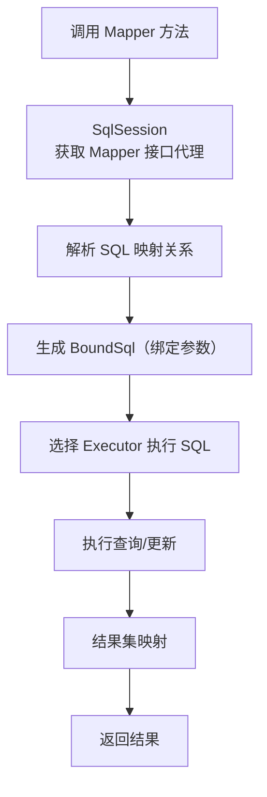
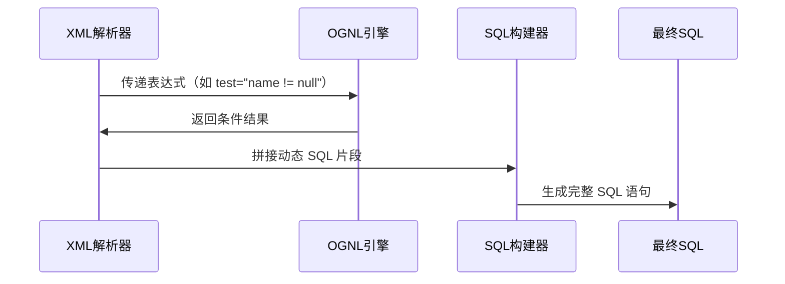

# 四. Mybatis

***

# Java面试八股——MyBatis 核心知识点详解

***

## 1. 概述与定义

**MyBatis** 是一款基于 **Java 的持久层框架**，采用 **半自动化 ORM（对象关系映射）** 技术，通过 **XML 或注解** 定义 SQL 语句，简化数据库操作。其核心目标是 **替代传统 JDBC 的繁琐代码**，提升开发效率。

### 1.1 核心定位对比表

| **框架**​        | **类型**​   | **SQL 处理方式**​ | **学习成本**​ | **适用场景**​     |
| -------------- | --------- | ------------- | --------- | ------------- |
| **MyBatis**​   | 半自动 ORM   | 手动编写 SQL      | 低         | 需灵活控制 SQL 的场景 |
| **Hibernate**​ | 全自动 ORM   | 自动生成 SQL      | 高         | 简单 CRUD 操作的场景 |
| **JPA**​       | 标准 ORM 接口 | 注解/元数据驱动      | 中         | 需标准 ORM 支持的场景 |

### 1.2 核心概念

- **ORM 映射**：将数据库表与 Java 对象（POJO）关联，如 `User` 类对应 `user` 表。 &#x20;
- **SQL 映射文件**：通过 XML 或注解定义 SQL 语句，如 `<select>`、`<insert>` 等标签。 &#x20;
- **SqlSession**：MyBatis 的核心接口，用于执行 SQL、管理事务等。

***

## 2. 主要特点

### 2.1 核心优势对比

| **特点**​            | **描述**​                                      | **示例**​                                                      |
| ------------------ | -------------------------------------------- | ------------------------------------------------------------ |
| **灵活的 SQL 控制**​    | 开发者需手写 SQL，支持动态 SQL（如 \`if\`、\`choose\` 标签）。 | \`\<select> SELECT \* FROM user WHERE id = #{id}\</select>\` |
| **零依赖**​           | 仅依赖 JDK，无需其他第三方库。                            | \`mybatis-3.x.jar\` 即可运行。                                    |
| **与 Spring 深度集成**​ | 通过 \`mybatis-spring\` 提供事务管理和依赖注入支持。         | \`@Autowired private UserMapper userMapper;\`                |
| **缓存机制**​          | 提供一级缓存（会话级）和二级缓存（全局级）。                       | \`\<cache/>\` 标签启用默认缓存。                                      |

### 2.2 动态 SQL 核心标签

| **标签**​        | **功能**​                       | **示例**​                                                                                    |
| -------------- | ----------------------------- | ------------------------------------------------------------------------------------------ |
| \`\<if>\`      | 条件判断（类似 \`WHERE\` 的 \`AND\`）。 | \`\<if test="name != null"> AND name = #{name}\</if>\`                                     |
| \`\<choose>\`  | 多条件分支（类似 \`switch\`）。         | \`\<choose> \<when test="age > 18">...\</when> \<otherwise>...\</otherwise> \</choose>\`   |
| \`\<foreach>\` | 遍历集合参数（如 \`IN\` 子句）。          | \`\<foreach item="id" collection="ids" open="(" separator="," close=")">#{id}\</foreach>\` |

***

## 3. 应用目标

### 3.1 解决 JDBC 缺陷

- **资源浪费**：通过 **连接池**（如 `PooledDataSource`）复用数据库连接。 &#x20;
- **SQL 硬编码**：将 SQL 抽取到 XML/注解中，解耦业务逻辑与数据库操作。 &#x20;
- **参数解析复杂**：通过 `#{}` 占位符自动绑定参数，无需手动 `set`。 &#x20;
- **结果集处理**：通过 `<resultMap>` 自动映射字段到对象属性。

### 3.2 典型场景

- **复杂查询**：如多表关联、动态条件查询。 &#x20;
- **高并发场景**：通过二级缓存提升查询性能。 &#x20;
- **微服务数据层**：与 Spring Boot 结合实现 REST API。

***

## 4. 主要内容及其组成部分

***

### 4.1 核心组件详解

#### **4.1.1 SqlSessionFactory**

- **作用**：创建 `SqlSession` 的工厂，单例模式使用。 &#x20;
- **创建方式**： &#x20;
  ```java 
  // XML 配置
  String resource = "mybatis-config.xml";
  InputStream inputStream = Resources.getResourceAsStream(resource);
  SqlSessionFactory sqlSessionFactory = new SqlSessionFactoryBuilder().build(inputStream);

  // 程序化配置
  Configuration config = new Configuration();
  config.addMapper(UserMapper.class);
  config.setMapUnderscoreToCamelCase(true);
  SqlSessionFactory factory = new SqlSessionFactoryBuilder().build(config);
  ```


#### **4.1.2 SqlSession**

- **核心操作**： &#x20;
  ```java 
  try (SqlSession session = sqlSessionFactory.openSession()) {
      UserMapper mapper = session.getMapper(UserMapper.class);
      User user = mapper.selectById(1);
      session.commit(); // 提交事务
  }
  ```


#### **4.1.3 映射文件（XML）结构**

```xml 
<mapper namespace="com.example.mapper.UserMapper">
    <select id="selectById" resultType="User">
        SELECT * FROM user WHERE id = #{id}
    </select>
    
    <resultMap id="userResultMap" type="User">
        <id property="id" column="user_id"/>
        <result property="name" column="user_name"/>
    </resultMap>
</mapper>
```


***

### 4.2 动态 SQL 实现原理

#### **4.2.1 OGNL 表达式**

- **作用**：在条件标签中判断参数值。 &#x20;
- **示例**： &#x20;
  ```xml 
  <if test="name != null">
      AND name = #{name}
  </if>
  ```


#### **4.2.2 参数传递方式**

- **单参数**：直接通过 `#{param}`。 &#x20;
- **对象参数**：通过属性名 `#{user.name}`。 &#x20;
- **Map 参数**：通过键名 `#{'id'}`。

***

### 4.3 缓存机制

#### **4.3.1 一级缓存（Local Cache）**

- **作用域**：`SqlSession` 生命周期内有效。 &#x20;
- **自动启用**：无需配置，默认缓存 `SELECT` 结果，`COMMIT` 或 `CLOSE` 后失效。

#### **4.3.2 二级缓存（Global Cache）**

- **作用域**：`SqlSessionFactory` 全局有效。 &#x20;
- **启用方式**： &#x20;
  ```xml 
  <!-- 在 mapper 文件中 -->
  <cache/>
  ```

- **配置参数**： &#x20;
  ```xml 
  <cache
      eviction="FIFO"          <!-- 缓存回收策略 -->
      flushInterval="60000"    <!-- 刷新间隔 -->
      size="512"               <!-- 缓存大小 -->
      readOnly="true"/>        <!-- 是否只读 -->
  ```


***

### 4.4 与 Spring 集成

#### **4.4.1 核心配置类**

```java 
@Configuration
@MapperScan("com.example.mapper") // 扫描 Mapper 接口
public class MyBatisConfig {
    @Bean
    public DataSource dataSource() {
        return new PooledDataSource("com.mysql.cj.jdbc.Driver", "jdbc:mysql://...", "user", "password");
    }

    @Bean
    public SqlSessionFactory sqlSessionFactory(DataSource dataSource) throws Exception {
        SqlSessionFactoryBean factory = new SqlSessionFactoryBean();
        factory.setDataSource(dataSource);
        return factory.getObject();
    }
}
```


***

## 5. 原理剖析

### 5.1 执行流程详解

#### **5.1.1 SQL 执行流程图**




#### **5.1.2 核心组件交互**

- **Executor**：执行 SQL 的策略类（`SimpleExecutor`、`ReuseExecutor`、`BatchExecutor`）。 &#x20;
- **MappedStatement**：存储 SQL 语句的元数据（ID、参数类型、结果映射等）。 &#x20;
- **ParameterHandler**：将参数对象转换为 JDBC 的参数值。 &#x20;
- **ResultSetHandler**：将结果集转换为 Java 对象。

***

### 5.2 动态 SQL 解析过程




***

## 6. 应用与拓展

### 6.1 典型场景示例

#### **6.1.1 分页插件**

```java 
// 自定义插件实现 Interceptor
public class PaginationInterceptor implements Interceptor {
    @Override
    public Object intercept(Invocation invocation) throws Throwable {
        // 动态修改 SQL 为分页查询
        return invocation.proceed();
    }
}

// 配置插件
<plugins>
    <plugin interceptor="com.example.PaginationInterceptor"/>
</plugins>
```


#### **6.1.2 二级缓存配置**

```xml 
<mapper namespace="com.example.UserMapper">
    <cache eviction="LRU" size="1024" readOnly="true"/>
    <select id="selectUser" resultType="User" useCache="true">
        SELECT * FROM user WHERE id = #{id}
    </select>
</mapper>
```


***

### 6.2 高级特性

#### **6.2.1 通用 Mapper 自动生成**

通过 `mybatis-generator` 生成基础 CRUD 代码： &#x20;

```xml 
<context id="DB2Tables" targetRuntime="MyBatis3">
    <plugin type="org.mybatis.generator.plugins.SerializablePlugin"/>
    <plugin type="org.mybatis.generator.plugins.ToStringPlugin"/>
    <commentGenerator>
        <property name="suppressAllComments" value="true"/>
    </commentGenerator>
    <jdbcConnection driverClass="com.mysql.cj.jdbc.Driver" 
        connectionURL="jdbc:mysql://localhost:3306/mydb" 
        userId="root" password="root"/>
    <javaModelGenerator targetPackage="com.example.model" 
        targetProject="src/main/java"/>
    <sqlMapGenerator targetPackage="mapper" 
        targetProject="src/main/resources"/>
    <javaClientGenerator type="XMLMAPPER" 
        targetPackage="com.example.mapper" 
        targetProject="src/main/java"/>
    <table tableName="user"/>
</context>
```


#### **6.2.3 自定义类型处理器**

```java 
public class JsonTypeHandler extends BaseTypeHandler<String> {
    @Override
    public void setNonNullParameter(PreparedStatement ps, int i, String parameter, JdbcType jdbcType) 
        throws SQLException {
        ps.setString(i, parameter);
    }

    @Override
    public String getNullableResult(ResultSet rs, String columnName) 
        throws SQLException {
        return rs.getString(columnName);
    }
}
```


***

## 7. 面试问答

### 问题1：MyBatis 与 Hibernate 的区别？

**回答**： &#x20;

- **MyBatis**： &#x20;
  - **半自动化 ORM**：需手动编写 SQL，灵活控制查询逻辑。 &#x20;
  - **性能高**：直接操作 SQL，适合复杂查询。 &#x20;
  - **学习成本低**：简单易用，适合中小型项目。 &#x20;
- **Hibernate**： &#x20;
  - **全自动 ORM**：通过注解自动生成 SQL，适合简单 CRUD。 &#x20;
  - **配置复杂**：需处理对象关系映射的细节。 &#x20;
  - **性能开销大**：N+1 查询等问题需额外优化。 &#x20;

***

### 问题2：MyBatis 的缓存机制是怎样的？

**回答**： &#x20;

- **一级缓存（SqlSession 级）**： &#x20;
  - **作用**：默认启用，缓存当前会话的查询结果。 &#x20;
  - **失效条件**：`commit()`、`close()` 或 `clearCache()`。 &#x20;
- **二级缓存（SqlSessionFactory 级）**： &#x20;
  - **作用**：跨会话共享，需手动开启 `<cache/>`。 &#x20;
  - **配置**：支持 `LRU`、`FIFO` 等回收策略。 &#x20;

***

### 问题3：如何实现 MyBatis 的动态 SQL？

**回答**： &#x20;

- **常用标签**： &#x20;
  - `<if>`：条件判断，如 `WHERE id = #{id} AND name = #{name}`。 &#x20;
  - `<foreach>`：遍历集合，如 `IN (#{item}, ...)`。 &#x20;
  - `<choose>`：多条件分支，类似 `switch`。 &#x20;
- **参数绑定**：通过 `OGNL` 表达式动态拼接 SQL。 &#x20;

***

### 问题4：MyBatis 的执行流程是怎样的？

**回答**： &#x20;

1. **调用 Mapper 方法**：通过代理获取接口实现。 &#x20;
2. **解析 SQL 映射**：根据方法名找到对应的 SQL 语句。 &#x20;
3. **绑定参数**：通过 `ParameterHandler` 将参数转换为 JDBC 参数。 &#x20;
4. **执行 SQL**：通过 `Executor` 执行查询或更新。 &#x20;
5. **结果映射**：通过 `ResultSetHandler` 将结果集转换为 Java 对象。 &#x20;

***

### 问题5：如何解决 MyBatis 的 N+1 问题？

**回答**： &#x20;

- **解决方案**： &#x20;
  1. **使用 ****`<select>`****的`fetchType="eager"`**：强制立即加载关联对象。 &#x20;
  2. **批量查询优化**：通过 `<collection>` 标签实现延迟加载。 &#x20;
  3. **使用 ****`<foreach>`**** 批量查询**：将多条 ID 一次性查询。 &#x20;
- **示例**： &#x20;
  ```xml 
  <resultMap id="userResult" type="User">
      <collection property="orders" ofType="Order"
          column="user_id" 
          select="selectOrdersByUserId"
          fetchType="eager"/>
  </resultMap>
  ```


***

## 结语

MyBatis 是 Java 开发者必备的持久层框架，其核心优势在于 **灵活控制 SQL** 和 **高效性能**。面试中需重点掌握 **动态 SQL 语法**、**缓存机制**、**与 Spring 集成** 等知识点。通过结合示例和流程图，能更清晰地展示对框架底层原理的理解，帮助在面试中脱颖而出。

[0. 核心组件](<0. 核心组件/0. 核心组件.md> "0. 核心组件")

[1. 执行流程](<1. 执行流程/1. 执行流程.md> "1. 执行流程")

[2. 延迟加载](<2. 延迟加载/2. 延迟加载.md> "2. 延迟加载")

[3. 缓存](<3. 缓存/3. 缓存.md> "3. 缓存")

[4. Mybatis-Plus](<4. Mybatis-Plus/4. Mybatis-Plus.md> "4. Mybatis-Plus")
