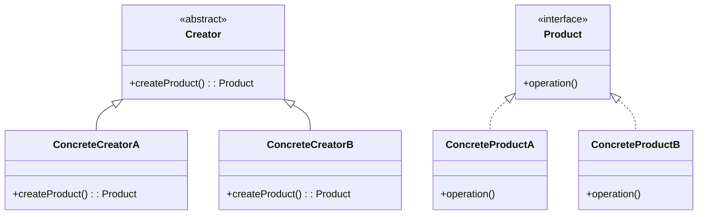
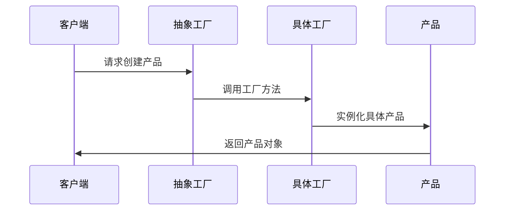

# 1. 工厂方法模式

# 1. 概述与定义

工厂方法模式属于创建型设计模式，其主要目的是将对象的创建过程封装在一个工厂类中，从而使客户端不直接依赖于具体的实现类，而只需依赖于抽象层。通过这种方式，实现了对象创建的灵活性和扩展性，同时也遵循了“开放-封闭原则”，即对扩展开放，对修改封闭。

工厂方法模式的基本思想是：定义一个用于创建对象的接口，让子类决定实例化哪一个类，使一个类的实例化延迟到其子类。换句话说，工厂方法模式将对象的创建权交给子类，从而达到解耦的目的。对于Java面试来说，掌握该模式不仅有助于理解面向对象设计思想，而且也是解决实际开发中模块解耦、扩展性和灵活性问题的重要手段。💡

# 2. 主要特点

工厂方法模式具有如下主要特点：

- **封装对象创建**：将实例化的过程封装在工厂方法中，隐藏了具体类的实现细节，使客户端无需关注对象的创建过程。🔒 &#x20;
- **遵循单一职责**：将对象创建逻辑与业务逻辑分离，使代码职责更加单一，便于维护和扩展。 &#x20;
- **符合开放-封闭原则**：新产品的加入只需新增相应的具体工厂和产品类，无需修改已有代码，从而实现系统的扩展。 &#x20;
- **实现低耦合**：客户端通过抽象工厂接口与产品接口进行交互，降低了系统各模块之间的耦合度。 &#x20;
- **提高系统灵活性**：根据实际需求选择具体工厂创建不同产品，增加系统的灵活性和可配置性。

通过这些特点，工厂方法模式在大型项目中可以有效应对不断变化的需求，并促进代码结构的清晰与模块的独立性。

# 3. 应用目标

工厂方法模式在实际应用中的目标主要有以下几点：

1. **解耦合**：通过将对象的创建和使用分离，降低系统各个模块之间的依赖。 &#x20;
2. **增强系统扩展性**：当需要增加新功能时，只需添加新的具体工厂和产品类，而不需要修改现有代码，从而避免引入新的bug。 &#x20;
3. **统一对象创建入口**：使系统中所有的对象创建行为都集中在工厂类中，便于统一管理和维护。 &#x20;
4. **提高代码复用性**：将相同的对象创建逻辑抽取到工厂方法中，使得代码具有更好的复用性。 &#x20;
5. **应对复杂对象的创建**：对于构造过程复杂、变化多端的对象，通过工厂方法模式可以集中处理，避免在客户端代码中出现复杂的构造逻辑。

在面试中，能够清楚地阐述这些目标，不仅能展示对设计模式的深刻理解，也能体现在实际项目中如何合理应用这一模式。

# 4. 主要内容及其组成部分

工厂方法模式主要由以下几个部分组成，每一部分都有其独特的职责和功能：

| 角色                    | 描述                                      | 示例                                             |
| --------------------- | --------------------------------------- | ---------------------------------------------- |
| 产品接口（Product）         | 定义产品的公共接口，规定产品必须实现的方法。                  | 接口 \`Product\`，所有具体产品均实现此接口。                   |
| 具体产品（ConcreteProduct） | 实现了产品接口，定义具体产品的行为。                      | 类 \`ConcreteProductA\`、\`ConcreteProductB\` 等。 |
| 抽象工厂（Creator）         | 声明工厂方法，定义一个返回产品对象的接口或抽象类，通常还包含一些公共业务逻辑。 | 抽象类 \`Creator\`，其中包含抽象方法 \`createProduct()\`。  |
| 具体工厂（ConcreteCreator） | 实现了抽象工厂的工厂方法，返回具体的产品对象。                 | 类 \`ConcreteCreatorA\`、\`ConcreteCreatorB\` 等。 |

下图使用Mermaid语法描述了工厂方法模式中各角色之间的关系：




上述图示清晰地展示了各个角色之间的继承和实现关系，其中：

- **Creator** 为抽象工厂，声明了工厂方法；
- **ConcreteCreatorA/B** 分别是具体工厂，重写了工厂方法；
- **Product** 为产品接口，具体产品类 ConcreteProductA/B 实现了该接口。

**示例代码：**

下面提供一个简单的Java代码示例，展示如何应用工厂方法模式：

```java 
// 定义产品接口
public interface Product {
    void operation();
}

// 具体产品A的实现
public class ConcreteProductA implements Product {
    @Override
    public void operation() {
        System.out.println("ConcreteProductA的操作实现");
    }
}

// 具体产品B的实现
public class ConcreteProductB implements Product {
    @Override
    public void operation() {
        System.out.println("ConcreteProductB的操作实现");
    }
}

// 定义抽象工厂类
public abstract class Creator {
    // 工厂方法，用于创建产品对象
    public abstract Product createProduct();
    
    // 一些与产品相关的公共方法
    public void doSomething() {
        Product product = createProduct();
        product.operation();
    }
}

// 具体工厂A，负责创建ConcreteProductA实例
public class ConcreteCreatorA extends Creator {
    @Override
    public Product createProduct() {
        return new ConcreteProductA();
    }
}

// 具体工厂B，负责创建ConcreteProductB实例
public class ConcreteCreatorB extends Creator {
    @Override
    public Product createProduct() {
        return new ConcreteProductB();
    }
}

// 客户端代码示例
public class Client {
    public static void main(String[] args) {
        Creator creatorA = new ConcreteCreatorA();
        creatorA.doSomething();  // 输出 ConcreteProductA的操作实现
        
        Creator creatorB = new ConcreteCreatorB();
        creatorB.doSomething();  // 输出 ConcreteProductB的操作实现
    }
}
```


在上述代码中，我们可以看到：

- 每个具体工厂都只负责创建一种具体产品，符合单一职责原则；
- 客户端无需了解具体产品的实现细节，只需通过工厂方法获取产品对象；
- 当需要添加新的产品时，只需扩展新的具体产品和具体工厂，而无需修改已有代码。👍

# 5. 原理剖析

深入解析工厂方法模式的原理，可以从以下几个方面进行阐述：

## 5.1 面向接口编程

工厂方法模式的核心在于面向接口编程。客户端只需要依赖产品接口，而不关心具体的实现类。这种做法使得系统具有更好的灵活性和可扩展性。当需要新增产品时，只需增加新的实现类，并在相应的工厂中进行配置，而不会影响到客户端代码。

## 5.2 开闭原则

工厂方法模式遵循开放-封闭原则。即对扩展开放，对修改封闭。新增产品时，通过添加新的具体工厂类和具体产品类，而不需要修改抽象工厂或客户端代码，从而降低了系统维护的风险，增强了代码的健壮性。

## 5.3 单一职责原则

将对象的创建与使用分离，使得每个类只承担单一的职责。例如，具体工厂类只负责产品对象的创建，而产品类只负责实现具体业务逻辑。这样既降低了系统耦合度，又使得代码更加清晰易懂。

## 5.4 依赖倒置原则

在工厂方法模式中，高层模块（如客户端代码）不依赖于低层模块（具体产品类），而是依赖于抽象。这样，当具体产品发生变化时，高层模块不受影响，提高了系统的稳定性。

## 5.5 代码扩展和维护的优势

利用工厂方法模式，我们可以在不修改现有代码的基础上扩展新的产品。比如，当项目需求变化时，只需增加新的产品及其对应的工厂，而不会破坏已有系统结构。这种扩展方式大大提高了代码的维护性和适应性。

**Mermaid图示工厂方法模式的工作流程：**




上述时序图展示了从客户端发起产品创建请求，到具体工厂实例化产品，再返回给客户端的整个流程。可以看到，整个过程清晰且解耦，确保了系统的灵活性。

# 6. 应用与拓展

工厂方法模式不仅适用于简单的对象创建场景，在实际开发中，其应用场景十分广泛。例如，在J2EE开发中，通过工厂方法模式实现DAO、Service等组件的解耦；在Android开发中，通过工厂模式实现View的动态加载；在各种插件化架构中，通过工厂方法实现模块的动态加载和替换。

## 6.1 应用场景

- **框架开发**：当开发框架或中间件时，往往需要对外提供统一的接口，同时支持多种实现，通过工厂方法模式能够轻松实现这一目标。 &#x20;
- **组件解耦**：在大型系统中，不同模块之间通过工厂方法进行交互，避免直接依赖具体实现，便于模块化开发。 &#x20;
- **插件化系统**：当系统需要支持插件扩展时，工厂方法模式可用于动态创建插件对象，确保系统扩展时不会影响核心逻辑。 &#x20;
- **日志、数据库连接等对象的创建**：通过工厂方法封装对象创建过程，便于对创建过程进行统一管理和配置。

## 6.2 与其他模式的对比与扩展

工厂方法模式与简单工厂模式、抽象工厂模式存在一定的联系与区别。简单工厂模式通过一个静态方法创建对象，虽然实现简单，但违背了开闭原则；而抽象工厂模式则是工厂方法模式的进一步扩展，适用于需要创建多个系列产品的场景。下表对比了这三种模式的特点：

| 模式名称   | 角色数量        | 是否符合开闭原则 | 使用场景                     |
| ------ | ----------- | -------- | ------------------------ |
| 简单工厂模式 | 少量（无继承结构）   | 部分符合     | 产品种类较少、创建逻辑简单时使用         |
| 工厂方法模式 | 需要抽象工厂和具体工厂 | 完全符合     | 产品种类较多且需要扩展、复杂创建逻辑场景     |
| 抽象工厂模式 | 包含多个产品族     | 完全符合     | 多个产品族之间相互关联，需要保证产品一致性时使用 |

通过表格我们可以清晰看到，在需要扩展和维护性较高的项目中，工厂方法模式与抽象工厂模式具有明显优势。而简单工厂模式虽然实现简单，但在扩展性方面存在不足。

## 6.3 拓展思考

在实际项目中，工厂方法模式的设计往往会与其他设计模式协同工作，例如结合单例模式确保工厂实例唯一，或与策略模式搭配使用以动态选择创建逻辑。此外，结合Spring等依赖注入框架时，工厂方法模式可以进一步简化对象创建流程，并通过配置实现更高的灵活性。

# 7. 面试问答

以下是模拟的面试问答部分，旨在帮助面试者梳理思路、从面试者角度详细回答相关问题，共包含五个部分。

### 问题1：什么是工厂方法模式？它的主要目的是什么？

作为一名面试者，我会回答： &#x20;

“工厂方法模式是一种创建型设计模式，其核心思想是将对象的实例化过程封装在工厂方法中，从而使客户端不需要直接依赖具体的实现类。其主要目的是实现对象创建与使用的解耦，遵循开放-封闭原则，便于系统扩展和维护。在实际项目中，当需要新增某个具体产品时，只需增加相应的具体工厂和产品类，而无需修改已有代码，极大提高了系统的灵活性和可维护性。” 😊

### 问题2：工厂方法模式与简单工厂模式有什么区别？

我的回答是： &#x20;

“简单工厂模式通常通过一个静态方法根据传入参数创建不同的对象，虽然实现上比较简单，但违背了开闭原则，因为每次新增产品都需要修改静态工厂方法。而工厂方法模式则将产品的创建委托给具体工厂类，每个具体工厂只负责创建一种产品，从而保证了系统的扩展性和灵活性。简单工厂属于一种编程技巧，而工厂方法模式是一种标准的设计模式，二者在职责分离和扩展性上有明显差别。” &#x20;

### 问题3：如何看待工厂方法模式中的开闭原则和依赖倒置原则？

我会回答： &#x20;

“工厂方法模式完美体现了开闭原则，即对扩展开放、对修改封闭。在这种模式中，当需要新增产品时，只需扩展新的具体工厂和具体产品，而不会影响到客户端已有的代码。同时，模式中依赖于抽象，而非具体实现，这正是依赖倒置原则的核心思想。通过这种设计，系统降低了耦合度，提高了代码的灵活性和可测试性，这对大型项目的维护具有重要意义。” &#x20;

### 问题4：请举例说明工厂方法模式在实际项目中的应用场景。

回答如下： &#x20;

“在实际项目中，工厂方法模式常常用于日志记录、数据库连接以及业务逻辑组件的创建。例如，在一个大型企业应用中，我们可能需要支持多种日志记录方式（如文件日志、数据库日志、远程日志等）。通过工厂方法模式，我们可以定义一个日志接口，然后为每种日志记录方式提供具体实现，并通过具体工厂类来创建日志对象。这样一来，当系统需要支持新的日志记录方式时，只需新增具体产品和对应工厂，而无需修改现有代码，从而实现系统的平滑升级。” &#x20;

### 问题5：如何设计一个灵活、可扩展的工厂方法模式？

我的回答会是： &#x20;

“设计灵活、可扩展的工厂方法模式需要注意以下几点： &#x20;

1. 定义清晰的产品接口和抽象工厂类，确保职责单一。 &#x20;
2. 每个具体工厂类只负责创建一种产品，避免工厂方法中出现复杂的逻辑判断。 &#x20;
3. 结合单例模式，可以确保工厂实例唯一，便于管理。 &#x20;
4. 使用依赖注入框架（如Spring）可以进一步解耦工厂与产品的耦合关系，通过配置文件实现灵活切换。 &#x20;
5. 对于复杂业务逻辑，可以将工厂方法与策略模式结合，通过配置动态选择创建策略，从而满足不同场景需求。 &#x20;

通过上述设计思路，可以构建一个既符合设计原则又能灵活应对需求变化的工厂方法模式。”

***

综上所述，工厂方法模式作为一种重要的设计模式，不仅在Java开发中有着广泛的应用，也是面试中考察面试者对面向对象设计原则和模式理解的重要内容。通过详细掌握各个组成部分、原理剖析以及实际应用场景，面试者能够在面试过程中给出专业且详实的回答，从而赢得面试官的认可。希望以上内容能够帮助大家在实际项目中灵活运用，并在面试中展现出扎实的专业知识。
