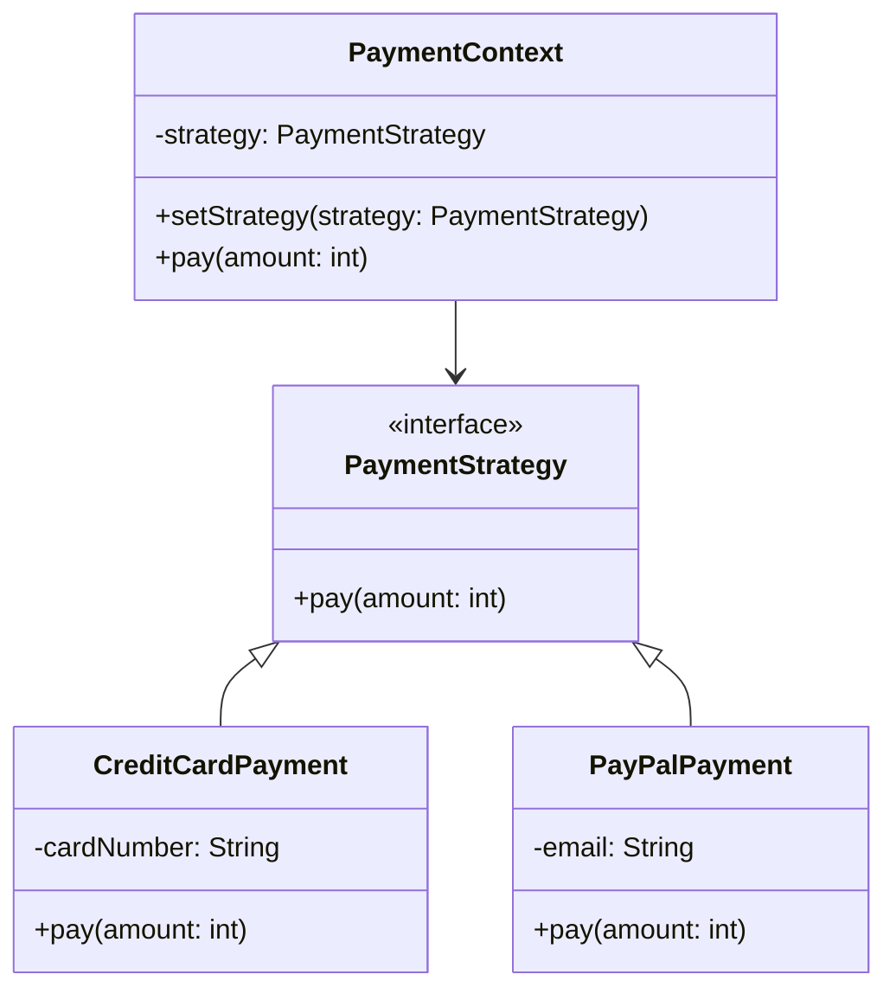

# 2. 策略模式

# 策略模式：Java面试八股文详解

***

## 1. 概述与定义

策略模式（Strategy Pattern）是一种行为型设计模式，它定义了一系列的算法，并将每个算法封装起来，使它们可以相互替换。这种模式的核心在于让算法的变化独立于使用它的客户端。换句话说，策略模式提供了一种机制，让客户端可以在运行时根据需要选择不同的行为或算法，而无需修改调用方的代码。

在Java开发中，策略模式非常常见，尤其是在需要根据不同场景动态选择处理逻辑时。例如，支付系统中的不同支付方式、游戏中的不同攻击策略，或者数据处理中的不同排序算法，都可以通过策略模式优雅地实现。从面试角度来看，策略模式不仅是技术能力的体现，还能反映你对代码设计的理解和对面向对象原则（如开闭原则）的掌握。

**正式定义**：策略模式定义了一系列算法，将每个算法封装到独立的类中，使它们可以相互替换，从而让算法的变化独立于客户端代码。这种模式通过将行为抽象为接口，并由具体实现类提供不同的算法实现，达到了高内聚、低耦合的效果。

在面试中，如果被问到“什么是策略模式”，你可以简洁回答：“策略模式是一种行为型设计模式，它允许定义一系列算法，并将每个算法封装起来，使它们可以相互替换，从而让算法独立于客户端而变化。”这样的回答既准确又简练，非常适合面试场景。

***

## 2. 主要特点

策略模式之所以在设计模式中占据一席之地，是因为它具备以下几个显著特点。这些特点不仅是理论要点，也是面试中常见的考察点，值得你熟练背诵并理解：

- **封装性** 🔒：策略模式将算法封装在独立的策略类中，使得算法的具体实现对客户端透明。客户端只需要知道策略接口，而不需要关心背后的实现细节。这种封装性降低了耦合度，提高了代码的健壮性。
- **可扩展性** 📈：当需要添加新的算法时，只需实现策略接口并创建一个新的具体策略类即可，无需修改现有代码。这符合面向对象的开闭原则（OCP），即对扩展开放、对修改关闭。
- **可替换性** 🔄：客户端可以在运行时动态选择不同的策略，而无需更改调用逻辑。这种灵活性使得策略模式非常适合需要动态切换行为的场景。
- **避免多重条件语句** 🚫：通过将算法分离到不同的类中，策略模式可以避免使用大量的if-else或switch-case语句，从而提高代码的可读性和可维护性。

**面试场景**：如果面试官问“策略模式有哪些特点”，你可以回答：“策略模式的主要特点包括封装性、可扩展性、可替换性和避免多重条件语句。封装性让算法独立于客户端，可扩展性支持新增策略而无需改动代码，可替换性允许运行时切换策略，而避免多重条件语句则让代码更简洁清晰。这些特点使它在实际开发中非常实用。”

***

## 3. 应用目标

策略模式的应用目标是面试中常被提及的理论性问题，理解这些目标能帮助你解释“为什么需要策略模式”。以下是它的主要应用目标：

- **算法替换**：当需要在运行时动态选择不同的算法或行为时，策略模式提供了一种优雅的解决方案。例如，在支付系统中，用户可以选择信用卡支付或PayPal支付，而不需要修改支付流程的代码。
- **避免多重条件语句**：在传统的实现中，可能会使用if-else来根据条件选择不同的逻辑，但这会导致代码臃肿且难以维护。策略模式通过将每种逻辑封装到单独的类中，消除了这种问题。
- **提高代码可读性**：将算法逻辑分离到不同的类中，使得代码结构更清晰，主流程代码更简洁，便于团队协作和后期维护。
- **增强代码灵活性**：客户端可以根据业务需求动态切换策略，而无需修改核心逻辑。这种灵活性在复杂系统中尤为重要。

**面试场景**：如果被问到“策略模式的目标是什么”，你可以回答：“策略模式的目标是提供一种灵活的算法选择机制，让客户端可以动态切换策略，同时避免多重条件语句，提高代码的可读性和可维护性。例如，在支付场景中，它可以让用户自由选择支付方式，而无需改动主流程代码。”

***

## 4. 主要内容及其组成部分

策略模式的核心在于其结构清晰的组成部分。以下是策略模式的三个主要部分，每部分都会进行详尽解释，确保知识点完备：

### 4.1 策略接口（Strategy）

策略接口是策略模式的基础，它定义了所有具体策略类必须实现的公共方法。通常，这个接口只包含一个抽象方法，用于执行具体的算法或行为。例如，在支付系统中，策略接口可以定义一个`pay()`方法，表示支付行为。

**代码示例**：

```java 
public interface PaymentStrategy {
    void pay(int amount);
}
```


在这个例子中，`PaymentStrategy`接口定义了一个`pay()`方法，所有的具体支付策略都需要实现这个方法。

### 4.2 具体策略类（ConcreteStrategy）

具体策略类是策略接口的实现类，每个具体策略类封装了一种具体的算法或行为。它们通过实现策略接口，提供不同的逻辑。例如，在支付系统中，可以有信用卡支付和PayPal支付两种具体策略。

**代码示例**：

```java 
// 信用卡支付
public class CreditCardPayment implements PaymentStrategy {
    private String cardNumber;
    public CreditCardPayment(String cardNumber) {
        this.cardNumber = cardNumber;
    }
    @Override
    public void pay(int amount) {
        System.out.println("Paid " + amount + " using Credit Card: " + cardNumber);
    }
}

// PayPal支付
public class PayPalPayment implements PaymentStrategy {
    private String email;
    public PayPalPayment(String email) {
        this.email = email;
    }
    @Override
    public void pay(int amount) {
        System.out.println("Paid " + amount + " using PayPal: " + email);
    }
}
```


这里，`CreditCardPayment`和`PayPalPayment`分别是两种具体的支付策略，分别实现了信用卡和PayPal的支付逻辑。

### 4.3 上下文（Context）

上下文类是客户端与策略之间的桥梁，它持有一个策略接口的引用，并通过这个引用调用具体的策略方法。上下文类通常提供一个方法来设置策略对象（setter），以及一个方法来触发策略的执行。

**代码示例**：

```java 
public class PaymentContext {
    private PaymentStrategy strategy;

    public void setStrategy(PaymentStrategy strategy) {
        this.strategy = strategy;
    }

    public void pay(int amount) {
        if (strategy != null) {
            strategy.pay(amount);
        } else {
            System.out.println("Please set a payment strategy first!");
        }
    }
}
```


在这个例子中，`PaymentContext`持有`PaymentStrategy`的引用，客户端可以通过`setStrategy()`方法设置具体的支付策略，然后调用`pay()`方法执行支付。

**表格总结**：以下表格清晰地展示了策略模式的组成部分及其作用：

| 组成部分  | 作用            | 示例                    |
| ----- | ------------- | --------------------- |
| 策略接口  | 定义所有策略的公共接口   | \`PaymentStrategy\`   |
| 具体策略类 | 实现策略接口，封装具体算法 | \`CreditCardPayment\` |
| 上下文   | 持有策略引用，调用策略方法 | \`PaymentContext\`    |

**表格说明**：这个表格列出了策略模式的三个核心部分，并通过支付系统的例子说明了它们的作用。策略接口是抽象层，具体策略类是实现层，上下文是调用层，三者协作完成策略的动态切换。

***

## 5. 原理剖析

为了让你在面试中展现深度，我们以支付系统为例，深入剖析策略模式的原理，并结合代码和图表进行解释。

### 5.1 核心思想

策略模式的核心思想是将算法的定义与使用分离。客户端通过上下文对象调用策略，而无需了解具体策略的实现细节。这种分离使得算法可以独立变化，而不影响客户端代码。在Java中，策略模式通常通过接口和多态实现，具体策略类实现策略接口，上下文类通过接口引用调用策略方法。

### 5.2 示例实现

以下是一个完整的支付系统示例，展示了策略模式的实现过程：

```java 
// 策略接口
public interface PaymentStrategy {
    void pay(int amount);
}

// 具体策略类：信用卡支付
public class CreditCardPayment implements PaymentStrategy {
    private String cardNumber;
    public CreditCardPayment(String cardNumber) {
        this.cardNumber = cardNumber;
    }
    @Override
    public void pay(int amount) {
        System.out.println("Paid " + amount + " using Credit Card: " + cardNumber);
    }
}

// 具体策略类：PayPal支付
public class PayPalPayment implements PaymentStrategy {
    private String email;
    public PayPalPayment(String email) {
        this.email = email;
    }
    @Override
    public void pay(int amount) {
        System.out.println("Paid " + amount + " using PayPal: " + email);
    }
}

// 上下文
public class PaymentContext {
    private PaymentStrategy strategy;
    public void setStrategy(PaymentStrategy strategy) {
        this.strategy = strategy;
    }
    public void pay(int amount) {
        if (strategy != null) {
            strategy.pay(amount);
        } else {
            System.out.println("Please set a payment strategy first!");
        }
    }
}

// 客户端代码
public class Main {
    public static void main(String[] args) {
        PaymentContext context = new PaymentContext();

        // 使用信用卡支付
        context.setStrategy(new CreditCardPayment("1234-5678-9012-3456"));
        context.pay(100);

        // 切换到PayPal支付
        context.setStrategy(new PayPalPayment("user@example.com"));
        context.pay(200);
    }
}
```


**输出结果**：

```markdown 
Paid 100 using Credit Card: 1234-5678-9012-3456
Paid 200 using PayPal: user@example.com
```


### 5.3 原理分析

- **策略接口**：`PaymentStrategy`定义了支付的公共接口，所有具体策略类都必须实现`pay()`方法。
- **具体策略类**：`CreditCardPayment`和`PayPalPayment`分别实现了信用卡和PayPal的支付逻辑，各自封装了不同的算法。
- **上下文**：`PaymentContext`通过`setStrategy()`方法动态设置策略对象，然后通过`pay()`方法调用具体的支付逻辑。
- **多态性**：上下文通过接口引用调用策略方法，利用Java的多态性实现了运行时策略的切换。

### 5.4 Mermaid 类图

以下是策略模式的类图，直观展示其结构：




**图表说明**：这个类图展示了策略模式的结构。`PaymentStrategy`是策略接口，`CreditCardPayment`和`PayPalPayment`是具体策略类，`PaymentContext`是上下文类，通过虚线箭头表示依赖关系（持有策略接口的引用）。这种结构清晰地体现了策略模式的层次关系。

### 5.5 优点与局限性

- **优点**：
  - 提高了代码的复用性和可维护性。
  - 支持运行时动态切换策略。
  - 符合开闭原则，便于扩展。
- **局限性**：
  - 如果策略类过多，会增加系统的复杂性。
  - 客户端需要知道所有策略类的存在，才能选择合适的策略。

**面试场景**：如果面试官要求深入讲解策略模式的原理，你可以结合上述代码和图表，详细说明每个部分的职责和协作方式，并补充优缺点分析，展现你的深度理解。

***

## 6. 应用与拓展

策略模式在Java开发中应用广泛，以下是几个典型的应用场景和拓展方向：

### 6.1 应用场景

- **支付系统**：不同的支付方式（如信用卡、PayPal、微信支付）可以使用策略模式实现，客户端根据用户选择动态切换支付策略。
- **排序算法**：不同的排序算法（如冒泡排序、快速排序）可以通过策略模式封装，客户端可以根据需求选择合适的排序方式。
- **游戏开发**：不同的攻击策略（如近战、远程攻击）可以使用策略模式实现，增强游戏的灵活性。

### 6.2 拓展方向

- **与工厂模式结合**：可以通过工厂类创建策略对象，进一步解耦客户端和具体策略。例如，定义一个`PaymentStrategyFactory`类，根据输入参数返回对应的策略对象。
- **与状态模式结合**：在某些复杂场景中，策略模式可以与状态模式结合使用，以实现更动态的行为切换。

**代码示例（工厂模式结合）**：

```java 
public class PaymentStrategyFactory {
    public static PaymentStrategy createStrategy(String type) {
        if ("creditCard".equals(type)) {
            return new CreditCardPayment("1234-5678-9012-3456");
        } else if ("paypal".equals(type)) {
            return new PayPalPayment("user@example.com");
        }
        return null;
    }
}

// 客户端使用
public class Main {
    public static void main(String[] args) {
        PaymentContext context = new PaymentContext();
        context.setStrategy(PaymentStrategyFactory.createStrategy("creditCard"));
        context.pay(100);
    }
}
```


**面试场景**：如果被问到“策略模式有哪些应用场景”，你可以回答：“策略模式适用于需要动态选择算法的场景，比如支付系统中的不同支付方式、排序算法的选择，以及游戏中的攻击策略。在实际开发中，它还可以与工厂模式结合，通过工厂类创建策略对象，进一步降低耦合。”

***

## 7. 面试问答

以下是五个常见面试问题及详细回答，模仿面试者口吻，确保内容详实且易于背诵。

### 7.1 什么是策略模式？

“面试官您好，策略模式是一种行为型设计模式，它允许定义一系列算法，并将每个算法封装到独立的类中，使它们可以相互替换。这种模式的核心是让算法独立于使用它的客户端而变化。例如，在支付系统中，我们可以定义一个支付策略接口，然后实现信用卡支付、PayPal支付等具体策略，客户端可以根据需要动态选择支付方式，而无需修改主流程代码。”

### 7.2 策略模式的主要组成部分有哪些？

“策略模式主要包含三个部分：策略接口、具体策略类和上下文类。策略接口定义了所有策略的公共方法，比如支付系统中的`pay()`方法；具体策略类实现了这个接口，封装了具体的算法，比如信用卡支付和PayPal支付；上下文类持有一个策略接口的引用，通过它调用具体的策略方法，客户端可以通过上下文动态切换策略。”

### 7.3 策略模式与状态模式有什么区别？

“策略模式和状态模式都是行为型设计模式，但它们的关注点不同。策略模式关注的是算法的替换，客户端可以根据需要选择不同的策略，比如选择不同的支付方式；而状态模式关注的是对象状态的改变，不同状态下对象的行为不同，比如订单的状态从待支付变为已支付。在实现上，策略模式由客户端控制策略的选择，而状态模式通常由对象内部管理状态的切换。”

### 7.4 在Java中如何实现策略模式？

“在Java中实现策略模式主要依赖接口和多态。首先，定义一个策略接口，包含抽象方法，比如`PaymentStrategy`接口中的`pay()`方法；然后创建多个具体策略类，比如`CreditCardPayment`和`PayPalPayment`，分别实现不同的支付逻辑；最后，定义一个上下文类`PaymentContext`，持有一个策略接口的引用，提供`setStrategy()`方法设置策略和`pay()`方法调用策略。客户端通过上下文动态切换策略，利用多态实现灵活性。”

### 7.5 策略模式的应用场景有哪些？

“策略模式适用于需要动态选择算法或行为的场景。比如，在支付系统中，可以用策略模式实现不同的支付方式，如信用卡、PayPal等；在排序系统中，可以用它选择不同的排序算法，如冒泡排序、快速排序；在游戏开发中，可以用它实现不同的攻击策略，如近战或远程攻击。这种模式通过封装算法，提高了代码的灵活性和可维护性。”

***

## 总结

策略模式是Java面试中的高频知识点，掌握它不仅能提升你的技术能力，还能在面试中展现你的专业素养。本文从概述与定义到原理剖析，再到应用场景和面试问答，全面覆盖了策略模式的核心内容。通过示例代码、表格和Mermaid图表的辅助，你可以更直观地理解它的实现和原理。希望你通过反复背诵和实践，能在面试中自信应对策略模式相关问题，拿到心仪的offer！
