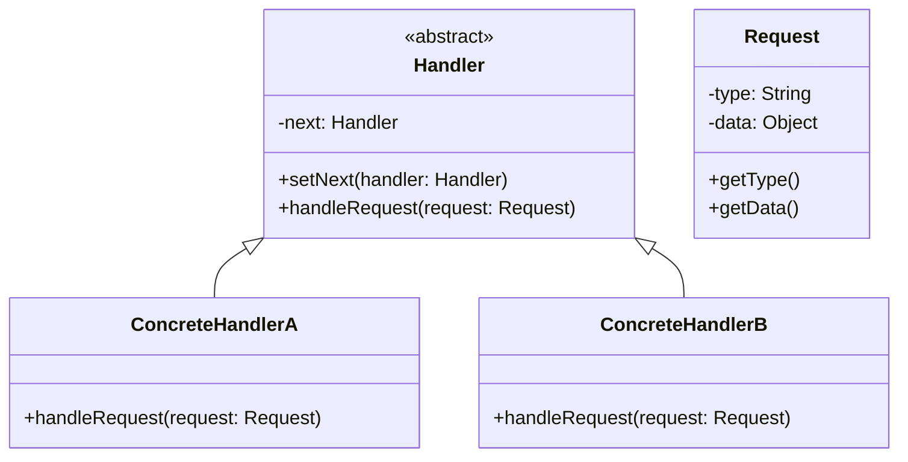
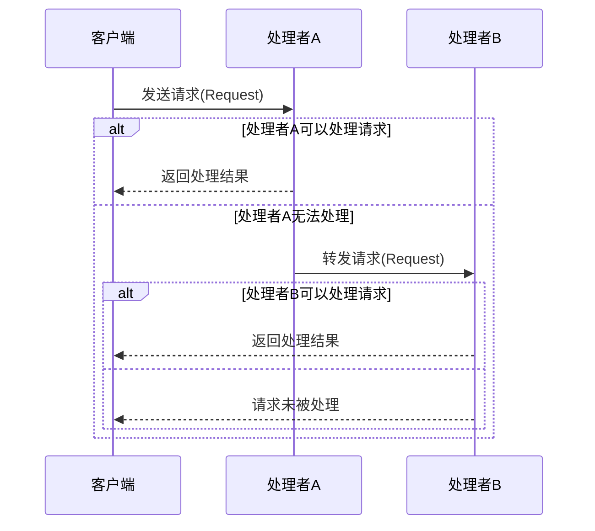

# 3. 责任链模式

***

# 1. 概述与定义

责任链模式（Chain of Responsibility Pattern）是一种行为型设计模式，其核心思想是将请求沿着处理对象链进行传递，直到有一个对象处理该请求为止。也就是说，将请求的发送者与接收者解耦，使得多个对象都有机会处理该请求。通过将这些对象连成一条链，沿着链传递请求，从而达到解耦的效果。💡

在责任链模式中，每个处理者（Handler）都有一个指向下一个处理者的引用，并且每个处理者都实现了一个处理请求的方法。当请求传入时，处理者首先判断自己是否能够处理该请求，如果不能，则将请求传递给下一个处理者。这样的设计不仅使得请求的发送者无需关心请求具体由谁处理，还可以在运行时动态地调整处理链的结构，增加系统的灵活性和扩展性。

这种模式在实际开发中应用广泛，常见场景包括日志记录、权限验证、事件处理、异常处理等。例如，在Web应用中，一个请求可能需要经过权限验证、数据校验、业务处理等多个环节，通过责任链模式可以将这些环节解耦，从而实现各个环节的独立扩展和维护。

***

# 2. 主要特点

责任链模式具有以下主要特点：

- **解耦请求发送者与处理者**：请求的发送者无需知道链中具体的处理者是谁，只需要将请求发送给链头即可。😊 &#x20;
- **动态组合处理链**：可以在运行时灵活地调整处理链的结构，方便扩展新的处理逻辑。🔀 &#x20;
- **避免请求集中**：多个对象都有机会处理请求，避免某一个对象承担过多责任，符合单一职责原则。 &#x20;
- **可扩展性强**：当需要增加新的处理逻辑时，只需添加新的处理者对象，并将其加入链中，而无需修改现有代码。 &#x20;
- **职责传递机制**：每个处理者都可以决定是否继续传递请求，形成一种链式传递的机制。

通过上述特点，责任链模式在分布式系统、复杂事件处理、权限管理等领域中具有广泛应用，是提升代码灵活性和模块化设计的重要手段。👍

***

# 3. 应用目标

责任链模式的应用目标主要体现在以下几个方面：

1. **降低系统耦合度** &#x20;

   通过将请求处理逻辑分散到多个处理者对象中，使得请求发送者和处理者之间不直接耦合，从而提高了系统的可维护性和扩展性。
2. **动态处理请求** &#x20;

   责任链模式允许在运行时动态地重新组织处理链，不同的请求可以由不同的处理链来处理，满足不同业务场景的需求。
3. **职责分离** &#x20;

   每个处理者只负责自己能够处理的请求，从而遵循单一职责原则，避免代码臃肿，便于独立测试和维护。
4. **提升系统灵活性** &#x20;

   系统可以在不修改请求发送者的情况下，通过增加、删除或调整处理者的顺序来实现对请求的不同处理策略，这对大规模复杂系统来说尤为重要。
5. **增强容错性** &#x20;

   通过责任链的传递机制，当某个处理者无法处理请求时，可以将请求传递给下一个处理者，保证请求最终得到处理或合理反馈，避免系统因单点故障而崩溃。

责任链模式正是为了满足上述目标而设计的，它在实际开发中能够有效地处理复杂的请求分发和处理问题，尤其适用于那些请求处理逻辑复杂且变化频繁的场景。

***

# 4. 主要内容及其组成部分

责任链模式主要由以下几部分组成，每个部分都有其独特的作用和职责：

| 角色名称                   | 描述                                     | 示例说明                                                        |
| ---------------------- | -------------------------------------- | ----------------------------------------------------------- |
| 抽象处理者（Handler）         | 声明一个处理请求的接口，并定义一个指向后继者的引用。             | 定义抽象方法 \`handleRequest(Request req)\`，并提供设置后继者的方法。          |
| 具体处理者（ConcreteHandler） | 实现抽象处理者接口，完成具体的请求处理，并决定是否将请求传递给下一个处理者。 | 如 \`ConcreteHandlerA\`、\`ConcreteHandlerB\` 等，根据请求类型进行具体处理。 |
| 请求（Request）            | 表示要处理的请求，通常包含请求数据和标识。                  | 可包含一个标识符和参数，如错误等级、日志级别等。                                    |
| 客户端（Client）            | 发起请求，并将请求传递到处理链的起始点。                   | 客户端代码只需知道责任链的入口，而无需了解链中每个处理者的具体实现细节。                        |

在责任链模式中，每个处理者对象都会维护一个指向下一个处理者的引用，从而形成一条责任链。当请求到来时，从链头开始，每个处理者都会判断自己是否能够处理该请求，如果能则执行相应操作；如果不能，则将请求转发给链中的下一个处理者。这种结构既体现了职责分离，又使得请求传递过程变得灵活和动态。

为了更直观地展示责任链模式的结构与关系，可以使用Mermaid语法绘制如下类图：




图中展示了抽象处理者（Handler）及其两个具体实现（ConcreteHandlerA 和 ConcreteHandlerB），同时还展示了请求对象（Request）的基本结构。整个结构清晰展示了如何通过链式结构传递和处理请求。

下面给出一个简单的Java代码示例，以便更好地说明责任链模式的实现：

```java 
// 请求对象，包含请求类型和数据
public class Request {
    private String type;
    private Object data;
    
    public Request(String type, Object data) {
        this.type = type;
        this.data = data;
    }
    
    public String getType() {
        return type;
    }
    
    public Object getData() {
        return data;
    }
}

// 抽象处理者，声明处理请求的接口，并维护下一个处理者的引用
public abstract class Handler {
    protected Handler next;
    
    public void setNext(Handler next) {
        this.next = next;
    }
    
    // 处理请求的方法，具体处理逻辑由子类实现
    public abstract void handleRequest(Request request);
}

// 具体处理者A，处理特定类型的请求
public class ConcreteHandlerA extends Handler {
    @Override
    public void handleRequest(Request request) {
        if ("TYPE_A".equals(request.getType())) {
            System.out.println("ConcreteHandlerA 处理请求：" + request.getData());
        } else if (next != null) {
            next.handleRequest(request);
        }
    }
}

// 具体处理者B，处理其他类型的请求
public class ConcreteHandlerB extends Handler {
    @Override
    public void handleRequest(Request request) {
        if ("TYPE_B".equals(request.getType())) {
            System.out.println("ConcreteHandlerB 处理请求：" + request.getData());
        } else if (next != null) {
            next.handleRequest(request);
        }
    }
}

// 客户端代码，构建责任链并发送请求
public class Client {
    public static void main(String[] args) {
        // 构建处理链：A -> B
        Handler handlerA = new ConcreteHandlerA();
        Handler handlerB = new ConcreteHandlerB();
        handlerA.setNext(handlerB);
        
        // 构造不同类型的请求进行测试
        Request requestA = new Request("TYPE_A", "数据A");
        Request requestB = new Request("TYPE_B", "数据B");
        Request requestC = new Request("TYPE_C", "数据C");
        
        // 处理请求
        handlerA.handleRequest(requestA); // 输出 ConcreteHandlerA 处理请求：数据A
        handlerA.handleRequest(requestB); // 输出 ConcreteHandlerB 处理请求：数据B
        handlerA.handleRequest(requestC); // 无处理者匹配，链结束
    }
}
```


在上述代码中，我们构建了一个简单的责任链，从处理者A到处理者B。每个处理者根据请求类型判断是否处理，如果不匹配则将请求传递给下一个处理者。这种设计充分体现了解耦、职责分离以及系统灵活扩展的优点。😊

***

# 5. 原理剖析

深入剖析责任链模式的原理，可以从以下几个方面展开：

## 5.1 职责分离与请求传递机制

责任链模式的核心在于将请求的处理逻辑分散到多个处理者中，每个处理者只负责自己能够处理的请求。客户端只需要将请求发送给责任链的起始点，而不关心具体的处理流程。这种设计使得每个处理者的职责单一，降低了模块之间的耦合度。请求在链中依次传递，直到有一个处理者满足条件并处理请求。若链中所有处理者均不处理该请求，则请求最终可能被忽略或给出默认处理结果。

## 5.2 处理链的动态组合

在实际应用中，处理链的结构往往不是固定的。可以根据业务需求，在运行时动态地添加、删除或调整处理者的顺序。例如，在一个权限校验系统中，不同的用户角色可能需要不同的校验链，通过动态配置处理者顺序，可以实现不同的业务逻辑。这样不仅增强了系统的灵活性，还能根据实际场景实时调整处理策略。

## 5.3 设计原则的体现

责任链模式体现了多项设计原则： &#x20;

- **单一职责原则**：每个处理者只处理特定类型的请求，避免了单个类承担过多责任。 &#x20;
- **开放-封闭原则**：新增处理者不需要修改现有代码，只需在链中增加新的处理者即可。 &#x20;
- **依赖倒置原则**：客户端依赖于抽象处理者，而不关心具体实现，降低了系统耦合度。

## 5.4 处理链的优缺点分析

责任链模式虽然具有良好的解耦和扩展性，但在使用时也需要注意一些问题： &#x20;

- 优点： &#x20;
  1. 降低了请求发送者和处理者之间的耦合。 &#x20;
  2. 便于动态地调整处理逻辑，增加系统的灵活性。 &#x20;
  3. 遵循设计原则，便于后期扩展和维护。 &#x20;
- 缺点： &#x20;
  1. 请求可能会在链中传递多个处理者，导致性能开销； &#x20;
  2. 如果链过长或没有合适的终止处理，可能导致请求无人处理； &#x20;
  3. 调试和跟踪请求传递过程可能会比较困难，尤其是在复杂的系统中。 &#x20;

为了解决这些问题，开发者在设计责任链时需要根据实际需求合理规划处理链的长度和终止条件。

## 5.5 Mermaid时序图说明

下面通过一个时序图来展示责任链模式中请求的传递过程：




时序图清晰地展示了客户端如何将请求发送给链头处理者，处理者根据条件判断是否处理请求或传递给下一个处理者。通过这种方式，整个请求的传递过程变得模块化、灵活且易于扩展。👍

***

# 6. 应用与拓展

责任链模式在实际开发中有着广泛的应用，以下是一些常见的应用场景及其拓展：

## 6.1 应用场景

- **日志记录系统** &#x20;

  日志系统中可能需要根据日志级别（INFO、DEBUG、ERROR等）将日志记录到不同的目标（控制台、文件、数据库）。使用责任链模式可以将不同日志级别的处理逻辑分离，并根据日志级别动态传递处理请求。 &#x20;
- **权限校验与请求过滤** &#x20;

  在Web系统中，用户请求可能需要经过多个验证环节，如认证、授权、参数校验等。责任链模式可以将这些验证逻辑解耦，形成一个责任链，使得每个环节单独处理各自的验证逻辑。 &#x20;
- **事件处理系统** &#x20;

  在GUI程序或中间件中，不同的事件可能需要由不同的对象处理。通过责任链模式，事件可以按照一定顺序传递，直到找到合适的处理者，保证系统响应的灵活性和扩展性。 &#x20;
- **错误与异常处理** &#x20;

  系统在运行时可能会产生各种错误，通过责任链模式可以将错误处理分布到不同的层次中，根据错误类型由相应处理者捕获和处理，避免集中式的错误处理带来的风险。

## 6.2 拓展思考

在实际项目中，责任链模式还可以与其他设计模式相结合，以达到更高的灵活性和功能扩展。例如：

- **与策略模式结合** &#x20;

  可以通过策略模式动态选择处理链中各个处理者的具体处理策略，使得系统能够根据不同的业务场景实时调整逻辑。 &#x20;
- **与观察者模式结合** &#x20;

  在一些复杂系统中，责任链模式可以与观察者模式协同工作，使得处理链中每个处理者在处理请求的同时，还能通知其他模块进行相应更新。 &#x20;
- **与配置管理结合** &#x20;

  利用配置文件或依赖注入框架（如Spring），可以在不修改代码的前提下动态调整责任链的结构，提升系统灵活性和可维护性。

通过上述拓展思考，开发者可以根据具体业务需求设计出更加灵活且高效的责任链处理机制，从而应对复杂多变的应用场景。🚀

***

# 7. 面试问答

以下是模拟的面试问答部分，旨在帮助面试者从自身角度详细回答有关责任链模式的问题，共包含五个部分，每个问题均附带详细回答说明：

### 问题1：什么是责任链模式？请简述其主要思想和适用场景。

回答示例： &#x20;

“责任链模式是一种行为型设计模式，其主要思想是将请求的发送者与接收者解耦，通过构建一个处理者链来传递请求，直到某个处理者能够处理该请求。在这种模式中，每个处理者只处理自己能够处理的请求，不符合条件时将请求传递给下一个处理者。典型的应用场景包括日志记录、权限验证、事件处理以及错误处理等。通过这种方式，可以动态地组合处理逻辑，便于扩展和维护。” 😀 &#x20;

### 问题2：在责任链模式中，如何实现处理链的动态调整？这种设计有什么优势？

回答示例： &#x20;

“责任链模式中，每个处理者都持有对下一个处理者的引用，因此可以通过设置或修改这一引用来动态调整处理链的结构。例如，在系统初始化时可以根据配置文件构建不同的处理链，也可以在运行时动态增加或删除某个处理者。这样的设计优势在于： &#x20;

1. 客户端无需了解具体处理链的结构，只需发送请求； &#x20;
2. 系统可以灵活应对不同场景，满足变化的业务需求； &#x20;
3. 遵循单一职责原则，每个处理者只专注于自身处理逻辑，从而降低耦合度。” 👍 &#x20;

### 问题3：责任链模式中有哪些主要角色？各自的职责是什么？

回答示例： &#x20;

“责任链模式主要包含以下几个角色： &#x20;

1. **抽象处理者（Handler）**：定义处理请求的接口，并维护对下一个处理者的引用； &#x20;
2. **具体处理者（ConcreteHandler）**：继承抽象处理者，实现具体的请求处理逻辑，根据请求类型判断是否处理，否则转发给下一个处理者； &#x20;
3. **请求（Request）**：封装请求相关的信息，通常包含请求类型和数据； &#x20;
4. **客户端（Client）**：负责发起请求，通常只需知道责任链入口，而不关心内部处理细节。 &#x20;

每个角色各司其职，使得请求在责任链中能够逐层传递并得到恰当处理。” &#x20;

### 问题4：责任链模式与其他设计模式相比有何优势和局限性？

回答示例： &#x20;

“责任链模式的主要优势在于降低了请求发送者与处理者之间的耦合，使得系统扩展更加灵活，符合开放-封闭原则。此外，通过动态组合处理链，可以轻松应对复杂的请求处理场景。然而，其局限性在于请求可能会在多个处理者之间传递，导致性能开销增加；同时，如果处理链设计不当，可能出现请求无人处理的情况。总体来说，责任链模式适合处理流程较为明确且各个处理步骤职责单一的场景。” &#x20;

### 问题5：请结合实际项目经验，谈谈你如何在项目中应用责任链模式解决问题的？

回答示例： &#x20;

“在我的项目中，我们曾经遇到一个复杂的权限校验问题。用户请求需要经过多个校验环节，例如身份认证、权限验证以及数据格式校验。为了避免将所有逻辑写在一个方法中，我们采用了责任链模式，将各个校验环节封装为独立的处理者。通过在系统启动时根据配置文件动态构建责任链，用户请求按照预定的顺序依次通过各个校验器，最终确定是否具有操作权限。这种设计不仅提高了代码的可维护性，而且使得每个校验模块可以独立测试和扩展，极大提升了系统的稳定性和灵活性。” 🚀

***

# 总结

责任链模式作为一种重要的行为型设计模式，通过构建处理者链，实现了请求的动态分发和解耦，极大提高了系统的灵活性和扩展性。本文从概述与定义、主要特点、应用目标、组成部分、原理剖析、应用与拓展，再到模拟面试问答等多个角度，进行了详尽解析。通过示例代码、表格对比、Mermaid图示及丰富的文字说明，帮助面试者从多个维度掌握该模式的核心思想及实际应用场景。希望这篇文章能够帮助各位在面试中从容应答，并在实际项目中熟练运用责任链模式解决复杂问题。
