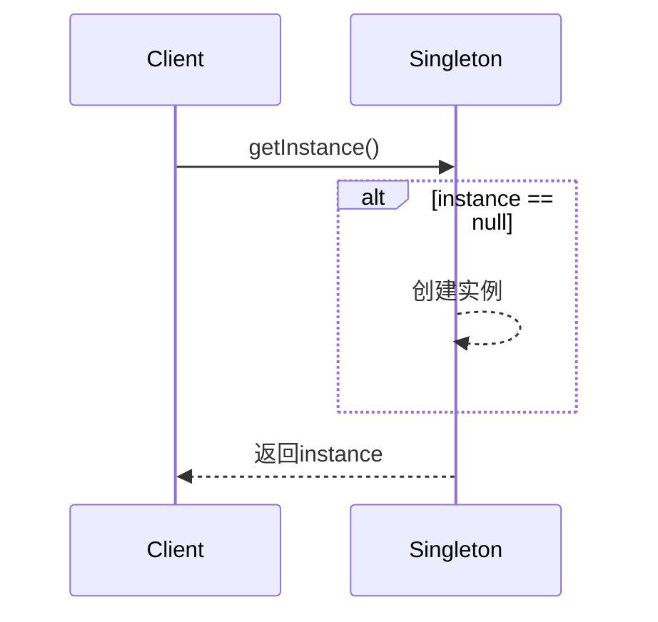

# 一. 设计模式

# 设计模式：Java面试八股文详解

***

## 1. 概述与定义

设计模式（Design Patterns）是软件开发中解决特定问题的通用解决方案，是经过无数开发者实践总结出的经验和套路。它本质上是一套被反复验证的代码设计模式，能够帮助开发者在面对常见问题时快速找到优雅的解决方法。在Java开发中，设计模式被广泛应用，尤其在主流框架如Spring、Hibernate中随处可见。

从面试角度来看，设计模式不仅是技术能力的体现，还能反映你对代码架构的理解和对面向对象思想的掌握。简单来说，设计模式就像武侠小说中的“招式”，学会这些招式，你就能在代码世界中游刃有余。常见的定义可以总结为：**设计模式是一套可重用的、经过分类的代码设计经验，用来提高代码的可读性、可维护性和可扩展性。**

***

## 2. 主要特点

设计模式之所以重要，是因为它具备以下几个显著特点，值得你在面试中熟练背诵并理解：

- **可重用性** 🚀：设计模式是经过时间和实践检验的解决方案，可以在不同项目中重复使用，避免重复造轮子。
- **可扩展性** 📈：设计模式通常预留了扩展空间，使得系统能够轻松应对需求变化。
- **解耦性** 🔗：通过合理的设计，降低模块之间的依赖关系，提升代码的灵活性。
- **可读性** 📚：使用设计模式后，代码结构更加规范，团队成员能够快速理解代码逻辑。

在面试中，如果被问到“设计模式的特点是什么”，你可以自信回答：“设计模式的核心特点包括可重用性、可扩展性、解耦性和可读性。这些特点让代码更健壮、更易维护，是现代软件开发不可或缺的一部分。”

***

## 3. 应用目标

设计模式的应用目标是面试中常被提及的理论性问题，理解这些目标能帮助你解释“为什么需要设计模式”。以下是主要目标：

- **提高代码质量**：通过成熟的解决方案，减少代码中的潜在错误。
- **增强团队协作**：设计模式提供了一种通用的“语言”，便于开发者之间的沟通。
- **加速开发过程**：利用现成的模式，开发者无需从零开始设计复杂逻辑。
- **应对变化**：设计模式考虑了系统的未来扩展性，能更好地适应需求变更。

在面试中，你可以这样回答相关问题：“设计模式的目标是提升代码质量、加速开发、增强协作并应对变化。比如在Spring框架中，代理模式的使用就大大提高了系统的扩展性，这也是为什么它能成为企业级开发的首选框架。”

***

## 4. 主要内容及其组成部分

设计模式通常分为三大类：**创建型模式**、**结构型模式**和**行为型模式**。以下是对每类模式的详细解释，包含所有子模式，确保知识点完备，方便你在面试中全面展示。

### 4.1 创建型模式

创建型模式关注如何创建对象，旨在让对象创建过程更灵活、更高效。以下是所有创建型模式及其解释：

- **单例模式（Singleton）**：确保一个类只有一个实例，并提供全局访问点。例如，日志管理器通常使用单例模式避免重复创建。
- **工厂模式（Factory Method）**：定义一个创建对象的接口，由子类决定实例化哪个类。比如，Java中的`Calendar.getInstance()`就是工厂模式的体现。
- **抽象工厂模式（Abstract Factory）**：提供一个接口，用于创建一系列相关或依赖的对象。例如，GUI框架中可以根据操作系统创建不同风格的按钮和窗口。
- **建造者模式（Builder）**：将复杂对象的构建过程与表示分离，适合创建复杂对象。例如，`StringBuilder`就是建造者模式的简化应用。
- **原型模式（Prototype）**：通过克隆已有对象来创建新对象，适合创建成本较高的对象。Java中的`Object.clone()`是原型模式的基础。

### 4.2 结构型模式

结构型模式关注类和对象的组合，形成更大的结构。以下是所有结构型模式：

- **适配器模式（Adapter）**：将不兼容的接口转换为客户端期望的接口。例如，Java中的`Arrays.asList()`将数组适配成List。
- **桥接模式（Bridge）**：将抽象与实现分离，使两者独立变化。例如，JDBC驱动程序通过桥接模式连接不同数据库。
- **组合模式（Composite）**：将对象组织成树形结构，表示“部分-整体”关系。例如，文件系统中的目录和文件。
- **装饰器模式（Decorator）**：动态为对象添加职责。例如，Java中的`BufferedReader`是对`Reader`的装饰。
- **外观模式（Facade）**：为复杂子系统提供简单接口。例如，Spring MVC中的`DispatcherServlet`就是一个外观。
- **享元模式（Flyweight）**：通过共享技术支持大量细粒度对象。例如，Java中的`String`常量池。
- **代理模式（Proxy）**：为对象提供代理以控制访问。例如，Spring AOP中的动态代理。

### 4.3 行为型模式

行为型模式关注对象之间的职责分配和通信。以下是所有行为型模式：

- **责任链模式（Chain of Responsibility）**：将请求沿处理链传递，直到被处理。例如，Servlet中的Filter链。
- **命令模式（Command）**：将请求封装为对象，支持撤销操作。例如，Swing中的Action。
- **解释器模式（Interpreter）**：为语言定义文法并解释执行。较少使用，但在SQL解析中有体现。
- **迭代器模式（Iterator）**：顺序访问集合元素而不暴露内部结构。例如，Java的`Iterator`接口。
- **中介者模式（Mediator）**：通过中介对象协调多个对象交互。例如，聊天室系统。
- **备忘录模式（Memento）**：保存和恢复对象状态。例如，游戏存档。
- **观察者模式（Observer）**：定义一对多依赖，当状态变化时通知观察者。例如，Java的`Observable`类。
- **状态模式（State）**：根据状态改变对象行为。例如，订单状态机。
- **策略模式（Strategy）**：封装可互换的算法。例如，Java中的`Comparator`。
- **模板方法模式（Template Method）**：定义算法骨架，延迟步骤到子类。例如，`AbstractList`中的方法。
- **访问者模式（Visitor）**：为对象结构添加新操作。例如，编译器中的语法树遍历。

**表格说明**：以下表格总结了三大类设计模式的主要关注点和代表模式，便于快速记忆：

| 设计模式类型 | 主要关注点   | 代表模式       |
| ------ | ------- | ---------- |
| 创建型    | 对象创建    | 单例、工厂、建造者  |
| 结构型    | 对象组合    | 适配器、装饰器、代理 |
| 行为型    | 对象通信与职责 | 观察者、策略、命令  |

***

## 5. 原理剖析

为了让你在面试中展现深度，我们以**单例模式**为例，进行详细剖析。

### 5.1 单例模式原理

**定义**：单例模式确保一个类只有一个实例，并提供全局访问点。

**核心原理**：

- **私有化构造函数**：防止外部直接实例化。
- **静态实例变量**：保存唯一实例。
- **静态获取方法**：提供访问实例的入口。

**实现方式**：

1. **饿汉式**：类加载时就创建实例。
2. **懒汉式**：第一次使用时创建实例。

**示例代码**：

```java 
// 饿汉式单例
public class SingletonEager {
    private static final SingletonEager INSTANCE = new SingletonEager();
    private SingletonEager() {}
    public static SingletonEager getInstance() {
        return INSTANCE;
    }
}

// 懒汉式单例（线程安全）
public class SingletonLazy {
    private static volatile SingletonLazy instance;
    private SingletonLazy() {}
    public static SingletonLazy getInstance() {
        if (instance == null) {
            synchronized (SingletonLazy.class) {
                if (instance == null) {
                    instance = new SingletonLazy();
                }
            }
        }
        return instance;
    }
}
```


**深入解析**：

- **饿汉式**：优点是简单且线程安全，缺点是无论是否使用都会占用内存。
- **懒汉式**：优点是延迟加载节省资源，缺点是多线程下需加锁（双重检查锁机制）。`volatile`关键字防止指令重排，确保实例化过程的原子性。
- **线程安全问题**：懒汉式未加锁时，多线程可能同时创建多个实例，破坏单例。

**Mermaid 图表示例**：以下是单例模式的调用流程：




**图表说明**：此图展示了客户端调用`getInstance()`的过程，如果实例不存在，则创建并返回，否则直接返回已有实例。

***

## 6. 应用与拓展

设计模式在Java开发中无处不在，以下是典型应用场景：

- **Spring框架**：单例模式管理Bean，工厂模式创建对象，代理模式实现AOP。
- **Java集合框架**：迭代器模式遍历集合，适配器模式转换数据结构。
- **Hibernate**：代理模式实现懒加载。

**拓展方向**：

- **微服务**：代理模式用于服务调用，观察者模式实现事件驱动。
- **并发编程**：单例模式需考虑线程安全，享元模式优化资源使用。

在面试中，你可以举例说明：“Spring的Bean默认是单例模式，通过`BeanFactory`使用工厂模式创建对象，这些设计大大提高了框架的灵活性。”

***

## 7. 面试问答

以下是五个常见面试问题及详细回答，模仿面试者口吻，确保内容详实。

### 7.1 什么是设计模式？为什么需要它？

“面试官您好，设计模式是软件开发中解决特定问题的通用解决方案，是前辈们总结出的经验。它本质上是一些经过验证的代码设计套路，可以提高代码的可重用性、可扩展性和可维护性。比如单例模式能确保全局唯一实例，工厂模式能解耦对象的创建和使用。我们需要设计模式是因为它能让我们少走弯路，提升开发效率，同时让代码更符合面向对象原则，像Spring这样的框架就大量使用了设计模式。”

### 7.2 单例模式有几种实现方式？优缺点是什么？

“单例模式主要有饿汉式和懒汉式两种实现。饿汉式是在类加载时就创建实例，代码简单，线程安全，但缺点是可能浪费内存，因为即使不使用也会实例化。懒汉式是延迟加载，只有第一次调用时才创建，节省资源，但单线程下简单实现不安全，多线程需要加锁，比如用双重检查锁机制。懒汉式的优点是按需加载，缺点是加锁可能影响性能。我在项目中用过懒汉式单例来管理数据库连接池，配合`volatile`和`synchronized`确保线程安全。”

### 7.3 工厂模式和抽象工厂模式有什么区别？

“工厂模式和抽象工厂模式的区别主要在关注点和复杂度上。工厂模式关注单个对象的创建，定义一个接口让子类决定实例化哪个类，比如`Calendar.getInstance()`。抽象工厂模式更复杂，它关注一组相关对象的创建，提供一个接口生成一系列对象，比如GUI系统中可以根据操作系统创建不同风格的控件。我理解工厂模式是一个‘单品工厂’，而抽象工厂是一个‘产品族工厂’，后者更适合需要协调多个对象创建的场景。”

### 7.4 观察者模式的应用场景有哪些？

“观察者模式特别适合一对多的依赖关系，我觉得它在事件驱动系统中很常见。比如Java的GUI编程中，按钮点击事件就是一个经典例子：按钮是主题，监听器是观察者，点击时所有监听器都会被通知。在项目中，我用过观察者模式实现日志订阅功能，当系统产生日志时，多个订阅者（如文件记录器、邮件通知器）会同时收到更新。这种模式的好处是解耦了主题和观察者，扩展性很强。”

### 7.5 设计模式会不会过度设计？如何避免？

“设计模式确实可能导致过度设计。我认为它是个双刃剑，用得好能提升代码质量，用不好反而增加复杂度。比如强行在简单逻辑中套用装饰器模式，可能让代码变得臃肿。避免过度设计的关键是根据实际需求选择合适的模式，而不是为了用模式而用。我在项目中会先分析问题场景，比如只需要全局唯一实例时用单例，需要动态扩展时才考虑装饰器，这样就能平衡代码的简洁性和扩展性。”

***

## 总结

设计模式是Java面试中的重头戏，掌握它不仅能提升你的技术能力，还能在面试中展现你的专业素养。本文从定义、特点到具体模式，再到原理剖析和面试问答，全面覆盖了设计模式的核心知识点。希望你通过反复背诵和理解，能在面试中脱颖而出，拿到心仪的offer！

[1. 工厂方法模式](<1. 工厂方法模式/1. 工厂方法模式.md> "1. 工厂方法模式")

[2. 策略模式](<2. 策略模式/2. 策略模式.md> "2. 策略模式")

[3. 责任链模式](<3. 责任链模式/3. 责任链模式.md> "3. 责任链模式")
