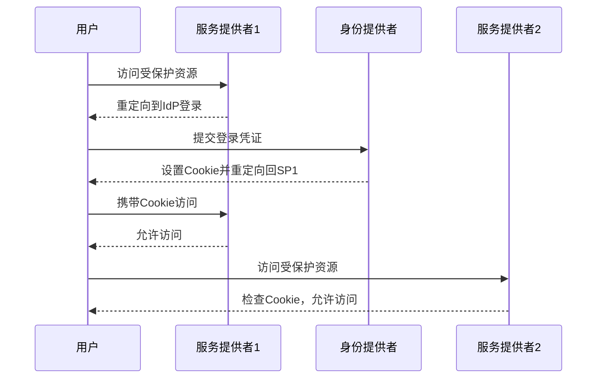

# 1. 单点登录

# 单点登录（SSO）：Java面试八股文详解

***

## 1. 概述与定义

单点登录（SSO）是一种用户认证技术，它允许用户在多个应用系统之间只需登录一次，即可访问所有相互信任的应用系统，而无需重复登录。SSO的核心思想是**一次登录，全局访问**，极大地提升了用户体验和系统的安全性。

在Java开发中，SSO被广泛应用于企业级应用、微服务架构和分布式系统中。常见的SSO实现方式包括基于Cookie的SSO、基于Token的SSO（如JWT）、以及使用第三方认证服务（如OAuth 2.0、SAML等）。无论是在传统的单体应用还是现代的分布式架构中，SSO都扮演着重要的角色。

**正式定义**：单点登录（SSO）是一种用户认证机制，通过在多个应用系统之间共享用户的登录状态，使用户在登录一个系统后，能够自动获得对其他关联系统的访问权限，而无需再次输入凭证。

在面试中，如果被问到“什么是单点登录”，你可以简洁回答：“单点登录是一种用户认证技术，允许用户在多个应用系统之间只需登录一次，即可访问所有信任的应用系统，提升了用户体验和系统的安全性。”这样的回答既准确又简练，非常适合面试场景。

需要注意的是，SSO并不是Java独有的技术，而是通用的认证方案，但在Java生态中，它通常与Spring Security、Shiro等框架结合实现，因此理解其原理和应用对Java工程师尤为重要。

***

## 2. 主要特点

SSO之所以在现代应用中被广泛采用，是因为它具备以下几个显著特点。这些特点不仅是理论要点，也是面试中常见的考察点，值得你熟练背诵并理解：

- **便捷性** 🚀：用户只需登录一次，即可访问多个应用系统，无需重复输入用户名和密码，减少了操作繁琐性。
- **安全性** 🔒：通过集中管理用户的认证信息，减少了密码在多个系统中的分散存储和传输，从而降低泄露风险，并支持更高级的安全策略，如多因素认证（MFA）。
- **可扩展性** 📈：SSO系统可以轻松扩展到新的应用系统，只需将新系统接入SSO服务即可，无需为每个系统单独开发认证模块。
- **集中管理** 🛠️：用户的认证和授权信息集中存储在SSO系统中，便于管理员进行权限控制、用户管理和安全审计。

**面试场景**：如果面试官问“SSO有哪些主要特点”，你可以回答：“SSO的主要特点包括便捷性、安全性、可扩展性和集中管理。便捷性体现在用户只需登录一次，安全性体现在集中认证和更强的安全策略，可扩展性体现在易于接入新系统，集中管理则便于权限控制和审计。”这个回答简洁明了，且覆盖了所有要点。

值得一提的是，虽然SSO提高了安全性，但也可能引入单点故障问题（Single Point of Failure），即SSO服务宕机可能导致所有系统无法认证。这种局限性虽不是主要特点，但在深入讨论时可以适当提及，以展示全面思考能力。

***

## 3. 应用目标

SSO的应用目标是面试中常被提及的理论性问题，理解这些目标能帮助你解释“为什么需要SSO”。以下是它的主要应用目标：

- **提升用户体验**：用户无需记住多个系统的用户名和密码，减少登录操作的繁琐性，尤其是在企业内部系统中，用户可以无缝切换应用。
- **增强系统安全性**：通过集中认证，减少密码在多个系统中的存储和传输，降低因密码管理不当导致的安全风险。
- **简化系统架构**：在微服务或分布式系统中，SSO可以统一管理用户的认证，避免每个服务都实现独立的认证逻辑，从而降低开发和维护成本。
- **支持跨域访问**：在多域名或跨站点的应用中，SSO可以实现无缝的跨域认证，解决传统认证方案的局限性。

**面试场景**：如果被问到“SSO的应用目标是什么”，你可以回答：“SSO的应用目标是提升用户体验、增强系统安全性、简化系统架构和支持跨域访问。例如，在企业内部系统中，用户登录后可以无缝访问邮箱、OA系统和CRM系统，无需重复登录。”这样的回答结合了实际场景，显得更有说服力。

此外，虽然不是主要目标，SSO还能间接提升系统的可维护性，因为认证逻辑集中化后，更新安全策略或修复漏洞时只需修改SSO服务，而无需逐一调整每个应用系统。

***

## 4. 主要内容及其组成部分

SSO系统的实现涉及多个组成部分，理解这些组成部分及其职责是掌握SSO的关键。以下是SSO的主要组成部分，每部分都会进行详尽解释，确保知识点完备：

### 4.1 身份提供者（Identity Provider, IdP）

身份提供者是SSO系统中的核心组件，负责用户的认证和授权。它维护用户的身份信息（如用户名、密码、角色等），并在用户登录时验证其凭证。IdP通常是一个独立的认证服务，可以是LDAP、Active Directory，也可以是基于Java实现的自定义认证服务器。在Java项目中，IdP常与Spring Security集成，通过数据库或第三方服务存储用户数据。

### 4.2 服务提供者（Service Provider, SP）

服务提供者是需要用户认证的应用系统，例如Web应用、API服务或移动端应用。SP不直接处理用户的登录请求，而是将未认证的用户重定向到IdP进行认证。认证成功后，IdP会向SP返回一个认证令牌，SP根据令牌授予用户访问权限。在Java中，SP可能是Spring Boot应用，通过拦截器或过滤器检查用户身份。

### 4.3 认证令牌（Token）

认证令牌是IdP颁发给SP的凭证，用于证明用户的身份。令牌可以是多种形式，包括：

- **Cookie**：在基于Cookie的SSO中，IdP设置一个共享域的Cookie，SP通过读取Cookie验证用户。
- **JWT（JSON Web Token）**：一种轻量级的Token，包含用户身份信息和签名，适合分布式系统。
- **SAML断言**：基于XML的认证数据，常用于跨域SSO。

令牌通常包含用户的身份信息（如用户ID）、过期时间和签名等元数据，确保安全性。

### 4.4 信任关系

IdP和SP之间需要建立信任关系，以确保SP能够验证IdP颁发的令牌的合法性。信任关系通常通过以下方式实现：

- **共享密钥**：IdP和SP使用相同的密钥对令牌进行签名和验证。
- **证书**：IdP使用私钥签名令牌，SP使用公钥验证。
- **配置**：通过配置文件或注册机制明确双方的信任关系。

在Java中，信任关系的实现可能涉及密钥管理库（如Java KeyStore）或配置文件。

### 4.5 会话管理

SSO系统中还需要管理用户的会话状态，例如记录用户是否已登录、何时退出等。会话管理可以由IdP集中处理，也可以通过分布式缓存（如Redis）在多个SP之间共享会话信息。Java项目中，Spring Session是一个常见的会话管理工具。

**表格总结**：以下表格清晰地展示了SSO的主要组成部分及其作用：

| 组成部分  | 作用              | 示例                   |
| ----- | --------------- | -------------------- |
| 身份提供者 | 负责用户认证和授权       | LDAP、认证服务器           |
| 服务提供者 | 需要用户认证的应用系统     | Web应用、API服务          |
| 认证令牌  | 证明用户身份的凭证       | Cookie、JWT、SAML      |
| 信任关系  | 确保IdP和SP之间的安全通信 | 共享密钥、证书              |
| 会话管理  | 维护用户的登录状态       | Spring Session、Redis |

**表格说明**：这个表格列出了SSO的五个核心组成部分，并通过示例说明了它们的作用。身份提供者是认证中心，服务提供者是应用系统，认证令牌是身份凭证，信任关系是安全基础，会话管理确保状态一致性。相比其他部分，会话管理虽不是SSO的必需组件，但在实际应用中不可或缺，因此也纳入表格。

***

## 5. 原理剖析

为了让你在面试中展现深度，我们以基于Cookie的SSO为例，深入剖析SSO的实现原理，并结合代码和图表进行解释。之后还会简要介绍基于Token的SSO，以确保知识点完备。

### 5.1 核心思想

SSO的核心思想是**共享认证状态**。在基于Cookie的SSO中，通过在浏览器中设置一个共享的Cookie（通常是域Cookie），使得多个应用系统可以访问这个Cookie，从而实现用户在不同系统间的自动登录。基于Token的SSO则通过在客户端存储Token并在请求中传递来实现类似效果。

### 5.2 实现流程（基于Cookie的SSO）

1. **用户访问SP1**：用户尝试访问服务提供者SP1的受保护资源。
2. **重定向到IdP**：SP1发现用户未登录，将用户重定向到IdP进行认证，并附带回调地址。
3. **用户登录**：用户在IdP输入用户名和密码进行登录。
4. **IdP颁发令牌**：IdP验证用户凭证后，生成一个认证令牌（如Cookie），设置在共享域下（如`.example.com`），并将用户重定向回SP1，同时附带令牌。
5. **SP1验证令牌**：SP1收到令牌后，验证其合法性，确认用户身份，允许访问。
6. **用户访问SP2**：当用户访问另一个服务提供者SP2时，SP2检查Cookie，发现用户已登录，直接允许访问。

### 5.3 示例代码

以下是一个简化的基于Cookie的SSO流程示例（伪代码），展示Java实现：

```java 
// IdP登录处理
public class IdPController {
    public void login(HttpServletRequest request, HttpServletResponse response) {
        String username = request.getParameter("username");
        String password = request.getParameter("password");
        if (authenticate(username, password)) {
            // 生成认证Cookie
            Cookie cookie = new Cookie("sso_token", generateToken(username));
            cookie.setDomain(".example.com"); // 设置为共享域
            cookie.setPath("/");
            response.addCookie(cookie);
            // 重定向回SP
            String redirectUrl = request.getParameter("redirect_url");
            response.sendRedirect(redirectUrl);
        } else {
            response.getWriter().write("Login failed");
        }
    }

    private boolean authenticate(String username, String password) {
        // 模拟认证逻辑
        return "admin".equals(username) && "123456".equals(password);
    }

    private String generateToken(String username) {
        // 模拟生成令牌
        return Base64.getEncoder().encodeToString((username + System.currentTimeMillis()).getBytes());
    }
}

// SP受保护资源访问
public class SPController {
    public void accessResource(HttpServletRequest request, HttpServletResponse response) throws IOException {
        Cookie[] cookies = request.getCookies();
        String token = getTokenFromCookies(cookies);
        if (token != null && validateToken(token)) {
            // 允许访问
            response.getWriter().write("Welcome, " + getUsernameFromToken(token));
        } else {
            // 重定向到IdP登录
            String idpUrl = "http://idp.example.com/login?redirect_url=" + URLEncoder.encode(request.getRequestURL().toString(), "UTF-8");
            response.sendRedirect(idpUrl);
        }
    }

    private String getTokenFromCookies(Cookie[] cookies) {
        if (cookies != null) {
            for (Cookie cookie : cookies) {
                if ("sso_token".equals(cookie.getName())) {
                    return cookie.getValue();
                }
            }
        }
        return null;
    }

    private boolean validateToken(String token) {
        // 模拟验证令牌
        return token != null && !token.isEmpty();
    }

    private String getUsernameFromToken(String token) {
        // 模拟从令牌中提取用户名
        String decoded = new String(Base64.getDecoder().decode(token));
        return decoded.split("\\d")[0];
    }
}
```


**代码说明**：这段代码展示了IdP和SP的简单实现。IdP验证用户凭证后设置共享Cookie并重定向回SP，SP通过检查Cookie决定是否允许访问。实际项目中，令牌生成和验证会更复杂，通常涉及加密和签名。

### 5.4 原理分析

- **共享Cookie**：通过设置域Cookie（如`.example.com`），所有子域（如`sp1.example.com`、`sp2.example.com`）都可以访问这个Cookie，实现状态共享。
- **重定向机制**：未登录时，SP将用户重定向到IdP，认证成功后IdP再重定向回SP，完成认证流程。
- **令牌验证**：SP通过验证Cookie的合法性确认用户身份，通常需要与IdP共享密钥或使用签名机制。

### 5.5 Mermaid 时序图

以下是SSO认证流程的时序图，直观展示其工作流程：




**图表说明**：这个时序图展示了用户在SSO系统中的认证流程。用户首次访问SP1时，被重定向到IdP登录，登录成功后，IdP设置Cookie并重定向回SP1。随后，用户访问SP2时，SP2通过共享Cookie直接允许访问，无需再次登录。

### 5.6 基于Token的SSO（补充）

基于Cookie的SSO受限于同域策略，而基于Token的SSO（如JWT）适用于跨域和分布式场景。其流程为：

1. 用户登录IdP，获得JWT令牌。
2. 客户端将JWT附在请求头中发送给SP。
3. SP验证JWT签名和有效性，确认用户身份。

### 5.7 优点与局限性

- **优点**：
  - 提升用户体验，减少登录次数。
  - 集中管理认证，增强安全性。
  - 易于扩展到新应用系统。
- **局限性**：
  - 基于Cookie的SSO受限于同域策略，不适用于跨顶级域。
  - Cookie可能面临CSRF攻击，需要防护措施。
  - IdP宕机会导致单点故障。

**面试场景**：如果面试官要求深入讲解SSO的原理，你可以结合上述流程、代码和图表，详细说明每个步骤的职责和协作方式，并补充基于Token的SSO和优缺点分析，展现你的深度理解。

***

## 6. 应用与拓展

SSO在Java开发中应用广泛，以下是几个典型的应用场景和拓展方向：

### 6.1 应用场景

- **企业内部系统**：如OA系统、CRM系统、ERP系统等，通过SSO实现统一登录，提高员工效率。
- **微服务架构**：SSO统一管理用户认证，避免每个微服务重复实现登录逻辑，常见工具包括Spring Cloud Gateway集成SSO。
- **第三方登录**：如使用Google、Facebook等第三方账号登录应用，基于OAuth 2.0实现。

### 6.2 拓展方向

- **基于Token的SSO**：使用JWT实现无状态SSO，适合分布式系统和跨域场景。
- **OAuth 2.0**：一种授权框架，常用于第三方登录和API授权。
- **SAML**：基于XML的安全断言标记语言，用于跨域身份验证，常见于企业级应用。

**代码示例（JWT-based SSO）**：

```java 
import io.jsonwebtoken.Jwts;
import io.jsonwebtoken.SignatureAlgorithm;

public class JwtUtil {
    private static final String SECRET_KEY = "secretKey";

    // 生成JWT令牌
    public static String generateJwtToken(String username) {
        return Jwts.builder()
                .setSubject(username)
                .setIssuedAt(new Date())
                .setExpiration(new Date(System.currentTimeMillis() + 3600000)) // 1小时有效期
                .signWith(SignatureAlgorithm.HS256, SECRET_KEY)
                .compact();
    }

    // 验证JWT令牌
    public static boolean validateJwtToken(String token) {
        try {
            Jwts.parser().setSigningKey(SECRET_KEY).parseClaimsJws(token);
            return true;
        } catch (Exception e) {
            return false;
        }
    }

    // 获取用户名
    public static String getUsernameFromToken(String token) {
        return Jwts.parser().setSigningKey(SECRET_KEY).parseClaimsJws(token).getBody().getSubject();
    }
}
```


**代码说明**：这段代码使用JJWT库生成和验证JWT令牌，适用于微服务中的SSO实现。实际项目中，还需考虑密钥管理、刷新令牌等问题。

**面试场景**：如果被问到“SSO有哪些应用场景”，你可以回答：“SSO广泛应用于企业内部系统、微服务架构和第三方登录等场景。在企业中，它让员工登录一次即可访问多个系统；在微服务中，它统一认证，简化架构；在第三方登录中，它允许用户使用社交账号登录应用。”

***

## 7. 面试问答

以下是五个常见面试问题及详细回答，模仿面试者口吻，确保内容详实且易于背诵。

### 7.1 什么是单点登录（SSO）？

“面试官您好，单点登录（SSO）是一种用户认证技术，允许用户在多个应用系统之间只需登录一次，即可访问所有信任的应用系统。它通过共享用户的登录状态，提升了用户体验和系统的安全性。常见的实现方式包括基于Cookie的SSO和基于Token的SSO，比如JWT。在Java开发中，SSO常与Spring Security等框架结合使用。”

### 7.2 SSO的主要组成部分有哪些？

“SSO主要包括身份提供者（IdP）、服务提供者（SP）、认证令牌、信任关系和会话管理。IdP负责用户认证，比如LDAP或自定义服务器；SP是需要认证的应用系统，比如Web应用；认证令牌是用户身份凭证，可以是Cookie或JWT；信任关系通过共享密钥或证书确保安全；会话管理维护登录状态，可能用到Redis或Spring Session。”

### 7.3 基于Cookie的SSO是如何工作的？

“基于Cookie的SSO通过共享域Cookie实现。用户访问SP时，如果未登录，SP会重定向到IdP。用户在IdP登录后，IdP生成一个共享Cookie，比如设置在`.example.com`域下，然后重定向回SP。SP验证Cookie后允许访问。之后用户访问其他SP时，这些SP也能读取Cookie，实现自动登录。”

### 7.4 SSO与OAuth 2.0有什么区别？

“SSO和OAuth 2.0都是认证和授权技术，但侧重点不同。SSO关注用户在多个系统间的无缝登录，比如企业内部系统的一次登录全局访问；而OAuth 2.0是一种授权框架，用于授权第三方应用访问用户资源，比如用Google账号登录其他应用。OAuth 2.0可以用来实现SSO，但SSO不一定依赖OAuth 2.0。”

### 7.5 在微服务架构中如何实现SSO？

“在微服务架构中，我会选择基于Token的SSO，比如用JWT。用户登录IdP后，IdP颁发一个JWT令牌，客户端将令牌附在请求头中发送给各个微服务。微服务通过验证令牌的签名和有效性确认用户身份。这种方式无状态，适合分布式系统。Java中可以用Spring Security和JJWT库实现。”

***

## 总结

单点登录（SSO）是Java面试中的高频知识点，掌握它不仅能提升你的技术能力，还能在面试中展现你的专业素养。本文从概述与定义到原理剖析，再到应用场景和面试问答，全面覆盖了SSO的核心内容。通过示例代码、表格和Mermaid图表的辅助，你可以更直观地理解SSO的实现和原理。希望你通过反复背诵和实践，能在面试中自信应对SSO相关问题，拿到心仪的offer！
