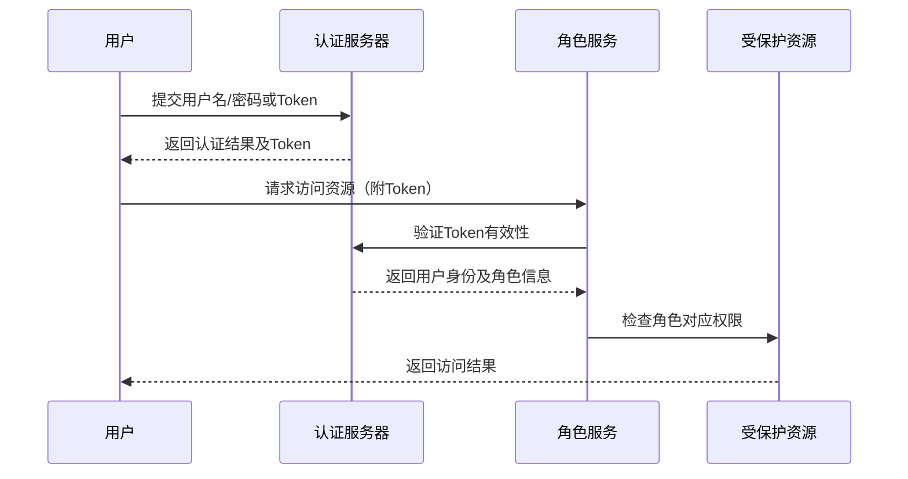

# 2. 权限认证

# 1. 概述与定义

权限认证（RBA，Role Based Authentication/Authorization）是一种基于角色的安全管理机制，其核心思想在于将用户身份认证与权限授权相结合，通过对用户、角色、权限等多维度数据进行管理，实现对系统资源访问的精细化控制。在这种模式下，用户首先进行身份认证（Authentication），确认用户的合法性；随后根据用户所属的角色进行权限授权（Authorization），确定其能访问哪些资源或执行哪些操作。💡

在实际开发中，权限认证通常作为安全体系的第一道防线，既可以防止未授权用户非法访问敏感数据，又能确保系统功能仅对具备相应权限的用户开放。常见的权限认证方案有基于会话的认证、Token认证（如JWT）、OAuth2等，而基于角色的权限认证更侧重于通过角色的划分来简化权限管理。通过这种方式，不仅能够降低系统的复杂度，还能够满足企业中大规模用户权限管理的需求。

# 2. 主要特点

权限认证（RBA）具有以下几个显著特点：

- **分层管理**：通过将用户、角色和权限进行分层管理，使得权限体系结构清晰。用户只需绑定一个或多个角色，角色再与权限进行映射，降低了直接为每个用户分配权限的复杂度。😊
- **集中控制与动态调整**：所有权限配置集中管理，可以在系统运行时动态调整用户角色、角色权限映射关系，满足不断变化的业务需求。🔧
- **灵活扩展**：基于角色的权限认证可以轻松应对业务拓展，例如新增业务模块时，只需新增相应的权限与角色映射，无需大范围修改系统代码，实现开放-封闭原则。
- **细粒度授权**：支持对资源、操作、数据等多维度进行权限划分，实现细粒度的访问控制。通过分配不同权限，可以精确控制用户对系统的操作范围，防止权限滥用。
- **兼容多种认证机制**：权限认证可以与多种认证方式（如基于Session、Token、OAuth2等）无缝结合，为不同场景提供统一的安全策略。
- **高安全性**：通过对用户身份进行严格验证，并基于角色授予相应权限，能够有效防范未经授权的访问，同时减少权限提升、横向越权等安全漏洞。🔒

上述特点使得权限认证在实际开发中成为企业级应用中不可或缺的安全设计思想。

# 3. 应用目标

权限认证（RBA）的应用目标主要集中在以下几个方面：

1. **保障系统安全** &#x20;

   通过身份认证与权限授权，确保只有合法用户才能访问系统资源，杜绝非法访问和攻击风险。
2. **简化权限管理** &#x20;

   利用角色对用户进行统一管理，避免为每个用户单独分配权限，降低运维难度和出错概率。
3. **实现细粒度控制** &#x20;

   对不同模块、不同操作以及不同数据层次进行细分授权，确保用户仅能操作其被允许的部分，从而最大程度地保护敏感信息。
4. **支持动态扩展与变更** &#x20;

   通过集中管理的方式，能够在系统升级、业务拓展时，动态调整权限体系而不影响现有系统稳定性。
5. **提高用户体验** &#x20;

   在满足安全要求的前提下，通过合理的权限划分和授权流程，确保用户在系统中能够快速定位到所需功能，提升整体体验。
6. **合规性要求** &#x20;

   对于金融、医疗等行业，权限认证往往是符合国家安全标准与法规的重要手段，保障数据隐私和系统合规。

# 4. 主要内容及其组成部分

基于角色的权限认证体系主要由以下几部分构成，每一部分均承担着独立而重要的角色，下面将对每个组成部分进行详细说明。

## 4.1 用户（User）

用户是权限认证的主体，代表具体的系统使用者。在实际系统中，用户通常包含以下属性：

- 用户ID、用户名、密码等基本信息
- 绑定的角色信息
- 其他认证信息（如邮箱、手机号、认证令牌等）

用户通过认证后，其身份信息会与角色、权限进行绑定，从而实现资源访问的控制。

## 4.2 角色（Role）

角色是权限认证体系中的中间层，用于将权限进行逻辑分组。角色通常代表一个岗位或职责，比如管理员、普通用户、审核员等。角色的主要作用是：

- 集中管理权限：一个角色可以关联多个权限，用户只需要绑定角色即可获得相应的访问权限。
- 简化权限分配：在大量用户中只需维护角色与权限的对应关系，避免为每个用户单独配置权限。
- 支持层级和继承：在复杂系统中，角色之间可以设置层级或继承关系，实现更为细致的权限控制。

## 4.3 权限（Permission）

权限是对系统资源或操作的具体授权，通常包括：

- 资源权限：如文件访问、API调用、数据查看等
- 操作权限：如新增、删除、修改、查询等
- 数据权限：如数据行级、列级的访问控制

权限可以细化到操作级别，确保用户只能在被允许的范围内操作数据和系统功能。

## 4.4 认证机制（Authentication Mechanism）

认证机制负责验证用户身份的合法性，常见的认证方式包括：

- 基于密码的认证：最常见的方式，用户输入用户名和密码进行验证。
- Token认证：如JWT（JSON Web Token），在分布式系统中广泛应用，能够实现无状态认证。
- 第三方认证：如OAuth2、CAS、LDAP等，通过第三方平台实现用户身份验证。

认证机制决定了用户进入系统后的身份标识，为后续的权限授权提供依据。

## 4.5 授权机制（Authorization Mechanism）

授权机制负责根据用户所属角色，判断并决定用户是否有权访问特定资源或执行某项操作。授权通常分为：

- 静态授权：在系统配置文件或数据库中预先设定角色与权限的映射关系，用户登录后直接加载。
- 动态授权：基于实时策略或业务规则，在用户每次请求时动态计算权限判断结果，适用于变化频繁的业务场景。

授权机制确保只有具备相应角色和权限的用户才能操作敏感资源，从而保障系统安全。

## 4.6 安全审计与日志记录

权限认证体系中，安全审计和日志记录是必不可少的组成部分。它主要包括：

- 用户登录、注销、权限变更等关键操作的日志记录
- 异常访问、非法请求等安全事件的监控与报警
- 后台审计系统，对用户操作进行追踪，以便出现问题时能够溯源调查

安全审计不仅有助于提升系统安全性，还能满足合规性要求和运营监管需求。

## 4.7 数据加密与传输安全

为了防止敏感信息泄露，权限认证体系中通常会采用数据加密与传输加密措施，例如：

- 用户密码加密存储（如使用bcrypt、PBKDF2等算法）
- 通信加密：使用SSL/TLS协议保护客户端与服务器之间的数据传输
- Token签名与验证：确保Token在传输过程中不被篡改

下表展示了权限认证系统中各组成部分及其主要职责：

| 组成部分           | 主要职责                            | 示例说明                         |
| -------------- | ------------------------------- | ---------------------------- |
| 用户（User）       | 存储用户基本信息，绑定角色及其他认证信息            | 用户ID、用户名、密码、绑定角色等            |
| 角色（Role）       | 对权限进行分组管理，简化用户权限配置              | 管理员、普通用户、审核员等                |
| 权限（Permission） | 定义具体的资源访问或操作权限，确保访问控制细粒度实现      | 新增、删除、修改、查询等权限               |
| 认证机制           | 验证用户身份合法性，包括密码认证、Token认证、第三方认证等 | JWT、OAuth2、LDAP认证等           |
| 授权机制           | 根据用户角色判断访问权限，支持静态和动态授权          | 基于数据库配置的静态授权、实时计算动态授权        |
| 安全审计           | 记录关键操作日志，监控异常事件，便于追踪溯源          | 登录日志、权限变更日志、安全报警等            |
| 数据加密           | 保护敏感数据存储和传输安全                   | 密码加密存储、SSL/TLS传输保护、Token签名验证 |

# 5. 原理剖析

深入探讨权限认证（RBA）的原理，主要包括认证与授权的分离、角色权限映射机制、策略实现以及安全保障手段。

## 5.1 认证与授权分离

权限认证体系遵循“认证与授权分离”的原则。 &#x20;

- **认证（Authentication）**：负责确认用户身份的合法性。用户通过输入用户名、密码或提供第三方认证凭证后，系统会进行验证，并生成用户的身份标识（如Token）。 &#x20;
- **授权（Authorization）**：在用户身份得到确认后，根据预设的角色与权限映射关系，判断用户是否具备访问某项资源或操作的权限。 &#x20;

这种分离有助于降低系统耦合性，同时使得两部分逻辑可以分别扩展和优化。

## 5.2 角色与权限的映射机制

角色与权限之间的映射关系是权限认证的核心。通常，系统会通过数据库或配置文件预先定义好角色与权限的对应关系。用户登录后，系统会根据用户的角色加载相应权限，并缓存至会话中。 &#x20;

例如，管理员角色可能具备“新增用户”、“删除用户”、“修改配置”等权限，而普通用户仅具备“查看数据”、“修改个人信息”等权限。 &#x20;

这种映射机制支持层级关系与继承，例如： &#x20;

- 角色A包含权限{p1, p2, p3} &#x20;
- 角色B包含权限{p2, p4} &#x20;
- 用户如果同时拥有角色A与角色B，其权限集合为{p1, p2, p3, p4}。 &#x20;

## 5.3 动态授权策略

静态授权适用于权限关系稳定的场景，而对于业务变化频繁的系统，动态授权显得尤为重要。动态授权通过实时计算当前用户权限与请求资源之间的匹配关系，能够更灵活地应对权限变更、权限继承以及临时授权等需求。 &#x20;

例如，在微服务架构中，每个服务可能存在独立的权限策略，通过中间件或API网关进行动态权限验证，确保统一安全策略执行。

## 5.4 安全加固措施

为了保证权限认证体系的安全性，还需要引入多重安全加固措施： &#x20;

- **数据加密**：对敏感数据（如用户密码、Token等）进行加密存储和传输，防止窃听和篡改。 &#x20;
- **Token防伪**：采用数字签名和校验机制确保Token未被伪造，常用JWT中包含签名验证。 &#x20;
- **日志审计**：对所有权限操作进行日志记录，便于异常检测和事后追踪。 &#x20;
- **权限最小化原则**：在分配权限时，遵循最小权限原则，确保用户仅获得完成任务所需的最少权限，从而降低潜在安全风险。 &#x20;

## 5.5 Mermaid时序图解析

下面通过时序图展示用户请求认证与授权的整体流程：

时序图说明： &#x20;

- 用户首先向认证服务器提交身份信息，认证通过后获得Token； &#x20;
- 用户携带Token向角色服务请求访问受保护资源； &#x20;
- 角色服务验证Token，并根据用户角色判断是否允许访问； &#x20;
- 最终返回给用户相应的访问结果。 &#x20;

这种设计既保证了认证与授权分离，又确保了权限验证的动态性和灵活性。👍

# 6. 应用与拓展

权限认证在企业级应用中应用极为广泛，下面详细说明其常见应用场景及扩展思路。

## 6.1 常见应用场景

- **Web应用安全** &#x20;

  在基于Spring Security、Apache Shiro等安全框架的Web应用中，权限认证负责用户登录、角色权限分配、请求拦截与访问控制，确保系统仅对具备合法权限的用户开放相应功能。
- **微服务架构** &#x20;

  在微服务体系中，各服务之间需要统一的权限认证机制。通过API网关、Token认证等手段，实现跨服务的权限验证，同时在各服务内部根据角色进行细粒度授权。
- **移动端与前后端分离应用** &#x20;

  移动端常采用JWT或OAuth2进行认证，前端携带Token访问后端接口。后端系统依据Token解析出的用户角色与权限进行访问控制，保证数据安全。
- **企业管理系统** &#x20;

  在ERP、CRM等企业级系统中，用户种类繁多，通过基于角色的权限认证能有效管理各部门、各岗位的访问权限，确保信息安全与操作合规。

## 6.2 拓展思路

- **与单点登录（SSO）结合** &#x20;

  将权限认证体系与SSO结合，实现跨系统的统一认证与授权，提升用户体验和管理效率。
- **基于策略的动态权限控制** &#x20;

  通过引入策略引擎，根据实时业务规则和上下文数据动态调整用户权限，满足临时授权、时间限制访问等特殊需求。
- **与安全审计平台对接** &#x20;

  集成安全审计平台，对所有权限相关操作进行监控和报警，实现安全事件的实时响应。
- **支持多维度权限控制** &#x20;

  除了角色权限控制外，还可以扩展数据权限、操作权限等多维度授权策略，实现更细粒度的安全管理。
- **利用缓存与分布式技术优化性能** &#x20;

  在高并发场景下，通过引入缓存机制（如Redis）存储用户权限信息，以及分布式鉴权服务，降低系统压力，确保权限认证快速响应。

# 7. 面试问答

下面是模拟面试问答部分，从面试者角度出发，详细解答关于权限认证（RBA）的常见问题，共包含五个部分。

### 问题1：什么是基于角色的权限认证？其主要流程是什么？

回答示例： &#x20;

“基于角色的权限认证是一种将用户身份认证与角色权限授权相结合的安全机制。基本流程包括：首先用户进行身份认证，通过用户名密码或Token等方式验证合法性；随后系统根据用户所拥有的角色加载预设的权限信息；最后在用户请求访问资源时，系统对比用户角色与资源要求，决定是否允许访问。这样不仅降低了单个用户权限配置的复杂度，也便于系统统一管理和动态调整权限。” 😊

### 问题2：如何设计一个灵活的权限认证系统，确保其既满足细粒度控制又具备高性能？

回答示例： &#x20;

“设计灵活的权限认证系统时，我会采取以下策略： &#x20;

1. 将认证和授权逻辑分离，采用Token认证（如JWT）实现无状态认证； &#x20;
2. 通过数据库或配置文件定义角色与权限映射，并使用缓存（如Redis）存储权限数据，提升访问效率； &#x20;
3. 利用注解和AOP实现对受保护接口的动态拦截与权限验证，保证代码模块化； &#x20;
4. 引入分布式鉴权服务，实现跨服务的统一权限认证； &#x20;
5. 定期进行安全审计和日志分析，确保系统运行过程中无异常权限访问。 &#x20;

这些措施能够实现细粒度权限控制的同时保证系统高性能。” 🔥

### 问题3：如何避免权限提升和横向越权问题？

回答示例： &#x20;

“避免权限提升和横向越权问题，我主要采取以下措施： &#x20;

1. 严格按照最小权限原则，为用户分配最少必要的权限； &#x20;
2. 在设计角色与权限映射时，确保角色定义清晰，避免权限重叠； &#x20;
3. 在每个受保护资源访问点进行严格验证，使用中间件或AOP对接口进行统一拦截； &#x20;
4. 对敏感操作设置额外的安全验证，例如双因子认证或验证码机制； &#x20;
5. 定期进行安全测试和代码审计，及时发现并修复潜在漏洞。 &#x20;

通过这些措施，可以大大降低因权限配置不当而引起的安全风险。” 🔒

### 问题4：在实际项目中，你如何处理权限认证的动态调整和多系统统一认证问题？

回答示例： &#x20;

“在实际项目中，我会采用单点登录（SSO）方案来实现跨系统统一认证，并通过Token（如JWT）实现无状态鉴权。权限信息存储在集中式数据库中，同时利用缓存技术提高查询效率。对于动态调整，我会设计一个灵活的权限管理后台，使得管理员可以实时调整角色权限映射，而无需重启系统。通过这种方式，既保证了各系统认证的统一性，又能灵活应对业务需求的变化。” 🚀

### 问题5：请举例说明你在项目中如何利用Spring Security或其他框架实现权限认证，并谈谈其中的关键点。

回答示例： &#x20;

“在最近的一个项目中，我们使用Spring Security构建了基于角色的权限认证系统。具体做法如下： &#x20;

1. 配置Spring Security拦截器，对每个请求进行过滤； &#x20;
2. 利用UserDetailsService加载用户信息，并通过BCrypt对密码进行加密存储； &#x20;
3. 在用户登录成功后，系统生成JWT令牌，并通过过滤器实现Token解析与验证； &#x20;
4. 使用注解（如@PreAuthorize）在Controller层限制方法访问，依据用户角色判断权限； &#x20;
5. 同时，通过自定义异常处理机制捕获权限不足时的异常，并返回友好提示。 &#x20;

关键点在于确保认证和授权逻辑分离、Token安全性以及细粒度权限配置，最终实现系统高安全性与灵活性。” 😊

# 总结

基于角色的权限认证（RBA）作为企业级安全管理的重要组成部分，既涵盖了用户身份认证、角色管理、权限授权等多层次概念，又涉及动态授权、数据加密、安全审计等关键技术。通过对各组成部分的详细剖析和实际应用场景的说明，我们可以看到该体系如何有效实现系统安全、降低运维复杂度，并满足高并发与分布式环境下的安全需求。结合Spring Security、JWT、OAuth2等现代技术手段，开发者不仅能够构建出高效、灵活的权限认证系统，也能在面试中从容回答相关问题，展示扎实的技术实力。希望以上内容能够帮助各位在面试中对权限认证相关知识点进行全面复习，取得优异成绩。
