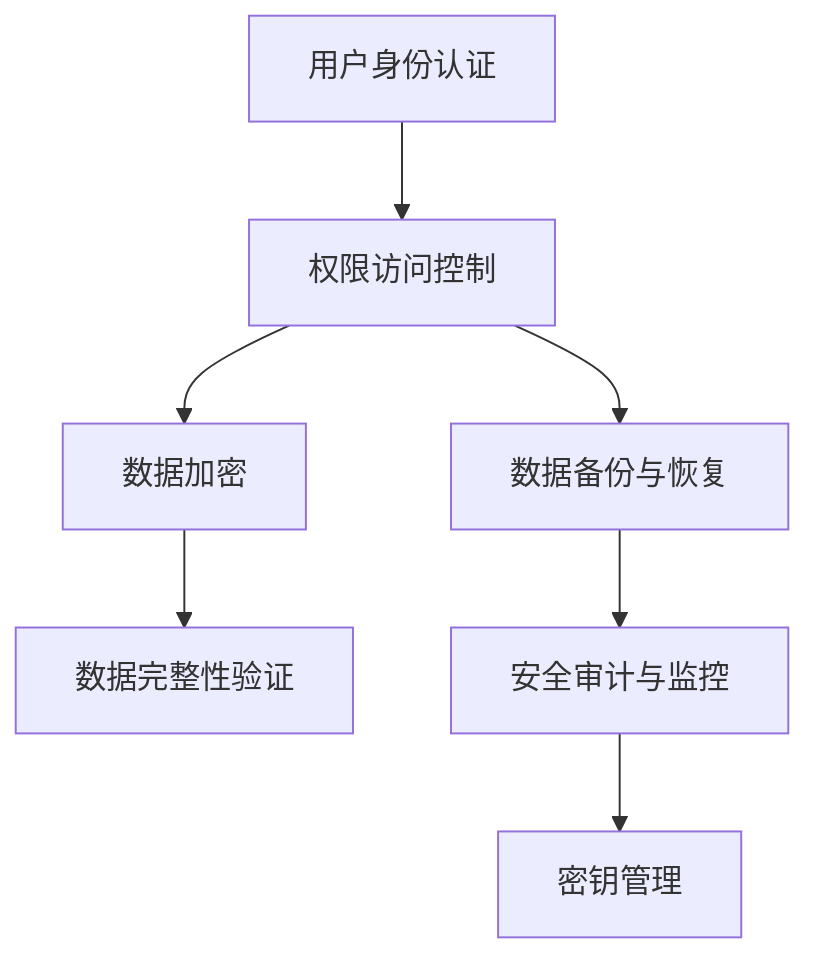

# 3. 数据安全

# 1. 概述与定义

数据安全是一门涉及保护数据免受未经授权访问、泄露、篡改、破坏以及丢失的技术与管理体系。它贯穿于数据从产生、存储、传输到销毁的整个生命周期。数据安全不仅包括对数据本身的保护，还涉及对数据传输过程、存储环境、访问权限以及系统安全策略的全面保障。💡

在现代企业中，数据安全具有至关重要的地位。无论是用户的个人信息、企业的核心数据，还是国家的重要情报，都需要通过加密、访问控制、数据备份、审计监控等多种技术手段来确保数据的机密性、完整性和可用性。数据安全遵循“保密性、完整性、可用性”（Confidentiality, Integrity, Availability，简称CIA）的基本原则，同时还涵盖身份认证、非否认性（Non-repudiation）、访问控制等方面的内容。数据安全的目标在于防止数据泄露、数据被篡改以及系统服务中断，保障系统在面对内外部威胁时能够持续稳定地运行。

# 2. 主要特点

数据安全具有以下几个显著特点：

- **保密性**：确保数据仅对授权用户开放，通过加密技术、访问控制等方式防止未授权人员访问敏感数据。🔒 &#x20;
- **完整性**：保证数据在存储、传输和处理过程中不被未经授权的修改，采用校验、数字签名等技术手段验证数据的完整性。 &#x20;
- **可用性**：确保授权用户在需要时能够及时、有效地访问信息和服务，防止由于攻击或故障导致数据不可用。 &#x20;
- **不可否认性**：通过日志审计和数字签名等技术，确保数据操作有据可查，用户操作行为不能否认。 &#x20;
- **动态防护**：数据安全体系具备动态防护和实时监控的能力，能够根据系统状态和风险级别自动调整安全策略。 &#x20;
- **分层防御**：采用多层次、多维度的安全防护手段，从网络、主机、应用到数据层面构建全方位的安全防护体系。😊

这些特点相辅相成，共同构成了数据安全的基本保障体系，为企业和组织提供了坚实的数据防护屏障。

# 3. 应用目标

数据安全在现代信息系统中承担着多重目标，其主要应用目标包括：

1. **防止数据泄露** &#x20;

   通过加密、访问控制等措施，确保敏感数据在存储和传输过程中不被未经授权的人员获取，从而降低泄露风险。
2. **保障数据完整性** &#x20;

   利用校验算法、数字签名和版本控制等手段，确保数据在存储、修改和传输过程中保持一致和准确，防止数据被篡改或损坏。
3. **提高系统可用性** &#x20;

   通过冗余备份、灾备方案、容错机制等措施，确保数据在遇到故障、攻击或自然灾害时能够快速恢复，保证业务连续性。
4. **满足合规要求** &#x20;

   遵循GDPR、HIPAA、PCI-DSS等国家和行业安全标准，确保企业在数据处理过程中符合相关法规要求，避免法律风险。
5. **降低安全成本** &#x20;

   通过统一的数据安全策略和自动化监控，减少因安全漏洞、数据泄露和攻击带来的损失，提高整体系统安全性与经济效益。
6. **提升用户信任** &#x20;

   通过严格的数据安全保护措施，增强用户对系统和企业的信任，从而促进业务发展和品牌声誉的提升。🚀

数据安全不仅是技术层面的需求，更是企业战略的重要组成部分，既能保护核心数据，又能提升市场竞争力。

# 4. 主要内容及其组成部分

数据安全的体系结构复杂，涉及多种技术手段和管理机制。下面将详细介绍数据安全所包含的主要组成部分及其核心内容：

## 4.1 数据加密

数据加密是保护数据不被未授权访问的首要手段。常见的加密方式包括对称加密、非对称加密和哈希算法。

- **对称加密**：如AES、DES等，使用相同密钥对数据进行加密与解密，速度较快，适用于大数据量加密。 &#x20;
- **非对称加密**：如RSA、ECC等，使用一对公钥和私钥进行加密与解密，安全性较高，常用于数据传输中的密钥交换。 &#x20;
- **哈希算法**：如SHA-256、MD5等，用于生成数据摘要，验证数据完整性。

示例代码：使用Java实现AES加密

```java 
import javax.crypto.Cipher;
import javax.crypto.KeyGenerator;
import javax.crypto.SecretKey;
import javax.crypto.spec.SecretKeySpec;
import java.util.Base64;

public class AESDemo {
    public static void main(String[] args) throws Exception {
        String data = "敏感数据需要加密";
        // 生成AES密钥
        KeyGenerator keyGen = KeyGenerator.getInstance("AES");
        keyGen.init(128);
        SecretKey secretKey = keyGen.generateKey();
        byte[] keyBytes = secretKey.getEncoded();
        
        // 创建Cipher对象，指定加密算法
        Cipher cipher = Cipher.getInstance("AES");
        cipher.init(Cipher.ENCRYPT_MODE, new SecretKeySpec(keyBytes, "AES"));
        byte[] encryptedBytes = cipher.doFinal(data.getBytes("UTF-8"));
        
        // 输出Base64编码后的加密数据
        String encryptedData = Base64.getEncoder().encodeToString(encryptedBytes);
        System.out.println("加密后的数据：" + encryptedData);
    }
}
```


该示例展示了如何使用AES算法对敏感数据进行加密，确保数据在存储和传输过程中不被轻易获取。

## 4.2 数据备份与恢复

数据备份是确保数据在遭受攻击、硬件故障或人为错误时能够迅速恢复的重要措施。数据备份可以分为全量备份、增量备份和差异备份，通常结合离线备份、云备份等方式构建高可用的数据恢复体系。

- **全量备份**：备份系统中的所有数据，恢复速度快，但备份量大。 &#x20;
- **增量备份**：仅备份上一次备份后发生变化的数据，备份效率高，但恢复时需要依赖多个备份文件。 &#x20;
- **差异备份**：备份上次全量备份后所有变化的数据，介于全量与增量之间。

## 4.3 数据访问控制

数据访问控制通过用户认证、授权、审计等手段实现对数据的严格管理。常见的访问控制模型包括：

- **基于角色的访问控制（RBAC）** &#x20;
- **基于属性的访问控制（ABAC）** &#x20;
- **基于策略的访问控制**

这些模型通过对用户、角色与资源之间的关系进行定义，实现数据的细粒度访问控制，确保只有具备相应权限的用户才能操作数据。

## 4.4 数据完整性保护

数据完整性保护旨在保证数据在传输和存储过程中的准确性和一致性，常用技术包括：

- **校验和与散列算法**：利用MD5、SHA系列算法生成数据摘要，验证数据是否被篡改。 &#x20;
- **数字签名**：使用非对称加密技术对数据进行签名，确保数据来源可信且未被篡改。 &#x20;
- **区块链技术**：通过分布式账本保证数据不可篡改，应用于金融、供应链等领域。

## 4.5 安全审计与监控

安全审计通过记录用户操作日志、系统事件和异常行为，实现对数据安全事件的监控与追溯。主要措施包括：

- **日志记录**：记录用户登录、数据修改、权限变更等关键操作，便于事后追查。 &#x20;
- **实时监控**：通过安全信息与事件管理系统（SIEM）对异常行为进行实时监控和报警。 &#x20;
- **安全审计报告**：定期生成安全审计报告，评估系统安全状况，并对潜在风险进行预警。

## 4.6 数据脱敏与隐私保护

数据脱敏是对敏感数据进行处理，使其在测试、开发或外部共享时不泄露真实信息。常用脱敏方法包括数据替换、数据掩码、数据加扰等。隐私保护则侧重于合规性，确保数据处理符合GDPR等隐私法规。

## 4.7 密钥管理

密钥管理是整个数据安全体系的核心。其内容包括密钥生成、分发、存储、更新、回收等生命周期管理。完善的密钥管理可以防止密钥泄露和滥用，保障加密机制的有效性。

下表对数据安全主要组成部分进行总结说明：

| 组成部分      | 主要职责                           | 示例说明             |
| --------- | ------------------------------ | ---------------- |
| 数据加密      | 通过对称/非对称加密、哈希算法保护数据不被未授权访问     | AES、RSA、SHA-256等 |
| 数据备份与恢复   | 定期备份数据，确保在数据损坏或攻击时能迅速恢复        | 全量备份、增量备份、差异备份   |
| 数据访问控制    | 管理用户、角色与权限关系，实现细粒度的数据操作权限控制    | RBAC、ABAC、策略控制   |
| 数据完整性保护   | 保证数据在存储与传输过程中未被篡改，确保数据准确一致     | 校验和、数字签名、区块链     |
| 安全审计与监控   | 记录用户操作、系统事件，实时监控异常行为，提供追溯依据    | 日志系统、SIEM、安全报告   |
| 数据脱敏与隐私保护 | 对敏感数据进行处理，确保数据在共享或外部访问时不泄露真实信息 | 数据掩码、脱敏算法、隐私协议   |
| 密钥管理      | 管理加密密钥的全生命周期，确保密钥安全，防止泄露和滥用    | 密钥生成、分发、更新与回收    |

# 5. 原理剖析

数据安全的实现原理涵盖了加密算法、访问控制模型、数据完整性验证以及系统审计等多个方面，下面将详细解析各项核心技术与设计思想。

## 5.1 加密算法原理

加密算法是数据安全的重要组成部分，其基本原理在于利用数学方法将明文数据转换为密文，只有持有正确密钥的用户才能解密恢复明文。 &#x20;

- **对称加密算法**：如AES、DES，优点在于速度快、适合大数据量加密，但密钥传输和管理较为复杂。 &#x20;
- **非对称加密算法**：如RSA、ECC，通过公钥和私钥对实现加密和解密，解决了密钥分发问题，但计算速度较慢。 &#x20;
- **哈希算法**：通过单向函数将数据映射为固定长度的摘要，常用于验证数据完整性和密码存储。

这些加密技术在实际应用中往往组合使用，例如在TLS协议中使用非对称加密进行密钥交换，然后使用对称加密进行数据传输，确保通信安全。

## 5.2 访问控制模型

访问控制模型确保只有授权用户可以访问特定数据。主要模型包括：

- **基于角色的访问控制（RBAC）**：将权限与角色绑定，用户通过角色获得相应权限，适用于大规模企业应用。 &#x20;
- **基于属性的访问控制（ABAC）**：根据用户、资源、环境等多个属性动态决定访问权限，适应灵活多变的业务需求。 &#x20;
- **基于策略的访问控制**：通过预定义安全策略来过滤访问请求，实现精细化控制。

这些模型通过分层防御实现多重校验，确保数据访问的合法性和安全性。

## 5.3 数据完整性验证

数据完整性验证通常采用散列算法和数字签名技术，确保数据在传输与存储过程中未被修改。 &#x20;

- 散列算法将任意长度数据转换为固定长度摘要，任意微小变化都会导致摘要不同； &#x20;
- 数字签名通过非对称加密技术生成，确保数据来源可信、未被篡改。

## 5.4 安全审计与日志分析

安全审计通过记录用户操作和系统事件，构成一条完整的追踪链。日志分析能够实时发现异常行为并触发报警，从而及时采取补救措施。此过程依赖于集中日志管理系统和实时监控平台（如SIEM）。

## 5.5 Mermaid图示数据安全体系

下面利用Mermaid语法展示一个典型数据安全体系的结构图，展示各层之间的关系：




图中展示了数据安全体系的主要组成部分：从用户身份认证开始，经由权限访问控制，数据在传输和存储过程中均通过加密、完整性验证和备份措施进行保护，同时通过安全审计与监控和密钥管理形成闭环，确保全流程数据安全。

# 6. 应用与拓展

数据安全技术在实际应用中具有广泛的适用性，下面介绍其主要应用场景和未来的拓展方向。

## 6.1 应用场景

- **企业级应用** &#x20;

  大型企业系统中，数据安全贯穿于客户信息、交易记录、内部管理数据等各个环节，通过数据加密、访问控制和审计监控确保业务安全。
- **金融系统** &#x20;

  银行、证券等金融系统对数据安全要求极高，必须采用多重加密、实时监控和严格权限管理，防止金融诈骗和数据泄露。
- **电子商务平台** &#x20;

  电商平台涉及海量用户数据和交易信息，数据安全技术确保用户隐私、支付信息安全和订单数据完整性。
- **云计算与大数据** &#x20;

  在云计算环境中，数据分布在多个节点上，采用分布式加密、容灾备份和权限控制，保障数据在跨区域传输中的安全性。
- **移动应用与物联网** &#x20;

  移动端应用和物联网设备常面临恶意攻击，需结合设备认证、数据加密和安全传输协议保障终端数据安全。

## 6.2 拓展方向

- **零信任架构** &#x20;

  零信任安全理念强调“永不信任，始终验证”，通过细粒度访问控制和动态监控，进一步提升数据安全防护能力。
- **区块链技术** &#x20;

  利用区块链不可篡改的特性，构建分布式数据存储和验证体系，为数据安全提供新的保障手段。
- **人工智能与大数据安全分析** &#x20;

  通过机器学习算法对安全日志和行为数据进行分析，实现实时异常检测和预测性维护，提升整体安全响应能力。
- **合规与隐私保护** &#x20;

  随着GDPR、CCPA等隐私法规的推行，数据安全技术需进一步兼顾合规性要求，实现数据脱敏、匿名化处理及数据生命周期管理。
- **多云安全管理** &#x20;

  在多云环境中，构建统一的数据安全管理平台，实现跨平台数据加密、密钥管理和访问控制，提高数据跨云安全性。

# 7. 面试问答

下面提供五个常见面试问题及详细回答，帮助面试者从自身角度展示对数据安全知识点的理解和实践经验。

### 问题1：请简述数据安全的基本概念及其核心目标是什么？

回答示例： &#x20;

“数据安全是指在数据存储、传输和处理过程中，采取一系列技术和管理措施，防止数据遭受泄露、篡改、破坏以及丢失的过程。其核心目标主要包括确保数据的保密性、完整性和可用性，进而保障用户隐私和企业业务的连续性。通过数据加密、访问控制、备份恢复和安全审计等多重手段，我们可以构建一个坚实的数据防护体系，从而降低安全风险。” 😊

### 问题2：在Java项目中，你是如何实现数据加密的？请谈谈对称加密与非对称加密的区别。

回答示例： &#x20;

“在Java项目中，我常常使用JCA（Java Cryptography Architecture）实现数据加密。以AES对称加密为例，我们可以快速对大量数据进行加密；而非对称加密（如RSA）主要用于密钥交换和数字签名。对称加密的优点是加密解密速度快，但密钥传输较难管理；非对称加密则在密钥分发上更为安全，但计算复杂度较高。通常在实际场景中，我们会结合二者优势，比如使用RSA加密AES密钥，再利用AES加密实际数据，实现安全高效的加密方案。” 🔐

### 问题3：如何确保数据在传输过程中不被篡改？请说明你对数据完整性验证技术的理解。

回答示例： &#x20;

“确保数据传输过程中不被篡改的关键在于数据完整性验证。我通常会采用散列算法（如SHA-256）来生成数据摘要，同时结合数字签名技术进行验证。具体来说，在数据发送前计算其散列值，并使用私钥进行签名；接收方在接收到数据后，再次计算散列值并用公钥验证签名，从而确保数据未被篡改。这样的机制不仅保证了数据一致性，还能够确认数据来源的合法性。” 👍

### 问题4：在实际项目中如何进行数据备份与恢复？你认为哪种备份策略更适合业务连续性？

回答示例： &#x20;

“在项目中，为了防止数据因系统故障或攻击而丢失，我通常采用全量备份结合增量备份的策略。全量备份定期进行，确保有完整的数据副本，而增量备份则在全量备份基础上记录数据变化，降低备份量并加快备份速度。在恢复时，先恢复全量数据，再依次应用增量备份，保证数据恢复的完整性。对于要求高可用性的业务，全量备份与增量备份的组合是最适合的方案，因为它既保证了数据完整性，又能满足实时恢复需求。” 🚀

### 问题5：请谈谈你对数据安全中密钥管理的重要性的理解，并举例说明你在项目中如何实现密钥管理。

回答示例： &#x20;

“密钥管理是数据安全体系中至关重要的一环。无论是数据加密还是数字签名，都依赖于密钥的安全性。密钥一旦泄露，整个加密机制都会失效。在项目中，我会采用专门的密钥管理系统（KMS），对密钥进行全生命周期管理，包括密钥生成、分发、存储、定期更新以及销毁。比如，在使用AES加密数据时，我会利用KMS生成密钥并加密存储在安全区域，同时通过严格的权限控制确保只有授权服务能够访问该密钥。这样不仅降低了密钥泄露的风险，还满足了合规性要求。” 😊

# 总结

数据安全作为现代信息系统的重要基石，其核心在于保护数据的保密性、完整性和可用性。本文从数据安全的概念、主要特点、应用目标出发，详细介绍了数据加密、数据备份、访问控制、完整性保护、安全审计、数据脱敏及密钥管理等主要组成部分，并对加密算法、访问控制模型、完整性验证和日志审计等原理进行了深入剖析。同时，通过Mermaid图示和表格等多种形式，直观展示了数据安全体系各层次之间的关系和运作流程。最后，通过模拟面试问答，帮助面试者从容回答数据安全相关问题，展示扎实的理论与实践经验。

对于企业和开发者而言，构建一套完善的数据安全体系，不仅能抵御外部攻击和内部威胁，还能提升系统的可靠性和用户信任。随着技术的发展和法规的不断完善，数据安全将越来越受到重视，并不断与新技术（如区块链、零信任架构、人工智能安全分析等）深度融合，推动整个行业向更高标准迈进。

希望本文能够帮助各位在面试中从容应对数据安全相关问题，同时在实际项目中应用这些知识，构建一个安全、稳定、高效的数据管理体系。
