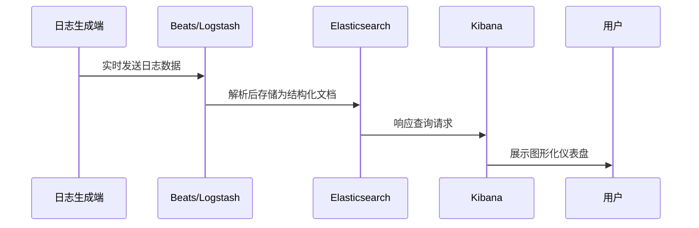

# 4. 日志ELK

***

# 1. 概述与定义

日志ELK是目前业界最常用的日志集中管理与分析解决方案之一，主要由 Elasticsearch、Logstash 和 Kibana 组成（有时也包括 Beats 组件，但本次主要讨论前三者）。 &#x20;

- **Elasticsearch** 是一个基于Lucene构建的分布式搜索和分析引擎，专注于数据存储与实时检索； &#x20;
- **Logstash** 负责日志数据的采集、解析、过滤以及格式化处理，可以接收多种数据源并进行统一处理； &#x20;
- **Kibana** 提供直观的图形化展示界面，方便用户对存储在 Elasticsearch 中的数据进行分析和可视化展示。 &#x20;

日志ELK的基本思想是通过统一的日志采集、处理、存储与展示体系，快速定位和解决生产环境中的问题，提高运维效率和业务监控能力。💡 在企业级应用、微服务架构、大数据平台等场景中，日志ELK已成为不可或缺的技术工具。

***

# 2. 主要特点

日志ELK具备以下显著特点：

- **集中管理** &#x20;

  利用Logstash统一采集各类日志数据，将分散在不同服务器或应用中的日志集中存储到Elasticsearch中，便于统一管理和检索。 &#x20;
- **实时搜索与分析** &#x20;

  Elasticsearch支持高效的全文检索和复杂查询，用户可以实时获取日志数据、统计指标和异常情况。🔍 &#x20;
- **灵活的日志处理** &#x20;

  Logstash支持多种输入、过滤和输出插件，可根据业务需求对日志进行格式化、解析和清洗。 &#x20;
- **直观的可视化展示** &#x20;

  Kibana通过图表、仪表盘等多种方式将数据可视化，帮助用户快速了解系统运行状态和业务指标。📊 &#x20;
- **高扩展性与容错性** &#x20;

  ELK各组件均支持分布式部署，能够应对大规模日志数据的采集与处理，并具备良好的容错能力。 &#x20;
- **开放性与灵活集成** &#x20;

  丰富的插件生态和开放的接口，使得ELK能够轻松与其他监控系统、告警系统和业务平台集成。😊

通过上述特点，日志ELK不仅能够提升日志处理效率，还能帮助运维人员及时发现系统瓶颈和异常情况，保障系统稳定运行。

***

# 3. 应用目标

日志ELK系统在实际生产环境中的主要应用目标包括：

1. **问题定位与故障排查** &#x20;

   将各服务、应用的日志数据集中后，通过实时搜索和关联分析快速定位问题所在。例如，定位某个请求的异常调用链、分析系统报错的根因。 &#x20;
2. **性能监控与资源统计** &#x20;

   通过对日志数据进行统计和可视化展示，实时监控系统性能指标（如响应时间、错误率、流量波动），为容量规划和性能调优提供依据。 &#x20;
3. **安全审计与异常检测** &#x20;

   集中记录用户操作日志、访问日志和系统事件，利用Kibana构建仪表盘及时发现异常行为和潜在安全威胁。 &#x20;
4. **业务数据分析** &#x20;

   除了系统日志，ELK同样适用于业务数据分析，如用户行为分析、交易统计和营销数据监控，帮助企业挖掘数据价值。 &#x20;
5. **自动化告警与事件响应** &#x20;

   与监控和告警系统集成，通过日志数据的实时监控自动触发告警，辅助运维团队及时响应系统故障。🚀

综上所述，日志ELK系统的核心目标在于实现日志的高效集中管理、实时搜索与分析、以及数据可视化展示，最终为系统运维、故障排查、安全监控和业务分析提供全方位支持。

***

# 4. 主要内容及其组成部分

日志ELK作为一个完整的日志处理与分析系统，主要由以下几部分构成，每一部分均承担着特定的职责：

## 4.1 Elasticsearch

- **功能**：存储日志数据、提供实时检索和聚合分析。
- **特点**：分布式、可扩展、高性能，支持全文检索和复杂查询。
- **实现细节**：数据以文档形式存储在索引中，利用倒排索引结构实现高效搜索。

示例说明：用户在Kibana中执行关键词搜索、统计错误率或生成时间序列图均依赖于Elasticsearch的高效聚合能力。

## 4.2 Logstash

- **功能**：日志数据的采集、解析、过滤和格式化处理。
- **特点**：支持多种数据输入（如文件、TCP/UDP、消息队列等），内置丰富插件，灵活配置管道处理。
- **实现细节**：通过配置文件定义输入、过滤和输出步骤，可对日志数据进行结构化处理。

示例说明：通过Logstash配置，可以将NGINX日志解析成JSON格式，并转发至Elasticsearch，实现日志数据的统一化管理。

## 4.3 Kibana

- **功能**：提供日志数据的图形化展示和分析界面。
- **特点**：直观的仪表盘、数据可视化、多种图表展示方式，便于用户构建实时监控面板。
- **实现细节**：通过与Elasticsearch交互获取数据，并支持自定义查询、过滤和数据聚合。

示例说明：用户可以在Kibana中构建仪表盘，实时展示各应用的错误率、访问流量和响应时间分布，辅助决策和调优。

## 4.4 Beats（可选组件）

- **功能**：轻量级数据采集器，用于将日志数据从各个节点发送到Logstash或Elasticsearch。
- **特点**：资源占用低、易于部署，支持多种类型的日志采集，如Filebeat、Metricbeat等。
- **实现细节**：通常部署在各个数据源主机上，作为日志采集的前置Agent，将数据传输至Logstash进行进一步处理。

## 4.5 其他辅助组件

- **数据存储与索引策略**：设计合理的索引策略（如按天、按应用划分索引），确保数据查询效率和存储管理的灵活性。 &#x20;
- **安全控制与认证**：对Elasticsearch、Kibana等组件进行安全配置，如用户认证、角色授权和数据传输加密，保障日志数据安全。 &#x20;
- **高可用性与灾备**：通过集群部署、备份机制和故障转移技术，确保日志系统在高负载或故障情况下依然正常运行。

下表总结了日志ELK各组件的主要功能和特点：

| 组件            | 主要功能             | 特点                     | 示例说明                                     |
| ------------- | ---------------- | ---------------------- | ---------------------------------------- |
| Elasticsearch | 数据存储与实时检索        | 分布式、全文检索、高性能           | 用于存储和查询各类日志数据                            |
| Logstash      | 日志采集、解析、过滤与格式化处理 | 丰富的输入/输出插件、灵活管道配置      | 将NGINX、应用日志解析成结构化JSON格式，发送至Elasticsearch |
| Kibana        | 数据可视化与仪表盘展示      | 图形化界面、实时监控、交互式查询       | 构建系统健康状态、错误统计、流量监控的实时仪表盘                 |
| Beats         | 轻量级数据采集器         | 部署简便、资源占用低、适用于多种数据采集场景 | Filebeat采集文件日志、Metricbeat采集系统指标          |

通过对这些组成部分的详细解释，我们可以看出日志ELK系统如何协同工作，实现日志数据的高效采集、存储、检索和可视化展示，从而为企业级日志管理提供强有力的技术支持。

***

# 5. 原理剖析

深入理解日志ELK的工作原理，可以从以下几个方面进行剖析：

## 5.1 数据采集与预处理

- **Logstash数据管道** &#x20;

  Logstash利用配置文件定义数据输入、过滤和输出管道，数据从各数据源（如应用日志、系统日志）进入后，通过过滤插件（如grok、mutate等）解析和转换为结构化数据，再输出到Elasticsearch。 &#x20;
- **Beats代理** &#x20;

  Beats组件（如Filebeat）部署在数据源服务器上，实时采集日志文件的更新，并将数据传输至Logstash或Elasticsearch，降低中心日志服务器的负载。

## 5.2 数据存储与索引机制

- **Elasticsearch索引原理** &#x20;

  日志数据以文档形式存储在Elasticsearch索引中，采用倒排索引技术实现高速全文检索。索引根据预设策略（如时间维度、应用名称）进行分片和副本分布，既保证数据高可用，又能满足大规模数据查询。 &#x20;
- **数据聚合** &#x20;

  Elasticsearch支持多种聚合操作（如sum、avg、histogram等），帮助用户统计日志数据、生成报表，进而实现实时数据监控和分析。

## 5.3 可视化与交互分析

- **Kibana的图形化展示** &#x20;

  Kibana与Elasticsearch无缝连接，用户通过构建查询和过滤条件，将数据以折线图、柱状图、饼图、热力图等多种形式展现，直观展示日志数据的时序变化、分布状态和异常情况。 &#x20;
- **仪表盘与自定义查询** &#x20;

  Kibana允许用户定制仪表盘，将多个图表组合在一起，实时监控系统各项指标，同时支持保存和分享查询模板，方便团队协作。

## 5.4 数据安全与高可用

- **安全认证与传输加密** &#x20;

  为确保日志数据安全，Elasticsearch与Kibana常采用用户认证、角色授权以及TLS/SSL加密传输，防止数据在传输过程中被窃取或篡改。 &#x20;
- **集群部署与容错机制** &#x20;

  ELK各组件支持分布式集群部署，通过数据分片、副本和故障转移机制，实现系统高可用和快速恢复能力，保障在大流量和故障场景下的稳定性。

## 5.5 Mermaid图示整体工作流程

下面使用Mermaid时序图描述日志ELK系统的整体数据流动过程：

图中展示了日志从生成端（如应用、服务器）通过Beats或Logstash采集，经过数据解析后存储至Elasticsearch，最终由Kibana提供可视化查询结果的全过程。这样的设计确保了日志数据的实时采集、存储、检索和展示，形成了完整的日志处理闭环。👍

***

# 6. 应用与拓展

日志ELK系统不仅在日志管理和故障排查中发挥重要作用，还可以扩展到更多领域，实现数据分析和业务监控等多种应用。

## 6.1 应用场景

- **系统运维与故障排查** &#x20;

  通过实时监控日志数据，快速定位错误日志和异常事件，实现高效故障排查。 &#x20;
- **安全审计与入侵检测** &#x20;

  分析安全日志、访问日志，构建异常检测规则，及时发现非法访问和攻击行为。 &#x20;
- **业务数据分析** &#x20;

  除了系统日志，还可以采集业务数据日志，辅助进行用户行为分析、交易统计和营销活动效果评估。 &#x20;
- **微服务分布式监控** &#x20;

  在微服务架构中，各服务产生大量日志数据，通过ELK实现集中管理和跨服务关联分析，优化系统性能和架构设计。

## 6.2 拓展方向

- **与告警系统集成** &#x20;

  将ELK系统与告警平台（如Prometheus、Grafana Alerting、PagerDuty等）结合，实现实时异常检测后自动触发报警。 &#x20;
- **引入机器学习分析** &#x20;

  利用机器学习模型对日志数据进行异常检测和预测，提前发现潜在问题并进行预防性维护。 &#x20;
- **零信任安全监控** &#x20;

  在零信任架构中，通过ELK系统采集全链路日志数据，实现更细粒度的安全监控和风险评估。 &#x20;
- **跨平台数据整合** &#x20;

  将ELK与云平台、大数据平台集成，实现异构数据源的统一采集、存储和分析，推动企业数据智能化转型。

通过不断扩展和优化，日志ELK系统不仅能提升日志管理效率，还能为企业级数据监控、安全分析和业务决策提供全方位支持。

***

# 7. 面试问答

下面是五个模拟面试问答，帮助面试者从自身角度详细解答关于日志ELK的常见问题：

### 问题1：请简述什么是日志ELK及其核心组件和作用？

回答示例： &#x20;

“日志ELK是一整套用于日志采集、处理、存储和可视化展示的解决方案，主要由 Elasticsearch、Logstash 和 Kibana 组成。Elasticsearch 负责存储和检索日志数据，Logstash 负责对日志进行采集、解析和过滤，而 Kibana 则用于将日志数据直观地展示出来。这套系统帮助企业实现集中管理日志、快速定位问题和进行数据分析。” 😊

### 问题2：在实际项目中，你是如何配置和使用Logstash进行日志数据处理的？

回答示例： &#x20;

“在项目中，我通常使用Logstash来采集和预处理各类日志数据。通过编写配置文件，我可以定义输入源（如文件、TCP流、消息队列等）、使用grok插件解析日志格式，并通过mutate等插件进行数据清洗和重命名，最后将结构化数据发送到Elasticsearch中。例如，针对NGINX日志，我会将日志解析为JSON格式，便于后续统计和可视化。” 🔧

### 问题3：请说明Elasticsearch的索引机制和如何保证高效的全文检索？

回答示例： &#x20;

“Elasticsearch将日志数据以文档形式存储在索引中，利用倒排索引技术实现高速全文检索。通过对数据进行分片和副本分布，不仅提高了数据查询效率，也保证了高可用性。同时，通过合理设计索引映射（mappings）和分析器（analyzers），可以优化查询性能，满足大数据量日志检索的需求。” 🔍

### 问题4：在Kibana中构建仪表盘时，你如何根据业务需求设计数据可视化方案？

回答示例： &#x20;

“在Kibana中，我首先根据业务需求确定关键指标，如错误率、响应时间、流量等，然后设计相应的查询语句和聚合操作。通过折线图、柱状图、饼图等多种图表形式，将数据直观展示出来。仪表盘通常会组合多个图表，以便实时监控系统健康状况，并支持过滤和钻取分析，帮助团队快速定位问题。” 📊

### 问题5：请谈谈你在项目中如何处理ELK系统的扩展性和高可用性问题？

回答示例： &#x20;

“为了保证ELK系统在高并发和大数据量场景下的稳定运行，我会采用分布式集群部署方式。Elasticsearch通过分片和副本机制实现数据冗余与负载均衡；Logstash配置上，我会部署多实例，并使用负载均衡器分发日志数据；Kibana同样可以配置在多节点环境中，确保用户查询时系统响应快速。除此之外，我还会设计合理的索引策略和定期清理机制，保证数据存储高效，并结合监控工具实时监控系统状态，及时处理异常情况。” 🚀

***

# 总结

日志ELK作为一种先进的日志管理与分析技术体系，从数据采集、存储、检索到可视化展示，全流程构建了一个高效、灵活、可扩展的日志平台。通过对Elasticsearch、Logstash和Kibana的深入解析，我们了解了各组件的职责与特点，同时也认识到数据安全、系统高可用性以及扩展性设计在实际项目中的重要性。 &#x20;

- 数据加密、访问控制、索引设计、安全审计等机制共同构成了日志系统的坚实基础； &#x20;
- 通过实时日志处理和图形化展示，运维团队可以快速定位故障、分析业务数据，并实时监控系统运行状态； &#x20;
- 日志ELK不仅适用于系统故障排查和安全审计，也在大数据分析、业务监控等方面发挥了重要作用； &#x20;
- 未来，结合人工智能、大数据分析、零信任安全等新技术，日志ELK系统将不断演进，满足更高层次的企业需求。 &#x20;

对于Java开发者来说，深入掌握日志ELK的架构和工作原理，不仅有助于解决实际项目中遇到的日志管理问题，还能在面试中从容应答，展示扎实的理论基础和实践经验。希望本文能为各位在面试中提供充分准备，并在实际工作中助力构建稳定高效的日志系统。
