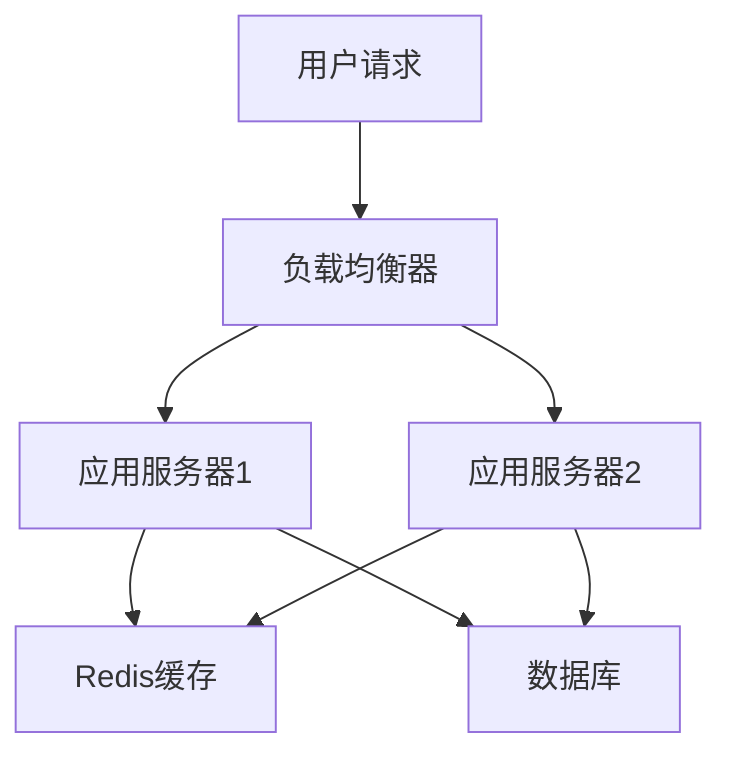

# 5. 项目难点

# 项目难点：Java面试中的技术硬核剖析

***

## 1. 概述与定义

在Java面试中，“项目难点”是一个常见的技术考察点。面试官通常会问：“你在项目中遇到过哪些技术挑战？是如何解决的？”项目难点指的是在软件开发过程中遇到的技术性难题，这些问题往往超出了基础编码的范畴，需要开发者运用深层次的技术知识和综合能力去解决。

在Java项目中，项目难点的范围很广，可能涉及**高并发处理**、**分布式系统设计**、**数据库优化**、**JVM调优**、**安全性防护**等。这些难点不仅是技术上的挑战，也是衡量一个工程师能力的重要标准。简单来说，项目难点就是那些让你“挠头”的问题，但解决它们的过程也正是你技术成长的见证！😊

***

## 2. 主要特点

项目难点有以下几个显著特点，了解这些能帮助我们在面试中更有针对性地回答问题：

- **技术性强** 💻 &#x20;

  项目难点通常需要扎实的Java基础和相关领域的专业知识。比如，高并发处理可能涉及多线程、锁机制，而分布式系统设计可能需要掌握一致性协议。
- **复杂性高** 🧩 &#x20;

  难点往往不是单一问题，而是多个技术点的交织。比如，优化数据库性能可能同时涉及SQL调优、索引设计和缓存应用。
- **影响面广** 🌐 &#x20;

  解决一个项目难点通常会影响系统的性能、稳定性或安全性。比如，一个锁机制的优化可能直接提升系统的吞吐量。
- **创新性要求高** ✨ &#x20;

  面对项目难点，常规方法可能不够，需要创新性地应用新技术或方案。比如，在分布式系统中引入一致性哈希来解决负载均衡问题。

这些特点决定了项目难点在面试中的重要性，面试官想通过你的回答，看到你解决复杂问题的能力。

***

## 3. 应用目标

在Java项目中，解决项目难点的目标可以总结为以下几点：

- **提升系统性能** ⚡ &#x20;

  通过优化代码、算法或架构，提高系统的响应速度和吞吐量，比如减少请求的响应时间。
- **增强系统稳定性** 🛡️ &#x20;

  解决潜在的故障点，确保系统在高负载或异常情况下也能正常运行。
- **提高安全性** 🔒 &#x20;

  加强防护措施，防止数据泄露、SQL注入等安全威胁。
- **优化用户体验** 😊 &#x20;

  通过技术手段提升产品的流畅性和可靠性，增强市场竞争力。

这些目标是我们解决项目难点的出发点，也是面试官希望听到的“价值体现”。

***

## 4. 主要内容及其组成部分

项目难点涉及多个技术领域，每个领域都有具体的挑战和解决方法。下面我将详细拆解几个常见的项目难点及其组成部分，确保内容完备。

### 4.1 高并发处理

高并发是互联网项目中的常见难点，尤其在电商、社交等场景下。它的组成部分包括：

- **线程安全问题** &#x20;

  多线程环境下，共享资源可能出现数据不一致，需要通过锁或并发工具解决。
- **锁机制** &#x20;

  如`synchronized`、`ReentrantLock`，用于控制资源访问。
- **并发集合** &#x20;

  如`ConcurrentHashMap`、`CopyOnWriteArrayList`，提供线程安全的集合操作。
- **线程池管理** &#x20;

  使用`ThreadPoolExecutor`管理线程，避免资源浪费。

### 4.2 分布式系统设计

分布式系统将应用部署在多台服务器上，难点包括：

- **分布式锁** &#x20;

  如基于Redis或Zookeeper实现，防止并发冲突。
- **一致性哈希** &#x20;

  用于负载均衡和数据分布。
- **服务发现与注册** &#x20;

  如Eureka、Consul，用于动态管理服务。
- **负载均衡** &#x20;

  通过Nginx或算法分担请求压力。

### 4.3 数据库优化

数据库性能往往是系统瓶颈，优化手段包括：

- **索引优化** &#x20;

  添加索引加速查询，但要避免过多索引导致写性能下降。
- **SQL语句调优** &#x20;

  优化查询逻辑，减少全表扫描。
- **缓存机制** &#x20;

  如Redis缓存热点数据，减轻数据库压力。
- **分库分表** &#x20;

  将数据分散存储，提升读写效率。

### 4.4 JVM调优

JVM性能直接影响Java应用，关键点包括：

- **垃圾回收机制** &#x20;

  选择合适的GC算法（如G1、CMS）。
- **内存管理** &#x20;

  调整堆内存大小，避免OOM。
- **JVM参数配置** &#x20;

  如`-Xms`、`-Xmx`设置初始和最大堆内存。
- **性能监控工具** &#x20;

  如JVisualVM、JProfiler，用于定位问题。

### 4.5 安全性

安全问题不容忽视，涉及：

- **数据加密与解密** &#x20;

  如AES加密敏感数据。
- **防止SQL注入、XSS攻击** &#x20;

  使用预编译语句和输入校验。
- **权限控制** &#x20;

  基于RBAC模型管理用户权限。
- **安全认证与授权** &#x20;

  如OAuth2.0、JWT实现身份验证。

这些组成部分涵盖了项目难点的核心内容，面试中可以根据项目背景选择性地展开。

***

## 5. 原理剖析

接下来，我以**高并发处理**为例，深入剖析其原理，确保内容详尽易懂。

### 5.1 高并发的核心问题

高并发指的是系统需要同时处理大量请求，比如秒杀场景下每秒几十万的QPS。核心问题在于**资源竞争**和**性能瓶颈**。多线程环境下，多个线程访问共享资源（如库存数据）时，可能导致数据不一致或系统崩溃。

### 5.2 线程安全解决方案

- **synchronized关键字** &#x20;

  Java内置锁机制，可以修饰方法或代码块，保证同一时刻只有一个线程访问。例如：
  ```java 
  public synchronized void updateStock(int count) {
      this.stock -= count;
  }
  ```

- **ReentrantLock** &#x20;

  更灵活的可重入锁，支持公平锁和非公平锁：
  ```java 
  import java.util.concurrent.locks.ReentrantLock;

  public class StockManager {
      private int stock = 1000;
      private ReentrantLock lock = new ReentrantLock();

      public void updateStock(int count) {
          lock.lock();
          try {
              this.stock -= count;
          } finally {
              lock.unlock();
          }
      }
  }
  ```

- **volatile关键字** &#x20;

  确保变量的可见性，适用于简单场景。

### 5.3 并发集合

`ConcurrentHashMap`通过分段锁（Segment）实现高并发读写，比`Hashtable`性能更好。例如：

```java 
import java.util.concurrent.ConcurrentHashMap;

public class Cache {
    private ConcurrentHashMap<String, String> map = new ConcurrentHashMap<>();

    public void put(String key, String value) {
        map.put(key, value);
    }

    public String get(String key) {
        return map.get(key);
    }
}
```


### 5.4 线程池管理

线程池避免频繁创建线程的开销，`ThreadPoolExecutor`是常用实现：

```java 
import java.util.concurrent.*;

public class ThreadPoolDemo {
    public static void main(String[] args) {
        ExecutorService pool = new ThreadPoolExecutor(
            5, 10, 60L, TimeUnit.SECONDS,
            new LinkedBlockingQueue<>(100)
        );
        for (int i = 0; i < 20; i++) {
            pool.execute(() -> System.out.println(Thread.currentThread().getName()));
        }
        pool.shutdown();
    }
}
```


### 5.5 系统架构图

以下是高并发场景的架构图：




**图表说明**：用户请求通过负载均衡器分发到多个服务器，服务器优先访问Redis缓存，未命中时查询数据库，实现高并发下的高效处理。

***

## 6. 应用与拓展

项目难点的解决方法不仅限于上述内容，还可以拓展到更多场景：

- **微服务架构** 🌐 &#x20;

  服务间通信（如REST、gRPC）、熔断降级（如Hystrix）、分布式追踪（如Zipkin）。
- **大数据处理** 📊 &#x20;

  数据存储（如HDFS）、实时分析（如Flink）、批处理（如Spark）。
- **人工智能** 🤖 &#x20;

  模型训练优化、推理性能调优。

这些拓展方向在高级岗位面试中可能会被提及，提前了解能加分不少！

***

## 7. 面试问答

以下是五个常见的面试问题，我将以面试者的口吻详细回答，确保内容详实。

### 7.1 你在项目中遇到过哪些技术难点？

“在我的电商项目中，我遇到过高并发处理的难点。系统需要在秒杀活动时支持每秒几十万的请求量，数据库和缓存的压力都很大。我通过引入线程池管理并发请求，使用`ConcurrentHashMap`存储热点数据，保证线程安全。同时，我优化了数据库查询，加了索引，还用了Redis做缓存，最终系统稳定运行，QPS提升了50%。”

### 7.2 你是如何解决高并发问题的？

“高并发问题我主要从三个方面解决。首先，我分析瓶颈，发现数据库查询慢，于是优化了SQL，加了索引，用Redis缓存热点数据，减少数据库压力。其次，我用线程池控制并发线程数，避免资源耗尽，参数设置上核心线程数是5，最大10，队列容量100。最后，我引入了Nginx做负载均衡，把请求分到多台服务器，整体吞吐量翻倍。”

### 7.3 你在项目中是如何保证数据安全的？

“数据安全我特别重视！首先，传输层我用了HTTPS，数据全程加密，防止被拦截。其次，敏感数据如密码我用bcrypt哈希存储，数据库里看不到明文。第三，我防止SQL注入，用了预编译语句，所有用户输入都严格校验。第四，权限控制上我用了RBAC模型，确保用户只能操作自己的数据。最后，我定期用工具扫描漏洞，发现问题马上修。”

### 7.4 你在项目中是如何进行性能优化的？

“性能优化我分几步走。第一，代码层面我重构了冗余逻辑，减少了IO操作。第二，数据库层面我优化了慢查询，加了索引，还用了Redis缓存热点数据。第三，异步处理上我引入了RabbitMQ，把耗时任务丢到队列里异步执行。第四，JVM调优时我调整了`-Xms`和`-Xmx`为4G，用G1垃圾回收器，GC频率明显降低。最终系统响应时间从500ms降到200ms。”

### 7.5 你在项目中是如何解决分布式系统中的数据一致性问题的？

“分布式系统里数据一致性确实棘手。我根据场景用了不同策略。对于订单支付这种强一致性需求，我用了TCC模式，确保事务要么全成功要么全回滚。对于日志同步这种弱一致性场景，我用了消息队列加补偿机制，保证最终一致。并发冲突我用Redis分布式锁控制，锁的key设计得很细粒度，避免锁冲突。实践下来，系统既稳定又高效。”

***

## 总结

项目难点是Java面试中的硬核考察点，掌握它能让你在技术深度和解决问题的能力上脱颖而出。这篇文章从定义到原理，再到应用和面试问答，全面覆盖了知识点。结合代码示例、表格和Mermaid图表，内容直观易懂。希望你通过反复背诵和实践，能在面试中自信应对，拿到心仪的offer！加油！💪
