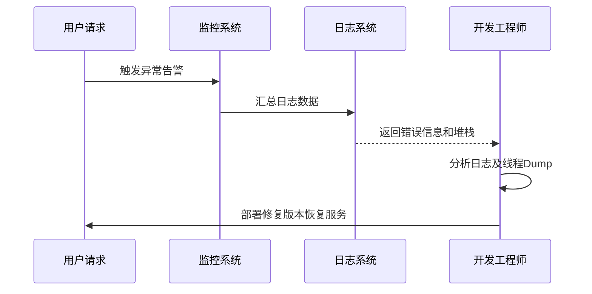

# 6. 生产问题

# 1. 概述与定义

生产问题是指在系统正式运行（生产环境）过程中出现的各种异常、故障或性能瓶颈。这些问题可能包括内存泄露、线程死锁、GC（垃圾回收）停顿、请求超时、服务不可用、数据库性能瓶颈、网络延迟等。生产问题直接影响业务系统的稳定性、响应速度和用户体验，对企业来说，及时发现和解决这些问题至关重要。💡

在Java生产环境中，由于系统复杂性和高并发场景的存在，生产问题往往来源于多方面，如代码缺陷、第三方依赖、配置错误、硬件故障等。解决生产问题不仅需要对Java虚拟机（JVM）、垃圾回收机制、线程管理等底层原理有深入理解，还需要掌握日志分析、监控告警、性能调优等一系列实践经验。

# 2. 主要特点

生产问题具有以下主要特点：

- **实时性与突发性** &#x20;

  生产问题往往在高峰时段或特殊场景下突然暴发，具有较强的实时性，需要在短时间内定位并解决。⏱
- **多样性与复杂性** &#x20;

  生产问题类型繁多，可能涉及代码、硬件、网络等多个层面，原因复杂，排查过程可能牵涉到多个系统模块。🔍
- **不可预测性** &#x20;

  由于业务和用户行为不断变化，生产问题具有不可预测性，甚至同一问题在不同时间可能表现不同。🤔
- **影响范围广** &#x20;

  一旦生产问题发生，可能影响整个系统的稳定性和可用性，甚至导致数据丢失或安全隐患。🚨
- **依赖监控与日志** &#x20;

  生产问题的定位往往依赖于完善的日志记录、监控告警和性能指标，通过这些数据可以帮助工程师迅速找到故障根源。
- **成本与资源消耗大** &#x20;

  排查和解决生产问题通常需要投入大量人力和时间，甚至可能引发后续补救措施，如回滚版本、修复补丁等。

# 3. 应用目标

在生产环境中，及时有效地发现和解决问题是保障系统稳定运行和业务连续性的关键。生产问题管理的主要应用目标包括：

1. **保障系统稳定性** &#x20;

   通过实时监控和自动告警，确保系统在遇到异常时能够迅速恢复，减少宕机时间和业务中断。
2. **提高性能和用户体验** &#x20;

   通过分析性能瓶颈、优化GC策略、调整线程池配置等手段，提高系统响应速度和并发处理能力，从而改善用户体验。
3. **降低运维成本** &#x20;

   建立完善的日志、监控与自动化运维体系，实现问题自动检测、快速定位和预防性维护，降低因生产问题引起的运维成本。
4. **提升问题定位效率** &#x20;

   通过集中化日志管理、分布式追踪、APM（应用性能监控）等技术，实现跨系统、跨模块的故障关联分析，快速锁定问题所在。
5. **保障数据安全与业务连续性** &#x20;

   在生产问题处理过程中，确保数据不丢失、不被破坏，同时保障核心业务功能的持续运行，满足企业合规和安全要求。

# 4. 主要内容及其组成部分

生产问题涉及的知识点非常全面，下面详细讲解生产问题管理体系的各个组成部分，每一部分都是不可或缺的要素。

## 4.1 日志采集与分析

- **功能**：通过日志记录记录系统各个环节的状态和错误信息，为问题排查提供数据依据。 &#x20;
- **技术手段**：常用工具有ELK（Elasticsearch、Logstash、Kibana）、Fluentd、Graylog等。 &#x20;
- **示例说明**：当系统出现响应超时问题时，通过日志分析可以查明请求处理过程中的瓶颈环节，如数据库查询慢、网络延迟等。

示例代码（使用Java记录日志）：

```java 
import org.slf4j.Logger;
import org.slf4j.LoggerFactory;

public class ProductionLogger {
    private static final Logger logger = LoggerFactory.getLogger(ProductionLogger.class);
    
    public static void main(String[] args) {
        logger.info("系统启动...");
        try {
            // 模拟业务逻辑
            int result = 10 / 0;
        } catch (Exception e) {
            logger.error("出现异常：", e);
        }
    }
}
```


## 4.2 监控与告警

- **功能**：实时监控系统关键指标，如响应时间、错误率、CPU与内存使用率，自动触发告警。 &#x20;
- **技术手段**：利用Prometheus、Grafana、Zabbix等工具实现指标采集与实时展示；结合自动告警机制及时通知运维人员。 &#x20;
- **示例说明**：在用户访问量激增时，系统响应时间突然升高，监控系统会自动告警，提示可能存在性能瓶颈或资源不足的问题。

## 4.3 性能调优与故障排查

- **功能**：通过对JVM参数、线程池、数据库连接池、缓存等进行优化，提升系统性能；并结合Profiling、Thread Dump、Heap Dump等工具排查问题根源。 &#x20;
- **技术手段**：使用VisualVM、JProfiler、YourKit等工具进行性能分析；借助GC日志分析工具查找内存泄漏和GC停顿问题。 &#x20;
- **示例说明**：通过分析GC日志，发现系统频繁Full GC导致响应变慢，从而调整JVM参数和内存分配策略，降低GC频率。

## 4.4 容错与降级策略

- **功能**：在生产问题发生时，通过限流、熔断、降级等手段保证系统部分功能正常运行，防止问题扩大。 &#x20;
- **技术手段**：采用Hystrix、Resilience4j等组件实现服务熔断与降级；设计合理的Fallback策略保障核心业务。 &#x20;
- **示例说明**：当外部依赖服务响应异常时，系统自动触发熔断，返回预定义降级响应，避免级联故障。

## 4.5 部署与持续集成/持续交付（CI/CD）

- **功能**：构建自动化部署流程，通过CI/CD工具（如Jenkins、GitLab CI）实现快速回滚和版本迭代，减少因生产问题引起的停机风险。 &#x20;
- **技术手段**：利用蓝绿部署、滚动更新等方式，实现无缝切换与版本回滚；结合自动化测试保障版本质量。 &#x20;
- **示例说明**：在新版本上线后，通过自动化监控验证新版本稳定性；若发现问题，系统可自动回滚至上一版本。

## 4.6 安全性与数据保护

- **功能**：确保在生产问题处理过程中，数据不被泄露、篡改或丢失，同时确保系统安全。 &#x20;
- **技术手段**：加密传输、权限控制、备份恢复、日志审计等技术，确保在系统异常时数据安全。 &#x20;
- **示例说明**：在生产环境出现异常时，系统通过备份数据、自动切换到备用服务器，保证业务连续性和数据完整性。

下表总结了生产问题各组成部分的主要内容及示例说明：

| 组成部分      | 主要功能                         | 技术手段                        | 示例说明                          |
| --------- | ---------------------------- | --------------------------- | ----------------------------- |
| 日志采集与分析   | 记录系统运行状态和错误信息，提供问题定位依据       | ELK、Fluentd、Graylog         | 通过日志查找某请求的异常处理链，确定故障环节        |
| 监控与告警     | 实时监控系统指标，自动触发告警              | Prometheus、Grafana、Zabbix   | 用户访问高峰时系统响应时间增加，自动告警提示可能存在瓶颈  |
| 性能调优与故障排查 | 分析系统性能瓶颈，优化JVM、线程池、数据库连接池等   | VisualVM、JProfiler、GC日志分析工具 | 调整JVM参数后，降低GC停顿，提升响应速度        |
| 容错与降级策略   | 保障部分功能在异常情况下仍能正常运行，防止级联故障    | Hystrix、Resilience4j        | 外部服务异常时自动触发熔断，返回降级响应          |
| 部署与CI/CD  | 自动化部署、快速回滚，确保版本稳定性           | Jenkins、GitLab CI、蓝绿部署、滚动更新 | 新版本出现问题时自动回滚至上一版本，保障系统稳定运行    |
| 安全性与数据保护  | 确保数据传输、存储和处理过程中的安全，防止数据泄露和篡改 | 加密传输、权限控制、数据备份、日志审计         | 生产环境出现问题时，通过数据备份和安全策略保障核心数据安全 |

# 5. 原理剖析

生产问题的产生原因与解决方案往往与系统架构、代码设计、资源分配等密切相关。下面从核心原理角度详细解析各类生产问题的根本原因和应对思路。

## 5.1 代码缺陷与逻辑错误

- **原理**：代码中的缺陷、边界条件未考虑或逻辑错误，往往会在特定输入或高并发场景下暴露，导致异常、崩溃或资源泄露。 &#x20;
- **解决思路**：通过单元测试、集成测试以及灰度发布等手段提前捕捉问题，并利用异常日志、堆栈信息进行定位。 &#x20;
- **示例**：某业务逻辑中未对空指针进行判断，导致在大并发情况下频繁出现NullPointerException，从而影响系统稳定性。

## 5.2 JVM与垃圾回收（GC）问题

- **原理**：Java虚拟机在内存分配和回收过程中，由于内存泄露、对象生命周期管理不当，可能导致GC频繁、Full GC停顿等问题。 &#x20;
- **解决思路**：通过分析GC日志，查找内存泄露和不合理内存分配；调优JVM参数、使用新生代与老年代分离的策略，平衡内存回收与应用响应时间。 &#x20;
- **示例**：利用GC日志分析工具发现某模块存在大量短生命周期对象，经过代码优化和JVM参数调整后，大幅降低了Full GC的频率。

## 5.3 多线程与并发问题

- **原理**：线程竞争、锁争用和死锁等问题，往往出现在高并发环境下，导致部分线程长时间等待或系统资源耗尽。 &#x20;
- **解决思路**：采用合理的并发设计模式，如线程池、读写锁、无锁数据结构；利用线程Dump和Profiler工具查找瓶颈。 &#x20;
- **示例**：在高并发订单处理系统中，由于锁争用严重，导致订单处理延迟，通过优化同步策略和减少锁粒度有效改善性能。

## 5.4 网络与数据库瓶颈

- **原理**：网络延迟、数据库慢查询、连接池配置不当等问题，都会引起系统响应缓慢或服务不可用。 &#x20;
- **解决思路**：通过分布式追踪系统、数据库优化、缓存策略等手段降低延迟；设计合理的超时和重试机制。 &#x20;
- **示例**：在高并发环境下，某接口因数据库查询时间过长导致响应超时，经过SQL优化和引入Redis缓存后，明显提升了响应速度。

## 5.5 容错与降级机制

- **原理**：在生产问题发生时，若系统未设置合理的容错、熔断与降级机制，可能引发级联故障，导致整个系统崩溃。 &#x20;
- **解决思路**：通过服务熔断、降级和限流设计，在某个模块出现异常时，自动切换到备用方案或返回预设响应，防止故障扩散。 &#x20;
- **示例**：采用Hystrix构建服务熔断，当外部依赖服务响应异常时，系统自动降级处理，保障核心业务继续运行。

## 5.6 Mermaid图示故障排查流程

下面的Mermaid时序图展示了从故障发生到定位原因的整个流程：




图中展示了用户请求触发异常告警，监控系统收集日志数据，开发人员根据错误信息和堆栈进行故障排查，最终通过修复版本恢复服务的整个流程。

# 6. 应用与拓展

生产问题的管理不仅限于单一的排查技术，更需要构建完善的运维体系和持续改进机制。以下是生产问题在实际应用中的几个拓展方向：

## 6.1 自动化监控与告警

通过引入Prometheus、Grafana等自动化监控平台，对系统各项指标进行实时监控，并结合ELK实现日志关联分析，自动触发告警和故障预警，降低人工排查成本。

## 6.2 分布式追踪与APM

采用分布式追踪系统（如Zipkin、Jaeger）和APM工具，实现跨服务、跨模块的调用链追踪，帮助运维人员快速定位性能瓶颈和故障节点，提升故障定位效率。

## 6.3 持续集成与自动回滚

构建完善的CI/CD流程，通过自动化测试、灰度发布和蓝绿部署，实现新版本快速上线和自动回滚机制，降低因生产问题引发的风险，保障业务连续性。

## 6.4 人工智能与日志大数据分析

利用机器学习算法对海量日志数据进行异常检测和预测，提前预警潜在风险，并结合大数据分析构建智能监控系统，实现生产问题的主动防御。

## 6.5 零信任架构与安全防护

在生产环境中，结合零信任安全理念，强化对各个环节的身份认证和权限控制，确保即便在内部网络中也能防范异常行为和数据泄露风险。

# 7. 面试问答

下面是模拟的面试问答部分，帮助面试者从自身角度详细回答有关生产问题管理的常见问题，共包含五个部分，每个问题均附详细说明。

### 问题1：请简述生产问题的定义以及在生产环境中常见的问题类型？

回答示例： &#x20;

“生产问题是指在系统实际运行环境中，由于代码缺陷、资源分配不合理、网络或硬件故障等原因引起的各种异常和性能瓶颈。常见的问题类型包括内存泄露、GC停顿、线程死锁、网络延迟、数据库瓶颈以及服务不可用等。生产问题对业务系统的稳定性和用户体验有直接影响，因此需要建立完善的监控、日志分析和自动化告警机制来及时发现和解决问题。” 😊

### 问题2：在生产环境中遇到响应时间突然升高的问题，你会如何快速定位和解决？

回答示例： &#x20;

“当生产环境出现响应时间突然升高的情况时，我会首先查看监控指标，判断是哪个环节出现了瓶颈。通过日志系统查看异常日志和错误信息，结合分布式追踪工具查找具体调用链，确定是否是数据库查询、网络延迟还是GC频繁导致。随后，根据问题根因进行针对性优化，如调整数据库索引、优化代码逻辑、调优JVM参数或者增加系统资源。整个过程需要结合日志、监控和追踪数据进行多维度分析。” 🔧

### 问题3：如何通过日志分析排查生产问题？请举例说明你的实际操作经验。

回答示例： &#x20;

“在项目中，我经常使用ELK系统来集中管理日志。当生产环境出现异常时，我会通过Kibana构建查询条件，过滤出错误日志和异常堆栈，然后结合时间轴和业务日志进行关联分析。例如，当发现某个接口响应异常时，我会查找该接口相关的所有日志记录，观察是否有连续的错误或超时信息，进而确定问题是否出在数据库查询、外部服务调用或者代码逻辑上。通过日志分析，我能够快速定位问题所在，并与开发团队协同修复。” 🔍

### 问题4：请谈谈你对生产问题中GC停顿和内存泄露问题的理解，并说明如何调优？

回答示例： &#x20;

“GC停顿和内存泄露是生产环境中常见的JVM问题。GC停顿通常是由于大量对象频繁创建和销毁引起的，通过优化对象的生命周期、调整新生代和老年代的比例、使用合适的GC算法可以降低停顿时间；而内存泄露则是由于对象不再使用但仍被引用，导致内存无法释放。为了解决这些问题，我通常会通过开启GC日志，利用工具如VisualVM、JProfiler分析内存使用情况，定位泄露对象，并对代码进行优化。针对GC问题，则通过调整JVM参数、采用分代收集算法等方法来平衡吞吐量和响应时间。” 👍

### 问题5：请分享一下你在生产问题处理中的容错与降级策略，以及如何通过自动化手段降低风险？

回答示例： &#x20;

“在生产系统中，我会设计一套完善的容错与降级机制。当某个服务出现异常时，利用熔断器（如Hystrix）自动切换到降级模式，返回预设的备用数据，防止级联故障。此外，通过限流、超时机制和重试策略，确保在高并发下系统不会崩溃。结合CI/CD和自动化监控平台，实现实时告警和自动回滚，进一步降低因生产问题带来的风险。这样可以保障核心业务的连续性，同时为后续问题修复争取时间。” 🚀

# 总结

生产问题作为企业级应用中不可避免的挑战，涵盖了从代码缺陷、JVM调优、并发问题到网络与数据库瓶颈等多个层面。本文详细阐述了生产问题的定义、特点、应用目标，并对日志采集与分析、监控与告警、性能调优、容错降级、CI/CD部署以及安全性等关键组成部分做了全面解析。同时，从原理角度深入剖析了常见生产问题的根源及应对策略，并利用Mermaid图示和表格直观展示了整体架构和流程。通过模拟面试问答，帮助面试者从容回答实际工作中可能遇到的生产问题，展示扎实的理论基础和实践经验。

对于Java工程师来说，掌握生产问题的全链路管理、实时监控与自动化处理能力，不仅能显著提升系统稳定性和用户体验，更能在面试中赢得面试官的认可。希望本文能为大家提供系统的复习资料，在实际工作中构建一个高可用、稳定、安全的生产系统，并在面试中从容应答、展示出扎实的技术实力。
