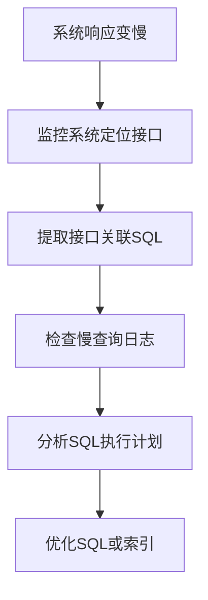
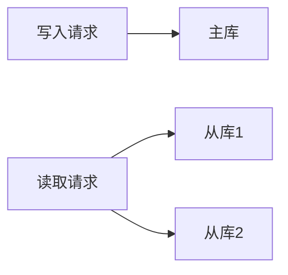

# 1. 定位慢查询

***

# **Java面试八股文：MySQL定位慢查询详解**

***

## **1. 概述与定义**

**慢查询**指执行时间超过预设阈值（如2秒）的SQL语句，通常会导致接口响应变慢、系统吞吐量下降。定位慢查询是性能优化的核心步骤，需结合监控工具和MySQL原生功能实现。

**示例场景**： &#x20;

```java 
// 接口响应超过2秒，通过监控系统定位到SQL
public User getUserInfo(Long id) {
    return jdbcTemplate.queryForObject(
        "SELECT * FROM users WHERE id = ?",
        new Object[]{id},
        new BeanPropertyRowMapper<>(User.class)
    );
}
```


***

## **2. 原理剖析**

### **2.1 定位流程**

**核心步骤**： &#x20;

1. **监控工具**：通过Skywalking/Prometheus定位接口耗时。 &#x20;
2. **慢查询日志**：记录执行时间超过阈值的SQL。 &#x20;
3. **分析工具**：使用`EXPLAIN`、`pt-query-digest`分析执行计划与性能瓶颈。

#### **流程图**：




***

### **2.2 慢查询日志机制**

#### **配置步骤**：

1. **修改配置文件**（`my.cnf`）： &#x20;
   ```ini 
   [mysqld]
   slow_query_log = 1
   slow_query_log_file = /var/log/mysql/slow.log
   long_query_time = 2  # 执行时间超过2秒的SQL
   log_queries_not_using_indexes = 1  # 记录无索引查询
   ```

2. **重启MySQL**：使配置生效。

#### **日志内容示例**： &#x20;

```sql 
# Time: 2025-03-07T16:51:09
# User@Host: user[admin] @ localhost []
# Query_time: 2.3333  Lock_time: 0.0001 Rows_sent: 1  Rows_examined: 100000
SELECT * FROM users WHERE age > 30;
```


***

### **2.3 分析工具详解**

#### **2.3.1 EXPLAIN命令** &#x20;

解析SQL执行计划，关键字段： &#x20;

- **type**：查询类型（`const` < `eq_ref` < `ref` < `range` < `index` < `ALL`）。 &#x20;
- **possible\_keys/key**：是否命中索引。 &#x20;
- **rows**：扫描行数。 &#x20;
- **Extra**：是否回表（`Using temporary`、`Using filesort`）。 &#x20;

**示例**： &#x20;

```sql 
EXPLAIN SELECT * FROM orders WHERE user_id = 100;
```


| id | select\\\_type | table  | type  | key  | rows | Extra       |
| -- | -------------- | ------ | ----- | ---- | ---- | ----------- |
| 1  | SIMPLE         | orders | index | NULL | 1000 | Using where |

**分析**：未命中索引，需添加`user_id`索引。

***

#### **2.3.2 pt-query-digest** &#x20;

分析慢查询日志的工具： &#x20;

```bash 
pt-query-digest /var/log/mysql/slow.log
```


**输出示例**： &#x20;

```markdown 
# Rank Query           Response Time  %     Items
1   SELECT * FROM users ... 20.5s      45%   500
```


***

## **3. 应用目标**

1. **快速定位瓶颈**：减少系统响应时间。 &#x20;
2. **优化资源利用**：降低CPU/IO消耗。 &#x20;
3. **提升吞吐量**：支持高并发场景（如秒杀、列表分页）。 &#x20;
4. **预防故障**：避免慢查询拖垮数据库连接池。

***

## **4. 主要特点**

| **特性**​    | **描述**​                                              |
| ---------- | ---------------------------------------------------- |
| **实时监控**​  | 通过工具实时捕获慢查询，无需事后排查。                                  |
| **多维度分析**​ | 结合执行时间、锁等待、扫描行数等多指标定位问题。                             |
| **工具丰富**​  | 支持MySQL原生工具（\`EXPLAIN\`）和第三方工具（\`pt-query-digest\`）。 |
| **可扩展性**​  | 支持与Prometheus、Grafana集成，实现可视化监控。                     |

***

## **5. 主要内容及其组成部分**

### **5.1 监控工具分类**

#### **5.1.1 开源工具** &#x20;

- **Arthas**：实时诊断Java应用，定位接口耗时。 &#x20;
- **Skywalking**：分布式链路追踪，关联SQL与接口响应。 &#x20;
- **Prometheus+Grafana**：可视化监控MySQL指标（如QPS、慢查询数）。

#### **5.1.2 MySQL内置工具** &#x20;

- **Performance Schema**： &#x20;
  ```sql 
  -- 查看慢查询统计
  SELECT * FROM performance_schema.events_statements_summary_by_digest 
  WHERE digest_text LIKE '%SELECT%';
  ```

- **SHOW PROFILES**： &#x20;
  ```sql 
  SET profiling = 1;  -- 开启性能分析
  SELECT * FROM orders WHERE status = 'pending';
  SHOW PROFILES;
  ```


***

### **5.2 慢查询日志优化配置**

#### **5.2.1 细化配置项** &#x20;

- **log\_output**：指定日志输出方式（`FILE`、`TABLE`）。 &#x20;
- **min\_examined\_row\_limit**：记录扫描行数超过阈值的SQL。 &#x20;
- **extended**：记录更详细的执行计划。 &#x20;

**配置示例**： &#x20;

```ini 
[mysqld]
slow_query_log = 1
long_query_time = 1
log_output = FILE,TABLE
min_examined_row_limit = 1000
```


***

### **5.3 EXPLAIN输出详解**

#### **关键字段说明**： &#x20;

| **字段**​             | **含义**​                            |
| ------------------- | ---------------------------------- |
| **type**​           | 查询类型（如\`ALL\`表示全表扫描）。              |
| **possible\_keys**​ | 可能使用的索引。                           |
| **key/key\_len**​   | 实际使用的索引及长度。                        |
| **rows**​           | 预计扫描行数。                            |
| **Extra**​          | 附加信息（如\`Using temporary\`表示使用临时表）。 |

**优化建议**： &#x20;

- **避免**\*\*`type=ALL`\*\*：添加相关字段索引。 &#x20;
- **减少**\*\*`rows`\*\*：优化WHERE条件或拆分大表。 &#x20;
- **消除**\*\*`Using filesort`\*\*：添加排序字段索引。

***

## **6. 应用与拓展**

### **6.1 常见慢查询场景与优化**

#### **6.1.1 全表扫描** &#x20;

**问题**：未命中索引导致全表扫描。 &#x20;

**优化**： &#x20;

```sql 
-- 添加索引
ALTER TABLE orders ADD INDEX idx_user_id (user_id);
```


#### **6.1.2 深度分页** &#x20;

**问题**：`SELECT * FROM users LIMIT 100000, 10`。 &#x20;

**优化**： &#x20;

```sql 
-- 改用主键范围查询
SELECT * FROM users WHERE id > 100000 LIMIT 10;
```


***

### **6.2 索引优化原则**

1. **选择性高**：优先索引区分度高的字段（如`user_id`而非`is_deleted`）。 &#x20;
2. **覆盖索引**：确保查询字段全包含在索引中，避免回表。 &#x20;
3. **避免前缀索引**：可能降低查询效率（如`VARCHAR(255)`前缀）。 &#x20;
4. **联合索引**：遵循最左前缀原则（如`(user_id, create_time)`）。

***

### **6.3 主从复制与读写分离** &#x20;

通过主从复制分散读压力，主库处理写操作，从库处理读操作： &#x20;




***

## **7. 面试问答**

***

### **问题1：如何快速定位系统中的慢查询？** &#x20;

**回答**： &#x20;

定位慢查询的核心步骤包括： &#x20;

1. **启用慢查询日志**：在MySQL配置文件中设置`slow_query_log=1`、`long_query_time=2`（阈值可根据业务调整），并指定日志路径。重启MySQL生效后，所有执行时间超过2秒的SQL会被记录。 &#x20;
2. **分析日志文件**：使用`pt-query-digest`工具分析慢查询日志。例如： &#x20;
   ```text 
   pt-query-digest /var/log/mysql/slow.log > analysis_report.txt  
   ```

   这会生成报告，按响应时间排序展示Top N慢查询，包括执行次数、总耗时、涉及的表等关键信息。 &#x20;
3. **结合监控工具**：通过Skywalking或Prometheus定位接口级别的耗时操作，关联具体SQL语句。例如，Skywalking的链路追踪可直接显示SQL执行耗时，快速关联到具体接口。 &#x20;
4. **细化分析条件**：若需分析特定时间段或用户，可使用`pt-query-digest`的过滤参数。例如： &#x20;
   ```text 
   pt-query-digest --since '2025-03-07 16:00:00' --until '2025-03-07 17:00:00' slow.log > filtered_report.log  
   ```

   这会筛选出某时段内的慢查询，进一步缩小排查范围。 &#x20;

***

### **问题2：如何解读EXPLAIN的输出结果？** &#x20;

**回答**： &#x20;

`EXPLAIN`是分析SQL执行计划的核心工具，关键字段含义如下： &#x20;

- **type**：查询类型，从优到劣为`system`（单值匹配）→`const`（主键/唯一索引）→`eq_ref`（唯一索引关联）→`ref`（非唯一索引扫描）→`range`（范围扫描）→`index`（索引全扫）→`ALL`（全表扫描）。例如： &#x20;
  ```text 
  EXPLAIN SELECT * FROM orders WHERE user_id = 100;  
  ```

  若`type=ALL`，说明未命中索引，需为`user_id`添加索引。 &#x20;
- **possible\_keys/key**：显示可能使用的索引和实际使用的索引。若`key=NULL`，表示未使用索引。 &#x20;
- **rows**：预估扫描行数，数值越大性能越差。 &#x20;
- **Extra**：关键提示字段。例如： &#x20;
  - `Using temporary`：查询需要临时表，可能需优化排序或分组。 &#x20;
  - `Using filesort`：未命中排序字段索引，导致额外排序开销。 &#x20;
  - `Using index`：覆盖索引命中，无需回表查询。 &#x20;

***

### **问题3：如何优化全表扫描的慢查询？** &#x20;

**回答**： &#x20;

全表扫描通常因索引缺失或条件无法命中索引导致。优化步骤如下： &#x20;

1. **添加索引**：为查询条件字段（如`WHERE`、`JOIN`）添加索引。例如： &#x20;
   ```text 
   ALTER TABLE users ADD INDEX idx_age (age);  
   ```

   针对复合条件，按最左前缀原则设计联合索引（如`(user_id, create_time)`）。 &#x20;
2. **覆盖索引**：确保查询字段包含在索引中，避免回表。例如： &#x20;
   ```text 
   -- 原查询：SELECT id, name FROM users WHERE age > 30;  
   -- 添加联合索引：idx_age_name(age, name)  
   ```

3. **避免函数或类型转换**：如`WHERE YEAR(create_time)=2023`会导致索引失效，改用范围查询： &#x20;
   ```text 
   WHERE create_time BETWEEN '2023-01-01' AND '2023-12-31';  
   ```

4. **拆分大表**：若表数据量极大，考虑水平分表或分区（如按时间分区）。 &#x20;

***

### **问题4：如何使用pt-query-digest分析慢查询？** &#x20;

**回答**： &#x20;

`pt-query-digest`是Percona Toolkit的核心工具，常用场景包括： &#x20;

1. **基础分析**：直接分析慢日志并输出报告： &#x20;
   ```text 
   pt-query-digest slow.log > report.txt  
   ```

   报告中会按响应时间、执行次数排序，显示Top N查询的指纹、平均耗时、涉及的表等。 &#x20;
2. **过滤条件**： &#x20;
   - **按用户**：分析特定用户（如root）的慢查询： &#x20;
     ```text 
     pt-query-digest --filter '($event->{user} || "") =~ m/^root/i' slow.log > root_slow.log  
     ```

   - **按数据库**：分析指定数据库（如sonar）的慢查询： &#x20;
     ```text 
     pt-query-digest --filter '($event->{db} || "") =~ m/^sonar/i' slow.log > sonar_slow.log  
     ```

3. **时间范围**：分析某时段内的慢查询： &#x20;
   ```text 
   pt-query-digest --since '2025-03-07 16:00:00' --until '2025-03-07 17:00:00' slow.log > filtered.log  
   ```

4. **历史对比**：将分析结果存入数据库，对比趋势： &#x20;
   ```text 
   pt-query-digest --review h=host,D=db,t=slow_query_review --history h=host,D=db,t=slow_history slow.log  
   ```


***

### **问题5：慢查询导致锁等待如何排查？** &#x20;

**回答**： &#x20;

锁等待通常由长事务、索引缺失或锁竞争引起，排查步骤如下： &#x20;

1. **查看慢查询日志**：检查`Lock_time`字段，若值较大（如`Lock_time: 0.5`），说明锁等待严重。 &#x20;
2. **实时监控锁状态**：通过`SHOW ENGINE INNODB STATUS\G`定位当前锁等待的事务： &#x20;
   ```text 
   SHOW ENGINE INNODB STATUS\G  
   ```

   在`LATEST DETECTED DEADLOCK`或`TRANSACTIONS`段查看锁持有者和等待者。 &#x20;
3. **分析锁等待SQL**：结合`pt-query-digest`的`--since`参数，定位锁等待期间的慢查询。例如： &#x20;
   ```text 
   pt-query-digest --since '-5m' slow.log | grep 'Lock_time'  
   ```

4. **优化事务**： &#x20;
   - 缩短事务执行时间，拆分大事务。 &#x20;
   - 确保索引覆盖查询条件，减少锁范围（如通过索引避免全表扫描）。 &#x20;
   - 使用`SELECT ... LOCK IN SHARE MODE`或`FOR UPDATE`显式控制锁粒度。 &#x20;

***

### **问题6：如何优化深度分页（如LIMIT 100000,10）的慢查询？** &#x20;

**回答**： &#x20;

深度分页（如`LIMIT 100000,10`）会导致全表扫描，优化方法包括： &#x20;

1. **主键范围查询**：用主键范围代替偏移量。例如： &#x20;
   ```text 
   SELECT * FROM users WHERE id > 100000 LIMIT 10;  
   ```

   需确保`id`字段有索引。 &#x20;
2. **缓存分页结果**：对高频访问的分页数据（如排行榜），使用Redis缓存当前页的最后一条记录的ID，作为下一页的起始条件。 &#x20;
3. **数据分库分表**：按主键哈希拆分表，减少单表数据量。例如，将用户表按`user_id % N`分散到多个分表。 &#x20;
4. **反范式化设计**：预计算分页数据，如通过ETL任务生成分页结果并存储。 &#x20;

***

### **问题7：如何结合工具链实现慢查询的自动化监控？** &#x20;

**回答**： &#x20;

可通过工具链实现闭环监控： &#x20;

1. **日志收集**：MySQL启用慢查询日志，定期清理日志文件避免磁盘占用过高。 &#x20;
2. **定时分析**：编写Shell脚本，使用`pt-query-digest`定时分析日志并存入数据库（如MySQL的`slow_query_review`表）。示例脚本片段： &#x20;
   ```text 
   pt-query-digest --review h=localhost,D=monitor,t=slow_review --history h=localhost,D=monitor,t=slow_history --since '-1h' slow.log > /tmp/analysis.log  
   ```

3. **告警触发**：通过Prometheus监控`slow_query_count`指标，若某SQL的执行时间或频率突增，触发告警（如发送邮件或钉钉通知）。 &#x20;
4. **可视化展示**：用Grafana绘制慢查询趋势图、Top N SQL的响应时间分布，辅助快速决策。 &#x20;

***

以上回答结合了知识库中的`pt-query-digest`用法、慢查询定位流程、索引优化原则等核心知识点，覆盖了面试中常见的技术细节和实战场景。

***

## **总结**

MySQL慢查询定位需结合监控工具、日志分析和执行计划优化。面试中需掌握**慢查询日志配置**、**EXPLAIN分析**、**索引失效场景**等核心知识点，并能结合示例说明优化方案。通过工具链（如`pt-query-digest`）和索引设计原则，可有效提升系统性能。
