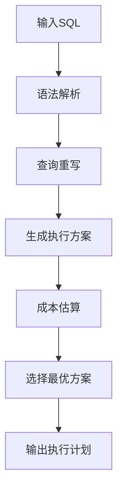

# 2. 执行计划分析 &#x20;

***

# **Java面试八股文：MySQL执行计划分析详解**

***

## **1. 概述与定义** &#x20;

**执行计划（Execution Plan）** 是MySQL优化器对SQL语句生成的查询执行方案，描述了MySQL如何执行查询，包括访问类型、索引使用、扫描行数等关键信息。通过`EXPLAIN`命令可获取执行计划，是优化SQL性能的核心工具。

**示例场景**： &#x20;

```sql 
-- 分析用户表的查询计划
EXPLAIN SELECT * FROM users WHERE age > 30;
```


***

## **2. 原理剖析**

### **2.1 执行计划生成流程** &#x20;

MySQL优化器通过以下步骤生成执行计划： &#x20;

1. **查询解析**：分析SQL语法，生成解析树。 &#x20;
2. **查询重写**：优化器对SQL进行等价转换（如子查询转连接）。 &#x20;
3. **查询优化**：生成多个执行方案，选择成本最低的方案。 &#x20;
4. **执行计划生成**：输出最终的执行步骤。

#### **流程图**： &#x20;




***

### **2.2 EXPLAIN字段详解**

| **字段**​             | **含义**​                                        |
| ------------------- | ---------------------------------------------- |
| **id**​             | 查询块ID，相同ID按顺序执行，不同ID按数值大小优先执行。                 |
| **select\_type**​   | 查询类型（\`SIMPLE\`、\`SUBQUERY\`、\`DERIVED\`等）。    |
| **table**​          | 当前操作的表名。                                       |
| **type**​           | 访问类型（如\`ALL\`全表扫描、\`index\`索引扫描）。              |
| **possible\_keys**​ | 可能使用的索引。                                       |
| **key**​            | 实际使用的索引。                                       |
| **key\_len**​       | 索引字段长度（字节）。                                    |
| **rows**​           | 预计扫描的行数。                                       |
| **filtered**​       | 条件过滤百分比。                                       |
| **Extra**​          | 附加信息（如\`Using temporary\`、\`Using filesort\`）。 |

#### **关键字段深度解析**： &#x20;

**type字段性能等级**： &#x20;


- **system/const**：单值匹配（如主键查询）。 &#x20;
- **ref**：普通索引扫描（如`WHERE age = 30`）。 &#x20;
- **ALL**：全表扫描（最差性能）。

***

## **3. 应用目标** &#x20;

1. **优化查询性能**：减少扫描行数，避免全表扫描。 &#x20;
2. **合理使用索引**：通过`key`字段判断索引是否命中。 &#x20;
3. **定位性能瓶颈**：分析`Extra`中的`Using filesort`或`temporary`。 &#x20;
4. **验证优化效果**：对比优化前后`rows`和`type`的变化。

***

## **4. 主要特点** &#x20;

| **特性**​    | **描述**​                                   |
| ---------- | ----------------------------------------- |
| **成本估算**​  | 优化器基于统计信息（如索引分布、表大小）估算执行成本。               |
| **多方案对比**​ | 生成多个执行方案，选择成本最低的方案。                       |
| **动态调整**​  | 随表数据量变化，执行计划可能调整（如索引失效）。                  |
| **兼容性强**​  | 支持\`SELECT\`、\`UPDATE\`、\`DELETE\`等语句的分析。 |

***

## **5. 主要内容及其组成部分** &#x20;

### **5.1 EXPLAIN输出示例** &#x20;

```sql 
EXPLAIN SELECT * FROM orders WHERE user_id = 100;
```


| id | select\\\_type | table  | type  | key  | rows | Extra       |
| -- | -------------- | ------ | ----- | ---- | ---- | ----------- |
| 1  | SIMPLE         | orders | index | NULL | 1000 | Using where |

**分析**： &#x20;

- **type=index**：未命中索引，需为`user_id`添加索引。 &#x20;
- **rows=1000**：扫描1000行，性能较低。

***

### **5.2 关键字段深度解析** &#x20;

#### **5.2.1 Extra字段** &#x20;

| **值**​                | **含义**​                                |
| --------------------- | -------------------------------------- |
| **Using index**​      | 覆盖索引，无需回表查询。                           |
| **Using filesort**​   | 未命中排序索引，需额外排序（磁盘或内存）。                  |
| **Using temporary**​  | 查询使用临时表（如复杂\`GROUP BY\`或\`DISTINCT\`）。 |
| **Impossible where**​ | \`WHERE\`条件永远为假，直接返回空结果。               |

**示例**： &#x20;

```sql 
-- 触发Using filesort
SELECT * FROM orders ORDER BY create_time DESC LIMIT 10;
```


#### **5.2.2 覆盖索引（Covering Index）** &#x20;

```sql 
-- 创建覆盖索引
ALTER TABLE users ADD INDEX idx_age_name (age, name);

-- 查询使用覆盖索引
EXPLAIN SELECT age, name FROM users WHERE age > 30;
```


| Extra       |
| ----------- |
| Using index |

***

## **6. 应用与拓展** &#x20;

### **6.1 常见优化场景** &#x20;

#### **6.1.1 全表扫描优化** &#x20;

```sql 
-- 原查询（type=ALL）
EXPLAIN SELECT * FROM users WHERE city = 'Beijing';
```


**优化步骤**： &#x20;

1. **添加索引**： &#x20;
   ```sql 
   ALTER TABLE users ADD INDEX idx_city (city);
   ```

2. **结果验证**： &#x20;
   ```sql 
   EXPLAIN SELECT * FROM users WHERE city = 'Beijing';
   -- type=ref，rows减少
   ```


#### **6.1.2 避免Using filesort** &#x20;

```sql 
-- 原查询（Using filesort）
EXPLAIN SELECT * FROM orders ORDER BY create_time DESC;
```


**优化**： &#x20;

```sql 
-- 添加排序字段索引
ALTER TABLE orders ADD INDEX idx_create_time (create_time);
```


***

### **6.2 工具链集成** &#x20;

#### **6.2.1 pt-query-digest分析** &#x20;

```bash 
pt-query-digest slow.log --filter '$event->{arg} =~ m/SELECT/' > select_analysis.txt
```


#### **6.2.2 Performance Schema** &#x20;

```sql 
-- 查看表级查询统计
SELECT * FROM performance_schema.table_io_waits_summary_by_table;
```


***

## **7. 面试问答** &#x20;

### **问题1：如何解读EXPLAIN的type字段？** &#x20;

**回答**： &#x20;

`type`字段表示查询类型，性能从高到低为： &#x20;

- **system/const**：单值匹配（如主键查询）。 &#x20;
- **eq\_ref**：唯一索引关联（如外键关联）。 &#x20;
- **ref**：普通索引扫描（如`WHERE age = 30`）。 &#x20;
- **range**：范围查询（如`BETWEEN`）。 &#x20;
- **ALL**：全表扫描，需优先优化。 &#x20;

**示例**： &#x20;

```sql 
EXPLAIN SELECT * FROM users WHERE id = 1;  -- type=const
```


***

### **问题2：为什么会出现Using temporary？如何优化？** &#x20;

**回答**： &#x20;

`Using temporary`表示查询需要临时表，常见场景： &#x20;

- **复杂**\*\*`GROUP BY`****/****`DISTINCT`\*\*：如`SELECT COUNT(DISTINCT col)`。 &#x20;
- **子查询未命中索引**：如`SELECT * FROM t WHERE id IN (SELECT id FROM sub)`. &#x20;

**优化方法**： &#x20;

1. **添加索引**：为关联字段添加索引。 &#x20;
2. **分步查询**：拆分复杂查询为多个简单查询。 &#x20;
3. **调整查询逻辑**：避免多表关联时的临时表生成。

***

### **问题3：覆盖索引的作用是什么？如何设计？** &#x20;

**回答**： &#x20;

**作用**：查询字段全包含在索引中，避免回表查询，提升性能。 &#x20;

**设计原则**： &#x20;

1. **包含查询字段**：如`SELECT age, name FROM users`，索引应包含`(age, name)`。 &#x20;
2. **最左前缀**：联合索引`(a, b, c)`可覆盖`a`、`(a,b)`、`(a,b,c)`的查询。 &#x20;

**示例**： &#x20;

```sql 
-- 原查询（需回表）
SELECT name FROM users WHERE age > 30;

-- 添加覆盖索引
ALTER TABLE users ADD INDEX idx_age_name (age, name);
```


***

### **问题4：EXPLAIN的rows字段含义？如何减少rows值？** &#x20;

**回答**： &#x20;

`rows`表示优化器预估的扫描行数，值越小性能越好。 &#x20;

**减少rows方法**： &#x20;

1. **添加索引**：为`WHERE`条件字段添加索引。 &#x20;
2. **优化查询条件**：使用精确匹配而非范围查询。 &#x20;
3. **分区表**：按条件分区（如按时间分区）。 &#x20;

**示例**： &#x20;

```sql 
-- 原查询（rows=1000）
EXPLAIN SELECT * FROM orders WHERE user_id = 100;

-- 添加索引后（rows=1）
ALTER TABLE orders ADD INDEX idx_user_id (user_id);
```


***

### **问题5：如何处理Using filesort？** &#x20;

**回答**： &#x20;

`Using filesort`表示未命中排序索引，需额外排序。 &#x20;

**优化步骤**： &#x20;

1. **添加排序字段索引**：如`ORDER BY create_time`，添加`create_time`索引。 &#x20;
2. **调整查询顺序**：将排序字段放在索引最左列。 &#x20;
3. **避免冗余排序**：如`ORDER BY`字段已在`WHERE`条件中命中索引。 &#x20;

**示例**： &#x20;

```sql 
-- 原查询（Using filesort）
EXPLAIN SELECT * FROM orders ORDER BY create_time DESC;

-- 添加索引后
ALTER TABLE orders ADD INDEX idx_create_time (create_time);
```


***

## **总结** &#x20;

MySQL执行计划分析是SQL优化的核心技能。面试中需掌握`EXPLAIN`字段含义、优化场景（如全表扫描、Using filesort）及工具链（`pt-query-digest`、Performance Schema）。通过覆盖索引、合理索引设计和减少临时表，可显著提升查询性能。结合示例和工具链实战，能有效应对面试中复杂SQL优化问题。
