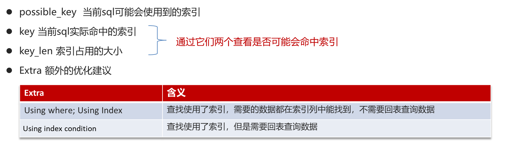
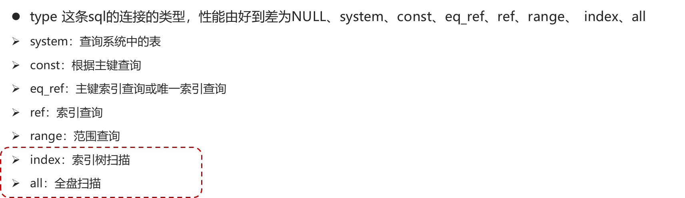

# 一. 性能

# A. 定位慢查询

## 开启慢查询日志

慢查询日志记录了所有执行时间超过指定参数（long\_query\_time，单位：秒，默认10秒）的所有SQL语句的日志. 如果要开启慢查询日志，需要在MySQL的配置文件（/etc/my.cnf）中配置如下信息： &#x20;

配置完毕之后，通过以下指令重新启动MySQL服务器进行测试，查看慢日志文件中记录的信息 /var/lib/mysql/localhost-slow\.log。

## EXPLAIN分析查询计划

- EXPLAIN 命令可以展示 MySQL 如何处理查询，包括使用的索引、连接方式等。
- 对于执行效率低的查询，可以通过 EXPLAIN 来分析是否存在索引未使用、全表扫描等问题。

## 借助性能分析工具

- 如 Percona Toolkit 中的 pt-query-digest 工具，可以对慢查询日志进行分析和汇总，提供更详细的报告。

# B. 执行计划

通过SQL执行计划, 找到慢查询的原因. 采用EXPLAIN 或者 DESC命令获取 MySQL 如何执行 SELECT 语句的信息. &#x20;

# C. SQL优化经验

## 表设计优化

①比如设置合适的数值（tinyint int bigint），要根据实际情况选择.
②比如设置合适的字符串类型（char和varchar）char定长效率高，varchar可变长度，效率稍低.

## 索引优化

依据索引创建原则, 见索引章节

## SQL语句优化

①SELECT语句务必指明字段名称（避免直接使用select \* ） &#x20;

②SQL语句要避免造成索引失效的写法 &#x20;

③尽量用union all代替union, union会多一次过滤，效率低 &#x20;

④避免在where子句中对字段进行表达式操作 &#x20;

⑤join优化 能用innerjoin 就不用left join right join，如必须使用 一定要以小表为驱动，内连接会对两个表进行优化，优先把小表放到外边，把大表放到里边。left join 或 right join，不会重新调整顺序.

## 主从复制, 读写分离

&#x20;如果数据库的使用场景读的操作比较多的时候，为了避免写的操作所造成的性能影响 可以采用读写分离的架构。读写分离解决的是，数据库的写入，影响了查询的效率。&#x20;

## 分库分表

[1. 定位慢查询](<1. 定位慢查询/1. 定位慢查询.md> "1. 定位慢查询")

[2. 执行计划分析  ](<2. 执行计划分析-/2. 执行计划分析-.md> "2. 执行计划分析  ")

[3. SQL优化经验  ](<3. SQL优化经验-/3. SQL优化经验-.md> "3. SQL优化经验  ")
