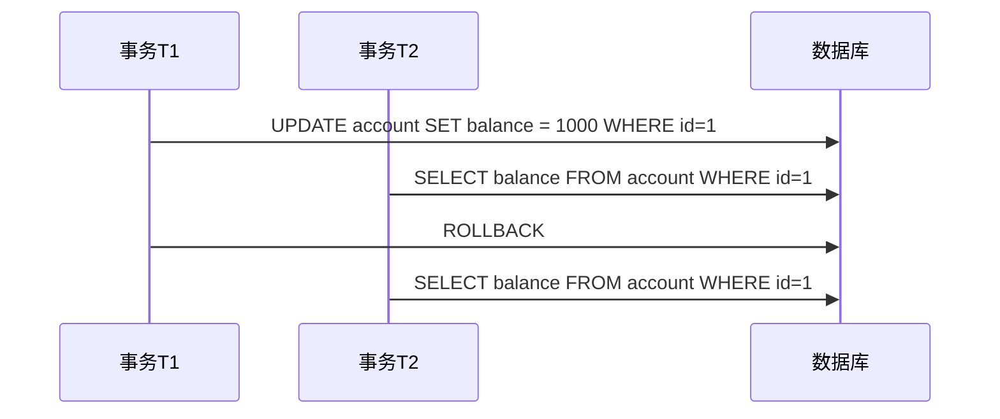

# 1. 事务特性

# **Java面试八股文：MySQL事务特性详解** &#x20;

***

## **1. 概述与定义** &#x20;

**事务（Transaction）** 是数据库操作的逻辑工作单元，**必须满足ACID四大特性**，以确保数据操作的正确性和一致性。 &#x20;

- **ACID特性**： &#x20;
  - **原子性（Atomicity）**：事务中的操作要么全部完成，要么全部不执行。 &#x20;
  - **一致性（Consistency）**：事务执行前后，数据库从一个合法状态转换到另一个合法状态。 &#x20;
  - **隔离性（Isolation）**：并发事务之间互不干扰，避免相互影响。 &#x20;
  - **持久性（Durability）**：事务提交后，其对数据库的修改是永久的，即使系统崩溃也能恢复。 &#x20;

**核心作用**： &#x20;

- 保证业务操作的完整性（如转账、订单支付）。 &#x20;
- 管理并发访问时的数据一致性。 &#x20;

***

## **2. 原理剖析** &#x20;

### **2.1 原子性（Atomicity）** &#x20;

#### **实现机制：Undo Log** &#x20;

- **原理**： &#x20;
  - 每个事务执行时，InnoDB会生成**回滚日志（Undo Log）** 记录数据修改前的旧值。
  - 若事务失败或回滚，通过Undo Log撤销所有已执行的操作。 &#x20;
- **示例**： &#x20;
  ```sql 
  -- 转账操作（事务示例）
  START TRANSACTION;
  UPDATE account SET balance = balance - 100 WHERE user = 'A';  -- 步骤1：A扣款
  UPDATE account SET balance = balance + 100 WHERE user = 'B';  -- 步骤2：B收款
  ROLLBACK;  -- 回滚后，A和B的余额恢复初始值
  ```

- **关键点**： &#x20;
  - Undo Log是**逻辑日志**，记录每行数据的旧值，用于回滚。 &#x20;
  - Undo Log还支持**多版本并发控制（MVCC）**，实现隔离性。 &#x20;

***

### **2.2 一致性（Consistency）** &#x20;

#### **核心保障**： &#x20;

- **业务约束**： &#x20;
  - 数据库约束（主键、外键、唯一性）。 &#x20;
  - 业务逻辑约束（如转账前后总金额不变）。 &#x20;
- **事务边界**： &#x20;
  - 确保事务提交前后的数据满足所有约束条件。 &#x20;
- **示例**： &#x20;
  ```sql 
  -- 转账前后总金额一致性
  SELECT SUM(balance) FROM account;  -- 事务前总金额：2000
  UPDATE account SET balance = balance - 100 WHERE user = 'A';
  UPDATE account SET balance = balance + 100 WHERE user = 'B';
  COMMIT;  
  SELECT SUM(balance) FROM account;  -- 事务后总金额仍为2000
  ```


***

### **2.3 隔离性（Isolation）** &#x20;

#### **并发问题与隔离级别** &#x20;

| **隔离级别**​                    | **允许的问题**​  | **描述**​                       |
| ---------------------------- | ----------- | ----------------------------- |
| **读未提交（Read Uncommitted）** ​ | 脏读、不可重复读、幻读 | 允许读取未提交数据，可能导致数据混乱。           |
| **读已提交（Read Committed）** ​   | 不可重复读、幻读    | 只读取已提交数据，但同一事务内多次读可能结果不同。     |
| **可重复读（Repeatable Read）** ​  | 幻读          | 同一事务内多次读取结果一致，但可能读到其他事务新增的数据。 |
| **串行化（Serializable）** ​      | 无           | 强制事务串行执行，避免所有并发问题，但性能最低。      |

#### **并发问题示例** &#x20;




***

### **2.4 持久性（Durability）** &#x20;

#### **实现机制：Redo Log** &#x20;

- **原理**： &#x20;
  - **预写式日志（WAL）**：事务修改数据前，先将操作记录到**重做日志（Redo Log）**。 &#x20;
  - **刷盘机制**：定期将Redo Log和数据页写入磁盘，确保崩溃后可恢复。 &#x20;
- **关键点**： &#x20;
  - Redo Log是**物理日志**，记录数据页的物理修改。 &#x20;
  - 通过`innodb_flush_log_at_trx_commit`配置控制刷盘频率（默认为1，每次事务提交写盘）。 &#x20;

***

## **3. 应用目标** &#x20;

### **3.1 核心目标** &#x20;

- **数据一致性**：避免因操作中断导致数据不完整。 &#x20;
- **并发控制**：平衡数据安全性和系统性能。 &#x20;
- **故障恢复**：保证崩溃后数据可恢复到事务提交状态。 &#x20;

### **3.2 典型场景** &#x20;

- **金融交易**：转账、支付等操作需严格保证ACID。 &#x20;
- **库存管理**：扣减库存与订单创建需原子性。 &#x20;

***

## **4. 主要特点对比** &#x20;

| **特性**​   | **原子性**​     | **一致性**​    | **隔离性**​    | **持久性**​        |
| --------- | ------------ | ----------- | ----------- | --------------- |
| **实现机制**​ | Undo Log     | 业务约束 + 事务边界 | 隔离级别 + 锁机制  | Redo Log + 刷盘机制 |
| **核心作用**​ | 回滚未完成操作      | 保证数据合法状态    | 隔离并发操作      | 永久保存提交结果        |
| **典型问题**​ | 半提交操作导致数据不一致 | 转账前后总金额不匹配  | 脏读、不可重复读、幻读 | 系统崩溃后数据丢失       |

***

## **5. 主要内容及其组成部分** &#x20;

### **5.1 原子性（Atomicity）** &#x20;

#### **5.1.1 Undo Log的作用** &#x20;

- **回滚操作**：通过Undo Log撤销未提交的事务。 &#x20;
- **示例**： &#x20;
  ```sql 
  START TRANSACTION;
  UPDATE account SET balance = 2000 WHERE user = 'Alice';  -- 步骤1
  ROLLBACK;  -- 回滚后，Alice的余额恢复为原值
  ```


***

### **5.2 一致性（Consistency）** &#x20;

#### **5.2.1 业务约束示例** &#x20;

- **外键约束**： &#x20;
  ```sql 
  CREATE TABLE orders (
      order_id INT PRIMARY KEY,
      customer_id INT,
      FOREIGN KEY (customer_id) REFERENCES customers(customer_id)
  );
  ```

- **自定义约束**： &#x20;
  ```sql 
  -- 确保转账前后总金额不变
  BEGIN;
  UPDATE account SET balance = balance - 100 WHERE user = 'A';
  UPDATE account SET balance = balance + 100 WHERE user = 'B';
  COMMIT;
  ```


***

### **5.3 隔离性（Isolation）** &#x20;

#### **5.3.1 隔离级别配置** &#x20;

- **设置隔离级别**： &#x20;
  ```sql 
  -- 设置为可重复读（默认）
  SET TRANSACTION ISOLATION LEVEL REPEATABLE READ;
  ```

- **并发问题解决方案**： &#x20;
  - **脏读**：提升隔离级别到Read Committed。 &#x20;
  - **幻读**：使用Serializable或优化查询条件。 &#x20;

***

### **5.4 持久性（Durability）** &#x20;

#### **5.4.1 Redo Log刷盘机制** &#x20;

- **配置参数**： &#x20;
  ```ini 
  [mysqld]
  innodb_flush_log_at_trx_commit = 1  # 每次事务提交写盘（最高安全性）
  ```

- **恢复流程**： &#x20;
  1. 系统崩溃后，InnoDB读取Redo Log。 &#x20;
  2. 重做（Redo）未写入磁盘的数据页。 &#x20;

***

## **6. 应用与拓展** &#x20;

### **6.1 事务优化策略** &#x20;

| **场景**​    | **解决方案**​        |
| ---------- | ---------------- |
| **长事务**​   | 缩短事务执行时间，减少锁竞争。  |
| **高并发写入**​ | 使用乐观锁（版本号）或分库分表。 |
| **死锁问题**​  | 调整事务顺序，遵循统一加锁顺序。 |

***

### **6.2 特殊场景处理** &#x20;

#### **6.2.1 事务与自动提交模式** &#x20;

- **自动提交（默认）**： &#x20;
  ```sql 
  -- 每条语句单独构成事务
  SELECT @@autocommit;  -- 返回1（开启）
  UPDATE account SET balance = 1000 WHERE user = 'A';  -- 自动提交
  ```

- **手动提交**： &#x20;
  ```sql 
  SET AUTOCOMMIT = 0;  -- 关闭自动提交
  START TRANSACTION;
  UPDATE account SET balance = 2000 WHERE user = 'A';
  COMMIT;  -- 显式提交
  ```


***

### **6.3 事务与锁机制** &#x20;

#### **6.3.1 锁类型对比** &#x20;

| **锁类型**​             | **适用场景**​      | **粒度**​ |
| -------------------- | -------------- | ------- |
| **行锁（Row Lock）** ​   | 高并发更新单行数据      | 行级      |
| **表锁（Table Lock）** ​ | 低并发场景或全表操作     | 表级      |
| **间隙锁（Gap Lock）** ​  | 防止幻读（InnoDB默认） | 范围间隙    |

***

## **7. 面试问答** &#x20;

### **问题1：简述事务的ACID特性及其作用。** &#x20;

**回答**： &#x20;

- **原子性（Atomicity）**：确保事务操作要么全部成功，要么全部失败。 &#x20;
- **一致性（Consistency）**：保证事务执行前后数据合法，如转账前后总金额不变。 &#x20;
- **隔离性（Isolation）**：控制并发事务间的可见性，避免脏读、不可重复读等问题。 &#x20;
- **持久性（Durability）**：提交后数据永久保存，即使系统崩溃也能恢复。 &#x20;

***

### **问题2：为什么InnoDB用Undo Log实现原子性？** &#x20;

**回答**： &#x20;

- **原理**：Undo Log记录数据修改前的旧值，事务回滚时通过这些日志恢复数据。 &#x20;
- **示例**： &#x20;
  ```sql 
  UPDATE account SET balance = 1000 WHERE user = 'A';  -- 修改后生成Undo Log
  ROLLBACK;  -- 使用Undo Log恢复原值
  ```

- **优势**：支持多版本并发控制（MVCC），提升读写并发性能。 &#x20;

***

### **问题3：解释可重复读与串行化的区别。** &#x20;

**回答**： &#x20;

- **可重复读（Repeatable Read）**： &#x20;
  - 同一事务内多次读取同一数据结果一致。 &#x20;
  - **允许幻读**：可能读到其他事务新增的行。 &#x20;
- **串行化（Serializable）**： &#x20;
  - 强制事务串行执行，完全避免所有并发问题。 &#x20;
  - **性能最低**：因锁冲突频繁。 &#x20;
- **选择建议**：优先使用可重复读（默认级别），仅在必要时选择串行化。 &#x20;

***

### **问题4：如何解决幻读问题？** &#x20;

**回答**： &#x20;

- **方案1**：提升隔离级别到**Serializable**。 &#x20;
- **方案2**：优化查询条件，使用唯一索引或范围条件。 &#x20;
- **示例**： &#x20;
  ```sql 
  -- 使用唯一索引避免幻读
  SELECT * FROM orders WHERE order_id = 1001 FOR UPDATE;
  ```


***

### **问题5：Redo Log和Undo Log的区别与作用？** &#x20;

**回答**： &#x20;

| **特性**​   | **Redo Log**​ | **Undo Log**​   |
| --------- | ------------- | --------------- |
| **作用**​   | 保证持久性（崩溃恢复）   | 保证原子性（回滚）       |
| **日志类型**​ | 物理日志（记录数据页修改） | 逻辑日志（记录行级旧值）    |
| **关键功能**​ | 刷盘后数据永久保存     | 回滚事务或提供MVCC版本数据 |

***

## **总结** &#x20;

- **核心考点**：ACID特性实现机制（Undo/Redo Log）、隔离级别选择、并发问题解决方案。 &#x20;
- **高频场景**：转账、订单处理、库存扣减。 &#x20;
- **面试技巧**：结合具体案例（如转账示例）解释原理，体现对日志机制和并发控制的理解。 &#x20;

通过掌握事务特性及其实现原理，面试中可清晰解答与事务相关的设计、优化及故障排查问题。

# MySQL的间隙锁

MySQL的间隙锁（Gap Lock）是一种锁定机制，主要用于防止在事务执行过程中，其他事务在锁定范围内插入新的记录，从而避免**幻读（Phantom Read）现象。** 幻读是指在同一个事务中，多次执行相同的查询时，由于其他事务的插入操作，导致查询结果集发生变化。间隙锁是 MySQL 中 InnoDB 存储引擎在可重复读（Repeatable Read）隔离级别下的重要特性。

***

## 什么是间隙锁？

间隙锁锁定的是索引记录之间的“间隙”，而不是具体的记录本身。它的作用是防止其他事务在锁定的间隙范围内插入新数据。例如，如果一个索引中有值 10 和 20，间隙锁可以锁定 (10, 20) 这个区间，在此期间其他事务无法在这个区间内插入新记录。不过，已有记录的更新或删除操作仍然可能发生（只要不违反其他锁的规则）。

间隙锁通常与**行锁（Record Lock）结合使用，形成**Next-Key Lock（下一键锁）。Next-Key Lock 是一个左开右闭的区间，既包括记录本身，也包括它前面的间隙。例如，对于索引值 10，Next-Key Lock 会锁定 (上一个值, 10] 的范围。

***

## 间隙锁的工作原理

### 1. 锁定范围

- 间隙锁锁定的是索引中的间隙，即两个索引值之间的空隙。
- 例如，索引值 10 和 20 之间的间隙 (10, 20) 可以被锁定，阻止新记录插入。

### 2. 锁定的触发条件

- 当执行以下语句时，可能会触发间隙锁：
  - `SELECT ... FOR UPDATE`
  - `SELECT ... LOCK IN SHARE MODE`
  - `UPDATE`
  - `DELETE`
- 如果查询条件不是基于**唯一索引的等值查询**（如 `WHERE id = 5`），而是范围查询（如 `WHERE id > 10 AND id < 20`），MySQL 可能会使用间隙锁来锁定查询范围内的间隙。

### 3. 与其他锁的关系

- 间隙锁通常与行锁一起使用，构成 Next-Key Lock。
- Next-Key Lock 锁定的是记录本身以及它前面的间隙，确保范围内的数据一致性。

***

## 间隙锁的优缺点

### 优点

- **防止幻读**：通过锁定间隙，阻止其他事务插入新记录，保证事务内的查询结果一致。
- **提高并发性**：相比于表锁，间隙锁只锁定部分数据范围，其他未锁定的范围仍可被其他事务操作。

### 缺点

- **可能导致死锁**：多个事务以不同顺序锁定间隙时，可能形成死锁。
- **影响性能**：在高并发场景下，间隙锁可能导致锁等待，从而降低系统性能。

***

## 间隙锁的使用场景

1. **可重复读隔离级别** &#x20;

   在 MySQL 的默认隔离级别（Repeatable Read）下，间隙锁被用来防止幻读。
2. **防止数据插入** &#x20;

   当需要在某个范围内确保没有新数据插入时，可以利用间隙锁。
3. **范围查询** &#x20;

   执行范围查询时，间隙锁防止其他事务在查询范围内插入新记录。

***

## 如何避免间隙锁

如果不需要间隙锁，可以通过以下方法避免：

1. **使用读已提交隔离级别** &#x20;

   在**读已提交（Read Committed）** 隔离级别下，MySQL 不会使用间隙锁，但这可能导致不可重复读和幻读问题。
2. **使用唯一索引的等值查询** &#x20;

   如果查询条件基于唯一索引的等值条件（如 `WHERE id = 10`），MySQL 会使用行锁而非间隙锁。
3. **优化查询** &#x20;

   尽量使用精确的查询条件，减少范围查询的使用，以避免触发间隙锁。

***

## 总结

MySQL 的间隙锁是 InnoDB 在可重复读隔离级别下防止幻读的重要机制。它通过锁定索引记录之间的间隙，阻止其他事务插入新记录，确保数据一致性。虽然间隙锁提高了事务的隔离性，但在高并发场景下可能引发死锁和性能问题。因此，在设计数据库事务时，需要根据业务需求权衡间隙锁的利弊，选择合适的隔离级别和查询策略。
