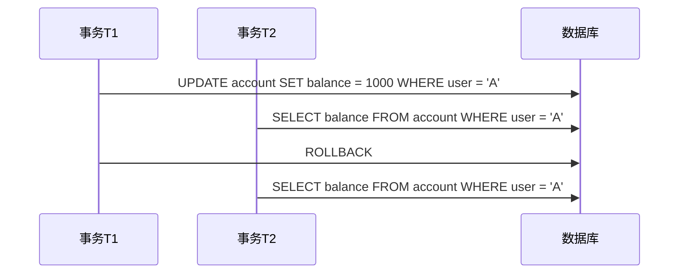
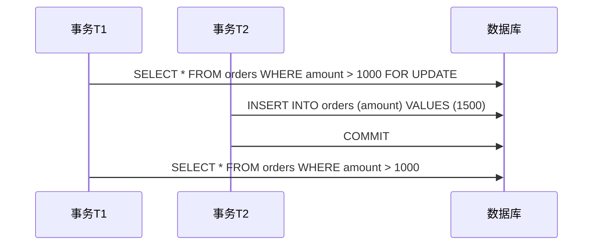

# 2. 隔离级别

***

# **Java面试八股文：MySQL事务隔离级别详解** &#x20;

***

## **1. 概述与定义** &#x20;

**事务隔离级别（Transaction Isolation Level）是数据库为解决并发事务间的**脏读、不可重复读、幻读问题而定义的规范，通过控制事务间的可见性来保证数据一致性。 &#x20;

### **核心问题定义** &#x20;

| **问题**​                          | **描述**​                                     | **示例场景**​                                      |
| -------------------------------- | ------------------------------------------- | ---------------------------------------------- |
| **脏读（Dirty Read）** ​             | 读取到其他事务未提交的数据，可能导致数据回滚后不一致。                 | 事务T1修改用户余额为1000但未提交，T2读取到1000后，T1回滚，T2最终读到错误值。 |
| **不可重复读（Non-Repeatable Read）** ​ | 同一事务内多次读取同一数据，结果不一致（其他事务已提交修改）。             | T1读取用户余额为500，T2提交更新为1000，T1再次读取到1000。          |
| **幻读（Phantom Read）** ​           | 同一事务内多次范围查询，结果集行数或内容不一致（其他事务插入/删除了符合条件的数据）。 | T1查询余额>500的用户，T2插入新用户后，T1再次查询发现多出一条记录。         |

***

## **2. 原理剖析** &#x20;

### **2.1 隔离级别分类与对比** &#x20;

MySQL支持**4种隔离级别**，由低到高依次为： &#x20;

| **隔离级别**​      | **允许的问题**​  | **实现机制**​                                | **性能**​ |
| -------------- | ----------- | ---------------------------------------- | ------- |
| **读未提交（RU）** ​ | 脏读、不可重复读、幻读 | 无锁控制，直接读取数据页。                            | 高       |
| **读已提交（RC）** ​ | 不可重复读、幻读    | 通过\*\*MVCC\*\*（多版本并发控制）和\*\*行锁\*\*控制可见性。 | 较高      |
| **可重复读（RR）** ​ | 幻读          | MVCC + **间隙锁（Gap Lock）** 阻止插入新行。         | 中       |
| **串行化（SER）** ​ | 无           | 全局锁（表锁），强制串行执行。                          | 低       |

#### **关键实现技术** &#x20;

- **MVCC**：通过版本链（Undo Log）记录数据历史版本，实现快照读（Snapshot Read）。 &#x20;
- **锁机制**：行锁、间隙锁、表锁等控制并发访问。 &#x20;

***

### **2.2 典型场景示例** &#x20;

#### **场景1：脏读（RU级别）** &#x20;




#### **场景2：幻读（RR级别）** &#x20;




***

## **3. 应用目标** &#x20;

- **核心目标**：在数据一致性与系统性能间取得平衡。 &#x20;
- **典型场景**： &#x20;
  - **金融系统**：需严格避免数据不一致，通常使用**RR**或**SER**。 &#x20;
  - **高并发电商系统**：优先保证性能，可能采用**RC**。 &#x20;

***

## **4. 主要特点** &#x20;

### **4.1 隔离级别选择策略** &#x20;

| **需求**​ | **推荐级别**​ | **理由**​                   |
| ------- | --------- | ------------------------- |
| 避免脏读    | RC及以上     | RU无法保证数据一致性。              |
| 需要可重复读  | RR及以上     | RC允许不可重复读，如订单金额多次查询结果不一致。 |
| 高并发写操作  | RC        | RR的间隙锁可能导致锁竞争和死锁。         |

***

## **5. 主要内容及其组成部分** &#x20;

### **5.1 读未提交（Read Uncommitted）** &#x20;

- **特点**： &#x20;
  - 允许脏读、不可重复读、幻读。 &#x20;
  - **极少使用**，因数据一致性无法保障。 &#x20;
- **适用场景**：仅用于读取临时数据。 &#x20;

***

### **5.2 读已提交（Read Committed）** &#x20;

- **实现机制**： &#x20;
  - 通过MVCC读取**最新已提交版本**的数据。 &#x20;
  - **行锁**防止其他事务修改当前读取的行。 &#x20;
- **示例**： &#x20;
  ```sql 
  -- 设置隔离级别
  SET SESSION TRANSACTION ISOLATION LEVEL READ COMMITTED;
  -- T1读取时，只能看到T2提交后的数据
  ```

- **优势**：避免脏读，性能较高。 &#x20;

***

### **5.3 可重复读（Repeatable Read）** &#x20;

- **核心机制**： &#x20;
  - **快照读（Snapshot Read）**：事务开始时生成数据快照，后续读取基于此快照。 &#x20;
  - **间隙锁**：锁定查询范围内的间隙，防止插入新行（但无法完全避免幻读）。 &#x20;
- **MySQL默认级别**： &#x20;
  ```sql 
  SELECT @@tx_isolation;  -- 返回'repeatable-read'  
  ```

- **幻读漏洞**： &#x20;
  - 若查询条件未命中索引，可能锁表导致幻读。 &#x20;

***

### **5.4 串行化（Serializable）** &#x20;

- **实现方式**： &#x20;
  - 全局表锁，事务按顺序执行。 &#x20;
  - **性能最低**，但完全避免并发问题。 &#x20;
- **强制顺序执行示例**： &#x20;
  ```sql 
  SET SESSION TRANSACTION ISOLATION LEVEL SERIALIZABLE;
  -- 事务T1和T2将排队执行，而非并行  
  ```


***

## **6. 应用与拓展** &#x20;

### **6.1 生产环境隔离级别选择** &#x20;

- **默认推荐**：**RR**（MySQL默认）。 &#x20;
- **优化策略**： &#x20;
  - **RC的适用场景**： &#x20;
    - 若业务能容忍不可重复读（如统计类查询）。 &#x20;
    - 通过**索引优化**减少锁竞争。 &#x20;

***

### **6.2 幻读解决方案** &#x20;

| **问题**​ | **解决方案**​        | **示例**​                                           |
| ------- | ---------------- | ------------------------------------------------- |
| 幻读      | 使用SER或优化查询索引。    | 确保查询条件命中唯一索引。                                     |
| RR下的幻读  | 在唯一索引列上加锁或改用SER。 | \`SELECT \* FROM users WHERE id = 1 FOR UPDATE;\` |

***

### **6.3 锁机制与隔离级别的关系** &#x20;

| **隔离级别**​ | **锁类型**​ | **锁范围**​ |
| --------- | -------- | -------- |
| RR        | 行锁 + 间隙锁 | 行与间隙     |
| RC        | 行锁       | 行级       |
| SER       | 表锁       | 全表       |

***

## **7. 面试问答** &#x20;

### **问题1：简述MySQL的四个隔离级别及其作用。** &#x20;

**回答**： &#x20;

- **读未提交（RU）**：允许所有并发问题，仅用于特殊场景。 &#x20;
- **读已提交（RC）**：避免脏读，但允许不可重复读和幻读，性能较高。 &#x20;
- **可重复读（RR）**：默认级别，避免脏读和不可重复读，但可能幻读。 &#x20;
- **串行化（SER）**：完全隔离，无并发问题，但性能最低。 &#x20;

***

### **问题2：为什么MySQL默认使用RR而非RC？** &#x20;

**回答**： &#x20;

- **历史原因**：早期MySQL的`REPEATABLE READ`通过MVCC解决了幻读问题（需InnoDB支持）。 &#x20;
- **性能权衡**：RR的间隙锁可能增加锁竞争，但通过索引优化可缓解。 &#x20;
- **主从复制兼容性**：RR与`ROW`格式的Binlog结合更安全，避免数据不一致。 &#x20;

***

### **问题3：如何通过代码设置事务的隔离级别？** &#x20;

**回答**： &#x20;

- **直接设置**： &#x20;
  ```sql 
  SET SESSION TRANSACTION ISOLATION LEVEL REPEATABLE READ;
  ```

- **Java中使用Spring**： &#x20;
  ```java 
  @Transactional(isolation = Isolation.READ_COMMITTED)
  public void someMethod() { ... }
  ```


***

### **问题4：解释不可重复读与幻读的区别。** &#x20;

**回答**： &#x20;

- **不可重复读**：同一查询结果值变化（如余额从500变为1000）。 &#x20;
- **幻读**：同一查询结果行数变化（如新增一条符合条件的订单）。 &#x20;
- **本质区别**： &#x20;
  - 不可重复读：修改现有行。 &#x20;
  - 幻读：插入/删除新行。 &#x20;

***

### **问题5：如何解决RR下的幻读问题？** &#x20;

**回答**： &#x20;

1. **优化查询索引**：确保查询条件命中唯一索引，避免间隙锁遗漏。 &#x20;
2. **显式加锁**： &#x20;
   ```sql 
   SELECT * FROM users WHERE name = 'Alice' FOR UPDATE;  -- 锁定具体行
   ```

3. **升级隔离级别**：临时切换为SER执行关键操作。 &#x20;

***

## **总结** &#x20;

- **核心考点**：隔离级别与并发问题的对应关系、MySQL默认RR的实现机制、生产环境选择策略。 &#x20;
- **高频场景**：转账、库存扣减、订单处理需严格隔离。 &#x20;
- **面试技巧**：结合代码示例和时序图解释原理，体现对锁机制和MVCC的理解。 &#x20;

通过掌握事务隔离级别，面试中可清晰回答并发控制、锁优化及故障排查问题。
