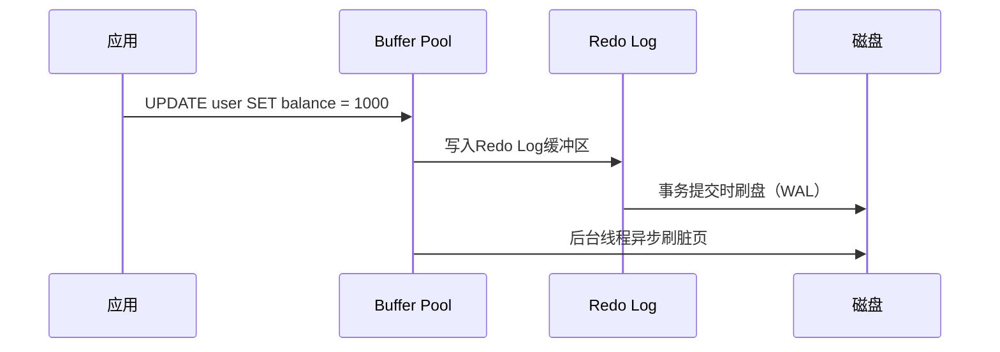
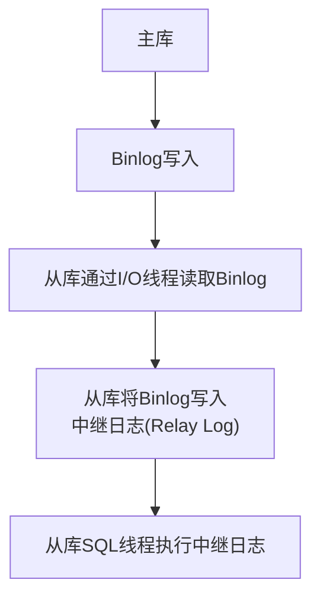
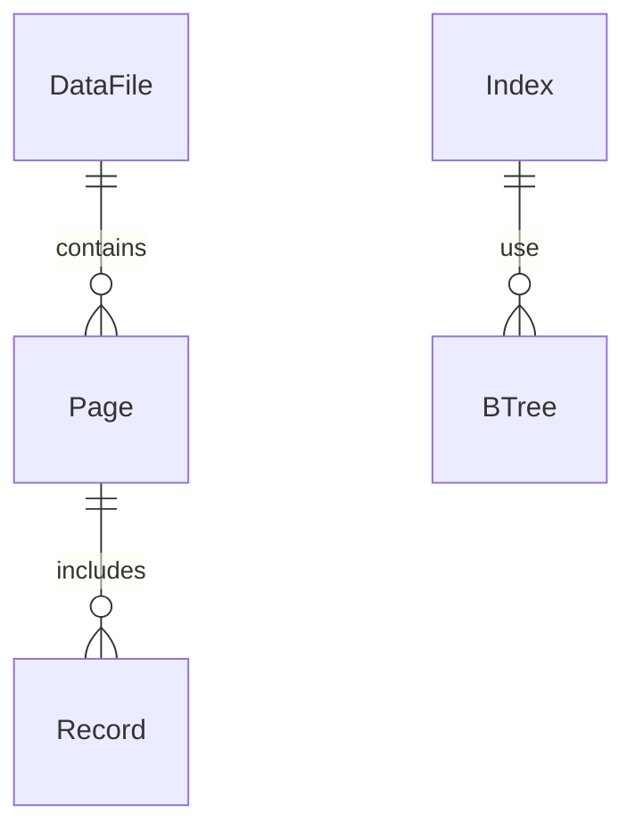

# 3. 日志与存储结构

***

# **Java面试八股文：MySQL事务日志与存储结构详解** &#x20;

***

## **1. 概述与定义** &#x20;

**事务日志**是MySQL保证数据一致性和持久性的核心机制，而**存储结构**则定义了数据在内存与磁盘中的组织方式。两者共同支撑了事务的ACID特性。 &#x20;

### **核心概念** &#x20;

| **概念**​          | **描述**​          | **作用**​                                       |
| ---------------- | ---------------- | --------------------------------------------- |
| **Redo Log**​    | 物理日志，记录数据页的修改操作。 | 保证事务的持久性（Durability），崩溃恢复时重做未完成的修改。           |
| **Undo Log**​    | 逻辑日志，记录数据修改前的旧值。 | 保证事务的原子性（Atomicity）和隔离性（Isolation），支持回滚与MVCC。 |
| **Binlog**​      | 逻辑日志，记录数据库的全局操作。 | 主从复制、数据恢复和增量备份的核心。                            |
| **Buffer Pool**​ | 内存中的数据页缓存。       | 缓解磁盘IO压力，提升查询性能。                              |

***

## **2. 原理剖析** &#x20;

### **2.1 Redo Log（重做日志）** &#x20;

#### **实现原理：WAL（Write-Ahead Logging）** &#x20;

- **流程**： &#x20;
  1. **修改数据前**：先将操作记录到Redo Log缓冲区（`innodb_redo_log_buffer`）。 &#x20;
  2. **事务提交时**：将缓冲区的Redo Log刷入磁盘文件（`ib_logfile0`/`ib_logfile1`）。 &#x20;
  3. **后台线程**：定期将Buffer Pool中的脏页（修改过的数据页）写入磁盘。 &#x20;

#### **示例流程图** &#x20;




***

### **2.2 Undo Log（回滚日志）** &#x20;

#### **核心作用** &#x20;

- **回滚（Rollback）**：通过旧值撤销未提交的事务。 &#x20;
- **MVCC（多版本并发控制）**：通过版本链提供不同事务的快照视图。 &#x20;

#### **示例：转账回滚** &#x20;

```sql 
START TRANSACTION;
UPDATE account SET balance = balance - 100 WHERE user = 'A';  -- 步骤1
UPDATE account SET balance = balance + 100 WHERE user = 'B';  -- 步骤2
ROLLBACK;  -- 通过Undo Log恢复初始值
```


***

### **2.3 Binlog（二进制日志）** &#x20;

#### **三大格式** &#x20;

| **格式**​        | **描述**​                       | **适用场景**​                              |
| -------------- | ----------------------------- | -------------------------------------- |
| **STATEMENT**​ | 记录SQL语句。                      | 简单复制，但可能因非确定性操作（如\`RAND()\`）导致主从数据不一致。 |
| **ROW**​       | 记录行级修改（INSERT/UPDATE/DELETE）。 | 精确复制，支持主从一致性和GTID。                     |
| **MIXED**​     | 自动选择STATEMENT或ROW格式。          | 平衡性能与一致性。                              |

#### **主从复制流程** &#x20;




***

### **2.4 存储结构：Buffer Pool与磁盘** &#x20;

#### **Buffer Pool** &#x20;

- **LRU算法**：淘汰未使用的冷数据页，优先保留热数据。 &#x20;
- **脏页管理**：修改后的数据页标记为“脏”，后台线程异步刷盘。 &#x20;

#### **磁盘存储结构** &#x20;

- **数据文件**：`.ibd`（InnoDB表空间文件）或`.frm`（表结构文件）。 &#x20;
- **日志文件**：`ibdata1`（共享表空间）、`ib_logfile0`（Redo Log）、`mysql-bin.000001`（Binlog）。 &#x20;

***

## **3. 应用目标** &#x20;

### **3.1 核心目标** &#x20;

- **Redo Log**：保证崩溃后的数据恢复。 &#x20;
- **Undo Log**：支持事务回滚与MVCC。 &#x20;
- **Binlog**：实现主从复制与数据备份。 &#x20;
- **Buffer Pool**：提升查询性能，减少磁盘IO。 &#x20;

### **3.2 典型场景** &#x20;

- **高并发写入**：通过Redo Log减少频繁刷盘。 &#x20;
- **读多写少**：Buffer Pool缓存热点数据。 &#x20;
- **灾难恢复**：结合Redo Log和Binlog进行全量+增量恢复。 &#x20;

***

## **4. 主要特点对比** &#x20;

| **特性**​   | **Redo Log**​      | **Undo Log**​         | **Binlog**​           |
| --------- | ------------------ | --------------------- | --------------------- |
| **类型**​   | 物理日志（数据页修改）        | 逻辑日志（行级旧值）            | 逻辑日志（全局操作记录）          |
| **作用**​   | 持久性（崩溃恢复）          | 原子性（回滚） + 隔离性（MVCC）   | 主从复制、数据恢复             |
| **存储位置**​ | InnoDB共享表空间或独立文件   | 每个表的.ibd文件            | 全局文件（如`mysql-bin. *`） |
| **依赖关系**​ | 必须先写Redo Log才能提交事务 | Undo Log需记录到Redo Log中 | Binlog是事务提交的必要条件      |

***

## **5. 主要内容及其组成部分** &#x20;

### **5.1 Redo Log组件** &#x20;

#### **5.1.1 内存缓冲区** &#x20;

- **参数配置**： &#x20;
  ```ini 
  [mysqld]
  innodb_log_buffer_size = 16M  -- 缓冲区大小，默认8M
  ```

- **作用**：暂存未刷盘的Redo Log，减少磁盘IO。 &#x20;

#### **5.1.2 磁盘文件** &#x20;

- **文件组**：默认2个文件（`ib_logfile0`和`ib_logfile1`），大小由`innodb_log_file_size`定义。 &#x20;
- **循环写入**：写满一个文件后切换到下一个，形成环形日志。 &#x20;

***

### **5.2 Undo Log组件** &#x20;

#### **5.2.1 版本链（Version Chain）** &#x20;

- **示例**： &#x20;
  ```sql 
  -- 事务T1更新用户余额
  UPDATE account SET balance = 1000 WHERE id = 1;
  -- 生成Undo Log记录旧值（500）
  ```

- **MVCC读取**： &#x20;
  ```sql 
  -- 事务T2读取T1未提交的旧值
  SELECT balance FROM account WHERE id = 1;  -- 读到500（旧版本）
  ```


***

### **5.3 Binlog组件** &#x20;

#### **5.3.1 文件结构** &#x20;

| **字段**​  | **描述**​                     |
| -------- | --------------------------- |
| **事件头**​ | 包含时间戳、位置、事务信息等。             |
| **事件体**​ | 记录具体操作（如UPDATE的前/后值）。       |
| **文件名**​ | \`mysql-bin.000001\`，按大小轮转。 |

#### **5.3.2 配置参数** &#x20;

```ini 
[mysqld]
log_bin = mysql-bin          -- 启用Binlog
binlog_format = ROW          -- 使用ROW格式
expire_logs_days = 7         -- 自动清理7天前的日志
```


***

### **5.4 存储结构组件** &#x20;

#### **5.4.1 Buffer Pool管理** &#x20;

- **LRU List**：最近使用的页在列表头部，冷数据在尾部。 &#x20;
- **Free List**：空闲页的缓存池。 &#x20;

#### **5.4.2 磁盘存储布局** &#x20;




***

## **6. 应用与拓展** &#x20;

### **6.1 性能调优策略** &#x20;

| **场景**​              | **解决方案**​                         | **参数示例**​                           |
| -------------------- | --------------------------------- | ----------------------------------- |
| **Redo Log不足**​      | 增大\`innodb\_log\_file\_size\`。    | \`innodb\_log\_file\_size = 1G\`    |
| **Binlog空间过大**​      | 缩短\`expire\_logs\_days\`或改用ROW格式。 | \`expire\_logs\_days = 3\`          |
| **Buffer Pool命中率低**​ | 增加\`innodb\_buffer\_pool\_size\`。 | \`innodb\_buffer\_pool\_size = 4G\` |

***

### **6.2 数据恢复流程** &#x20;

#### **步骤示例** &#x20;

1. **恢复Redo Log**： &#x20;
   ```bash 
   # 强制恢复InnoDB数据
   mysqld --innodb_force_recovery=1 --skip-innodb-read-only
   ```

2. **恢复Binlog**： &#x20;
   ```bash 
   mysqlbinlog mysql-bin.000001 | mysql -u root -p
   ```


***

### **6.3 与锁机制的关联** &#x20;

| **日志类型**​     | **关联锁类型**​     | **作用**​               |
| ------------- | -------------- | --------------------- |
| **Undo Log**​ | Next-Key锁（间隙锁） | 防止幻读，实现可重复读（RR）。      |
| **Redo Log**​ | 无直接关联          | 通过WAL确保写操作的持久性，无需额外锁。 |

***

## **7. 面试问答** &#x20;

### **问题1：Redo Log和Undo Log的区别与作用？** &#x20;

**回答**： &#x20;

- **Redo Log**： &#x20;
  - 物理日志，记录数据页的修改。 &#x20;
  - 保证持久性，崩溃后重做未完成的修改。 &#x20;
- **Undo Log**： &#x20;
  - 逻辑日志，记录行级旧值。 &#x20;
  - 支持事务回滚（原子性）和MVCC（隔离性）。 &#x20;

***

### **问题2：Binlog的三种格式如何选择？** &#x20;

**回答**： &#x20;

- **STATEMENT**：简单场景，但可能因非确定性操作导致主从不一致。 &#x20;
- **ROW**：推荐使用，精确记录行变更，支持主从一致性和GTID。 &#x20;
- **MIXED**：自动选择，但需权衡性能与一致性。 &#x20;

***

### **问题3：解释Buffer Pool的LRU算法。** &#x20;

**回答**： &#x20;

- **LRU（最近最少使用）**： &#x20;
  - 热数据（频繁访问的页）保留在列表头部。 &#x20;
  - 冷数据（未使用的页）被移到尾部，最终被淘汰。 &#x20;
- **作用**：平衡内存占用与访问效率。 &#x20;

***

### **问题4：如何通过Redo Log和Binlog恢复数据？** &#x20;

**回答**： &#x20;

1. **Redo Log恢复**： &#x20;
   - 崩溃后，InnoDB读取Redo Log重做未刷盘的修改。 &#x20;
2. **Binlog恢复**： &#x20;
   - 使用`mysqlbinlog`解析日志，通过SQL重放恢复数据。 &#x20;
   ```bash 
   mysqlbinlog mysql-bin.000001 | mysql -u root -p
   ```


***

### **问题5：为什么需要同时使用Redo Log和Binlog？** &#x20;

**回答**： &#x20;

- **Redo Log**： &#x20;
  - 属于InnoDB引擎内部日志，保证事务的持久性。 &#x20;
- **Binlog**： &#x20;
  - 全局日志，用于主从复制和逻辑备份。 &#x20;
- **区别**： &#x20;
  - Redo Log是物理日志（页级），Binlog是逻辑日志（行级或语句级）。 &#x20;
  - Redo Log用于崩溃恢复，Binlog用于逻辑操作（如删除误操作后的数据恢复）。 &#x20;

***

## **总结** &#x20;

- **核心考点**：日志类型的作用、存储结构的优化、崩溃恢复流程。 &#x20;
- **高频场景**：高并发事务处理、主从数据一致性、性能调优。 &#x20;
- **面试技巧**：结合代码示例（如回滚操作）和流程图（如Binlog复制），体现对底层机制的理解。 &#x20;

通过掌握事务日志与存储结构，面试中可深入分析性能瓶颈、数据恢复策略及锁冲突问题。
