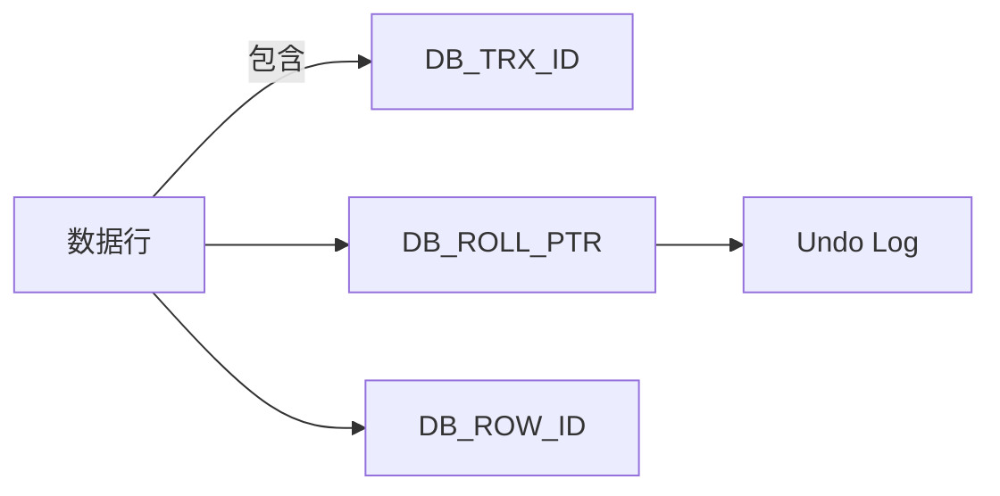
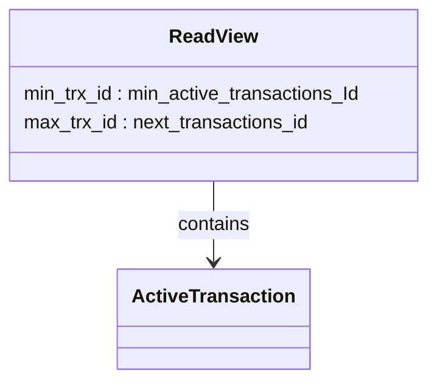
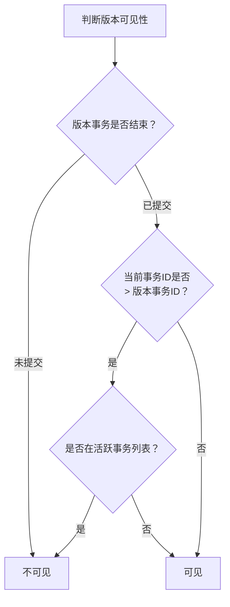
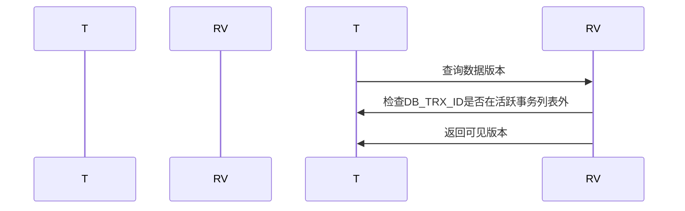
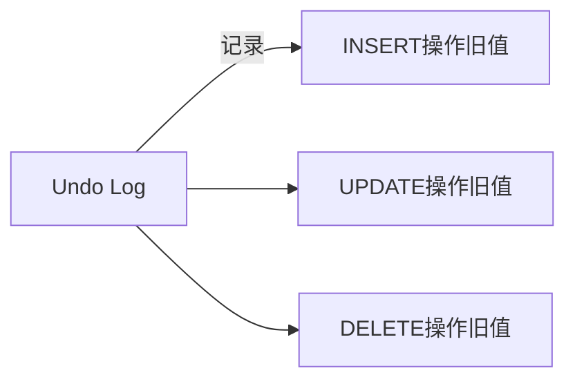
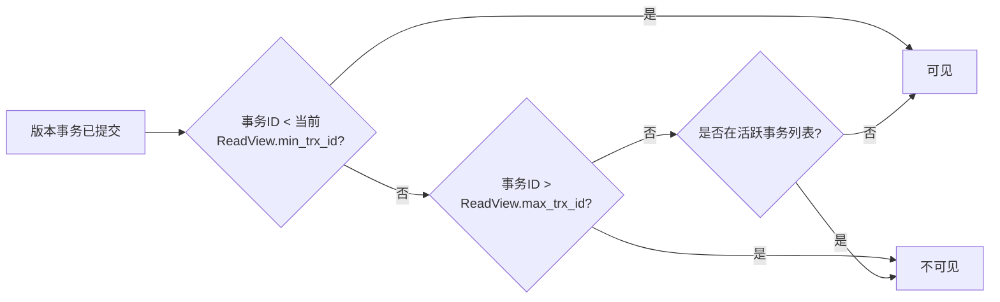

# 4. MVCC

***

# **Java面试八股文：MySQL事务MVCC详解** &#x20;

***

## **1. 概述与定义** &#x20;

**MVCC（Multi-Version Concurrency Control，多版本并发控制）是MySQL InnoDB引擎为解决并发事务中的**脏读、不可重复读、幻读问题而设计的核心机制。它通过**数据多版本化**实现非阻塞的读操作，避免频繁加锁带来的性能损耗。 &#x20;

### **核心作用** &#x20;

| **问题**​    | **MVCC解决方案**​  | **依赖机制**​                         |
| ---------- | -------------- | --------------------------------- |
| **脏读**​    | 仅可见已提交事务的版本    | Undo Log + 可见性规则                  |
| **不可重复读**​ | 事务开始时生成数据快照    | 隐藏字段（DB\_TRX\_ ID、DB\_ROLL\_ PTR） |
| **幻读**​    | 可重复读（RR）下结合间隙锁 | Read View + 隐式索引扫描                |

***

## **2. 原理剖析** &#x20;

### **2.1 核心组件与机制** &#x20;

#### **2.1.1 隐藏字段** &#x20;

InnoDB在每行数据后添加三个隐藏字段： &#x20;

| **字段**​           | **描述**​                    | **作用**​  |
| ----------------- | -------------------------- | -------- |
| \`DB\_TRX\_ID\`   | 记录最后一次修改该行的事务ID（6字节）。      | 标识版本归属。  |
| \`DB\_ROLL\_PTR\` | 指向该行旧版本在Undo Log中的位置（7字节）。 | 构建历史版本链。 |
| \`DB\_ROW\_ID\`   | 自增行ID（6字节，无主键时作为隐式主键）。     | 辅助索引排序。  |




#### **2.1.2 Read View（读视图）** &#x20;

- **定义**：事务启动时生成的快照视图，包含当前活跃事务列表。 &#x20;
- **关键参数**： &#x20;
  - `m_ids`：活跃事务ID列表。 &#x20;
  - `min_trx_id`：最小活跃事务ID。 &#x20;
  - `max_trx_id`：下一个事务ID。 &#x20;




#### **2.1.3 Undo Log（回滚日志）** &#x20;

- **作用**：存储数据的历史版本，供MVCC回溯。 &#x20;
- **类型**： &#x20;
  - **Insert Undo Log**：仅对当前事务可见，提交后可删除。 &#x20;
  - **Update Undo Log**：对其他事务可见，需等待Purge线程清理。 &#x20;

***

### **2.2 可见性规则** &#x20;

根据事务的隔离级别（RR/RC）和Read View，判断数据版本的可见性： &#x20;

#### **规则流程图** &#x20;




#### **示例场景** &#x20;

```sql 
-- 事务T1：更新用户余额
START TRANSACTION;
UPDATE account SET balance = 200 WHERE id = 1;
-- 事务T2：在T1未提交时读取
START TRANSACTION ISOLATION LEVEL REPEATABLE READ;
SELECT balance FROM account WHERE id = 1;  -- 读取T1未提交前的旧版本（如100）
COMMIT T1;  -- T2的SELECT仍显示旧值（快照读）
```


***

## **3. 应用目标** &#x20;

### **3.1 核心目标** &#x20;

- **提升并发性能**：读操作无需加锁，避免阻塞写操作。 &#x20;
- **保证数据一致性**：通过版本链和快照视图隔离事务。 &#x20;

### **3.2 典型场景** &#x20;

- **高并发读写系统**：如电商秒杀时，用户查询库存（快照读）与库存扣减（当前读）并行。 &#x20;
- **事务快照一致性**：在RR下，事务内多次查询结果一致。 &#x20;

***

## **4. 主要特点** &#x20;

| **特性**​    | **说明**​                  | **示例**​                      |
| ---------- | ------------------------ | ---------------------------- |
| **非阻塞读**​  | 读操作不加锁，通过版本链实现。          | \`SELECT \* FROM orders\`    |
| **版本回溯**​  | 通过Undo Log回滚到历史版本。       | \`ROLLBACK\`恢复到事务开始前的状态。     |
| **隔离性依赖**​ | 在RR下避免幻读，需结合间隙锁。         | \`SELECT FOR UPDATE\`锁定索引范围。 |
| **空间开销**​  | 历史版本占用额外存储空间，需Purge线程清理。 | 频繁更新的表可能产生大量Undo Log。        |

***

## **5. 主要内容及其组成部分** &#x20;

### **5.1 隐藏字段详解** &#x20;

#### **5.1.1 DB\_TRX\_ID** &#x20;

- **示例**： &#x20;
  ```sql 
  -- 假设事务ID为100的T1更新了某行数据
  UPDATE account SET balance = 200 WHERE id = 1;
  -- 该行DB_TRX_ID被设置为100
  ```


#### **5.1.2 DB\_ROLL\_PTR** &#x20;

- **作用**： &#x20;
  ```mermaid 
  graph LR
    A[当前版本] -->|DB_ROLL_PTR| B[旧版本]
    B --> C[更旧版本]
  ```


***

### **5.2 Read View的构建与判断** &#x20;

#### **5.2.1 生成时机** &#x20;

- **RR级别**：事务启动时生成固定快照。 &#x20;
- **RC级别**：每次查询生成新快照。 &#x20;

#### **5.2.2 可见性判断逻辑** &#x20;




***

### **5.3 Undo Log与Purge机制** &#x20;

#### **5.3.1 Undo Log结构** &#x20;




#### **5.3.2 Purge线程** &#x20;

- **作用**：清理不再需要的旧版本（如已提交事务的Insert Undo Log）。 &#x20;
- **触发条件**：事务提交后且无其他事务依赖该版本。 &#x20;

***

### **5.4 可见性规则深度解析** &#x20;

#### **规则1：未提交事务的版本不可见** &#x20;

```sql 
-- T1未提交时，T2读不到其修改
SELECT balance FROM account WHERE id = 1;  -- 显示旧值
```


#### **规则2：历史版本可见性判断** &#x20;




***

## **6. 应用与拓展** &#x20;

### **6.1 隔离级别与MVCC的关联** &#x20;

| **隔离级别**​      | **MVCC行为**​      | **锁机制**​       |
| -------------- | ---------------- | -------------- |
| **读已提交（RC）** ​ | 每次查询生成新快照，避免脏读。  | 行锁（写操作）。       |
| **可重复读（RR）** ​ | 事务内快照固定，需间隙锁防幻读。 | 行锁 + 间隙锁（写操作）。 |

***

### **6.2 幻读问题的解决** &#x20;

- **RR下的实现**： &#x20;
  ```sql 
  -- T1锁定范围防止插入
  SELECT * FROM orders WHERE amount > 1000 FOR UPDATE;
  -- T2插入新行将被间隙锁阻塞
  INSERT INTO orders (amount) VALUES (1500);
  ```


***

### **6.3 性能优化建议** &#x20;

| **问题**​      | **解决方案**​                              | **配置示例**​                                                   |
| ------------ | -------------------------------------- | ----------------------------------------------------------- |
| Undo Log空间过大 | 定期清理历史数据，增大\`innodb\_undo\_log\_size\` | \`innodb\_undo\_tablespaces=2\`                             |
| 快照读性能下降      | 减少大事务，使用\`READ COMMITTED\`降低开销。        | \`SET SESSION TRANSACTION ISOLATION LEVEL READ COMMITTED;\` |

***

## **7. 面试问答** &#x20;

### **问题1：什么是MVCC？它如何解决并发问题？** &#x20;

**回答**： &#x20;

- **MVCC**是InnoDB的多版本并发控制机制，通过数据多版本化实现非阻塞读。 &#x20;
- **解决并发问题**： &#x20;
  1. **避免加锁**：读操作不加锁，通过版本链访问历史数据。 &#x20;
  2. **快照隔离**：RR下事务内数据视图固定，RC下每次查询生成新快照。 &#x20;
  3. **可见性规则**：仅可见已提交版本或自身修改的版本。 &#x20;

***

### **问题2：解释MVCC中的隐藏字段及其作用。** &#x20;

**回答**： &#x20;

- **DB\_TRX\_ID**：记录最后一次修改该行的事务ID。 &#x20;
- **DB\_ROLL\_PTR**：指向该行的前一个版本，形成版本链。 &#x20;
- **DB\_ROW\_ID**：无主键时作为隐式主键，辅助索引排序。 &#x20;
- **作用**：通过隐藏字段和Undo Log，实现数据版本的回溯与可见性判断。 &#x20;

***

### **问题3：MVCC在RR和RC隔离级别下的行为有何不同？** &#x20;

**回答**： &#x20;

- **RR**： &#x20;
  - 事务启动时生成固定快照，多次读取结果一致。 &#x20;
  - 需间隙锁防止幻读。 &#x20;
- **RC**： &#x20;
  - 每次查询生成新快照，可见其他事务已提交的修改。 &#x20;
  - 不保证可重复读，但避免脏读。 &#x20;

***

### **问题4：如何通过MVCC实现事务回滚？** &#x20;

**回答**： &#x20;

1. **回滚逻辑**： &#x20;
   ```sql 
   -- T1更新后回滚
   UPDATE account SET balance = 200 WHERE id = 1;
   ROLLBACK;
   ```

2. **实现原理**： &#x20;
   - 通过Undo Log的DB\_ROLL\_PTR回溯到旧版本。 &#x20;
   - 回滚后，数据行恢复到修改前的DB\_TRX\_ID和版本值。 &#x20;

***

### **问题5：MVCC的优缺点是什么？** &#x20;

**回答**： &#x20;

- **优点**： &#x20;
  - 非阻塞读提升并发性能。 &#x20;
  - 隔离性与性能平衡，避免锁竞争。 &#x20;
- **缺点**： &#x20;
  - **存储开销**：历史版本占用额外空间。 &#x20;
  - **幻读漏洞**：需结合间隙锁（RR）或升级隔离级别（SER）。 &#x20;
  - **时间旅行问题**：长事务可能保留旧版本过久，阻碍Purge清理。 &#x20;

***

## **总结** &#x20;

- **核心考点**：隐藏字段的作用、Read View生成规则、可见性判断流程、与隔离级别的关联。 &#x20;
- **高频场景**：高并发读写系统、事务快照一致性、性能调优。 &#x20;
- **面试技巧**：结合代码示例（如回滚操作）和流程图（如可见性判断），体现对底层机制的理解。 &#x20;

通过掌握MVCC，面试中可深入分析并发控制、数据一致性及性能优化策略。

# 快照读与当前读

在数据库系统中，特别是像 MySQL（InnoDB 存储引擎）这样支持多版本并发控制（MVCC）的数据库中，**快照读（Snapshot Read）** 和 **当前读（Current Read）** 是两种不同的数据读取方式。它们在加锁机制、读取的数据版本以及数据一致性方面存在显著差异。下面将详细介绍这两种读取方式。

***

## 快照读（Snapshot Read）

### 1. 概念

快照读是一种**非锁定读**，基于 MVCC 机制，读取的是数据库在某个时间点的快照数据（历史版本），而不是最新的数据。由于不加锁，它不会阻塞其他事务的写操作。

### 2. 特点

- **不加锁**：读取时不对数据行加锁。
- **读取历史版本**：读取的是事务开始时的快照数据，不会反映其他事务提交的最新更改。
- **避免脏读**：读取的是已提交的快照数据，不会看到未提交的修改。
- **可能出现问题**：在某些隔离级别下，可能出现不可重复读（数据被其他事务修改）或幻读（数据行数量变化）。

### 3. 使用场景

快照读适用于大多数**只读事务**，如报表生成、数据分析等场景。它在 **可重复读（Repeatable Read）** 和 **读已提交（Read Committed）** 隔离级别下是默认的读取方式。

### 4. 示例

```sql 
SELECT * FROM table_name;
```


***

## 当前读（Current Read）

### 1. 概念

当前读是一种**锁定读**，读取的是数据库的最新数据，并通过加锁确保数据一致性。由于加锁，它会阻塞其他事务对同一数据的写操作。

### 2. 特点

- **加锁**：根据操作类型加共享锁（S 锁）或排他锁（X 锁）。
- **读取最新数据**：总是获取数据库的最新提交版本。
- **保证一致性**：通过锁机制，防止脏读、不可重复读和幻读。
- **可能阻塞**：加锁可能导致锁等待或死锁，影响并发性。

### 3. 使用场景

当前读适用于需要**数据一致性**和**实时性**的场景，例如转账、库存扣减等操作。写操作（如 INSERT、UPDATE、DELETE）会自动使用当前读，而 SELECT 语句也可以通过特定语法显式启用当前读。

### 4. 示例

```sql 
-- 加共享锁
SELECT * FROM table_name LOCK IN SHARE MODE;

-- 加排他锁
SELECT * FROM table_name FOR UPDATE;

-- 写操作（隐含当前读）
UPDATE table_name SET column = value WHERE condition;
```


***

## 快照读与当前读的对比

| 特性        | 快照读（Snapshot Read） | 当前读（Current Read） |
| --------- | ------------------ | ----------------- |
| **加锁**​   | 不加锁                | 加锁（共享锁或排他锁）       |
| **读取数据**​ | 历史版本（快照）           | 最新版本              |
| **一致性**​  | 可能出现不可重复读和幻读       | 防止脏读、不可重复读和幻读     |
| **阻塞**​   | 不阻塞写操作             | 可能阻塞写操作           |
| **性能**​   | 高（无锁）              | 低（有锁）             |
| **使用场景**​ | 只读事务、报表生成          | 写操作、需要最新数据的场景     |

***

## 总结

- **快照读**：利用 MVCC 机制，适合高并发的只读场景，提供良好的性能，但可能牺牲数据的实时性。
- **当前读**：通过加锁确保数据一致性和实时性，适合需要严格一致性的场景，但可能降低并发性能。

在实际应用中，应根据业务需求选择合适的读取方式，以在数据一致性和系统性能之间取得平衡。
