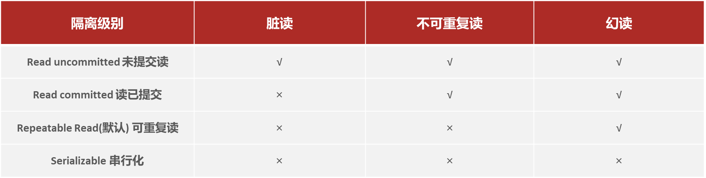
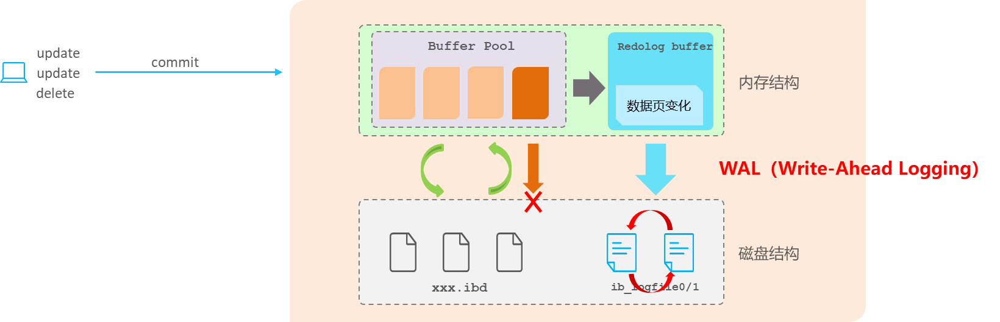
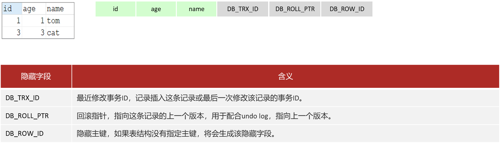

# 三. 事务

# A. 事务特性

ACID: 事务是一组操作的集合，它是一个不可分割的工作单位，事务会把所有的操作作为一个整体一起向系统提交或撤销操作请求，即这些操作要么同时成功，要么同时失败。 &#x20;

- **原子性（Atomicity）**：事务是不可分割的最小操作单元，要么全部成功，要么全部失败。
- **一致性（Consistency）**：事务完成时，必须使所有的数据都保持一致状态。
- **隔离性（Isolation）**：数据库系统提供的隔离机制，保证事务在不受外部并发操作影响的独立环境下运行。
- **持久性（Durability）**：事务一旦提交或回滚，它对数据库中的数据的改变就是永久的。

# B. 隔离级别

并发事务问题 &#x20;

解决方案：对事务进行隔离 &#x20;

# C. Log

redo log 和 undo log 的区别:

- redo log 记录的是数据页的物理变化, 服务宕机可以用来同步数据
- undo log 记录的是逻辑日志, 当事务回滚时, 通过逆操作恢复原来的数据

redo log 保证了事务的持久性, undo log 保证了事务的一致性和原子性

## 缓冲池和数据页

- 缓冲池(buffer pool): 主内存中的一个区域, 可以缓存磁盘上经常操作的数据, 在执行增删改查操作时, 先操作缓冲池中的 数据( 若缓冲池没有数据, 则从磁盘中加载到内存 ), 再以一定频率刷新到磁盘, 从而减少磁盘IO, 加快处理速度.
- 数据页(page): 是InnoDB存储引擎磁盘管理的最小单元, 每个页的默认大小是16KB, 页中存储的是行数据.

## redo log

重做日志，记录的是事务提交时数据页的物理修改，是用来实现事务的持久性。该日志文件由两部分组成：重做日志缓冲（redo log buffer）以及重做日志文件（redo log file）,前者是在内存中，后者在磁盘中。当事务提交之后会把所有修改信息都存到该日志文件中, 用于在刷新脏页到磁盘,发生错误时, 进行数据恢复使用。 &#x20;

## undo log

回滚日志，用于记录数据被修改前的信息 , 作用包含两个 : 提供回滚 和 MVCC(多版本并发控制) 。undo log和redo log记录物理日志不一样，它是逻辑日志。 &#x20;

- 可以认为当delete一条记录时，undo log中会记录一条对应的insert记录，反之亦然.
- 当update一条记录时，它记录一条对应相反的update记录。当执行rollback时，就可以从undo log中的逻辑记录读取到相应的内容并进行回滚。

undo log可以实现事务的一致性和原子性

# D. MVCC

MVCC（Multi-Version Concurrency Control，多版本并发控制）是 MySQL 中用于实现高并发读操作的一种机制。

在 MVCC 中，数据库为每行数据维护多个版本。当一个事务读取数据时，它会根据自身的事务 ID 和数据行的版本信息来决定读取哪个版本的数据，从而实现了非阻塞的读操作，提高了并发性能。

MVCC 的实现依赖于 undo log（回滚日志）和 read view（读视图）。

undo log 中保存了数据的历史版本，使得不同事务可以看到不同版本的数据。

read view 用于判断当前事务可以看到哪些版本的数据。它包含了当前活跃事务的列表等信息。

例如，有事务 T1 对某行数据进行了修改，此时会生成一个新的版本并记录在 undo log 中。当事务 T2 读取这行数据时，通过 read view 和 undo log 来确定读取的版本。

MVCC 的优点包括：

1. 提高并发读性能：多个事务可以同时读取数据，而不需要阻塞等待。
2. 解决脏读、不可重复读和幻读问题（在一定程度上）：通过合适的隔离级别设置，如读已提交（Read Committed）和可重复读（Repeatable Read）。

然而，MVCC 也并非没有缺点：

1. 增加了存储空间的开销：需要保存数据的多个版本和 undo log。
2. 复杂的实现逻辑：增加了数据库内部的复杂性。

## ReadView

ReadView（读视图）是 快照读 SQL执行时MVCC提取数据的依据，记录并维护系统当前活跃的事务（未提交的）id。 &#x20;

不同的隔离级别，生成ReadView的时机不同：

- READ COMMITTED ：在事务中每一次执行快照读时生成ReadView。 &#x20;
- REPEATABLE READ：仅在事务中第一次执行快照读时生成ReadView，后续复用该ReadView。

## 当前读

&#x20;读取的是记录的最新版本，读取时还要保证其他并发事务不能修改当前记录，会对读取的记录进行加锁。对于我们日常的操作，如：select ... lock in share mode(共享锁)，select ... for update、update、insert、delete(排他锁)都是一种当前读。&#x20;

## 快照读

简单的select（不加锁）就是快照读，快照读，读取的是记录数据的可见版本，有可能是历史数据，不加锁，是非阻塞读。 &#x20;

- Read Committed：每次select，都生成一个快照读。
- Repeatable Read：开启事务后第一个select语句才是快照读的地方。

## 隐藏字段

[1. 事务特性](<1. 事务特性/1. 事务特性.md> "1. 事务特性")

[2. 隔离级别](<2. 隔离级别/2. 隔离级别.md> "2. 隔离级别")

[3. 日志与存储结构](<3. 日志与存储结构/3. 日志与存储结构.md> "3. 日志与存储结构")

[4. MVCC](<4. MVCC/4. MVCC.md> "4. MVCC")

::
