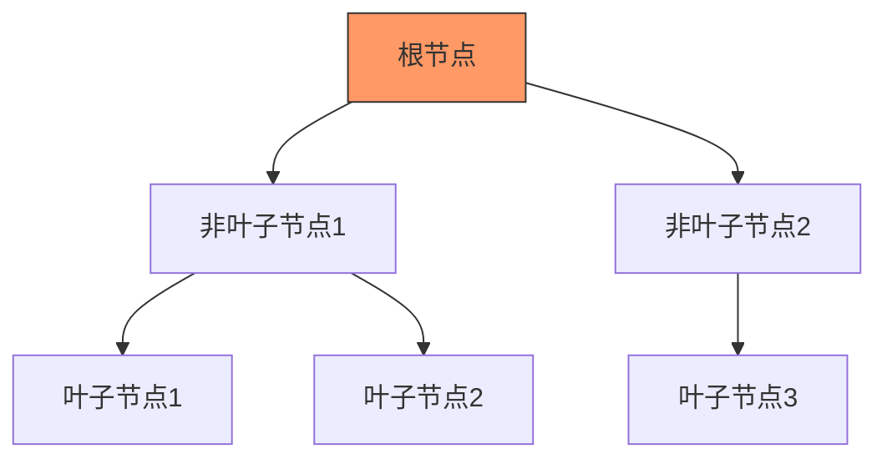

# 1. 存储引擎

# **Java面试八股文：MySQL存储引擎与索引详解** &#x20;

***

## **1. 概述与定义** &#x20;

**存储引擎** 是MySQL处理数据存储和检索的核心模块，不同引擎针对不同场景优化。**索引** 是加速数据检索的底层结构，其设计与存储引擎密切相关。 &#x20;

- **核心关联**：InnoDB的聚簇索引、MyISAM的非聚簇索引，均基于B+树结构。 &#x20;

***

## **2. 原理剖析** &#x20;

### **2.1 存储引擎分类与核心结构** &#x20;

#### **2.1.1 常见存储引擎对比** &#x20;

| **引擎**​      | **特性**​                      | **适用场景**​            | **索引类型**​ |
| ------------ | ---------------------------- | -------------------- | --------- |
| **InnoDB**​  | 支持事务、行级锁、聚簇索引（数据与索引物理存储在一起）。 | 高并发、事务性场景（如电商、银行系统）。 | B+树索引     |
| **MyISAM**​  | 表级锁、非聚簇索引（索引与数据分离）、全文索引支持。   | 高读低写场景（如日志分析、数据仓库）。  | B+树索引     |
| **MEMORY**​  | 数据存于内存，哈希索引，速度快但重启丢失。        | 临时表、缓存。              | 哈希索引      |
| **ARCHIVE**​ | 只支持INSERT/SELECT，压缩存储，无索引。   | 日志归档、历史数据存储。         | 无索引       |

#### **2.1.2 InnoDB的聚簇索引（Clustered Index）** &#x20;

- **结构**：数据与主键索引物理存储在一起，主键即聚簇索引。 &#x20;
- **特点**： &#x20;
  - **主键查询高效**：直接通过B+树定位数据。 &#x20;
  - **辅助索引**：叶子节点存储主键值（回表查询）。 &#x20;

**示例代码**： &#x20;

```sql 
CREATE TABLE users (
    id INT PRIMARY KEY,  -- 聚簇索引
    name VARCHAR(50),
    INDEX idx_name(name) -- 辅助索引，叶子节点存id
);
```


#### **2.1.3 B+树结构** &#x20;

**B+树与二叉树的对比**： &#x20;

- **B+树**： &#x20;
  - 非叶子节点不存数据，叶子节点形成双向链表。 &#x20;
  - 每个节点包含大量键值，减少磁盘IO。 &#x20;
- **二叉树**： &#x20;
  - 可能退化为链表，导致查询效率低下。 &#x20;

**Mermaid图示**： &#x20;




***

### **2.2 索引的数据结构与类型** &#x20;

#### **2.2.1 索引分类** &#x20;

| **分类维度**​ | **类型**​      | **适用场景**​     | **示例**​                                                      |
| --------- | ------------ | ------------- | ------------------------------------------------------------ |
| **数据结构**​ | B+树索引        | 范围查询、排序、关联查询。 | InnoDB默认使用B+树索引。                                             |
| **物理存储**​ | 聚簇索引（InnoDB） | 主键或唯一索引。      | 直接定位数据行。                                                     |
| **字段特性**​ | 全文索引（MyISAM） | 文本内容模糊匹配。     | \`CREATE FULLTEXT INDEX idx\_content ON articles(content);\` |
| **字段个数**​ | 复合索引         | 多字段联合查询。      | \`INDEX idx\_user\_time (user\_id, create\_time);\`          |

***

## **3. 应用目标** &#x20;

### **3.1 存储引擎选择目标** &#x20;

- **InnoDB**：高并发事务、行级锁、数据一致性。 &#x20;
- **MyISAM**：高读低写、全文搜索、轻量级存储。 &#x20;

### **3.2 索引设计目标** &#x20;

- **减少数据扫描范围**：通过索引避免全表扫描。 &#x20;
- **降低资源消耗**：减少临时表、排序、回表操作。 &#x20;
- **提升并发能力**：减少锁竞争和事务阻塞。 &#x20;

***

## **4. 主要特点** &#x20;

### **4.1 InnoDB的特点** &#x20;

- **聚簇索引强制性**：必须有主键，否则自动创建隐藏列。 &#x20;
- **回表查询**：辅助索引需通过主键回查数据。 &#x20;
- **覆盖索引**：查询字段全包含在索引中，避免回表。 &#x20;
  ```sql 
  -- 覆盖索引示例
  SELECT id, name FROM users WHERE id=100;  -- 主键索引直接返回结果
  ```


### **4.2 MyISAM的特点** &#x20;

- **非聚簇索引**：索引指向数据行的物理地址。 &#x20;
- **全文索引**：支持`MATCH() AGAINST()`语句。 &#x20;
  ```sql 
  CREATE TABLE articles (
      id INT PRIMARY KEY,
      content TEXT,
      FULLTEXT INDEX idx_content(content)
  );
  ```


***

## **5. 主要内容及其组成部分** &#x20;

### **5.1 索引失效场景** &#x20;

| **场景**​               | **原因**​                                   | **修复示例**​                                                            |
| --------------------- | ----------------------------------------- | -------------------------------------------------------------------- |
| **函数操作字段**​           | \`WHERE YEAR(create\_time)=2023\` 导致索引失效。 | 改为范围查询：\`WHERE create\_time BETWEEN '2023-01-01' AND '2023-12-31'\`。 |
| **`LIKE`** **通配符前置**​ | \`WHERE name LIKE '%abc'\` 无法使用索引。        | 避免通配符前置，或使用全文索引。                                                     |
| **联合索引未按最左前缀使用**​     | 索引\`(a, b, c)\`，但查询条件为\`WHERE b=1\`。      | 调整查询条件顺序或重建索引。                                                       |

### **5.2 索引优化方法** &#x20;

1. **覆盖索引**：确保查询字段在索引中。 &#x20;
2. **最左前缀原则**：联合索引需按左前缀顺序使用。 &#x20;
3. **区分度优先**：优先为高区分度字段建索引（如身份证号）。 &#x20;

***

## **6. 应用与拓展** &#x20;

### **6.1 InnoDB的事务与锁机制** &#x20;

- **行级锁**：支持高并发写入，减少锁冲突。 &#x20;
- **MVCC（多版本并发控制）**：通过事务ID实现隔离级别，避免幻读。 &#x20;

### **6.2 索引与性能调优** &#x20;

- **深度分页优化**： &#x20;
  ```sql 
  -- 原查询（全表扫描）
  SELECT * FROM users ORDER BY id LIMIT 100000, 10;
  -- 优化：主键范围查询
  SELECT * FROM users WHERE id > 100000 ORDER BY id LIMIT 10;
  ```


***

## **7. 面试问答** &#x20;

### **问题1：InnoDB和MyISAM的锁机制有何区别？** &#x20;

**回答**： &#x20;

- **InnoDB**：行级锁（默认），并发度高，支持事务。 &#x20;
- **MyISAM**：表级锁，写锁阻塞读，适合读多写少场景。 &#x20;

**示例**： &#x20;

```sql 
-- InnoDB行级锁示例
UPDATE users SET score = 100 WHERE id = 1; -- 仅锁定id=1的行
```


### **问题2：为什么InnoDB必须要有主键？** &#x20;

**回答**： &#x20;

- **聚簇索引需要主键**：若未显式定义主键，InnoDB会自动生成隐藏列作为主键。 &#x20;
- **辅助索引依赖主键**：叶子节点存储主键值，用于回表查询。 &#x20;

### **问题3：B+树相比二叉树的优势？** &#x20;

**回答**： &#x20;

1. **磁盘IO优化**：每个节点包含大量键值，减少寻道时间。 &#x20;
2. **范围查询高效**：叶子节点有序，支持区间扫描。 &#x20;
3. **平衡性高**：插入删除后自动调整结构，避免退化。 &#x20;

### **问题4：InnoDB的聚簇索引有什么优缺点？** &#x20;

**回答**： &#x20;

- **优点**： &#x20;
  - 主键查询效率高。 &#x20;
  - 范围查询高效（叶子节点有序）。 &#x20;
- **缺点**： &#x20;
  - 插入数据需维护B+树结构，写入性能略低。 &#x20;
  - 辅助索引需回表查询，增加IO开销。 &#x20;

### **问题5：如何选择存储引擎？** &#x20;

**回答**： &#x20;

- **事务需求**：选InnoDB。 &#x20;
- **全文搜索**：选MyISAM或InnoDB（需插件支持）。 &#x20;
- **内存高速缓存**：选MEMORY。 &#x20;
- **日志归档**：选ARCHIVE。 &#x20;

***

## **总结** &#x20;

- **存储引擎选择**：根据事务、并发、索引需求选择（InnoDB为主流）。 &#x20;
- **索引优化核心**：合理设计主键，利用覆盖索引减少回表。 &#x20;
- **高频考点**：聚簇索引、B+树结构、锁机制、索引失效场景。 &#x20;

通过掌握存储引擎与索引的底层原理，面试中可深入分析性能问题，如InnoDB的回表查询优化、MyISAM的表锁瓶颈等，从容应对面试官的技术考察。
