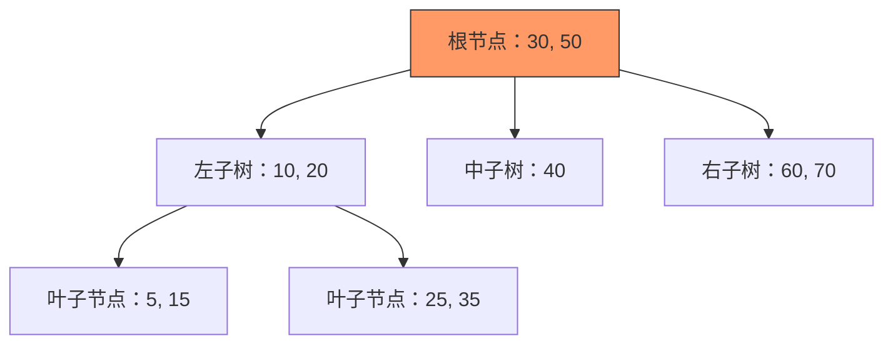
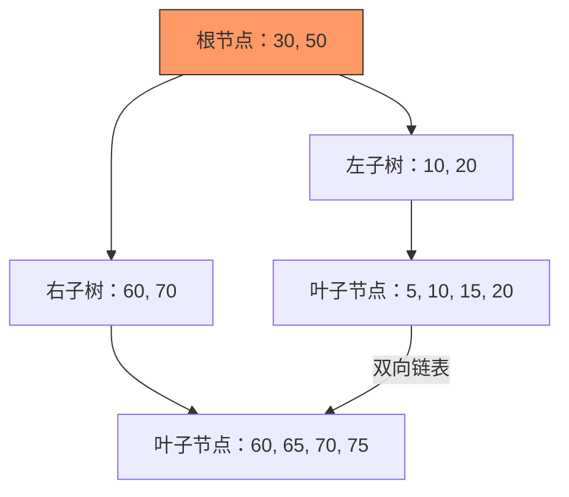

# 2. 底层数据结构

# **Java面试八股文：MySQL索引底层数据结构（B-Tree与B+Tree）详解** &#x20;

***

## **1. 概述与定义** &#x20;

**B-Tree** 和 **B+Tree** 是MySQL索引的底层数据结构，用于高效存储和检索数据。 &#x20;

- **B-Tree**：多路平衡搜索树，支持快速查找、插入和删除操作。 &#x20;
- **B+Tree**：B-Tree的变种，**非叶子节点不存储数据**，叶子节点形成有序链表。 &#x20;
- **MySQL选择B+Tree**：因B+Tree更适合数据库场景（范围查询、减少I/O）。 &#x20;

***

## **2. 原理剖析** &#x20;

### **2.1 B-Tree结构** &#x20;

#### **结构特点** &#x20;

- **多路分支**：每个节点包含多个键值和子节点指针。 &#x20;
- **平衡性**：所有叶子节点深度相同。 &#x20;
- **数据存储**：**非叶子节点和叶子节点均存储数据**。 &#x20;

#### **示例结构图** &#x20;




#### **查询过程** &#x20;

1. **根节点**：定位键值范围。 &#x20;
2. **中间节点**：逐步缩小范围。 &#x20;
3. **叶子节点**：找到目标数据。 &#x20;

**时间复杂度**：`O(logN)`。 &#x20;

***

### **2.2 B+Tree结构** &#x20;

#### **结构特点** &#x20;

| **特性**​     | **描述**​                         |
| ----------- | ------------------------------- |
| **非叶子节点**​  | 仅存储键值和子节点指针，\*\*不存储数据\*\*。      |
| **叶子节点**​   | 存储所有数据，形成\*\*双向链表\*\*，支持快速范围扫描。 |
| **磁盘IO优化**​ | 每个节点键值更多，树高更矮（通常2-4层），减少寻道次数。   |

#### **示例结构图** &#x20;




#### **查询过程** &#x20;

1. **根节点**：定位键值范围。 &#x20;
2. **中间节点**：逐层缩小范围。 &#x20;
3. **叶子节点**：直接找到数据。 &#x20;

**优势**：叶子节点有序，范围查询高效。 &#x20;

***

## **3. 应用目标** &#x20;

### **3.1 B-Tree的应用** &#x20;

- **数据库索引**：早期数据库使用B-Tree，但B+Tree更优。 &#x20;
- **文件系统**：如Unix的`ext3/ext4`文件系统。 &#x20;

### **3.2 B+Tree的应用** &#x20;

- **MySQL索引**：InnoDB默认使用B+Tree，支持范围查询和事务。 &#x20;
- **数据库主键/非主键索引**：聚簇索引（主键）和辅助索引均基于B+Tree。 &#x20;

***

## **4. 主要特点对比** &#x20;

| **对比项**​  | **B-Tree**​        | **B+Tree**​        |
| --------- | ------------------ | ------------------ |
| **数据存储**​ | 非叶子节点和叶子节点均存数据。    | 非叶子节点仅存键值，叶子节点存数据。 |
| **查询效率**​ | 等值查询快，范围查询需遍历中间节点。 | 范围查询快（叶子节点链表）。     |
| **磁盘IO**​ | 每个节点存储数据，IO次数较多。   | 非叶子节点仅存键，IO效率更高。   |
| **叶子节点**​ | 数据分散在所有节点。         | 数据集中于叶子节点，形成有序链表。  |

***

## **5. 主要内容及其组成部分** &#x20;

### **5.1 B-Tree的节点结构** &#x20;

- **非叶子节点**：`[键值1, 键值2, ..., 子节点指针1, 子节点指针2, ...]`。 &#x20;
- **叶子节点**：`[键值1, 数据1, 键值2, 数据2, ..., 叶子节点指针]`。 &#x20;

### **5.2 B+Tree的节点结构** &#x20;

- **非叶子节点**：`[键值1, 键值2, ..., 子节点指针1, 子节点指针2, ...]`。 &#x20;
- **叶子节点**：`[键值1, 数据指针, 键值2, 数据指针, ..., 前驱/后继指针]`。 &#x20;

#### **示例代码（伪代码）** &#x20;

```java 
// B+Tree叶子节点结构
class BPlusTreeNode {
    int[] keys;      // 存储键值
    void** data;     // 数据指针（指向实际数据）
    BPlusTreeNode* next; // 双向链表指针
}

// B-Tree非叶子节点结构
class BTreeNode {
    int[] keys;      // 存储键值
    BTreeNode** children; // 子节点指针
    void** data;     // 非叶子节点也存储部分数据
}
```


***

## **6. 应用与拓展** &#x20;

### **6.1 B+Tree在MySQL中的作用** &#x20;

- **聚簇索引**：主键索引的B+Tree叶子节点直接存储行数据。 &#x20;
- **辅助索引**：叶子节点存储主键值（回表查询）。 &#x20;

#### **聚簇索引示例** &#x20;

```sql 
CREATE TABLE users (
    id INT PRIMARY KEY,  -- 聚簇索引（B+Tree叶子节点存整行数据）
    name VARCHAR(50)
);
```


### **6.2 其他索引结构对比** &#x20;

| **类型**​   | **适用场景**​                       | **优缺点**​          |
| --------- | ------------------------------- | ----------------- |
| **哈希索引**​ | 等值查询（如\`WHERE id=100\`）。        | 不支持范围查询，依赖键值分布。   |
| **全文索引**​ | 文本内容搜索（如\`MATCH() AGAINST()\`）。 | 基于倒排索引，不适用B+Tree。 |

***

## **7. 面试问答** &#x20;

### **问题1：为什么MySQL选择B+Tree而非B-Tree？** &#x20;

**回答**： &#x20;

- **范围查询优化**：B+Tree叶子节点有序链表，支持快速区间扫描（如`WHERE age BETWEEN 20 AND 30`）。 &#x20;
- **磁盘IO减少**：非叶子节点仅存键值，每个节点能容纳更多键值，树高更矮，IO次数更少。 &#x20;
- **数据一致性**：叶子节点集中存储，避免B-Tree中间节点数据冗余。 &#x20;

***

### **问题2：B+Tree的查询时间复杂度是多少？** &#x20;

**回答**： &#x20;

- **时间复杂度**：`O(logN)`，与树高成正比。 &#x20;
- **实际优势**： &#x20;
  - **树高极低**：例如，16KB节点存储1000个键值，查询2100万数据仅需3次IO。 &#x20;
  - **磁盘预读**：叶子节点链表支持顺序读取，利用磁盘预读优化性能。 &#x20;

***

### **问题3：B+Tree的叶子节点链表有何作用？** &#x20;

**回答**： &#x20;

- **范围查询加速**：遍历链表可快速获取连续数据（如`SELECT * FROM users ORDER BY id`）。 &#x20;
- **数据有序性**：保证查询结果与索引顺序一致，减少排序开销。 &#x20;

***

### **问题4：B+Tree的非叶子节点为什么不存储数据？** &#x20;

**回答**： &#x20;

- **空间优化**：非叶子节点仅存键值，每个节点能容纳更多键值，树高降低。 &#x20;
- **查询效率**：中间层仅需定位范围，无需存储数据，减少冗余。 &#x20;

***

### **问题5：如何理解“B+Tree的最左前缀匹配原则”？** &#x20;

**回答**： &#x20;

- **联合索引**：假设索引为`(a, b, c)`，查询条件需包含`a`，才能利用索引。 &#x20;
- **示例**： &#x20;
  ```sql 
  -- 可用索引：WHERE a=1 AND b=2
  -- 不可用索引：WHERE b=2 AND c=3（未满足最左前缀）
  ```

- **原理**：B+Tree按最左列排序，跳过前缀则无法定位范围。 &#x20;

***

## **总结** &#x20;

- **B+Tree是MySQL索引的核心**，其设计兼顾查询效率与磁盘IO优化。 &#x20;
- **关键考点**：B+Tree与B-Tree的区别、叶子节点链表的作用、聚簇索引与回表查询。 &#x20;
- **面试技巧**：结合实际场景（如分页优化、覆盖索引）说明B+Tree的优势。 &#x20;

通过深入理解B+Tree的结构与特性，面试中可自信解答索引底层原理、性能优化等问题，展现对MySQL核心机制的掌握。
