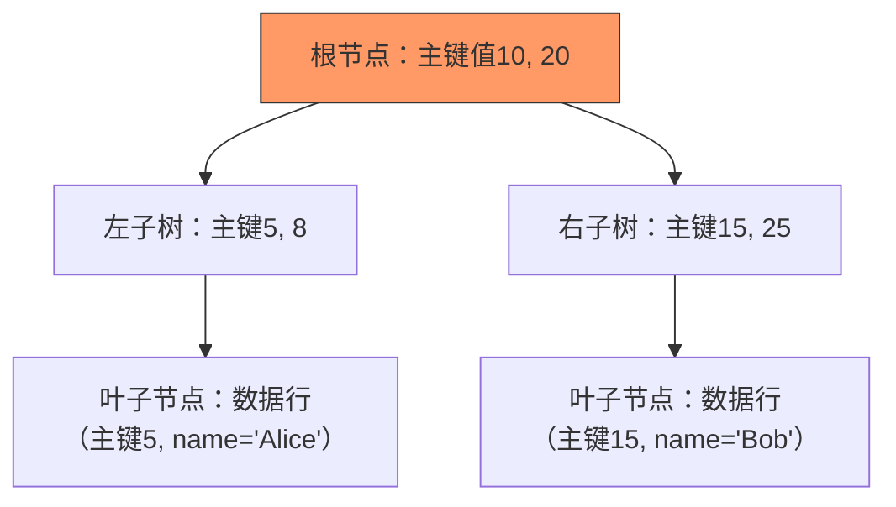
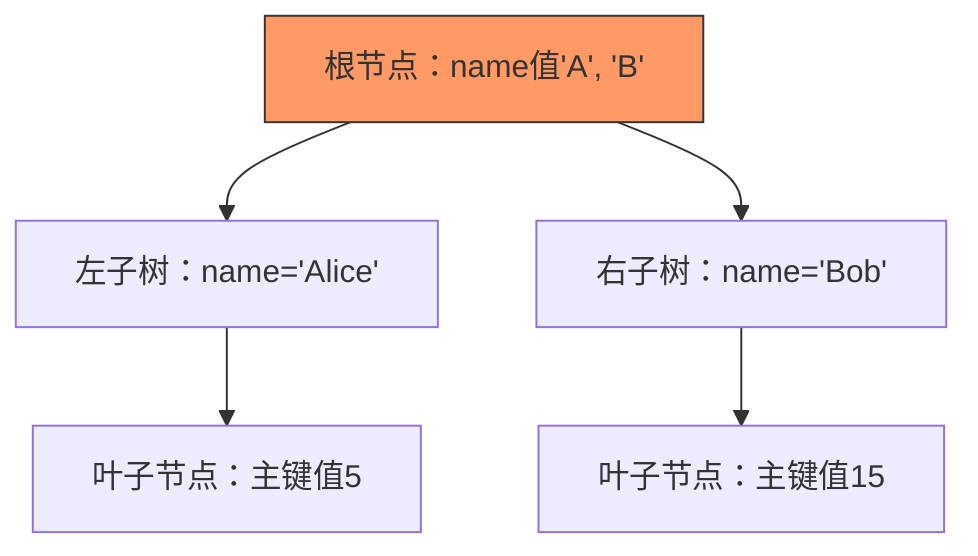

# 3. 聚簇与非聚簇

# **Java面试八股文：MySQL聚簇与非聚簇索引详解** &#x20;

***

## **1. 概述与定义** &#x20;

**聚簇索引（Clustered Index）** 和 **非聚簇索引（Non-Clustered Index）** 是MySQL索引的两种核心类型，直接影响数据存储和查询性能。 &#x20;

- **聚簇索引**：数据与索引物理存储在一起，B+树的叶子节点直接保存行数据（InnoDB主键索引）。 &#x20;
- **非聚簇索引**：数据与索引分离，B+树的叶子节点仅保存主键值（辅助索引）。 &#x20;
- **核心关联**：InnoDB默认使用聚簇索引（主键），而非聚簇索引需显式创建。 &#x20;

***

## **2. 原理剖析** &#x20;

### **2.1 聚簇索引的实现原理** &#x20;

#### **结构特点** &#x20;

- **数据与索引一体**：B+树的叶子节点包含**完整的行数据**。 &#x20;
- **物理存储顺序**：数据按主键值排序，保证范围查询高效。 &#x20;

#### **示例结构图** &#x20;




#### **查询流程** &#x20;

```sql 
SELECT * FROM users WHERE id = 10;  -- 主键查询
```


1. **根节点**：定位主键范围。 &#x20;
2. **中间节点**：缩小到左子树。 &#x20;
3. **叶子节点**：直接获取行数据。 &#x20;

***

### **2.2 非聚簇索引的实现原理** &#x20;

#### **结构特点** &#x20;

- **主键指针存储**：叶子节点保存**主键值**，需通过主键回查数据。 &#x20;
- **独立B+树结构**：与聚簇索引物理分离。 &#x20;

#### **示例结构图** &#x20;




#### **查询流程** &#x20;

```sql 
SELECT * FROM users WHERE name = 'Alice';  -- 辅助索引查询
```


1. **辅助索引**：查得主键5。 &#x20;
2. **回表查询**：通过主键5到聚簇索引获取行数据。 &#x20;

***

## **3. 应用目标** &#x20;

### **3.1 聚簇索引的应用** &#x20;

- **主键查询加速**：直接定位行数据。 &#x20;
- **范围查询优化**：如`WHERE id BETWEEN 1 AND 100`。 &#x20;
- **事务支持**：InnoDB通过聚簇索引实现行级锁。 &#x20;

### **3.2 非聚簇索引的应用** &#x20;

- **多条件查询**：复合索引支持多字段联合查询。 &#x20;
- **覆盖索引**：查询字段全在索引中，避免回表（如`SELECT id FROM users WHERE name='Alice'`）。 &#x20;

***

## **4. 主要特点对比** &#x20;

| **特性**​   | **聚簇索引**​          | **非聚簇索引**​        |
| --------- | ------------------ | ----------------- |
| **存储结构**​ | 数据与索引一体，叶子节点存行数据。  | 数据与索引分离，叶子节点存主键值。 |
| **查询效率**​ | 直接获取数据，效率最高。       | 需回表查询，效率略低。       |
| **数量限制**​ | 每表仅一个（主键或唯一索引）。    | 每表可有多个。           |
| **范围查询**​ | 高效（叶子节点有序）。        | 需回表，性能较差。         |
| **插入性能**​ | 按主键顺序插入快，否则因页分裂变慢。 | 无影响，独立存储。         |

***

## **5. 主要内容及其组成部分** &#x20;

### **5.1 聚簇索引的核心内容** &#x20;

#### **5.1.1 主键选择原则** &#x20;

- **自增主键**：避免页分裂，保证插入性能（推荐）。 &#x20;
- **非空唯一**：若无主键，InnoDB选择第一个非空唯一索引，否则生成隐式主键。 &#x20;

#### **5.1.2 聚簇索引的优缺点** &#x20;

- **优点**： &#x20;
  - 范围查询快。 &#x20;
  - 行数据物理连续，适合顺序扫描。 &#x20;
- **缺点**： &#x20;
  - 更新主键代价高（需移动数据）。 &#x20;
  - 插入无序时性能差。 &#x20;

***

### **5.2 非聚簇索引的核心内容** &#x20;

#### **5.2.1 回表查询机制** &#x20;

- **过程**： &#x20;
  ```sql 
  SELECT name FROM users WHERE age = 30;  -- 需回表
  ```

  1. **辅助索引**：查得主键值`5, 15`。 &#x20;
  2. **聚簇索引**：通过主键5和15分别获取行数据，提取`name`字段。 &#x20;

#### **5.2.2 覆盖索引优化** &#x20;

- **定义**：查询字段全在索引中，避免回表。 &#x20;
- **示例**： &#x20;
  ```sql 
  SELECT id FROM users WHERE name = 'Alice';  -- 索引包含id，无需回表
  ```

  **索引创建**： &#x20;
  ```sql 
  CREATE INDEX idx_name ON users(name, id);  -- 覆盖查询需求
  ```


***

## **6. 应用与拓展** &#x20;

### **6.1 聚簇索引的典型场景** &#x20;

- **高频主键查询**：电商订单表按订单ID查询。 &#x20;
- **排序与分组**：`ORDER BY id`利用物理顺序避免排序。 &#x20;

### **6.2 非聚簇索引的优化技巧** &#x20;

- **最左前缀原则**： &#x20;
  ```sql 
  CREATE INDEX idx_user ON users(user_id, create_time);  -- 仅user_id可用
  ```

- **避免冗余索引**：复合索引`(a, b)`可覆盖单列`a`，无需额外索引。 &#x20;

### **6.3 隐式聚簇索引** &#x20;

- **触发条件**：表无主键且无唯一非空索引。 &#x20;
- **影响**：6字节隐藏列作为主键，可能引发热点问题。 &#x20;

***

## **7. 面试问答** &#x20;

### **问题1：聚簇索引和非聚簇索引的区别？** &#x20;

**回答**： &#x20;

- **存储结构**： &#x20;
  - 聚簇索引：叶子节点存行数据，数据与索引一体。 &#x20;
  - 非聚簇索引：叶子节点存主键值，需回表查询。 &#x20;
- **性能**： &#x20;
  - 聚簇索引直接获取数据，范围查询快。 &#x20;
  - 非聚簇索引需两次查询，但支持多字段组合。 &#x20;
- **数量限制**：聚簇索引每表仅一个，非聚簇索引可多个。 &#x20;

***

### **问题2：为什么InnoDB选择主键作为聚簇索引？** &#x20;

**回答**： &#x20;

- **唯一性**：主键天然唯一，适合确定数据物理位置。 &#x20;
- **查询优化**：高频主键查询直接命中，减少IO。 &#x20;
- **事务支持**：行级锁基于主键实现。 &#x20;

***

### **问题3：什么是回表查询？如何避免？** &#x20;

**回答**： &#x20;

- **回表**：通过非聚簇索引查得主键后，再到聚簇索引查数据。 &#x20;
- **避免方法**： &#x20;
  1. **覆盖索引**：确保查询字段在索引中。 &#x20;
  2. **联合索引优化**：如`SELECT id FROM users WHERE name='Alice'`。 &#x20;

***

### **问题4：主键选自增还是UUID？** &#x20;

**回答**： &#x20;

- **自增主键**： &#x20;
  - 优点：插入按顺序，避免页分裂，性能高。 &#x20;
  - 缺点：业务无关，可能泄露数据量。 &#x20;
- **UUID**： &#x20;
  - 优点：分布式场景唯一，业务无关。 &#x20;
  - 缺点：无序插入导致页分裂，性能差。 &#x20;
- **建议**：优先选自增，若需全局唯一可考虑`UUID()+自增`组合。 &#x20;

***

### **问题5：如何选择聚簇索引字段？** &#x20;

**回答**： &#x20;

- **原则**： &#x20;
  1. **高频查询字段**：如订单表选`order_id`。 &#x20;
  2. **唯一且稳定**：避免频繁更新。 &#x20;
  3. **范围查询需求**：如时间范围查询选`create_time`（需谨慎，可能引发锁竞争）。 &#x20;
- **反例**： &#x20;
  ```sql 
  ALTER TABLE users DROP PRIMARY KEY, ADD PRIMARY KEY (name);  -- 错误！name可能重复且频繁修改
  ```


***

## **总结** &#x20;

- **核心考点**：聚簇索引的物理存储、回表机制、主键选择策略。 &#x20;
- **高频场景**：覆盖索引优化、自增主键性能、InnoDB事务与锁。 &#x20;
- **面试技巧**：结合业务场景（如电商、日志系统）说明索引设计，展现对底层原理的理解。 &#x20;

通过掌握聚簇与非聚簇索引的底层原理，面试中可深入分析性能瓶颈（如回表查询开销、页分裂问题），从容应对技术深挖环节。

# 补充: 分布式系统中的数据主键生成方法的选取考量: 主键自增与UUID

在分布式系统中，数据主键生成方法的选取是一个关键问题，尤其是在处理大规模数据和多节点环境时。自增主键（Auto-increment Primary Key）和UUID（Universally Unique Identifier）是两种常见的选择，各有其优缺点。以下是关于这两种方法在分布式系统中的选取考量的详细分析。

***

### **自增主键（Auto-increment Primary Key）**

#### **优点**

- **简单性**：自增主键易于实现，例如在MySQL中使用`AUTO_INCREMENT`，数据库自动管理，无需额外编码。
- **空间效率**：通常使用整数类型（如`INT`或`BIGINT`），占用空间小，相比UUID的128位更节省存储。
- **查询性能**：主键值连续，有助于范围查询和B-tree索引的效率，减少页面分裂。
- **可读性**：数字主键人类可读，便于调试和日志记录。

#### **缺点**

- **单点故障**：若依赖单一数据库实例生成主键，该实例故障会导致主键生成中断。
- **扩展性问题**：多节点环境下，协调自增主键复杂，可能需通过步长分配主键段，增加管理难度。
- **主键冲突**：数据合并或迁移时，不同节点生成的主键可能重复，需额外机制解决。
- **安全性**：主键可预测，可能暴露数据量或插入顺序等信息。

***

### **UUID（Universally Unique Identifier）**

#### **优点**

- **全局唯一性**：UUID在全球范围内唯一，无需协调即可在多节点生成，避免冲突。
- **去中心化**：各节点独立生成UUID，提升系统扩展性和容错性。
- **安全性**：随机性强，难以预测，不易暴露业务逻辑。
- **灵活性**：适用于多种场景，如会话ID、文件标识等，不限于数据库主键。

#### **缺点**

- **存储空间**：UUID为128位，通常以36字符字符串存储，占用空间远超自增主键。
- **索引性能**：随机性导致B-tree索引页面分裂频繁，降低插入效率并可能造成碎片化。
- **可读性**：长字符串不便于人类阅读和记忆，调试时较麻烦。
- **生成开销**：高并发场景下生成UUID需更多计算资源，性能开销需考虑。

***

### **选取考量**

选择主键生成方法时，需综合以下因素：

1. **系统规模和架构**
   - 小型系统或单数据库场景，自增主键简单高效。
   - 大型分布式系统，UUID的全局唯一性和去中心化更具优势。
2. **性能要求**
   - 对插入和查询性能敏感时，自增主键更优。
   - UUID在高并发写入时可能因索引性能下降而不利。
3. **数据合并和迁移**
   - 频繁合并或迁移数据时，UUID避免冲突更方便。
   - 自增主键需额外处理冲突，如重映射。
4. **存储成本**
   - 存储空间受限时，自增主键更节省。
   - UUID在大规模数据下存储成本显著增加。
5. **安全性需求**
   - 主键不可预测性重要时，UUID更合适。
   - 自增主键可能泄露业务信息。
6. **开发和维护成本**
   - 自增主键实现和管理简单。
   - UUID虽复杂，但现代库函数可轻松生成。

***

### **折衷方案**

为结合两者优点，可考虑以下方案：

- **雪花算法（Snowflake）**：生成64位主键，包含时间戳、机器ID和序列号，既保证唯一性又保持递增性，适用于分布式系统。
- **分段主键**：为各节点分配主键段（如节点1用1-1000，节点2用1001-2000），需管理分配和回收。
- **组合主键**：将自增ID与节点ID组合，兼顾唯一性和性能。

***

### **总结**

- **自增主键**适合小型系统或对性能、存储要求高的场景。
- **UUID**适合大型分布式系统，强调全局唯一性和去中心化。
- **折衷方案**如雪花算法可平衡两者优点。

最终选择应基于系统需求、架构设计及未来扩展计划综合决定。

# 雪花算法

雪花算法（Snowflake）是一种分布式系统中用于生成全局唯一ID的算法，由Twitter开发。它旨在解决高并发、分布式环境下生成唯一ID的问题，同时保持ID的有序性和可预测性。雪花算法生成的ID是一个64位的整型数字，具有以下特点：

- **全局唯一性**：在分布式系统中，不同节点生成的ID不会重复。
- **时间有序性**：ID中包含时间戳信息，生成的ID随时间递增。
- **高性能**：支持高并发的ID生成需求。
- **可预测性**：ID的结构允许从中提取生成时间、机器ID等信息。

***

## 雪花算法的组成

雪花算法生成的64位ID由以下几部分组成：

1. **1位符号位**：通常为0，表示生成的ID是正数。
2. **41位时间戳**：记录ID生成的时间，精确到毫秒级。41位时间戳可以表示大约69年的时间范围。
3. **10位机器ID**：标识生成ID的机器或节点，支持最多1024台机器。
4. **12位序列号**：在同一毫秒内，同一机器通过序列号递增生成不同的ID，每毫秒最多支持4096个ID。

这种结构设计确保了ID的唯一性、有序性以及在分布式环境下的高效生成。

***

## 雪花算法的工作原理

雪花算法通过以下步骤生成ID：

1. **时间戳部分**：计算当前时间与一个预定义起始时间（epoch）的毫秒级差值，确保ID随时间递增。
2. **机器ID部分**：每台机器在启动时分配一个唯一的机器ID，避免不同机器生成重复的ID。
3. **序列号部分**：在同一毫秒内，同一机器通过序列号自增生成ID。当序列号达到最大值（4095）时，系统会等待到下一毫秒再继续生成。

***

## 雪花算法的优点

- **全局唯一**：机器ID和序列号的组合保证了分布式系统中的ID唯一性。
- **高性能**：ID生成速度快，不依赖数据库等外部系统，适用于高并发场景。
- **有序性**：ID随时间递增，有助于优化数据库索引，减少页面分裂。
- **可扩展性**：10位机器ID支持多达1024台机器，易于扩展。
- **信息丰富**：ID包含时间戳和机器ID，可用于分析和调试。

***

## 雪花算法的缺点

- **时钟依赖**：依赖系统时钟，如果时钟回拨（例如手动调整时间），可能导致ID重复。
- **机器ID管理**：需要确保每台机器的机器ID唯一，否则可能出现冲突。
- **ID长度**：64位ID在某些场景下可能过长，占用较多存储空间。
- **序列号溢出**：在极高并发下，同一毫秒内的ID需求可能超过4096个，需等待下一毫秒，可能会引入延迟。

***

## 雪花算法的应用场景

雪花算法广泛应用于需要全局唯一ID的分布式系统，例如：

- **分布式数据库**：作为主键或唯一标识符，确保多节点下的唯一性。
- **消息队列**：生成消息的唯一ID，保证消息的有序性和追踪能力。
- **日志系统**：为日志记录生成唯一ID，便于分析和排查问题。
- **缓存系统**：作为缓存键的唯一标识符。

***

## 总结

雪花算法是一种高效、可靠的分布式ID生成算法，通过时间戳、机器ID和序列号的组合，实现了全局唯一性、有序性和高性能。它适用于分布式数据库、消息队列等场景，但在使用时需注意时钟回拨和机器ID管理的问题，以确保ID的正确性和系统的稳定性。
