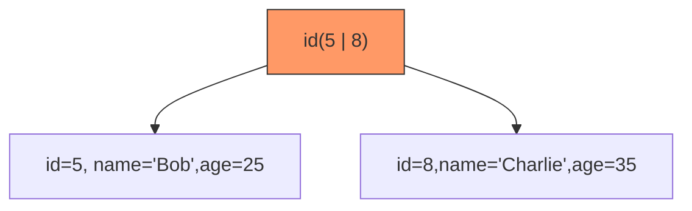

# 4. 覆盖索引

# **Java面试八股文：MySQL覆盖索引详解** &#x20;

***

## **1. 概述与定义** &#x20;

**覆盖索引（Covering Index）** 是指查询所需的字段数据**完全包含在索引中**，无需通过回表操作到聚簇索引获取数据。 &#x20;

- **核心目标**：减少IO次数，提升查询效率。 &#x20;
- **实现条件**：查询字段（`SELECT`）、过滤条件（`WHERE`）、排序（`ORDER BY`）等字段均在索引列中。 &#x20;
- **对比回表查询**：非覆盖索引需通过二级索引查主键，再回查聚簇索引获取数据。 &#x20;

***

## **2. 原理剖析** &#x20;

### **2.1 覆盖索引的实现机制** &#x20;

#### **B+树索引结构** &#x20;

- **聚簇索引**：叶子节点存储**完整行数据**。 &#x20;
- **非聚簇索引**：叶子节点存储**索引列值 + 主键值**（回表依据）。 &#x20;

#### **覆盖索引示例图** &#x20;




#### **查询流程对比** &#x20;

| **场景**​  | **覆盖索引**​                               | **非覆盖索引**​                            |
| -------- | --------------------------------------- | ------------------------------------- |
| **SQL**​ | \`SELECT name FROM users WHERE age=25\` | \`SELECT \* FROM users WHERE age=25\` |
| **步骤**​  | 1\\. 通过非聚簇索引查得\`name="Bob"\`            | 1\\. 查得主键\`id=5 \`2. 回表查聚簇索引获取完整行数据   |
| **性能**​  | 单次IO，直接返回结果                             | 两次IO，效率降低                             |

***

## **3. 应用目标** &#x20;

### **3.1 核心目标** &#x20;

- **减少IO操作**：避免回表查询，降低磁盘访问次数。 &#x20;
- **提升查询速度**：直接从索引中获取数据，减少计算开销。 &#x20;
- **优化大表查询**：对百万级数据表的`SELECT id, name`等场景效果显著。 &#x20;

### **3.2 典型场景** &#x20;

- **范围查询**：`SELECT id FROM users WHERE age BETWEEN 20 AND 30`。 &#x20;
- **联合查询**：`SELECT order_id FROM orders WHERE customer_id=1001`。 &#x20;

***

## **4. 主要特点对比** &#x20;

| **特性**​        | **覆盖索引**​              | **非覆盖索引**​               |
| -------------- | ---------------------- | ------------------------ |
| **IO次数**​      | 单次IO（直接从索引返回数据）        | 两次IO（索引查主键 + 主键查数据）      |
| **性能**​        | 高（避免回表）                | 低（需回表）                   |
| **适用场景**​      | 查询字段少且均在索引中            | 需返回所有字段或未命中索引字段          |
| **EXPLAIN标识**​ | \`Extra: Using index\` | \`Extra: Using where\`或空 |

***

## **5. 主要内容及其组成部分** &#x20;

### **5.1 覆盖索引的实现条件** &#x20;

#### **5.1.1 索引列包含所有查询字段** &#x20;

```sql 
-- 覆盖索引案例
CREATE INDEX idx_age_name ON users(age, name);  -- 索引包含age和name

SELECT name FROM users WHERE age = 25;  -- name在索引中，直接返回
```


#### **5.1.2 联合索引的最左前缀原则** &#x20;

- **示例**： &#x20;
  ```sql 
  CREATE INDEX idx_age_city_salary ON users(age, city, salary);  -- 联合索引
  ```

  - **有效覆盖**： &#x20;
    ```sql 
    SELECT age, city FROM users WHERE age = 25;  -- 命中最左前缀
    ```

  - **无效覆盖**： &#x20;
    ```sql 
    SELECT city FROM users WHERE city = 'Beijing';  -- 未满足最左前缀
    ```


### **5.2 覆盖索引的局限性** &#x20;

- **无法完全替代其他索引**： &#x20;
  - 对于需更新的字段，仍需回表。 &#x20;
  - 聚簇索引本身天然覆盖所有字段。 &#x20;

***

## **6. 应用与拓展** &#x20;

### **6.1 覆盖索引的优化技巧** &#x20;

#### **6.1.1 联合索引设计** &#x20;

- **示例场景**： &#x20;
  ```sql 
  SELECT id, name FROM users WHERE age BETWEEN 20 AND 30;
  ```

  - **优化方案**： &#x20;
    ```sql 
    CREATE INDEX idx_age_id_name ON users(age, id, name);  -- 确保age+id+name在索引中
    ```


#### **6.1.2 避免**\*\*`SELECT *`\*\* &#x20;

- **反模式**： &#x20;
  ```sql 
  SELECT * FROM orders WHERE customer_id = 1001;  -- 需回表
  ```

- **优化后**： &#x20;
  ```sql 
  SELECT order_id FROM orders WHERE customer_id = 1001;  -- 若order_id在索引中
  ```


### **6.2 EXPLAIN分析覆盖索引** &#x20;

- **关键字段**：`Extra`列显示`Using index`表示命中覆盖索引。 &#x20;
  ```sql 
  EXPLAIN SELECT name FROM users WHERE age = 25;
  ```

  ```text 
  +----+-------------+-------+-------+---------------+------------+---------+-------+------+-------------+
  | id | select_type | table | type  | possible_keys | key        | key_len | ref   | rows | Extra       |
  +----+-------------+-------+-------+---------------+------------+---------+-------+------+-------------+
  | 1  | SIMPLE      | users | range | idx_age_name  | idx_age_name | 4       | const | 1    | Using index |
  +----+-------------+-------+-------+---------------+------------+---------+-------+------+-------------+
  ```


***

## **7. 面试问答** &#x20;

### **问题1：什么是覆盖索引？如何判断是否使用了覆盖索引？** &#x20;

**回答**： &#x20;

- **定义**：覆盖索引是指查询所需的字段**全部包含在索引中**，无需回表。 &#x20;
- **判断方法**： &#x20;
  - **EXPLAIN**：`Extra`列显示`Using index`。 &#x20;
  - **索引设计**：检查查询字段是否均在索引列中。 &#x20;
- **示例**： &#x20;
  ```sql 
  SELECT name FROM users WHERE age = 25;  -- 若age和name在同一个索引中，即为覆盖索引
  ```


***

### **问题2：覆盖索引和回表查询的关系？** &#x20;

**回答**： &#x20;

- **覆盖索引**：**避免**回表查询，直接从索引返回结果。 &#x20;
- **回表查询**：非覆盖索引需通过**主键回查聚簇索引**获取数据。 &#x20;
- **性能影响**：覆盖索引的IO次数是回表查询的一半，效率更高。 &#x20;

***

### **问题3：如何设计联合索引实现覆盖索引？** &#x20;

**回答**： &#x20;

- **原则**：将`SELECT`、`WHERE`、`ORDER BY`涉及的字段**按访问频率排序**，放在索引最左前缀。 &#x20;
- **示例**： &#x20;
  ```sql 
  -- 查询：SELECT id, name FROM users WHERE age BETWEEN 20 AND 30 ORDER BY city;
  -- 索引设计：
  CREATE INDEX idx_age_city_id_name ON users(age, city, id, name);
  ```

  - **解释**： &#x20;
    - `age`用于范围查询。 &#x20;
    - `city`用于排序。 &#x20;
    - `id`和`name`确保覆盖`SELECT`字段。 &#x20;

***

### **问题4：覆盖索引的优缺点？** &#x20;

**回答**： &#x20;

- **优点**： &#x20;
  - **减少IO**：避免回表，降低磁盘访问次数。 &#x20;
  - **提升性能**：单次查询完成，尤其适合高并发场景。 &#x20;
- **缺点**： &#x20;
  - **索引膨胀**：过多的覆盖索引可能增加存储和维护成本。 &#x20;
  - **设计复杂度**：需精准匹配查询字段，联合索引设计需权衡。 &#x20;

***

### **问题5：覆盖索引与最左前缀原则如何结合？** &#x20;

**回答**： &#x20;

- **最左前缀原则**：联合索引需从**最左列开始连续匹配**。 &#x20;
- **覆盖索引设计**： &#x20;
  ```sql 
  CREATE INDEX idx_age_salary ON users(age, salary);  -- 联合索引
  ```

  - **有效场景**： &#x20;
    ```sql 
    SELECT age FROM users WHERE age = 25;  -- 命中最左前缀
    ```

  - **无效场景**： &#x20;
    ```sql 
    SELECT salary FROM users WHERE salary > 5000;  -- 未命中最左前缀
    ```


***

## **总结** &#x20;

- **核心考点**：覆盖索引的定义、实现条件、EXPLAIN分析、联合索引设计。 &#x20;
- **高频场景**：优化大表查询、减少回表次数、联合索引的最左前缀原则。 &#x20;
- **面试技巧**：结合`EXPLAIN`结果和实际SQL案例，说明如何通过覆盖索引提升性能。 &#x20;

通过深入理解覆盖索引的原理与应用，面试中可自信解答索引优化问题，展现对MySQL查询执行机制的掌握。
