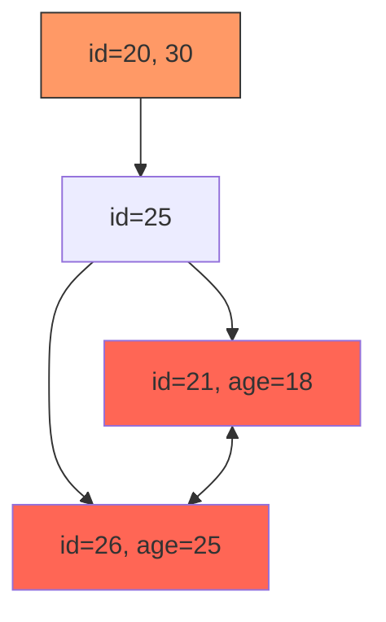

# 5. 创建与实施原则

# **Java面试八股文：MySQL索引创建与实施原则详解** &#x20;

***

## **1. 概述与定义** &#x20;

**索引创建与实施原则** 是优化MySQL查询性能的核心方法论，旨在通过合理设计索引结构，平衡查询效率与维护成本。 &#x20;

- **核心目标**： &#x20;
  - **提升查询速度**：减少全表扫描，通过索引快速定位数据。 &#x20;
  - **减少资源消耗**：避免过度索引导致的存储和写入性能下降。 &#x20;
- **适用场景**：高并发、大数据量的业务场景（如电商订单、日志分析）。 &#x20;

***

## **2. 原理剖析** &#x20;

### **2.1 B+树索引的底层原理** &#x20;

#### **B+树结构** &#x20;

- **多级索引节点**：根节点→中间节点→叶子节点，形成平衡树结构。 &#x20;
- **叶子节点特性**： &#x20;
  - 聚簇索引：叶子节点存储**完整行数据**。 &#x20;
  - 非聚簇索引：叶子节点存储**主键值**（回表依据）。 &#x20;

#### **示例图** &#x20;




#### **索引失效的典型场景** &#x20;

| **场景**​              | **原因**​     | **示例SQL**​                                                                       |
| -------------------- | ----------- | -------------------------------------------------------------------------------- |
| **函数或表达式操作**​        | 索引列被计算，无法命中 | \`SELECT \* FROM users WHERE YEAR(birth\_date) = 2020\`                          |
| **范围查询跳跃**​          | 违反最左前缀原则    | \`SELECT \* FROM users WHERE city = 'Beijing' AND age > 25\`（索引为\`(age, city)\`） |
| **`LIKE`** **以%开头**​ | 无法定位范围      | \`SELECT \* FROM articles WHERE title LIKE '%MySQL%'\`                           |
| **隐式类型转换**​          | 字符集或类型不匹配   | \`SELECT \* FROM orders WHERE order\_id = '123'\`（\`order\_id\`为整型）              |

***

## **3. 应用目标** &#x20;

### **3.1 核心目标** &#x20;

- **查询优化**：通过索引减少数据扫描量。 &#x20;
- **写入平衡**：避免索引过多导致`INSERT/UPDATE/DELETE`性能下降。 &#x20;
- **资源控制**：合理分配存储空间，避免冗余索引占用磁盘。 &#x20;

### **3.2 典型场景** &#x20;

- **高频查询字段**：如电商订单表的`order_id`、`customer_id`。 &#x20;
- **排序与分组**：通过索引避免文件排序（`Using filesort`）。 &#x20;
- **联合条件过滤**：多条件查询时选择区分度高的字段优先。 &#x20;

***

## **4. 主要特点对比** &#x20;

| **特性**​   | **合理索引**​      | **不合理索引**​     |
| --------- | -------------- | -------------- |
| **查询效率**​ | 快速定位数据，减少IO    | 全表扫描或回表查询，效率低下 |
| **存储开销**​ | 索引数量适中，空间可控    | 冗余索引过多，存储浪费    |
| **写入性能**​ | 平衡增删改操作与索引维护代价 | 索引过多导致DML操作变慢  |
| **维护成本**​ | 定期优化与清理冗余索引    | 索引碎片化，需频繁优化    |

***

## **5. 主要内容及其组成部分** &#x20;

### **5.1 索引设计原则** &#x20;

#### **5.1.1 高区分度优先** &#x20;

- **定义**：字段取值越分散（如身份证号），索引效果越好；取值集中（如性别）则效果差。 &#x20;
- **公式**：`区分度 = count(distinct col) / count(*)`。 &#x20;
- **示例**： &#x20;
  ```sql 
  -- 高区分度字段
  CREATE INDEX idx_order_id ON orders(order_id);  -- 主键天然高区分度
  ```


#### **5.1.2 最左前缀原则** &#x20;

- **规则**：联合索引需从**最左连续列**开始匹配。 &#x20;
- **示例**： &#x20;
  ```sql 
  CREATE INDEX idx_age_city_salary ON users(age, city, salary);  -- 联合索引
  ```

  - **有效场景**： &#x20;
    ```sql 
    SELECT * FROM users WHERE age = 25 AND city = 'Shanghai';  -- 命中最左前缀(age, city)
    ```

  - **失效场景**： &#x20;
    ```sql 
    SELECT * FROM users WHERE city = 'Shanghai';  -- 未满足最左前缀(age)
    ```


#### **5.1.3 避免低效操作** &#x20;

- **禁止行为**： &#x20;
  - 索引列参与计算：`WHERE age + 1 = 25`。 &#x20;
  - `NULL`字段建索引：`NULL`值无法命中索引。 &#x20;
  - `LIKE`以`%`开头：`WHERE title LIKE '%MySQL'`。 &#x20;

***

#### **5.1.4 覆盖索引优化** &#x20;

- **定义**：查询字段完全包含在索引中，避免回表。 &#x20;
- **示例**： &#x20;
  ```sql 
  -- 查询设计
  SELECT order_id, amount FROM orders WHERE customer_id = 1001;
  ```

  - **索引设计**： &#x20;
    ```sql 
    CREATE INDEX idx_customer_id ON orders(customer_id, order_id, amount);  -- 覆盖查询字段
    ```


***

### **5.2 实施注意事项** &#x20;

#### **5.2.1 索引数量控制** &#x20;

- **建议**：单表索引数≤5-10个，避免维护成本过高。 &#x20;
- **反例**： &#x20;
  ```sql 
  CREATE INDEX idx_name ON users(name);  -- 可能冗余，若已有联合索引覆盖name
  ```


#### **5.2.2 前缀索引** &#x20;

- **适用场景**：长文本字段（如`VARCHAR(255)`）。 &#x20;
- **示例**： &#x20;
  ```sql 
  CREATE INDEX idx_email_prefix ON users(LEFT(email, 10));  -- 前缀长度需根据业务调整
  ```


***

## **6. 应用与拓展** &#x20;

### **6.1 联合索引的优化设计** &#x20;

#### **6.1.1 选择字段顺序** &#x20;

- **原则**： &#x20;
  1. **高频查询字段优先**：区分度高的列放最左。 &#x20;
  2. **范围查询字段**：放在等值条件之后（范围查询终止匹配）。 &#x20;
- **示例**： &#x20;
  ```sql 
  -- 场景：按用户ID分页查询订单
  CREATE INDEX idx_user_id_created ON orders(user_id, created_at);  -- 等值(user_id) + 范围(created_at)
  ```


#### **6.2 EXPLAIN分析索引使用** &#x20;

- **关键字段**： &#x20;
  - `type`：`index`（全索引扫描）→ `range`（范围查询）→ `ref`（单值关联）→ `const`（最优）。 &#x20;
  - `key`：实际使用的索引名称。 &#x20;
  - `Extra`：`Using index`（覆盖索引）→ `Using where`→ `Using filesort`（需优化）。 &#x20;
- **示例**： &#x20;
  ```sql 
  EXPLAIN SELECT * FROM users WHERE age BETWEEN 20 AND 30;
  ```

  ```text 
  +----+-------------+-------+-------+---------------+------------+---------+------+------+--------------------------+
  | id | select_type | table | type  | possible_keys | key        | key_len | ref  | rows | Extra                    |
  +----+-------------+-------+-------+---------------+------------+---------+------+------+--------------------------+
  | 1  | SIMPLE      | users | range | idx_age       | idx_age    | 4       |      | 100  | Using where; Using index |
  +----+-------------+-------+-------+---------------+------------+---------+------+------+--------------------------+
  ```


***

### **6.3 索引维护与优化** &#x20;

- **定期分析表**：`ANALYZE TABLE users;` 更新统计信息。 &#x20;
- **碎片整理**：`OPTIMIZE TABLE users;` 重建索引。 &#x20;
- **清理冗余索引**：通过`pt-duplicate-key-checker`工具扫描。 &#x20;

***

## **7. 面试问答** &#x20;

### **问题1：索引的设计原则有哪些？如何权衡？** &#x20;

**回答**： &#x20;

- **核心原则**： &#x20;
  1. **高区分度优先**：选择取值分散的字段（如订单ID）。 &#x20;
  2. **最左前缀匹配**：联合索引需从左到右连续匹配。 &#x20;
  3. **避免低效操作**：如函数、`NULL`、`LIKE %`。 &#x20;
  4. **覆盖索引优化**：减少回表次数。 &#x20;
- **权衡点**： &#x20;
  - 索引数量与DML性能：过多索引会拖慢写操作。 &#x20;
  - 存储空间：前缀索引可压缩长文本字段。 &#x20;

***

### **问题2：为什么联合索引要遵循最左前缀原则？** &#x20;

**回答**： &#x20;

- **原理**：B+树索引按列顺序存储，查询必须从最左列开始匹配。 &#x20;
- **示例**： &#x20;
  ```sql 
  CREATE INDEX idx_a_b_c ON table(a, b, c);
  ```

  - **有效查询**：`WHERE a = 1 AND b = 2`。 &#x20;
  - **无效查询**：`WHERE b = 2`（未命中最左列a）。 &#x20;
- **影响**：违反原则会导致全表扫描或部分索引失效。 &#x20;

***

### **问题3：索引失效的常见原因及解决方案？** &#x20;

**回答**： &#x20;

- **原因**： &#x20;
  1. **函数或表达式操作**：如`WHERE YEAR(create_time) = 2023`。 &#x20;
  2. \*\*`LIKE`\*\***以%开头**：如`WHERE name LIKE '%Java%'`。 &#x20;
  3. **隐式类型转换**：如`WHERE id = '123'`（`id`为整型）。 &#x20;
- **解决方案**： &#x20;
  - 避免操作索引列，改用等值条件。 &#x20;
  - 使用前缀索引或调整字段类型。 &#x20;

***

### **问题4：如何设计联合索引以覆盖复杂查询？** &#x20;

**回答**： &#x20;

- **步骤**： &#x20;
  1. **确定查询条件**：`WHERE a = ? AND b > ?`。 &#x20;
  2. **排序字段**：区分度高的字段优先。 &#x20;
  3. **覆盖查询字段**：将`SELECT`字段加入索引。 &#x20;
- **示例**： &#x20;
  ```sql 
  -- 查询：SELECT c, d FROM table WHERE a = 1 AND b > 10 ORDER BY c;
  CREATE INDEX idx_a_b_c_d ON table(a, b, c, d);  -- 覆盖条件+排序+结果字段
  ```


***

### **问题5：索引过多会带来什么问题？如何优化？** &#x20;

**回答**： &#x20;

- **问题**： &#x20;
  - **写入变慢**：`INSERT/UPDATE`需维护多个索引。 &#x20;
  - **存储膨胀**：冗余索引占用额外空间。 &#x20;
  - **查询优化器选择困难**：过多索引可能导致低效执行计划。 &#x20;
- **优化方案**： &#x20;
  1. **删除冗余索引**：通过`EXPLAIN`分析未使用的索引。 &#x20;
  2. **合并联合索引**：用复合索引替代多个单列索引。 &#x20;
  3. **定期清理**：使用`pt-duplicate-key-checker`工具扫描。 &#x20;

***

## **总结** &#x20;

- **核心考点**：索引失效场景、最左前缀、区分度、覆盖索引。 &#x20;
- **高频场景**：电商订单查询、日志分页、大数据量排序。 &#x20;
- **面试技巧**：结合`EXPLAIN`输出和业务案例，展示对索引设计原则的深入理解。 &#x20;

通过掌握索引创建与实施原则，面试中可从容分析查询性能瓶颈，提出优化方案，体现对MySQL底层原理的掌控力。
