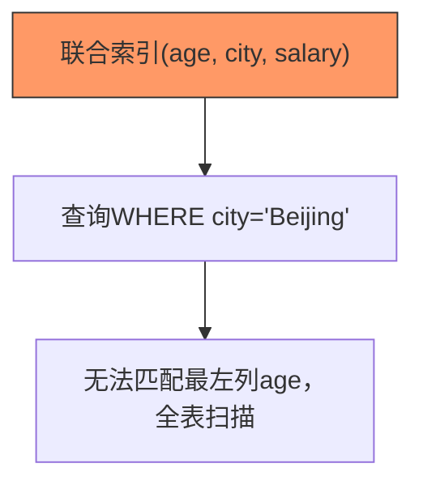

# 6. 失效场景

# **Java面试八股文：MySQL索引失效场景详解** &#x20;

***

## **1. 概述与定义** &#x20;

**索引失效**是指MySQL优化器在执行查询时，因查询条件或索引设计问题，无法利用已有的索引，导致查询退化为全表扫描，显著降低性能。 &#x20;

- **核心影响**： &#x20;
  - **性能下降**：全表扫描增加IO和CPU消耗。 &#x20;
  - **资源浪费**：索引维护成本增加但未发挥价值。 &#x20;
- **主要场景**： &#x20;
  - 查询条件设计不当（如函数操作、模糊匹配）。 &#x20;
  - 索引设计违背原则（如未遵循最左前缀）。 &#x20;
  - 数据分布或统计信息异常（如索引碎片、选择性低）。 &#x20;

***

## **2. 原理剖析** &#x20;

### **2.1 B+树索引失效的核心逻辑** &#x20;

#### **索引命中机制** &#x20;

- **B+树查询流程**： &#x20;
  1. 通过索引列的值定位叶子节点。 &#x20;
  2. 根据条件匹配数据行。 &#x20;
- **失效触发点**：当查询条件无法通过**二分查找**快速定位区间时，索引失效。 &#x20;

#### **示例图：最左前缀原则失效** &#x20;




***

## **3. 应用目标** &#x20;

### **3.1 核心目标** &#x20;

- **避免全表扫描**：通过合理设计查询与索引，提升定位效率。 &#x20;
- **减少资源消耗**：降低CPU、内存、IO的使用。 &#x20;
- **提升查询稳定性**：避免因索引失效导致的性能波动。 &#x20;

### **3.2 典型场景** &#x20;

- **高频查询优化**：电商订单按时间范围查询。 &#x20;
- **日志分析场景**：通过时间戳或ID快速过滤日志数据。 &#x20;

***

## **4. 主要特点对比** &#x20;

| **场景类型**​      | **索引生效**​                 | **索引失效**​                      |
| -------------- | ------------------------- | ------------------------------ |
| **查询条件**​      | 等值匹配（\`WHERE id=1\`）      | 范围匹配+非左前缀（\`WHERE city='BJ'\`） |
| **数据扫描量**​     | 少量数据（命中索引范围）              | 全表或大量数据（全表扫描）                  |
| **EXPLAIN标识**​ | \`type: index\`或\`range\` | \`type: ALL\`或\`index\`未命中指定索引 |
| **性能表现**​      | 响应时间短（毫秒级）                | 响应时间长（秒级或更久）                   |

***

## **5. 主要内容及其组成部分** &#x20;

### **5.1 索引失效的14种典型场景** &#x20;

#### **5.1.1 最左前缀原则违反** &#x20;

- **场景**：联合索引未使用最左列开始匹配。 &#x20;
- **示例**： &#x20;
  ```sql 
  CREATE INDEX idx_age_city ON users(age, city);  -- 联合索引
  SELECT * FROM users WHERE city = 'Shanghai';  -- 未命中age，索引失效
  ```


#### **5.1.2 函数或表达式操作** &#x20;

- **场景**：索引列参与计算或函数调用。 &#x20;
- **示例**： &#x20;
  ```sql 
  SELECT * FROM orders WHERE YEAR(create_time) = 2023;  -- 函数操作导致索引失效
  ```


#### **5.1.3 类型转换** &#x20;

- **场景**：查询值类型与索引列不匹配，隐式转换导致失效。 &#x20;
- **示例**： &#x20;
  ```sql 
  CREATE INDEX idx_stu_no ON student(stu_no VARCHAR);  -- 索引列类型为VARCHAR
  SELECT * FROM student WHERE stu_no = 123;  -- 整数与字符串类型不匹配，索引失效
  ```


#### **5.1.4 LIKE模糊匹配不当** &#x20;

- **场景**：`LIKE`以`%`开头，无法定位范围。 &#x20;
- **示例**： &#x20;
  ```sql 
  SELECT * FROM articles WHERE title LIKE '%MySQL';  -- 全表扫描
  ```


#### **5.1.5 OR条件连接多列** &#x20;

- **场景**：OR连接的条件涉及不同索引列或未索引列。 &#x20;
- **示例**： &#x20;
  ```sql 
  SELECT * FROM users WHERE age=25 OR name='Alice';  -- name未建索引，导致全表扫描
  ```


#### **5.1.6 不等于操作（****`<>`****/****`!=`****）** &#x20;

- **场景**：不等于操作导致大量数据扫描。 &#x20;
- **示例**： &#x20;
  ```sql 
  SELECT * FROM orders WHERE status <> 'completed';  -- 可能扫描大部分数据，索引失效
  ```


#### **5.1.7 范围查询后跟其他条件** &#x20;

- **场景**：范围查询后附加非索引列条件。 &#x20;
- **示例**： &#x20;
  ```sql 
  SELECT * FROM users WHERE age BETWEEN 20 AND 30 AND city='Beijing';  -- 若索引为(age, city)，city无法继续优化
  ```


#### **5.1.8 NULL值判断** &#x20;

- **场景**：使用`IS NULL`或`IS NOT NULL`。 &#x20;
- **示例**： &#x20;
  ```sql 
  SELECT * FROM users WHERE address IS NOT NULL;  -- 部分版本索引失效
  ```


#### **5.1.9 索引碎片过多** &#x20;

- **场景**：频繁增删改导致索引节点分裂，查询效率下降。 &#x20;
- **修复**：`OPTIMIZE TABLE users;`重建索引。

#### **5.1.10 低选择性字段** &#x20;

- **场景**：索引列取值重复率高（如性别字段）。 &#x20;
- **示例**： &#x20;
  ```sql 
  CREATE INDEX idx_gender ON users(gender);  -- 性别只有'M'/'F'，选择性低
  ```


#### **5.1.11 数据分布不均** &#x20;

- **场景**：数据分布极不均匀，优化器认为全表扫描更快。 &#x20;
- **示例**： &#x20;
  ```sql 
  SELECT * FROM orders WHERE customer_id = 1;  -- 若customer_id=1占90%数据，可能全表扫描
  ```


#### **5.1.12 联合索引未覆盖查询字段** &#x20;

- **场景**：查询字段未包含在索引中，需回表导致失效。 &#x20;
- **示例**： &#x20;
  ```sql 
  CREATE INDEX idx_order_id ON orders(order_id);  -- 索引未覆盖amount字段
  SELECT amount FROM orders WHERE order_id = 1001;  -- 需回表，可能失效
  ```


#### \*\*5.1.13 \*\***`NOT IN`****与****`NOT EXISTS`** &#x20;

- **场景**：使用`NOT IN`或`NOT EXISTS`涉及普通索引。 &#x20;
- **示例**： &#x20;
  ```sql 
  SELECT * FROM users WHERE id NOT IN (SELECT user_id FROM black_list);  -- 普通索引失效
  ```


#### **5.1.14 统计信息不准确** &#x20;

- **场景**：`cardinality`统计信息过时，优化器误判成本。 &#x20;
- **修复**：`ANALYZE TABLE users;`更新统计信息。

***

## **6. 应用与拓展** &#x20;

### **6.1 检测索引失效的工具** &#x20;

#### **6.1.1 EXPLAIN分析** &#x20;

- **关键字段**： &#x20;
  - `type`：`ALL`（全表扫描）→ `index`（全索引扫描）→ `ref`（最佳）。 &#x20;
  - `key`：实际使用的索引名称。 &#x20;
  - `Extra`：`Using where`（未命中索引）。 &#x20;
- **示例**： &#x20;
  ```sql 
  EXPLAIN SELECT * FROM users WHERE name LIKE '%Java';
  ```

  ```text 
  +----+-------------+-------+-------+---------------+------+---------+------+------+--------------------------+
  | id | select_type | table | type  | possible_keys | key  | key_len | ref  | rows | Extra                    |
  +----+-------------+-------+-------+---------------+------+---------+------+------+--------------------------+
  | 1  | SIMPLE      | users | ALL   | NULL          | NULL | NULL    | NULL | 1000 | Using where              |
  +----+-------------+-------+-------+---------------+------+---------+------+------+--------------------------+
  ```


#### **6.2 优化策略** &#x20;

| **场景**​       | **解决方案**​                             |
| ------------- | ------------------------------------- |
| **函数操作**​     | 将条件改写为等值匹配（如\`create\_time >= ...\`）。 |
| **类型转换**​     | 确保查询值类型与字段一致。                         |
| **OR条件**​     | 拆分为\`UNION\`或为不同条件单独建索引。              |
| **LIKE以%开头**​ | 避免模糊查询，或改用全文索引。                       |
| **低选择性字段**​   | 合并索引或调整查询逻辑。                          |

***

### **6.3 特殊场景优化** &#x20;

#### **6.3.1 范围查询+等值条件** &#x20;

- **示例**： &#x20;
  ```sql 
  CREATE INDEX idx_age_city ON users(age, city);  -- 索引设计
  SELECT * FROM users WHERE age > 20 AND city='Beijing';  -- 范围+等值，仍可命中索引
  ```


#### **6.3.2 处理**\*\*`IS NOT NULL`\*\* &#x20;

- **示例**： &#x20;
  ```sql 
  -- 建议：避免NULL值，或改用默认值
  SELECT * FROM users WHERE address IS NOT NULL;  -- 若address有索引，可能仍失效
  ```


***

## **7. 面试问答** &#x20;

### **问题1：索引失效的常见原因有哪些？如何检测？** &#x20;

**回答**： &#x20;

- **原因**： &#x20;
  1. **最左前缀原则违反**：联合索引未从最左列开始匹配。 &#x20;
  2. **函数操作或类型转换**：如`DATE(create_time)`或隐式类型转换。 &#x20;
  3. \*\*`LIKE`\*\***以%开头**：无法定位范围。 &#x20;
  4. **OR条件涉及多列**：导致无法同时命中索引。 &#x20;
- **检测方法**： &#x20;
  - **EXPLAIN**：查看`type`是否为`ALL`或`key`是否为`NULL`。 &#x20;
  - **慢查询日志**：分析执行时间长的查询。 &#x20;

***

### **问题2：为什么最左前缀原则会导致索引失效？** &#x20;

**回答**： &#x20;

- **原理**：B+树索引按列顺序构建，查询必须从最左列开始匹配。 &#x20;
- **示例**： &#x20;
  ```sql 
  CREATE INDEX idx_a_b ON table(a, b);  -- 联合索引
  ```

  - **有效**：`WHERE a=1 AND b=2`。 &#x20;
  - **失效**：`WHERE b=2`（未命中a）。 &#x20;
- **影响**：索引失效后，需全表扫描或仅使用部分索引列。 &#x20;

***

### **问题3：如何解决**\*\*`LIKE '%Java'`\*\***导致的索引失效？** &#x20;

**回答**： &#x20;

- **方案**： &#x20;
  1. **避免前缀模糊查询**：改用`LIKE 'Java%'`。 &#x20;
  2. **全文索引**：创建全文索引（`FULLTEXT`）支持模糊匹配。 &#x20;
- **示例**： &#x20;
  ```sql 
  ALTER TABLE articles ADD FULLTEXT idx_content(content);  -- 全文索引
  SELECT * FROM articles WHERE MATCH(content) AGAINST('Java');
  ```


***

### **问题4：索引选择性低会导致什么问题？如何优化？** &#x20;

**回答**： &#x20;

- **问题**： &#x20;
  - 优化器认为全表扫描比索引更高效。 &#x20;
  - 索引维护成本高但收益低。 &#x20;
- **优化方案**： &#x20;
  1. **合并索引**：将低选择性列与其他高区分度列组合。 &#x20;
  2. **删除冗余索引**：定期清理低效索引。 &#x20;
- **示例**： &#x20;
  ```sql 
  -- 低选择性索引：gender只有'M'/'F'
  DROP INDEX idx_gender ON users;  -- 删除冗余索引
  ```


***

### **问题5：OR条件导致索引失效的原理是什么？如何优化？** &#x20;

**回答**： &#x20;

- **原理**： &#x20;
  - OR分拆为多个查询条件，若条件列未被索引覆盖，需全表扫描。 &#x20;
  - 如`WHERE a=1 OR b=2`，若a和b为不同索引，需两次扫描合并。 &#x20;
- **优化方案**： &#x20;
  1. **拆分查询**：使用`UNION`替代OR。 &#x20;
  2. **为不同条件建索引**：如`idx_a`和`idx_b`。 &#x20;
- **示例**： &#x20;
  ```sql 
  -- 原查询
  SELECT * FROM users WHERE age=25 OR name='Alice';
  -- 优化后
  SELECT * FROM users WHERE age=25 UNION SELECT * FROM users WHERE name='Alice';
  ```


***

## **总结** &#x20;

- **核心考点**：14种失效场景、EXPLAIN分析、最左前缀、函数操作、类型转换。 &#x20;
- **高频场景**：电商订单查询、日志模糊搜索、联合索引设计。 &#x20;
- **面试技巧**：结合具体SQL案例，说明失效原因及优化方案，体现对索引底层原理的理解。 &#x20;

通过掌握索引失效场景及解决方案，面试中可从容应对性能调优问题，展现对MySQL查询执行机制的深刻掌握。
